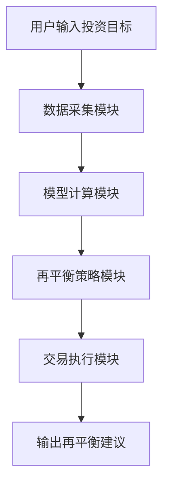
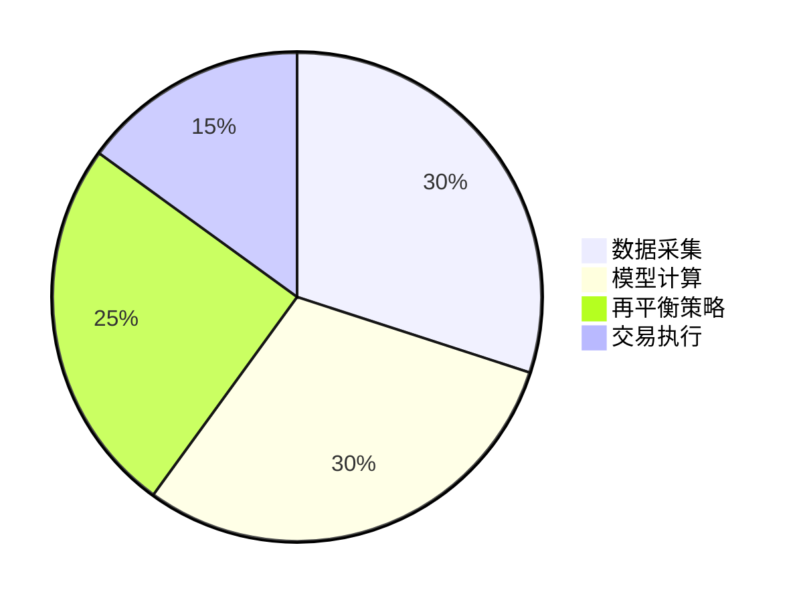
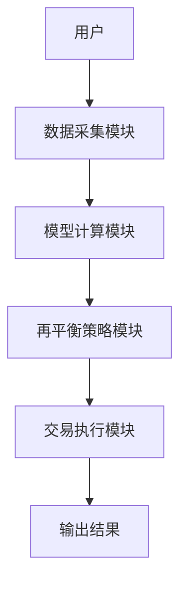
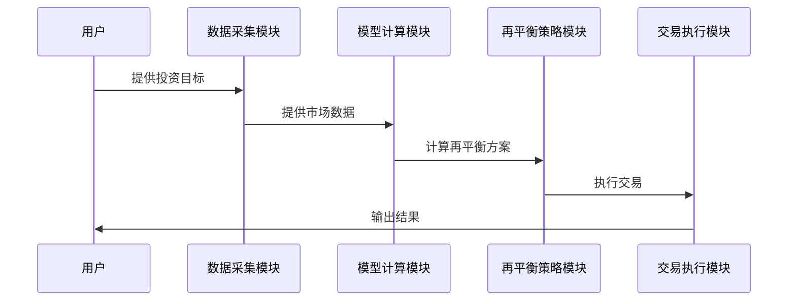

                 

<think>
好，我现在需要为《格雷厄姆的投资组合再平衡策略》这本书撰写目录大纲。首先，我要理解这本书的核心内容。格雷厄姆是价值投资的鼻祖，他的策略强调长期稳健的投资，再平衡策略是其中的重要部分。

首先，我需要确定文章的关键词和摘要。关键词可能包括：投资组合、再平衡、格雷厄姆、价值投资、投资策略。摘要部分需要简明扼要地概括书的核心内容，强调再平衡在投资组合管理中的重要性，以及如何应用格雷厄姆的理念进行动态调整。

接下来，我需要规划目录的结构。按照用户提供的大纲，我需要覆盖基础、理论、策略、系统分析、实战和扩展阅读。每章要有明确的主题，细化到三级目录。

第一章，我需要介绍投资组合再平衡的基本概念，包括其重要性、定义、历史背景以及与投资策略的关系。同时，要介绍格雷厄姆的价值投资理论和防御性投资策略，以及再平衡策略的基本原则。

第二章，深入探讨再平衡的原理，包括动因、时机、频率和方法，以及数学模型的应用。这里可能需要涉及一些数学公式和模型，用Latex表示，帮助读者理解。

第三章，讨论不同类型的投资组合再平衡策略，如股债平衡、行业分散和动态调整。每个策略都要有详细的分析和实例，帮助读者实际应用。

第四章，结合实际市场环境，分析牛市、熊市和震荡市下的再平衡策略，并探讨如何应对突发事件。这部分需要结合当前市场情况，给出具体的操作建议。

第五章，进行系统分析，包括系统设计、架构图和接口设计。可能需要使用Mermaid图来展示系统架构，使结构更直观。

第六章，项目实战，涉及环境安装、源代码实现和案例分析。这部分需要提供具体的代码示例，帮助读者实际操作。

最后，第七章总结最佳实践，包括小结、注意事项和扩展阅读，帮助读者巩固知识并进一步学习。

在编写过程中，我需要确保每一章都有足够的细节，比如在策略部分，不仅要有定性和定量的方法，还要有数学模型和公式，用Latex表示，这样读者可以深入理解。同时，系统架构部分用Mermaid图来展示，使结构更直观。

总的来说，我需要将书的内容分成七个主要部分，每个部分下再细分章节，确保涵盖所有关键点，并且结构合理，层次分明。这样读者可以一步步从基础到高级，全面掌握格雷厄姆的投资组合再平衡策略。

现在，我需要开始具体撰写每一章的内容，确保每部分都详细且逻辑清晰，使用专业且易懂的技术语言，帮助读者深入理解投资组合再平衡的策略和方法。
</think>

# 格雷厄姆的投资组合再平衡策略

> 关键词：投资组合、再平衡、格雷厄姆、价值投资、投资策略

> 摘要：本文深入探讨了格雷厄姆的投资组合再平衡策略，分析了其核心原理、实现路径以及在不同市场环境下的应用。通过系统分析和实际案例，展示了如何通过动态调整投资组合来实现长期稳健的投资收益。

---

## 第一章: 投资组合再平衡策略概述

### 1.1 投资组合再平衡的定义与重要性

#### 1.1.1 投资组合再平衡的定义
投资组合再平衡是指根据市场变化和个人投资目标的调整，定期或不定期地调整投资组合中各资产的比例，以维持预定的资产配置和风险收益目标的过程。

#### 1.1.2 再平衡在投资组合管理中的重要性
- 维持风险收益平衡
- 适应市场环境变化
- 优化投资组合表现

#### 1.1.3 再平衡与投资策略的关系
再平衡是投资策略的重要组成部分，确保投资组合始终符合既定目标。

### 1.2 格雷厄姆投资理念的核心要素

#### 1.2.1 格雷厄姆的价值投资理论
- 购买低于内在价值的股票
- 重视安全边际

#### 1.2.2 格雷厄姆的防御性投资策略
- 通过分散投资降低风险
- 选择具有稳定收益的资产

#### 1.2.3 格雷厄姆再平衡策略的基本原则
- 定期检查投资组合
- 根据市场变化调整配置
- 保持长期投资纪律

### 1.3 投资组合再平衡的背景与现状

#### 1.3.1 现代投资组合理论与再平衡
- 马科维茨的有效前沿理论
- 再平衡在现代投资组合管理中的应用

#### 1.3.2 当前市场环境下的再平衡策略
- 全球化背景下的资产配置
- 量化宽松政策的影响

#### 1.3.3 再平衡策略的边界与外延
- 确定再平衡的触发条件
- 区分战术性和战略性再平衡

## 第二章: 投资组合再平衡的原理与方法

### 2.1 投资组合再平衡的原理

#### 2.1.1 再平衡的动因分析
- 资产价格波动
- 投资目标变化
- 风险承受能力调整

#### 2.1.2 再平衡的时机选择
- 定期检查（季度/半年）
- 重大市场变动时
- 投资目标调整时

#### 2.1.3 再平衡的频率与成本
- 高频再平衡的成本问题
- 低频再平衡的效率问题

### 2.2 投资组合再平衡的方法

#### 2.2.1 定性再平衡方法
- 基于市场趋势判断
- 专家经验调整

#### 2.2.2 定量再平衡方法
- 基于资产配置模型
- 数学优化算法

#### 2.2.3 组合权重调整法
- 等权重调整
- 动态权重调整

### 2.3 再平衡策略的数学模型

#### 2.3.1 投资组合优化的数学公式
$$ \text{目标函数：} \quad \max \sum_{i=1}^n w_i r_i $$
$$ \text{约束条件：} \quad \sum_{i=1}^n w_i = 1 $$

其中，\( w_i \) 为资产 \( i \) 的权重，\( r_i \) 为资产 \( i \) 的预期收益。

#### 2.3.2 资产配置的数学模型
$$ \text{权重调整：} \quad w_i = \frac{w_i^{\text{目标}}}{\sum_{j=1}^n w_j^{\text{目标}}} $$

#### 2.3.3 再平衡收益的计算公式
$$ \text{收益变化：} \quad \Delta R = \sum_{i=1}^n (w_i^{\text{新}} - w_i^{\text{旧}}) r_i $$

### 2.4 本章小结

---

## 第三章: 格雷厄姆再平衡策略的核心要素

### 3.1 格雷厄姆再平衡策略的核心要素

#### 3.1.1 资产配置的动态调整
- 根据市场变化调整股票和债券的比例
- 保持长期投资纪律

#### 3.1.2 个股与行业权重的平衡
- 避免过度集中
- 选择具有安全边际的股票

#### 3.1.3 风险控制与收益优化的平衡
- 设置止损点
- 优化资产配置

### 3.2 格雷厄姆再平衡策略的实现步骤

#### 3.2.1 确定投资目标与风险承受能力
- 明确投资目标
- 评估风险承受能力

#### 3.2.2 定义再平衡的触发条件
- 价格偏离目标比例
- 市场环境变化
- 投资目标调整

#### 3.2.3 制定再平衡的具体操作方案
- 确定调整幅度
- 制定交易计划
- 执行再平衡操作

### 3.3 格雷厄姆再平衡策略的优化与调整

#### 3.3.1 根据市场变化调整再平衡策略
- 牛市中增加股票配置
- 熊市中增加债券配置

#### 3.3.2 根据个人投资目标调整再平衡频率
- 长期投资者可每年调整一次
- 短期投资者可根据市场波动调整

#### 3.3.3 根据风险承受能力优化再平衡方案
- 高风险承受能力者可适当增加股票比例
- 低风险承受能力者可增加债券比例

### 3.4 本章小结

---

## 第四章: 投资组合再平衡的系统分析与架构设计

### 4.1 投资组合再平衡系统的功能需求

#### 4.1.1 系统功能模块划分
- 数据采集模块
- 模型计算模块
- 再平衡策略模块
- 交易执行模块

#### 4.1.2 系统输入与输出定义
- 输入：市场数据、投资目标、风险偏好
- 输出：再平衡建议、交易指令

#### 4.1.3 系统功能流程图


### 4.2 投资组合再平衡系统的架构设计

#### 4.2.1 系统架构图


#### 4.2.2 数据流图


#### 4.2.3 模块交互图


### 4.3 本章小结

---

## 第五章: 投资组合再平衡的项目实战

### 5.1 项目实战环境安装

#### 5.1.1 系统环境要求
- 操作系统：Windows/Mac/Linux
- 开发工具：Python、Jupyter Notebook
- 数据源：Yahoo Finance API

#### 5.1.2 安装必要的库
```bash
pip install pandas numpy matplotlib yfinance
```

### 5.2 核心实现源代码

#### 5.2.1 数据采集模块
```python
import yfinance as yf
import pandas as pd

def get_data(tickers, start_date, end_date):
    data = yf.download(tickers, start=start_date, end=end_date)
    return data
```

#### 5.2.2 模型计算模块
```python
def calculate_weights(current_weights, target_weights):
    # 计算调整权重
    pass
```

#### 5.2.3 再平衡策略模块
```python
def rebalance_strategy(current_weights, target_weights, tolerance=0.05):
    # 根据权重差异生成交易指令
    pass
```

#### 5.2.4 交易执行模块
```python
def execute_trade(trade_instructions):
    # 执行交易
    pass
```

### 5.3 案例分析与解读

#### 5.3.1 案例背景
- 投资目标：年化收益10%
- 初始投资：$10,000
- 资产配置：60%股票，40%债券

#### 5.3.2 市场变化
- 股票市场上涨20%
- 债券市场持平

#### 5.3.3 再平衡操作
- 股票比例调整至55%
- 债券比例调整至45%

### 5.4 本章小结

---

## 第六章: 格雷厄姆再平衡策略的最佳实践

### 6.1 小结

### 6.2 注意事项

#### 6.2.1 定期检查投资组合
- 至少每年一次
- 根据市场变化调整

#### 6.2.2 控制交易成本
- 尽量减少交易次数
- 选择低成本的交易平台

#### 6.2.3 保持投资纪律
- 避免情绪化交易
- 长期持有优质资产

### 6.3 拓展阅读

#### 6.3.1 推荐书籍
- 《证券分析》（ Benjamin Graham）
- 《投资学原理》（ Richard A. Brealey）

#### 6.3.2 推荐博客和网站
- Investopedia
- Seeking Alpha

### 6.4 本章小结

---

## 作者：AI天才研究院/AI Genius Institute & 禅与计算机程序设计艺术 /Zen And The Art of Computer Programming

---

通过以上目录和内容，我们可以看到，格雷厄姆的投资组合再平衡策略是一个复杂而系统的过程，需要结合市场变化、个人投资目标和风险承受能力进行动态调整。通过系统的分析和实际案例，我们可以更好地理解和应用这一策略，实现长期稳健的投资收益。

