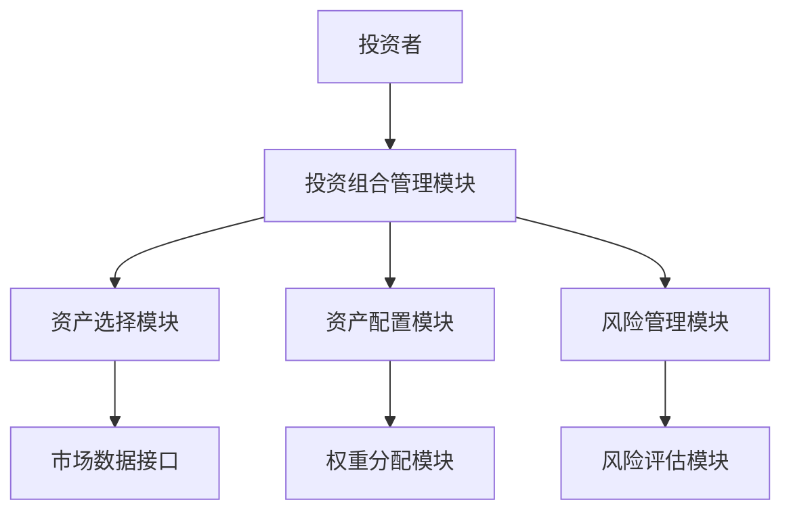
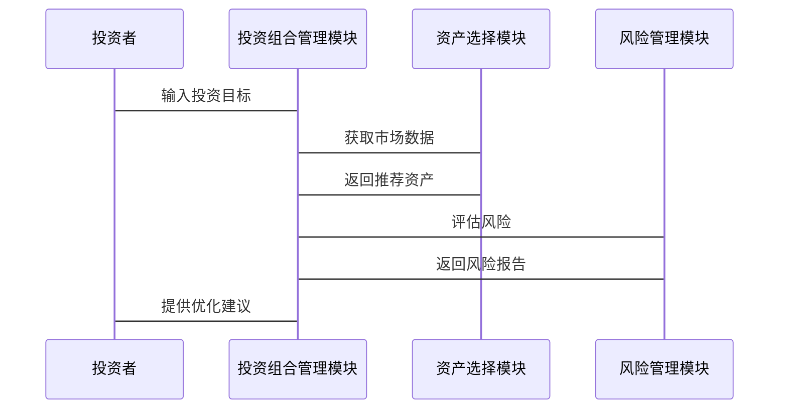

                 

# 格雷厄姆的投资组合管理

---

## 关键词

投资组合管理, 价值投资, 资产配置, 风险管理, 绩效评估, 股票投资, 系统设计

---

## 摘要

本文深入探讨了格雷厄姆的投资组合管理理论与实践，从核心概念到数学模型，从系统架构到实战应用，全面剖析投资组合管理的原理与方法。通过详细讲解资产配置、风险管理、绩效评估等关键环节，结合实际案例和系统设计，为投资者提供科学的投资组合管理方案。本文适合投资专业人士、程序员、系统架构师以及对价值投资感兴趣的技术爱好者阅读。

---

# 目录

## 第1章: 格雷厄姆投资组合管理的核心概念

### 1.1 投资组合管理的定义与背景

- 1.1.1 投资组合管理的定义
- 1.1.2 投资组合管理的背景与重要性
- 1.1.3 格雷厄姆投资理念的核心思想

### 1.2 投资组合管理的目标与方法

- 1.2.1 投资组合管理的目标
- 1.2.2 投资组合管理的主要方法
- 1.2.3 投资组合管理的优缺点对比

### 1.3 投资组合管理的核心要素

- 1.3.1 资产配置
- 1.3.2 风险管理
- 1.3.3 绩效评估

## 第2章: 投资组合管理的数学模型与公式

### 2.1 投资组合的期望收益与风险

- 2.1.1 期望收益的计算公式
- 2.1.2 风险的衡量指标
- 2.1.3 投资组合的方差计算公式

### 2.2 资本资产定价模型（CAPM）

- 2.2.1 CAPM的基本公式
- 2.2.2 CAPM在投资组合管理中的应用

### 2.3 风险调整后的收益评估

- 2.3.1 夏普比率
- 2.3.2 特雷诺比率
- 2.3.3 净风险收益

## 第3章: 投资组合管理的系统分析与架构设计

### 3.1 投资组合管理的系统功能设计

- 3.1.1 资产选择模块
- 3.1.2 资产配置模块
- 3.1.3 风险管理模块

### 3.2 投资组合管理的系统架构图

### 3.3 系统接口设计

- 3.3.1 投资者输入接口
- 3.3.2 资产数据接口
- 3.3.3 风险评估接口

### 3.4 系统交互流程图

## 第4章: 资产选择策略与投资组合优化

### 4.1 资产选择策略

- 4.1.1 格雷厄姆的资产选择原则
- 4.1.2 基本面分析与技术分析
- 4.1.3 风险调整后的资产选择

### 4.2 投资组合优化

- 4.2.1 均值-方差优化
- 4.2.2 最小方差组合
- 4.2.3 最大方差组合

### 4.3 资产配置与再平衡

- 4.3.1 资产配置的步骤
- 4.3.2 投资组合再平衡的策略
- 4.3.3 再平衡的频率与成本

## 第5章: 风险管理与绩效评估

### 5.1 风险管理策略

- 5.1.1 风险的来源与分类
- 5.1.2 风险分散化策略
- 5.1.3 风险对冲方法

### 5.2 绩效评估与优化

- 5.2.1 绩效评估的指标
- 5.2.2 绩效评估的步骤
- 5.2.3 绩效优化的策略

## 第6章: 系统实现与代码实战

### 6.1 环境安装

- 6.1.1 Python环境搭建
- 6.1.2 数据获取工具安装
- 6.1.3 开发工具配置

### 6.2 核心实现代码

- 6.2.1 资产选择模块代码
- 6.2.2 资产配置模块代码
- 6.2.3 风险管理模块代码

### 6.3 代码解读与分析

- 6.3.1 数据处理流程
- 6.3.2 模型实现细节
- 6.3.3 系统运行测试

## 第7章: 投资组合管理的实战案例分析

### 7.1 实战案例背景

- 7.1.1 投资目标与约束条件
- 7.1.2 市场环境分析
- 7.1.3 投资者风险偏好

### 7.2 投资组合构建与优化

- 7.2.1 资产选择与配置
- 7.2.2 风险管理与控制
- 7.2.3 绩效评估与优化

### 7.3 案例分析总结

- 7.3.1 案例总结与反思
- 7.3.2 经验教训与启示

## 第8章: 投资组合管理的未来趋势

### 8.1 数字化与智能化投资

- 8.1.1 人工智能在投资组合管理中的应用
- 8.1.2 大数据分析对投资组合管理的影响

### 8.2 可持续投资与ESG因素

- 8.2.1 ESG投资理念
- 8.2.2 可持续投资的策略与实践

### 8.3 投资组合管理的未来发展

- 8.3.1 技术创新对投资组合管理的影响
- 8.3.2 未来投资组合管理的趋势

## 附录

### 附录A: 格雷厄姆投资理念的经典语录

### 附录B: 投资组合管理相关工具与资源

### 附录C: 术语表

---

## 作者

作者：AI天才研究院/AI Genius Institute & 禅与计算机程序设计艺术 /Zen And The Art of Computer Programming

