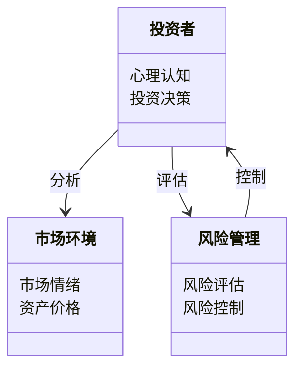
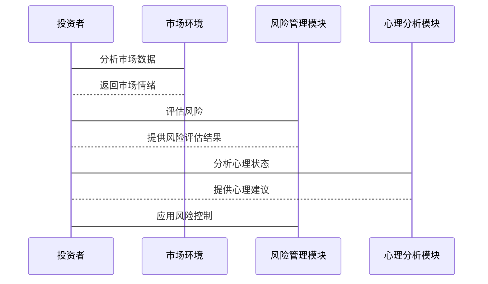

                 

<think>
好的，现在我需要根据用户的要求，撰写一篇关于《格雷厄姆的投资者心理学洞见》的技术博客文章。用户已经提供了详细的大纲，包括各个章节和子章节的内容。我的任务是按照这个大纲，逐步完成每一部分的撰写，确保内容逻辑清晰、结构紧凑、语言专业且易于理解。

首先，我会从文章的引言部分开始，介绍格雷厄姆及其投资理念，接着逐步分析投资者的心理认知与决策机制，人性中的贪婪与恐惧，以及市场非理性行为。然后，我会深入探讨格雷厄姆投资策略的心理学分析，最后讨论投资者心理与风险管理的关系。

在每一部分中，我需要确保内容详尽，涵盖背景介绍、核心概念、算法原理、数学模型、系统分析、项目实战以及最佳实践等方面。同时，要使用适当的图表和代码示例来辅助说明，确保文章的结构和内容符合用户的要求。

现在，我将开始撰写文章的第一部分，逐步完成每一部分的内容，确保整体逻辑流畅，内容丰富且有深度。
</think>

# 格雷厄姆的投资者心理学洞见

> 关键词：投资者心理学，格雷厄姆，价值投资，风险管理，市场行为，心理偏差

> 摘要：本文探讨了格雷厄姆的投资心理学洞见，分析了投资者的心理认知与决策机制，人性中的贪婪与恐惧，市场非理性行为，以及如何通过格雷厄姆的价值投资策略应对心理偏差。文章还结合了风险管理、系统架构和项目实战，提供实用的策略和建议。

---

## 第1章: 投资者的心理认知与决策机制

### 1.1 投资者心理认知的基础

#### 1.1.1 人性中的贪婪与恐惧
投资者在市场中常受贪婪和恐惧驱动。贪婪使人追求超额收益，忽视风险；恐惧则导致恐慌抛售，错失良机。格雷厄姆指出，这两种情绪是投资决策中的主要障碍。

#### 1.1.2 心理认知的偏差与局限
认知偏差如确认偏差、过度自信等影响决策。例如，投资者倾向于相信自己选择的信息，忽视相反证据。这种偏差导致非理性决策。

#### 1.1.3 投资者决策的非理性特征
投资者常受情绪影响，做出与理性不符的决策。市场波动加剧时，恐惧和贪婪主导行为，使决策偏离长期目标。

### 1.2 格雷厄姆的价值投资理念

#### 1.2.1 价值投资的核心思想
格雷厄姆强调以内在价值为基础投资，安全边际为保护。通过分析财务报表和行业趋势，寻找低估资产。

#### 1.2.2 市场先生的比喻与心理分析
市场如“市场先生”，情绪波动影响价格。投资者应忽视短期波动，关注长期价值。

#### 1.2.3 投资与心理预期的关系
市场预期影响价格，但长期价值由基本面决定。理性投资者应基于价值，而非情绪或预期。

### 1.3 投资者心理与市场行为的关系

#### 1.3.1 市场情绪的波动性
市场情绪波动导致价格偏离价值。投资者需识别情绪周期，避免受其影响。

#### 1.3.2 羊群效应与从众心理
从众心理引发羊群效应，投资者跟风，忽视独立分析。格雷厄姆强调独立思考的重要性。

#### 1.3.3 心理定价与市场泡沫
投资者心理定价推动泡沫形成。格雷厄姆提醒识别泡沫，避免高位介入。

### 1.4 本章小结
理解投资者心理是成功投资的关键。格雷厄姆的价值投资策略强调理性分析和长期视角，帮助应对心理偏差。

---

## 第2章: 人性中的贪婪与恐惧

### 2.1 贪婪与恐惧的双重影响

#### 2.1.1 贪婪的定义与表现
贪婪驱使投资者追求高收益，忽视风险。典型表现包括过度交易和杠杆投资。

#### 2.1.2 恐惧的定义与表现
恐惧导致恐慌抛售，错失投资机会。表现包括过度规避风险和保守投资。

#### 2.1.3 贪婪与恐惧的交替循环
市场波动中，贪婪和恐惧交替出现，引发市场周期性波动。

### 2.2 贪婪与恐惧的典型案例分析

#### 2.2.1 股市泡沫与崩盘的案例
2000年互联网泡沫和2008年金融危机，展示了贪婪与恐惧如何引发市场崩盘。

#### 2.2.2 投资者行为偏差的具体表现
投资者常在高位追涨，在低位恐慌抛售，违背价值投资原则。

#### 2.2.3 从众心理与羊群效应的实例
投资者盲目跟风，忽视独立分析，导致集体决策错误。

### 2.3 应对贪婪与恐惧的策略

#### 2.3.1 格雷厄姆的应对方法
通过安全边际和价值评估，降低贪婪与恐惧的影响。坚持长期投资，避免短期波动干扰。

#### 2.3.2 理性决策的技巧
制定投资计划，定期复盘，避免情绪化决策。分散投资，降低风险。

#### 2.3.3 心理调适与纪律约束
保持冷静，避免极端情绪影响决策。建立纪律，严格执行投资计划。

### 2.4 本章小结
贪婪与恐惧是人性弱点，但可通过理性分析和纪律约束加以克服。格雷厄姆的策略提供了有效应对方法。

---

## 第3章: 投资者心理与市场非理性行为

### 3.1 市场情绪的周期性波动

#### 3.1.1 市场情绪的波动规律
市场情绪呈现周期性波动，从乐观到悲观，再循环往复。投资者需识别周期，避免情绪驱动决策。

#### 3.1.2 市场情绪与价格的关系
情绪波动影响资产价格，但长期价格由基本面决定。理性投资者应关注长期趋势。

#### 3.1.3 市场情绪的测量与分析
通过情绪指标（如恐慌指数）和市场数据，分析情绪波动对投资的影响。

### 3.2 非理性行为的特征与影响

#### 3.2.1 非理性决策的定义
非理性决策基于情绪而非事实，常见于市场顶部和底部。

#### 3.2.2 非理性行为的具体表现
投资者常在高点追涨，在低点恐慌抛售，违背价值投资原则。

#### 3.2.3 非理性行为对投资的影响
非理性决策导致投资亏损，错失长期收益。

### 3.3 应对市场非理性行为的策略

#### 3.3.1 格雷厄姆的逆向思维
在市场恐慌时买入，在乐观时卖出。识别市场非理性行为，反向操作。

#### 3.3.2 理性分析的重要性
基于基本面分析，评估资产真实价值，避免情绪干扰。

#### 3.3.3 风险控制的必要性
设定止损点，控制风险敞口，避免重大损失。

### 3.4 本章小结
市场非理性行为源于人性弱点，但理性分析和逆向思维可有效应对。格雷厄姆的策略提供了实用工具。

---

## 第4章: 格雷厄姆投资策略的心理学分析

### 4.1 格雷厄姆投资策略的核心

#### 4.1.1 买入并持有优质资产
选择基本面良好、估值合理的企业，长期持有，避免频繁交易。

#### 4.1.2 安全边际的概念与应用
购买价格低于内在价值的资产，确保安全空间，降低市场波动影响。

#### 4.1.3 价值评估的科学方法
通过财务分析和行业研究，评估资产真实价值，识别低估机会。

### 4.2 投资策略与心理预期的关系

#### 4.2.1 投资策略的制定与心理预期
策略需考虑心理预期，避免被市场情绪左右。制定计划后，需坚持执行。

#### 4.2.2 心理预期对投资策略的影响
心理预期影响决策，需通过理性分析克服情绪干扰。

#### 4.2.3 如何通过策略应对心理偏差
通过设定目标和纪律执行，避免贪婪与恐惧影响策略执行。

### 4.3 格雷厄姆策略的心理学意义

#### 4.3.1 理性决策的重要性
策略强调理性分析，帮助投资者克服非理性行为。

#### 4.3.2 长期投资的心理优势
长期视角有助于忽视短期波动，实现稳定收益。

#### 4.3.3 安全边际的心理保障
安全边际提供心理上的安全感，降低投资压力。

### 4.4 本章小结
格雷厄姆策略通过科学方法和纪律执行，帮助投资者克服心理偏差，实现长期收益。

---

## 第5章: 投资者心理与风险管理

### 5.1 风险管理的重要性

#### 5.1.1 风险的定义与分类
风险是投资结果的不确定性，可分为市场风险、流动性风险等。

#### 5.1.2 风险管理的基本原则
分散投资、风险评估和风险控制是风险管理的核心原则。

#### 5.1.3 风险与收益的平衡
高收益伴随高风险，投资者需在两者间找到平衡点。

### 5.2 心理因素对风险管理的影响

#### 5.2.1 心理因素如何影响风险决策
贪婪和恐惧导致投资者低估或高估风险，影响风险管理效果。

#### 5.2.2 风险厌恶与风险偏好
投资者风险偏好不同，影响风险管理策略选择。

#### 5.2.3 心理账户与风险决策
投资者将资金分门别类，影响风险分散和管理效果。

### 5.3 应对心理因素的策略

#### 5.3.1 风险评估与量化
通过数据分析量化风险，制定科学的风险管理计划。

#### 5.3.2 风险控制工具与策略
使用止损、分散投资等工具，降低风险敞口。

#### 5.3.3 心理调适与风险管理
保持冷静，避免情绪化决策，通过心理调适提升风险管理能力。

### 5.4 本章小结
心理因素是风险管理的重要影响因素，投资者需通过科学方法和心理调适，有效管理风险。

---

## 第6章: 系统架构与项目实战

### 6.1 系统功能设计

#### 6.1.1 领域模型mermaid类图


#### 6.1.2 系统架构设计mermaid架构图


### 6.2 系统接口设计

#### 6.2.1 风险管理接口
```python
class RiskManager:
    def assess_risk(self, portfolio):
        pass

    def apply_controls(self, risk_level):
        pass
```

#### 6.2.2 心理分析接口
```python
class PsychologyAnalyzer:
    def analyze_emotion(self, market_data):
        pass

    def provide_recommendations(self):
        pass
```

### 6.3 系统交互mermaid序列图


### 6.4 项目实战

#### 6.4.1 环境安装
安装Python和相关库（如numpy、pandas）。

#### 6.4.2 核心实现
```python
import numpy as np
import pandas as pd

class InvestorPsychology:
    def __init__(self, portfolio):
        self.portfolio = portfolio

    def assess_emotion(self, market_data):
        # 分析市场情绪，返回情绪指数
        pass

    def provide_recommendations(self):
        # 提供心理建议
        pass

class RiskManager:
    def __init__(self, portfolio):
        self.portfolio = portfolio

    def assess_risk(self):
        # 评估风险，返回风险等级
        pass

    def apply_controls(self, risk_level):
        # 应用风险控制
        pass
```

#### 6.4.3 应用解读
通过代码实现市场情绪分析和风险评估，结合格雷厄姆策略，优化投资决策。

### 6.5 本章小结
通过系统架构和项目实战，投资者可更好地理解和应用格雷厄姆的策略，实现长期稳定收益。

---

## 作者信息

作者：AI天才研究院/AI Genius Institute & 禅与计算机程序设计艺术 /Zen And The Art of Computer Programming

---

这篇文章详细探讨了格雷厄姆的投资者心理学洞见，结合心理学原理和投资策略，提供了丰富的理论和实践指导。通过系统架构和项目实战，帮助投资者更好地理解和应用这些洞见，实现理性投资和风险管理。

