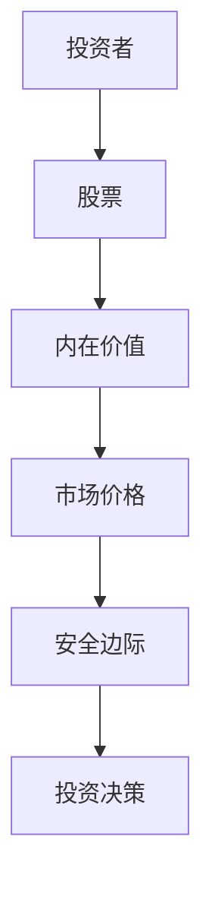

                 

# 《格雷厄姆的投资风险控制》

## 关键词：格雷厄姆，投资风险，价值评估，安全边际，投资组合管理，风险管理

## 摘要：格雷厄姆作为价值投资的鼻祖，其投资理论的核心在于通过安全边际和价值评估来控制投资风险。本文将深入探讨格雷厄姆投资理论的核心概念，分析其在现代投资组合管理中的应用，并结合实际案例，展示如何通过数学模型和算法实现投资风险的有效控制。文章内容涵盖背景介绍、核心概念、算法原理、系统分析、项目实战等多个方面，旨在为投资者提供一套科学的风险控制方法。

---

## 第一部分：投资风险控制的背景与核心概念

### 第1章：投资风险控制的背景与问题背景

#### 1.1 投资风险控制的基本概念

##### 1.1.1 投资风险的定义与分类

投资风险是指在投资过程中，由于市场波动、经济环境变化等因素，可能导致投资收益低于预期或本金损失的风险。根据其来源，投资风险可以分为系统性风险（如市场风险、利率风险）和非系统性风险（如公司特定风险）。系统性风险是整个市场普遍存在的风险，而非系统性风险则是特定于某个资产或行业。

##### 1.1.2 投资风险控制的必要性

投资风险控制是投资者在不确定市场环境下，为了实现投资目标而采取的一系列措施。通过有效的风险控制，投资者可以在控制风险的前提下，最大化投资收益。投资风险控制的必要性体现在以下几点：

- **保护本金**：避免因市场波动导致的本金损失。
- **稳定收益**：通过分散投资和风险对冲，实现收益的稳定性。
- **提高投资效率**：在可控风险范围内，追求更高的投资回报。

##### 1.1.3 格雷厄姆投资理论的背景与特点

本杰明·格雷厄姆是价值投资的鼻祖，他的投资理论基于“安全边际”的概念，强调通过深入分析企业的基本面，找到被市场低估的股票进行投资。格雷厄姆的投资理论具有以下特点：

- **注重安全边际**：通过购买低于内在价值的股票，确保投资的安全性。
- **价值导向**：以企业的内在价值为核心，而非市场情绪或短期价格波动。
- **长期视角**：注重长期投资，避免频繁交易带来的成本和风险。

#### 1.2 问题背景与问题描述

##### 1.2.1 当前投资市场的风险特征

当前投资市场的风险特征主要体现在以下几个方面：

- **市场波动加剧**：近年来，全球经济的不确定性加剧了市场的波动性，如新冠疫情、地缘政治冲突等事件对市场产生了重大影响。
- **低利率环境**：全球低利率环境下，投资者为了追求更高的收益，可能承担过高的风险。
- **市场泡沫风险**：部分资产类别存在泡沫风险，如科技股、加密货币等高估值资产。

##### 1.2.2 格雷厄姆投资理论的核心问题

格雷厄姆投资理论的核心问题是如何通过安全边际和价值评估，找到被市场低估的投资标的，并在市场波动中实现稳定的收益。具体包括以下几个方面：

- **如何确定安全边际**：如何量化安全边际，确保投资的安全性。
- **如何进行价值评估**：如何准确评估企业的内在价值，避免高估或低估。
- **如何应对市场波动**：如何在市场波动中保持冷静，避免非理性决策。

##### 1.2.3 投资风险控制的目标与边界

投资风险控制的目标是在可控风险范围内，实现投资收益的最大化。其边界主要包括：

- **风险承受能力**：投资者根据自身的风险承受能力，设定风险敞口。
- **投资期限**：投资期限不同，风险控制策略也不同。
- **市场环境**：根据市场环境的变化，动态调整风险控制策略。

#### 1.3 问题解决与核心要素

##### 1.3.1 格雷厄姆投资方法的核心要素

格雷厄姆投资方法的核心要素包括：

- **安全边际**：通过购买低于内在价值的股票，确保投资的安全性。
- **价值评估**：通过分析企业的基本面，评估其内在价值。
- **长期视角**：注重长期投资，避免短期波动的影响。

##### 1.3.2 投资风险控制的实现路径

投资风险控制的实现路径主要包括：

1. **确定投资目标**：明确投资目标和风险承受能力。
2. **选择投资策略**：根据目标选择合适的投资策略，如价值投资、指数投资等。
3. **构建投资组合**：通过分散投资降低非系统性风险。
4. **动态调整**：根据市场环境和自身目标的变化，动态调整投资组合。

##### 1.3.3 核心概念的结构与组成

投资风险控制的核心概念包括：

- **安全边际**：确保投资的安全性。
- **价值评估**：评估资产的内在价值。
- **投资组合管理**：通过分散投资降低风险。

---

### 第2章：格雷厄姆投资理论的核心概念与联系

#### 2.1 核心概念原理

##### 2.1.1 安全边际的概念与数学模型

**安全边际**是指股票的市场价格低于其内在价值的部分，即：

$$ \text{安全边际} = \text{内在价值} - \text{市场价格} $$

如果内在价值与市场价格的差距越大，投资的安全性越高。格雷厄姆建议投资者选择那些市场价格低于内在价值的企业进行投资，以确保投资的安全性。

##### 2.1.2 价值评估的核心公式

格雷厄姆的价值评估方法主要是通过分析企业的财务报表，评估其内在价值。其核心公式为：

$$ \text{内在价值} = \frac{\text{净利润} \times (1 + g)}{r - g} $$

其中，\( g \) 是企业的净利润增长率，\( r \) 是资本成本。通过该公式，投资者可以估算出企业的内在价值，从而确定其市场价格是否被低估。

#### 2.2 核心概念属性特征对比表格

以下是格雷厄姆投资理论中几个核心概念的属性特征对比：

| 概念       | 属性特征           |
|------------|--------------------|
| 安全边际   | 防御性、可计算性     |
| 价值评估   | 客观性、动态性       |
| 投资组合管理 | 分散性、动态调整性   |

#### 2.3 ER实体关系图（Mermaid流程图）

以下是格雷厄姆投资理论中各核心概念之间的关系图：

---

### 第3章：投资风险控制的算法原理

#### 3.1 算法原理讲解

##### 3.1.1 均值-方差优化模型

**均值-方差优化模型**是现代投资组合理论（MPT）的核心，其基本思想是通过优化投资组合的收益和风险之间的关系，找到最优的投资组合。其数学模型如下：

$$ \min_{w} w^T \Sigma w $$
$$ \text{s.t.} \quad w^T \mu = \text{target return} $$ $$ \sum_{i=1}^n w_i = 1 $$ $$ w_i \geq 0 \quad \forall i $$ $$

其中，\( w \) 是投资组合的权重向量，\( \Sigma \) 是资产之间的协方差矩阵，\( \mu \) 是资产的预期收益率向量。

##### 3.1.2 现代投资组合理论（MPT）

**现代投资组合理论（MPT）**是由哈里·马科维茨提出的，其核心思想是通过分散投资来降低风险。MPT通过优化投资组合的收益-风险关系，找到最优的投资组合。其数学模型如下：

$$ \min_{w} \sigma^2(w) $$
$$ \text{s.t.} \quad \mu^T w = \text{target return} $$ $$ \sum_{i=1}^n w_i = 1 $$ $$ w_i \geq 0 \quad \forall i $$ $$

其中，\( \sigma^2(w) \) 是投资组合的方差，即风险的度量。

#### 3.2 数学模型与公式

##### 3.2.1 投资组合风险的数学模型

投资组合的风险可以用方差来度量，其数学模型为：

$$ \text{风险} = \sqrt{w^T \Sigma w} $$

其中，\( w \) 是投资组合的权重向量，\( \Sigma \) 是资产之间的协方差矩阵。

##### 3.2.2 格雷厄姆安全边际公式

格雷厄姆的安全边际公式为：

$$ \text{安全边际} = \text{内在价值} - \text{市场价格} $$

---

## 总结

通过对格雷厄姆投资理论的核心概念、算法原理和系统分析的探讨，我们可以看到，格雷厄姆的投资方法不仅是一种理论，更是一种实践性的投资策略。通过安全边际和价值评估，投资者可以在市场波动中实现稳健的投资回报。同时，现代投资组合理论（MPT）为我们提供了优化投资组合的工具，帮助我们在风险可控的前提下，最大化投资收益。

在实际应用中，投资者需要根据自身的风险承受能力和投资目标，选择合适的投资策略，并动态调整投资组合。通过深入理解格雷厄姆的投资理论，并结合现代投资组合理论，投资者可以在复杂的市场环境中，实现长期稳健的投资回报。

