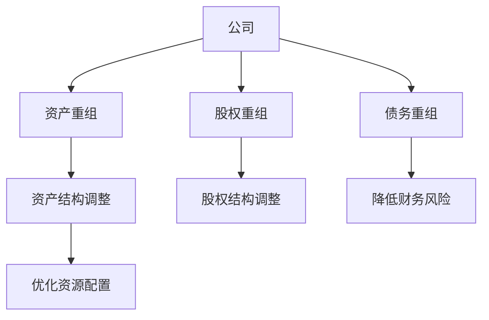
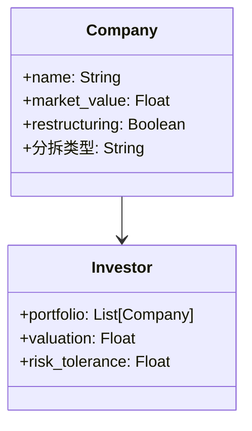

                 

# 格雷厄姆的特殊情况投资：在公司重组和分拆中寻找机会

## 关键词：
- 特殊情况投资
- 公司重组
- 公司分拆
- 投资机会
- 格雷厄姆投资理论

## 摘要：
本文深入探讨了格雷厄姆的特殊情况投资策略，重点关注公司重组和分拆中的投资机会。通过分析公司重组和分拆的类型、机制及驱动因素，结合数学模型和实际案例，为投资者提供系统的分析框架和投资策略。文章还介绍了如何利用这些策略在市场中寻找低估的投资机会，帮助投资者在复杂市场环境中做出明智决策。

---

# 第一部分: 特殊情况投资概述

## 第1章: 特殊情况投资的背景与概念

### 1.1 特殊情况投资的定义与特点
#### 1.1.1 什么是特殊情况投资
特殊情况投资是指在公司面临重组、分拆或其他特殊事件时，投资者通过分析这些事件对股价的影响，寻找低估的投资机会。这种投资策略的核心在于识别市场未充分反映的价值。

#### 1.1.2 格雷厄姆的特殊情况投资理念
格雷厄姆在《证券分析》中提出，投资者应关注市场低估的股票，尤其是那些在公司重组或分拆中具有潜在价值的公司。他认为，市场情绪往往会导致股票价格偏离其实际价值，而特殊情况投资正是利用这种偏差。

#### 1.1.3 特殊情况投资的市场环境
特殊情况投资的机会往往出现在市场波动较大或经济周期转折点。例如，经济衰退期间，许多公司可能通过重组优化结构，从而释放被压抑的价值。

### 1.2 公司重组与分拆的背景分析
#### 1.2.1 公司重组的定义与类型
公司重组是指调整公司资产、负债或股权结构的过程，以提高效率或实现战略目标。常见的重组类型包括股权重组、资产重组和债务重组。

#### 1.2.2 公司分拆的定义与类型
公司分拆是指将母公司的一部分业务或资产独立出来，形成新的公司。分拆通常分为子公司分拆、业务分拆和股权分拆三种类型。

#### 1.2.3 特殊情况投资的市场机会
公司重组和分拆通常伴随着股价的波动。投资者需要识别这些事件中的价值，尤其是在市场情绪低迷时，许多公司可能被低估。

---

# 第二部分: 公司重组与分拆的分析框架

## 第2章: 公司重组的类型与机制

### 2.1 公司重组的类型
#### 2.1.1 股权重组
股权重组涉及调整公司股东结构，通常通过增发、回购或转让股份实现。这种重组可能带来新的股权结构和治理模式。

#### 2.1.2 资产重组
资产重组是指调整公司资产结构，优化资源配置。例如，剥离亏损资产或收购优质资产以增强竞争力。

#### 2.1.3 债务重组
债务重组通过调整债务结构和期限，降低公司财务风险。这通常发生在公司面临财务压力时。

### 2.2 公司重组的驱动因素
#### 2.2.1 经济周期的影响
经济衰退可能导致公司重组，以应对市场需求下降和成本上升的压力。

#### 2.2.2 企业战略调整
公司重组可能是为了实现战略目标，例如进入新市场或优化业务结构。

#### 2.2.3 市场竞争压力
面对激烈竞争，公司可能通过重组提高效率，降低成本。

### 2.3 公司重组的评估方法
#### 2.3.1 财务指标分析
通过分析重组前后的财务指标，如净利润率、资产负债率等，评估重组的效果。

#### 2.3.2 企业价值评估
使用DCF模型等方法，评估重组后的公司价值。

#### 2.3.3 市场反应分析
观察市场对重组的反应，判断股价走势。

---

## 第3章: 公司分拆的类型与机制

### 3.1 公司分拆的类型
#### 3.1.1 子公司分拆
将子公司独立上市，释放母公司的价值。

#### 3.1.2 业务分拆
将某项业务独立出来，形成新的公司。

#### 3.1.3 股权分拆
通过分配子公司股权给母公司股东，实现资产的重新分配。

### 3.2 公司分拆的驱动因素
#### 3.2.1 优化企业结构
分拆可以提高管理效率，专注于不同业务。

#### 3.2.2 提高市场效率
通过分拆，公司可以更灵活地应对市场变化。

#### 3.2.3 资本运作需求
分拆可以为公司提供新的融资渠道。

### 3.3 公司分拆的评估方法
#### 3.3.1 财务指标分析
评估分拆后的财务健康状况。

#### 3.3.2 市场反应分析
观察市场对分拆的反应，判断投资机会。

#### 3.3.3 企业价值评估
评估分拆后的公司价值，寻找低估机会。

---

## 第4章: 特殊情况投资的核心概念与联系

### 4.1 核心概念原理
特殊情况投资的核心在于识别市场低估的机会，尤其是在公司重组和分拆中。投资者需要分析这些事件对股价的影响，并利用市场情绪的偏差。

### 4.2 核心概念属性特征对比表格
| 概念       | 定义                                   | 特点                                   |
|------------|--------------------------------------|--------------------------------------|
| 公司重组   | 调整企业资产、负债、股权结构的过程     | 提高效率，优化资本结构               |
| 公司分拆   | 将部分业务或资产独立出来               | 释放价值，提高市场效率               |

### 4.3 实体关系图

---

## 第三部分: 投资策略与数学模型

## 第5章: 投资策略与数学模型

### 5.1 投资策略
#### 5.1.1 格雷厄姆的估值方法
格雷厄姆提出，投资者应关注股票的内在价值，而不是市场价格。他建议使用市盈率、市净率等指标评估股票价值。

#### 5.1.2 市场情绪与投资机会
市场情绪往往影响股价，投资者应利用市场恐慌时寻找低估机会。

### 5.2 数学模型
#### 5.2.1 股票估值公式
股票的内在价值可以通过以下公式计算：
$$
V = \frac{E}{k}
$$
其中，$E$ 是公司的净利润，$k$ 是期望的回报率。

#### 5.2.2 市场情绪指标
使用恐慌指数（VIX）衡量市场情绪，当指数上升时，市场可能处于恐慌状态，股价可能被低估。

### 5.3 案例分析
以某公司分拆为例，分析分拆前后的股价变化，评估投资机会。

---

## 第6章: 系统分析与架构设计方案

### 6.1 系统功能设计
#### 6.1.1 领域模型

### 6.2 系统架构设计

---

## 第7章: 项目实战

### 7.1 环境安装
安装必要的数据分析工具，如Python和Pandas。

### 7.2 核心实现
编写代码分析公司重组和分拆的影响。

### 7.3 案例分析
分析某公司分拆案例，展示如何应用理论进行实际操作。

---

## 第8章: 总结与展望

### 8.1 总结
特殊情况投资需要结合市场环境和公司情况，利用市场情绪的偏差寻找机会。

### 8.2 注意事项
投资者需谨慎评估风险，避免盲目跟风。

### 8.3 拓展阅读
推荐相关书籍和文献，进一步学习投资理论。

---

作者：AI天才研究院 & 禅与计算机程序设计艺术

