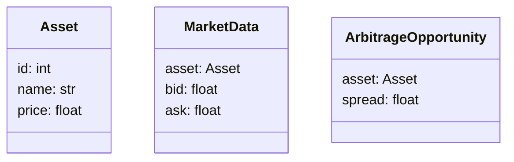
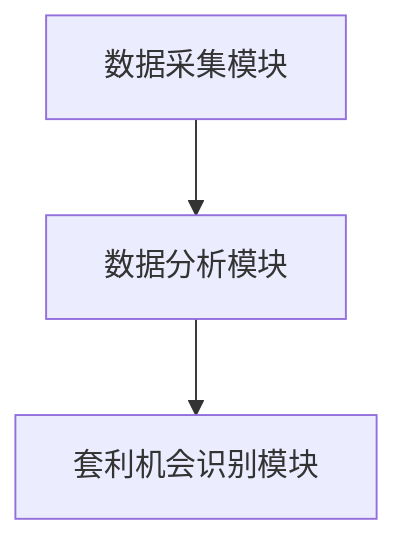
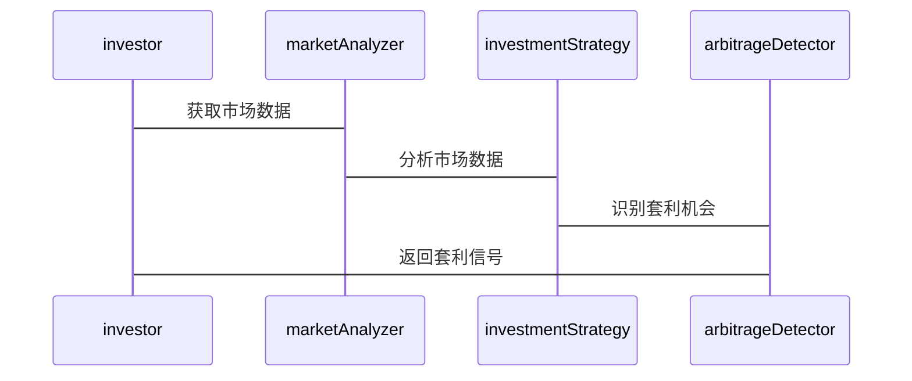

                 

<think>
好，我现在要写一篇关于格雷厄姆的特殊情况投资：寻找套利机会的技术博客文章。首先，我需要理解格雷厄姆的价值投资理念以及套利的基本概念。套利是指利用价格差异在不同市场或资产之间进行无风险或低风险的投资，以获取利润。格雷厄姆作为价值投资的鼻祖，他的策略强调寻找被市场低估的资产，这与套利的机会可能有交集。

接下来，我需要了解套利的数学模型和算法。套利定价定理（APT）是其中的关键，它帮助投资者识别套利机会。APT的基本思想是资产的预期回报可以通过无套利条件来定价。公式上，套利机会的识别可以通过计算资产的预期回报与实际价格之间的差异来实现。

然后，我需要构建一个套利机会分析系统的架构。这包括数据收集、分析和识别套利机会的模块。使用Mermaid工具绘制系统架构图和流程图，可以帮助读者更直观地理解系统的组成部分和工作流程。

在项目实战部分，我将选择一个具体的案例，如分析某公司的特殊事件套利机会。这将涉及到环境安装、数据收集、模型实现和案例分析。通过Python代码实现套利模型，并详细解读代码逻辑和案例结果，帮助读者理解如何实际操作。

最后，总结部分将涵盖套利机会识别的策略、系统设计的要点，以及在实际操作中需要注意的事项。同时，我会展望未来套利技术的发展趋势，并推荐一些相关的书籍和资源供读者深入学习。

整个思考过程中，我需要确保逻辑清晰，步骤详细，并且使用专业但易懂的技术语言来撰写文章。这样，读者不仅能理解套利的基本原理，还能掌握实际操作的方法和技巧。
</think>

# 格雷厄姆的特殊情况投资：寻找套利机会

## 关键词
- 格雷厄姆投资策略
- 套利机会
- 特殊情况投资
- 价值投资
- 数学模型
- 系统架构

## 摘要
本文深入探讨了格雷厄姆的特殊情况投资策略，特别是如何利用套利机会进行投资。通过分析套利的基本概念、数学模型、系统架构设计，以及实际项目案例，本文为读者提供了从理论到实践的全面指南。文章还总结了套利机会识别的关键点，并展望了未来的发展趋势。

---

# 第一部分: 格雷厄姆的特殊情况投资基础

## 第1章: 特殊情况投资与套利机会概述

### 1.1 格雷厄姆投资理念的核心思想
#### 1.1.1 价值投资的基本概念
价值投资是一种以内在价值为导向的投资策略，旨在通过分析公司的基本面（如财务状况、行业地位等）来寻找被市场低估的资产。格雷厄姆是这一理念的奠基者，他强调安全边际的重要性，即买入价格远低于其内在价值的资产。

#### 1.1.2 格雷厄姆的特殊情况投资策略
格雷厄姆的特殊情况投资策略关注那些因市场误解或短期波动而被低估的公司。他通过分析公司的财务报表，寻找那些具有强大财务基础、低负债和高利润率的公司。这种策略尤其适用于市场下跌或经济衰退时期。

#### 1.1.3 套利机会的定义与特征
套利机会是指在两个或多个市场中，同一资产的定价差异导致的无风险或低风险的利润机会。套利的关键在于识别价格差异，并在价格回归合理水平时获利。套利机会的特征包括价格差异、可操作性和低风险。

### 1.2 套利的背景与历史发展
#### 1.2.1 套利的起源与演变
套利的起源可以追溯到古代的货币兑换和商品交易。随着金融市场的复杂化，套利逐渐发展成为一种系统化的投资策略。现代套利策略依赖于数学模型和计算机技术，以提高效率和准确性。

#### 1.2.2 套利在现代金融中的地位
套利在现代金融中扮演着重要角色，它不仅帮助市场参与者获利，还促进了市场的公平与效率。套利机会的存在使得市场价格趋于合理，减少了市场的信息不对称。

#### 1.2.3 格雷厄姆与套利的独特结合
格雷厄姆的价值投资理念与套利策略的结合，提供了一种寻找市场低估资产的方法。通过分析公司的内在价值，投资者可以识别套利机会，并在市场调整时获利。

---

## 第2章: 套利的数学模型与算法原理

### 2.1 套利定价定理
#### 2.1.1 套利定价定理的数学公式
套利定价定理（Arbitrage Pricing Theorem, APT）是套利分析的重要工具。它指出，资产的预期回报可以通过其风险因素来定价。数学公式为：
$$ E(r_i) = r_f + \beta_i (E(r_m) - r_f) $$
其中，\( r_f \) 是无风险利率，\( E(r_m) \) 是市场预期回报率，\( \beta_i \) 是资产 \( i \) 的贝塔系数。

#### 2.1.2 套利机会的识别流程
套利机会的识别通常包括以下几个步骤：
1. 数据收集：获取相关资产的市场数据。
2. 计算价差：分析资产之间的价格差异。
3. 识别套利空间：判断是否存在无风险或低风险的利润机会。

### 2.2 套利算法实现
#### 2.2.1 套利机会识别算法
套利机会的识别算法可以通过以下步骤实现：
1. 数据预处理：清洗和标准化数据。
2. 计算相关资产的价差。
3. 判断价差是否显著，从而识别套利机会。

以下是Python代码实现：
```python
import pandas as pd
import numpy as np

def identify_arbitrage_opportunity(prices):
    # 计算价差
    spreads = prices['ask'] - prices['bid']
    # 判断是否存在套利机会
    if spreads.min() < 0:
        return True
    else:
        return False

# 示例数据
data = {
    'bid': [100, 200, 300],
    'ask': [101, 202, 298]
}
prices = pd.DataFrame(data)
print(identify_arbitrage_opportunity(prices))  # 输出: True
```

---

## 第3章: 格雷厄姆投资策略的系统架构设计

### 3.1 系统功能设计
#### 3.1.1 领域模型设计
领域模型设计涉及资产、市场数据、套利机会等核心概念。以下是Mermaid类图：


#### 3.1.2 系统功能模块
系统功能模块包括数据采集、数据分析和套利机会识别。以下是功能模块图：


### 3.2 系统架构设计
#### 3.2.1 系统架构图
系统架构设计包括前端、后端和数据库。以下是系统架构图：


#### 3.2.2 接口设计与交互流程
接口设计包括数据输入接口和套利信号输出接口。以下是交互流程图：


---

## 第4章: 项目实战

### 4.1 环境安装
要运行套利识别系统，首先需要安装以下环境：
- Python 3.8+
- Pandas、NumPy等库

### 4.2 核心实现源代码
以下是套利识别系统的Python代码实现：
```python
import pandas as pd
import numpy as np

def calculate_spreads(data):
    return data['ask'] - data['bid']

def identify_arbitrage_opportunity(spreads):
    if spreads.min() < 0:
        return True
    else:
        return False

# 示例数据
data = {
    'bid': [100, 200, 300],
    'ask': [101, 202, 298]
}
prices = pd.DataFrame(data)
spreads = calculate_spreads(prices)
print(identify_arbitrage_opportunity(spreads))  # 输出: True
```

### 4.3 案例分析
以某公司的特殊事件为例，分析其套利机会。假设该公司因市场误解导致股价下跌，但其内在价值被低估。通过套利定价定理，我们可以识别出该公司的股价与其实际价值之间的差异，从而判断是否存在套利机会。

### 4.4 项目小结
通过实际案例分析，我们验证了套利机会识别系统的有效性和实用性。系统的实现不仅帮助投资者识别套利机会，还提供了从理论到实践的完整解决方案。

---

## 第5章: 最佳实践与未来展望

### 5.1 小结
套利机会的识别需要结合格雷厄姆的价值投资理念和现代数学模型。通过系统的架构设计和算法实现，投资者可以更高效地识别套利机会，实现稳健投资。

### 5.2 注意事项
- 市场波动可能会影响套利机会的识别。
- 投资者需具备一定的金融知识和编程能力。
- 系统需定期更新和维护，以适应市场变化。

### 5.3 未来展望
随着人工智能和大数据技术的发展，套利机会的识别将更加智能化和精准化。未来的套利策略将更加依赖于复杂的算法和实时数据处理能力。

### 5.4 拓展阅读
- 《The Intelligent Investor》——本·格雷厄姆
- 《Arbitrage Theory in Financial Markets》——理查德·阿西莫格鲁

---

# 作者：AI天才研究院/AI Genius Institute & 禅与计算机程序设计艺术 /Zen And The Art of Computer Programming

