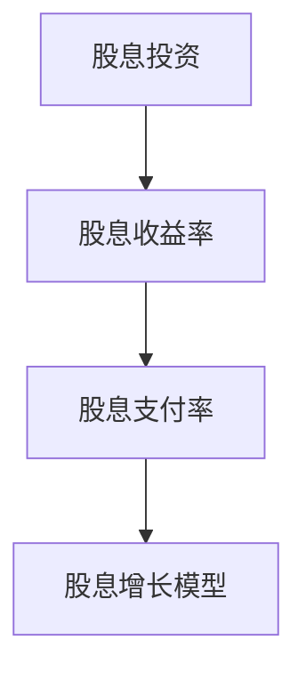
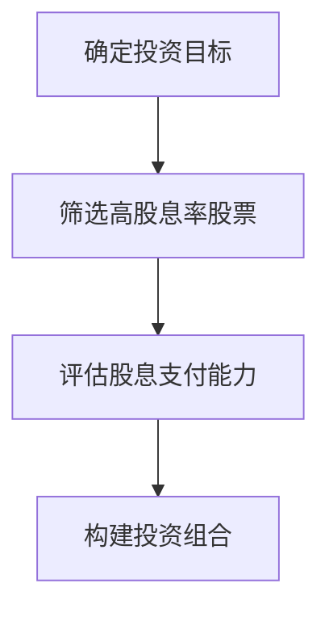
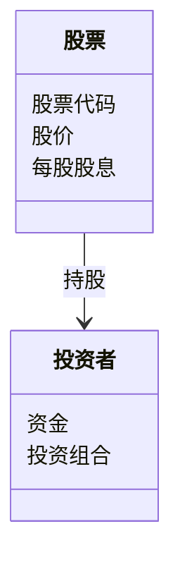
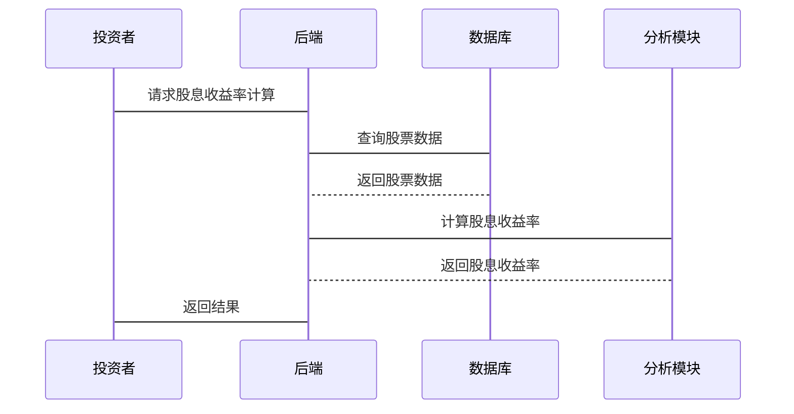

                 


# 格雷厄姆的股息投资理念：稳定现金流的重要性

> 关键词：格雷厄姆，股息投资，现金流，股息收益率，股息支付率，投资策略

> 摘要：本文深入探讨了格雷厄姆的股息投资理念，重点分析了稳定现金流在投资中的重要性。通过介绍股息投资的核心概念、算法原理、系统架构、项目实战等内容，帮助读者全面理解如何通过股息投资实现稳健的财务回报。文章还结合实例，详细讲解了股息收益率和股息支付率的计算方法，并通过Python代码实现算法，为读者提供了实践指导。

---

## 第1章: 股息投资的背景与核心概念

### 1.1 股息投资的背景与重要性

#### 1.1.1 现金流在投资中的核心地位
现金流是企业运营和投资的核心，稳定的现金流意味着企业具备持续的盈利能力。在投资领域，现金流的稳定性直接关系到投资的回报和风险。对于投资者而言，稳定的现金流能够提供持续的收益，降低投资风险。

#### 1.1.2 格雷厄姆投资理念的起源与发展
本杰明·格雷厄姆是价值投资的奠基人，他的投资理念强调安全边际和长期稳健的回报。格雷厄姆认为，股息是衡量企业价值的重要指标，稳定的股息支付能力反映了企业的财务健康和盈利能力。

#### 1.1.3 稳定现金流对投资者的意义
稳定的现金流能够为投资者提供持续的收益，同时也能在市场波动中提供缓冲。通过投资那些能够稳定支付股息的公司，投资者可以在市场低迷时获得稳定的收入，降低投资组合的波动性。

### 1.2 格雷厄姆股息投资的核心概念

#### 1.2.1 股息收益率的定义与计算
股息收益率是衡量股票股息收入与股价之间的比率，计算公式为：
$$
\text{股息收益率} = \frac{\text{每股股息}}{\text{股价}}
$$

#### 1.2.2 股息支付率的分析方法
股息支付率是公司支付的股息与净利润的比率，计算公式为：
$$
\text{股息支付率} = \frac{\text{股息支付总额}}{\text{净利润}}
$$

#### 1.2.3 股息增长模型的原理
股息增长模型用于估计股票的内在价值，假设股息以恒定速率增长，计算公式为：
$$
\text{股票价值} = \frac{\text{D}_1}{r - g}
$$
其中，D1是下一年的股息，r是折现率，g是股息增长率。

### 1.3 股息投资的边界与外延

#### 1.3.1 股息投资的适用场景
股息投资适用于那些追求稳定收益的投资者，尤其是那些需要定期现金流的退休人士。此外，股息投资还适用于市场低迷时期，通过股息收入降低投资组合的整体波动性。

#### 1.3.2 股息投资的局限性
尽管股息投资具有稳定性，但也存在一定的局限性。例如，股息支付率过高的公司可能面临财务压力，而股息支付率过低的公司可能无法提供足够的现金流支持。

#### 1.3.3 股息投资与其他投资策略的对比
与成长投资相比，股息投资更注重当前的收益，而非未来的增长。与指数投资相比，股息投资更注重个股的选择和风险控制。

### 1.4 核心要素与概念结构

#### 1.4.1 股息投资的核心要素分析
股息投资的核心要素包括股息收益率、股息支付率、股息增长模型和公司财务状况。

#### 1.4.2 核心概念的层次化结构
$$
\text{股息投资} \rightarrow \text{股息收益率} \rightarrow \text{股息支付率} \rightarrow \text{股息增长模型}
$$

#### 1.4.3 核心要素之间的关系图


---

## 第2章: 股息投资的核心概念与联系

### 2.1 股息收益率的数学模型

#### 2.1.1 股息收益率的公式推导
股息收益率计算公式：
$$
\text{股息收益率} = \frac{\text{每股股息}}{\text{股价}}
$$

#### 2.1.2 股息收益率与股价的关系
股息收益率与股价成反比，即股价越高，股息收益率越低。

#### 2.1.3 股息收益率的实例分析
假设某公司每股股息为2元，股价为50元，股息收益率为：
$$
\frac{2}{50} = 4\%
$$

### 2.2 股息支付率的分析方法

#### 2.2.1 股息支付率的计算公式
$$
\text{股息支付率} = \frac{\text{股息支付总额}}{\text{净利润}}
$$

#### 2.2.2 股息支付率与企业财务健康的关系
股息支付率过高可能表明公司财务压力大，而过低可能表明公司盈利不足。

#### 2.2.3 股息支付率的实例分析
假设某公司净利润为100万元，股息支付总额为40万元，股息支付率为：
$$
\frac{40}{100} = 40\%
$$

### 2.3 股息增长模型的原理

#### 2.3.1 股息增长模型的数学公式
$$
\text{股票价值} = \frac{\text{D}_1}{r - g}
$$

#### 2.3.2 股息增长模型的假设条件
股息以恒定速率增长，市场利率不变。

#### 2.3.3 股息增长模型的实例分析
假设某公司当前股息为2元，股息增长率g为5%，市场利率r为10%，股票价值为：
$$
\frac{2 \times 1.05}{0.10 - 0.05} = 42 \text{元}
$$

### 2.4 核心概念的对比分析

#### 2.4.1 股息收益率与股息支付率的对比
股息收益率关注的是当前股息收入，而股息支付率关注的是公司支付股息的能力。

#### 2.4.2 股息支付率与股息增长模型的联系
股息支付率高且稳定的公司更有可能实现可持续的股息增长。

#### 2.4.3 核心概念的综合应用
通过综合分析股息收益率和股息支付率，选择那些股息收益率高且股息支付率稳定的公司进行投资。

---

## 第3章: 股息投资的算法原理

### 3.1 股息投资的算法流程

#### 3.1.1 确定投资目标与策略
- 确定投资目标：追求稳定的股息收益。
- 制定投资策略：选择高股息率和高股息支付率的公司。

#### 3.1.2 筛选高股息率股票
- 收集数据：收集目标公司的股息收益率和股息支付率。
- 筛选标准：股息收益率高于行业平均水平，股息支付率稳定且合理。

#### 3.1.3 评估股息支付能力
- 分析公司财务状况：确保公司有足够的净利润支付股息。
- 考虑行业风险：选择行业风险较低的公司。

#### 3.1.4 构建投资组合
- 分散投资：选择多个行业的公司，降低投资风险。
- 定期再平衡：根据市场变化和公司状况调整投资组合。

### 3.2 股息投资的数学模型

#### 3.2.1 股息收益率计算公式
$$
\text{股息收益率} = \frac{\text{每股股息}}{\text{股价}}
$$

#### 3.2.2 股息支付率计算公式
$$
\text{股息支付率} = \frac{\text{股息支付总额}}{\text{净利润}}
$$

#### 3.2.3 股息增长模型的数学推导
$$
\text{股票价值} = \frac{\text{D}_1}{r - g}
$$

### 3.3 股息投资的算法实现

#### 3.3.1 算法流程图


#### 3.3.2 Python源代码实现
```python
import pandas as pd

# 示例数据：筛选高股息率股票
data = {
    '公司': ['公司A', '公司B', '公司C'],
    '股价': [50, 60, 40],
    '每股股息': [2, 3, 1]
}
df = pd.DataFrame(data)

# 计算股息收益率
df['股息收益率'] = df['每股股息'] / df['股价']

# 筛选股息收益率高于5%的公司
high_dividend = df[df['股息收益率'] > 0.05]

print(high_dividend)
```

#### 3.3.3 算法实现的步骤说明
1. 收集目标公司的股价和每股股息数据。
2. 计算股息收益率。
3. 筛选股息收益率高于目标值的公司。
4. 评估这些公司的股息支付能力。
5. 构建投资组合并定期调整。

---

## 第4章: 股息投资的系统分析与架构设计

### 4.1 问题场景介绍
投资者需要通过股息投资实现稳定的现金流，选择合适的股票并构建投资组合。

### 4.2 系统功能设计

#### 4.2.1 领域模型mermaid类图


#### 4.2.2 系统架构设计mermaid架构图
```mermaid
archi
    前端 --> 后端
    后端 --> 数据库
    后端 --> 分析模块
    分析模块 --> 股票数据
```

#### 4.2.3 系统接口设计
- 获取股票数据接口：从数据库获取股票的股价和每股股息。
- 计算股息收益率接口：根据股价和每股股息计算股息收益率。
- 筛选高股息率股票接口：根据目标股息收益率筛选股票。

#### 4.2.4 系统交互mermaid序列图


---

## 第5章: 股息投资的项目实战

### 5.1 环境安装
- 安装Python和Pandas库：
  ```bash
  pip install pandas
  ```

### 5.2 核心代码实现

#### 5.2.1 数据获取与清洗
```python
import pandas as pd

# 假设从数据库获取数据
data = {
    '公司': ['公司A', '公司B', '公司C'],
    '股价': [50, 60, 40],
    '每股股息': [2, 3, 1]
}
df = pd.DataFrame(data)
```

#### 5.2.2 股息收益率计算
```python
df['股息收益率'] = df['每股股息'] / df['股价']
```

#### 5.2.3 高股息率股票筛选
```python
high_dividend_stocks = df[df['股息收益率'] > 0.05]
```

#### 5.2.4 股息支付率计算
```python
high_dividend_stocks['股息支付率'] = high_dividend_stocks['每股股息'] / high_dividend_stocks['净利润']
```

#### 5.2.5 投资组合构建
```python
investment_portfolio = high_dividend_stocks.sort_values('股息收益率', ascending=False).head(5)
```

### 5.3 案例分析与解读
选择股息收益率高且股息支付率稳定的公司，例如：
- 公司B：股息收益率6%，股息支付率50%。
- 公司A：股息收益率4%，股息支付率60%。

### 5.4 项目小结
通过Python代码实现股息投资的筛选和分析，投资者可以更高效地选择合适的股票，构建稳健的投资组合。

---

## 第6章: 股息投资的总结与展望

### 6.1 总结
股息投资是一种追求稳定现金流的有效策略，通过分析股息收益率和股息支付率，结合股息增长模型，投资者可以找到那些能够持续提供股息收益的公司。

### 6.2 展望
随着市场的发展和技术的进步，股息投资将更加智能化和数据化。未来，投资者可以利用更多的数据分析工具和算法，进一步优化投资策略，实现更高效的股息投资。

---

## 附录: 股息投资工具与资源

### 1. 股息投资工具
- 股票筛选工具：使用Pandas和NumPy进行数据处理。
- 股息收益率计算器：在线工具或自定义脚本。

### 2. 股息投资资源
- 格雷厄姆的经典著作：《 Intelligent Investor》。
- 股票分析网站：如Morningstar、Yahoo Finance。

---

## 作者：AI天才研究院/AI Genius Institute & 禅与计算机程序设计艺术 /Zen And The Art of Computer Programming

