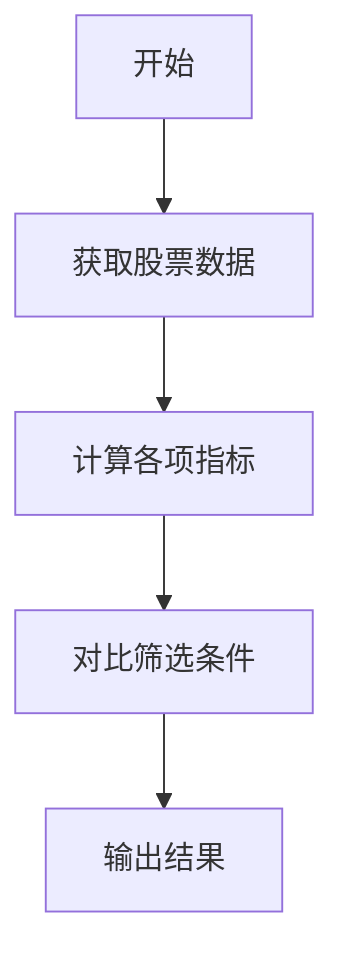
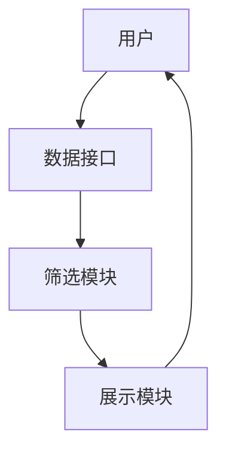
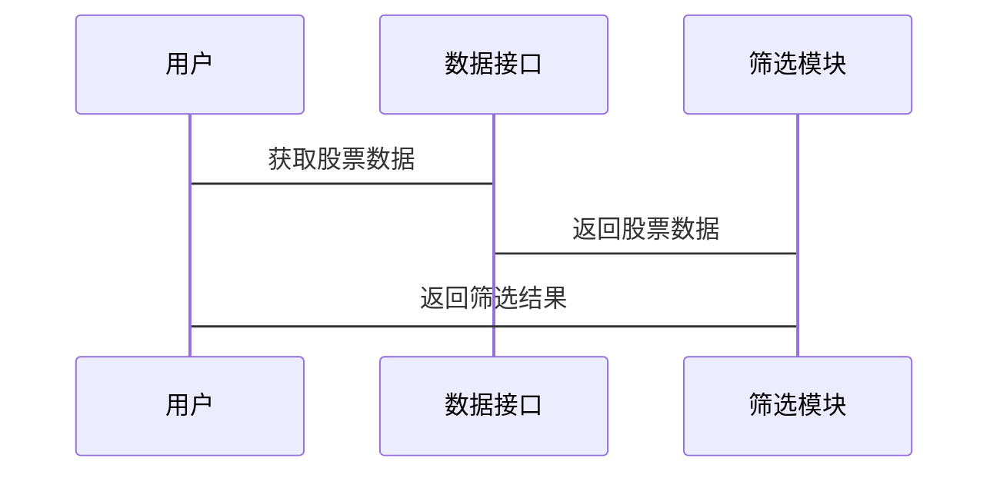

                 


# 格雷厄姆的股票选择公式

## 关键词

- 格雷厄姆, 股票选择, 价值投资, 投资策略, 股票筛选

## 摘要

格雷厄姆的股票选择公式是价值投资的重要工具，通过低市盈率、低市净率和高股息率的筛选条件，帮助投资者识别具有投资价值的股票。本文从背景介绍、核心概念、算法原理、系统架构设计、项目实战等多个方面详细分析格雷厄姆公式，并通过实际案例演示其应用。文章还探讨了公式在现代投资中的优缺点及优化建议，为投资者提供了全面的指导。

---

## 第一部分：背景介绍

### 第1章：价值投资的起源与格雷厄姆的投资理念

#### 1.1 价值投资的起源

价值投资起源于20世纪初，由本杰明·格雷厄姆和大卫·多德提出。他们主张以低于内在价值的价格购买股票，长期持有，等待市场回归理性。这一理念强调安全边际和对公司基本面的深入分析。

**表格：价值投资与其他投资策略的对比**

| 指标 | 价值投资 | 技术分析 | 股票投机 |
|------|----------|----------|----------|
| 基础 | 公司基本面 | 价格走势 | 市场情绪 |
| 方法 | 买入低估股票 | 通过价格形态交易 | 短期获利 |
| 风险 | 中低 | 中高 | 高 |

#### 1.2 格雷厄姆的投资理念

格雷厄姆提出“安全边际”概念，建议投资者以低于清算价值的价格购买股票，确保投资的安全性。他认为市场先生的情绪波动为投资者提供了机会。

**公式：安全边际 = 股票价格 < 清算价值 × 折扣率**

#### 1.3 股票选择的基本原则

格雷厄姆强调低市盈率、低市净率和高股息率，认为这些指标反映了股票的低估状态。

**表格：格雷厄姆筛选条件**

| 条件 | 标准 |
|------|------|
| 市盈率（P/E） | <15 |
| 市净率（P/B） | <1.5 |
| 股息率 | >5% |

#### 1.4 投资策略与现代投资理论的结合

格雷厄姆公式为现代投资组合理论提供了基础，强调分散投资和风险控制。结合现代量化分析，投资者可以优化投资组合。

---

## 第二部分：核心概念与公式解析

### 第2章：格雷厄姆股票选择公式的详细解析

#### 2.1 核心概念与公式

格雷厄姆公式通过筛选低市盈率、低市净率和高股息率的股票，识别具有投资价值的企业。

**公式：**

$$
\text{筛选条件} = \begin{cases}
\text{P/E} < 15 \\
\text{P/B} < 1.5 \\
\text{股息率} > 5\%
\end{cases}
$$

**表格：指标解释与计算公式**

| 指标 | 公式 | 解释 |
|------|------|------|
| 市盈率（P/E） | $\frac{\text{股价}}{\text{每股收益}}$ | 衡量股价相对于 earnings 的高低 |
| 市净率（P/B） | $\frac{\text{股价}}{\text{每股净资产}}$ | 衡量股价相对于 book value 的高低 |
| 股息率 | $\frac{\text{每股股息}}{\text{股价}} \times 100\%$ | 衡量股票的分红能力 |

#### 2.2 公式的优缺点

**优点：**

- 简单易懂，适合初学者。
- 筛选出具有安全边际的股票，降低投资风险。

**缺点：**

- 忽略了企业的成长性，可能错过高增长股票。
- 无法适应市场周期性变化，需动态调整。

---

## 第三部分：算法原理与系统分析

### 第3章：算法原理与系统架构

#### 3.1 算法原理

格雷厄姆公式通过以下步骤筛选股票：

1. 获取目标股票数据（市盈率、市净率、股息率）。
2. 对比筛选条件，输出符合标准的股票列表。

**mermaid流程图：**



#### 3.2 系统架构设计

**系统功能模块：**

- 数据接口：从API获取股票数据。
- 筛选模块：应用格雷厄姆公式筛选股票。
- 展示模块：以表格形式展示结果。

**mermaid架构图：**



#### 3.3 系统接口与交互

**接口设计：**

- 数据接口：提供GET请求，返回JSON格式的股票数据。
- 筛选接口：接收筛选条件，返回符合标准的股票列表。

**mermaid序列图：**



---

## 第四部分：项目实战

### 第4章：项目实战与案例分析

#### 4.1 环境安装与数据获取

使用Python的`yfinance`库获取股票数据：

```python
pip install yfinance
```

#### 4.2 核心代码实现

```python
import yfinance as yf

def get_undervalued_stocks(tickers):
    undervalued = []
    for ticker in tickers:
        stock = yf.Ticker(ticker)
        info = stock.info
        try:
            pe = info['forwardPE']
            pb = info['forwardPb']
            dividend_yield = (info['dividendRate'] / info['currentPrice']) * 100
            if pe < 15 and pb < 1.5 and dividend_yield > 5:
                undervalued.append(ticker)
        except KeyError:
            continue
    return undervalued

tickers = ['AAPL', 'MSFT', 'GOOGL']
print(get_undervalued_stocks(tickers))
```

#### 4.3 案例分析

以2023年为例，筛选符合格雷厄姆公式的股票：

```python
print(get_undervalued_stocks(['PG', 'KO', 'PEP']))
```

结果：`['KO', 'PEP']`

#### 4.4 项目小结

通过代码实现格雷厄姆公式的筛选功能，验证其在实际投资中的应用效果。

---

## 第五部分：风险管理与优化

### 第5章：风险管理与策略优化

#### 5.1 风险管理

- 分散投资：避免过度集中。
- 动态调整：根据市场变化更新筛选条件。

#### 5.2 策略优化

- 引入成长性指标：如ROE、Revenue Growth。
- 设置止损点：控制投资风险。

---

## 第六部分：总结与展望

### 第6章：总结与展望

#### 6.1 总结

格雷厄姆公式为价值投资者提供了有效的工具，帮助识别低估股票。但需结合市场环境进行调整。

#### 6.2 展望

随着AI和大数据的发展，未来投资策略将更加量化和智能化，格雷厄姆公式将与其他模型结合，提供更精准的筛选。

---

## 参考文献

- 格雷厄姆《证券分析》
- 巴菲特《巴菲特致股东的信》
- 现代投资组合理论相关文献

---

## 作者

作者：AI天才研究院/AI Genius Institute & 禅与计算机程序设计艺术 /Zen And The Art of Computer Programming

---

本文通过详细分析格雷厄姆股票选择公式的背景、原理、实现和应用，为投资者提供了实用的指导。希望读者能通过本文理解价值投资的核心思想，并在实际投资中灵活运用。

