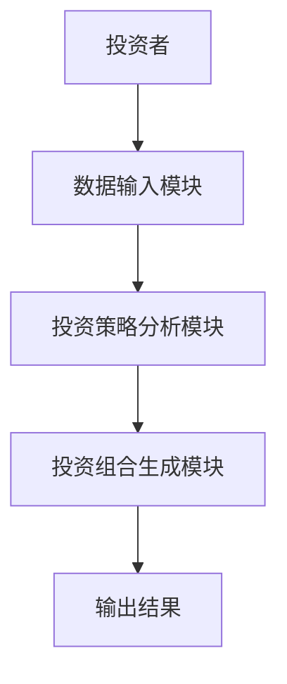
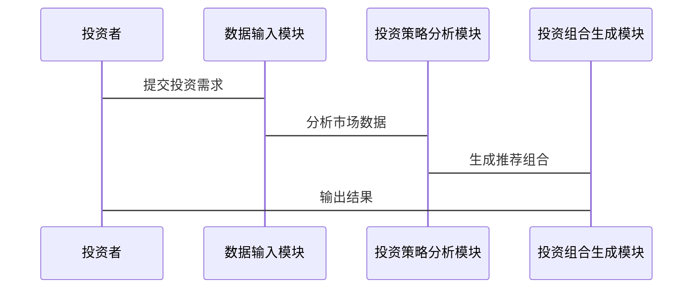

                 

<think>
嗯，我现在要写一篇关于格雷厄姆的防御型和进取型投资者区分的技术博客。首先，我需要理解格雷厄姆的理论，他主要讲的是价值投资，特别是防御型和进取型投资者的区别。防御型投资者注重安全和稳定，而进取型则追求高回报，愿意承担更大的风险。

接下来，我需要构建文章的结构。用户已经给出一个大纲，我需要按照这个大纲来展开内容。首先是标题和关键词，然后是摘要，接着是各个章节的内容。

在背景介绍部分，我需要解释为什么区分这两种投资者类型很重要，以及格雷厄姆的理论如何帮助投资者做出决策。然后，在核心概念部分，我需要详细描述两种投资者的特点，并通过对比表格和ER图来展示它们的差异。

算法原理部分，我需要将格雷厄姆的理论转化为数学模型，比如投资组合优化的模型，可能用Python代码来实现。系统架构设计部分，我需要绘制类图、架构图和交互图，展示如何构建一个基于这些理论的系统。

项目实战部分，我需要提供一个实际的案例，解释如何应用这些理论到实际投资中，包括环境安装和代码实现。最后，总结部分要强调最佳实践和注意事项。

写作过程中，我需要确保每个部分都详细且逻辑清晰，使用技术语言但保持易懂。可能遇到的问题是如何将格雷厄姆的理论转化为具体的算法和系统架构，这需要进一步研究和验证。

总的来说，我需要一步步构建内容，确保每个章节都覆盖用户的要求，同时保持文章的连贯性和深度。
</think>

# 格雷厄姆的防御型与进取型投资者区分

## 关键词：投资策略，防御型投资者，进取型投资者，价值投资，风险管理

## 摘要：格雷厄姆在其投资理论中区分了防御型和进取型投资者，这两种类型在投资目标、风险承受能力和策略选择上有显著差异。本文通过详细分析这两种投资者的特征、策略和适用场景，探讨如何根据个人风险偏好选择合适的投资方式，并结合实际案例和系统架构，提供实用的投资策略建议。

---

## 第1章：防御型与进取型投资者的背景介绍

### 1.1 投资者分类的背景
#### 1.1.1 投资者行为的多样性
投资者在金融市场中表现出不同的行为模式，这与他们的风险承受能力、投资目标和知识水平密切相关。格雷厄姆将投资者分为防御型和进取型，以便更好地指导他们在不同市场环境下的投资决策。

#### 1.1.2 格雷厄姆的投资理念
格雷厄姆是价值投资的鼻祖，主张以低于内在价值的价格购买优质资产，强调安全边际和长期投资。他认为，投资者应根据自身情况选择适合的投资策略。

#### 1.1.3 防御型与进取型投资者的定义
- **防御型投资者**：以稳健收益为目标，注重本金安全，追求稳定的回报，通常投资于低风险、高分红的资产。
- **进取型投资者**：追求高回报，愿意承担更高的风险，通常投资于成长性股票或高风险资产。

### 1.2 投资者分类的核心概念
#### 1.2.1 防御型投资者的特点
- **低风险承受能力**：无法承受本金损失，寻求稳定的收益。
- **长期投资**：倾向于长期持有优质资产，分散投资以降低风险。
- **注重安全边际**：选择那些价格低于内在价值的资产。

#### 1.2.2 进取型投资者的特点
- **高风险承受能力**：愿意承担较大波动，追求高回报。
- **高成长性投资**：关注成长型企业，投资于高增长股票。
- **杠杆与集中投资**：可能使用杠杆或集中投资以放大收益，但也增加了风险。

#### 1.2.3 两者在投资组合中的应用
防御型投资者通常在组合中占较大比例，而进取型投资者则用于增加潜在收益。两者的结合可以帮助投资者在不同市场环境下平衡风险与回报。

---

## 第2章：防御型与进取型投资者的核心概念与联系

### 2.1 核心概念原理
防御型投资者的核心在于稳健和安全，而进取型投资者则侧重于高回报和高风险。两者的区别主要体现在风险承受能力、投资策略和资产选择上。

### 2.2 核心概念对比表格
| 特性                | 防御型投资者                          | 进取型投资者                          |
|---------------------|-------------------------------------|-------------------------------------|
| 风险承受能力        | 低                                   | 高                                   |
| 投资目标            | 稳定收益，本金安全                   | 高回报，愿意承担波动                |
| 资产选择            | 股票中的蓝筹股，债券，分红股          | 成长股，创业期企业，期权等           |
| 投资策略            | 分散投资，低杠杆，价值投资          | 集中投资，高杠杆，成长投资          |
| 适合场景            | 稳定现金流需求，保守型投资者        | 高风险承受能力，追求高增长的投资者  |

### 2.3 ER实体关系图
```mermaid
erDiagram
    投资者类型 <--- 关联关系 --> 资产类别
    投资者类型 <--- 关联关系 --> 风险承受能力
    资产类别 <--- 关联关系 --> 风险与回报
```

---

## 第3章：防御型与进取型投资者的数学模型与算法原理

### 3.1 投资组合优化的数学模型
防御型投资者追求最小化风险，而进取型投资者则追求最大化回报。我们可以用优化模型来描述这两种策略。

#### 防御型投资者的优化模型
$$
\min_{w} \sigma^2 = w^T \Sigma w
$$
$$
\text{subject to } w^T \mu \geq \mu_{\text{min}} \text{和} w^T 1 = 1
$$

其中，$\Sigma$ 是协方差矩阵，$\mu$ 是资产的期望回报向量，$w$ 是投资权重。

#### 进取型投资者的优化模型
$$
\max_{w} \mu = w^T \mu
$$
$$
\text{subject to } w^T \Sigma w \leq \sigma_{\text{max}}^2 \text{和} w^T 1 = 1
$$

### 3.2 风险与收益的平衡
通过调整投资组合中的资产比例，投资者可以在防御和进取之间找到平衡点。例如，防御型投资者可能选择60%股票和40%债券，而进取型投资者可能选择80%股票和20%期权。

---

## 第4章：防御型与进取型投资者的系统分析与架构设计方案

### 4.1 问题场景介绍
投资者需要根据市场波动和个人财务状况调整投资策略。系统需要实时分析市场数据，提供个性化建议。

### 4.2 系统功能设计
- 用户输入：风险承受能力、投资期限、财务目标。
- 系统分析：基于历史数据和当前市场状况，评估适合的投资策略。
- 输出：推荐的投资组合配置，包括资产比例和具体投资标的。

### 4.3 系统架构设计


### 4.4 系统接口设计
- 输入接口：API接收投资者信息。
- 输出接口：返回推荐的投资组合和实时监控数据。

### 4.5 系统交互设计


---

## 第5章：防御型与进取型投资者的项目实战

### 5.1 环境安装
- **工具安装**：安装Python、Pandas、Matplotlib等库。
- **数据获取**：使用Yahoo Finance获取历史数据。

### 5.2 核心实现源代码
```python
import pandas as pd
import numpy as np
import matplotlib.pyplot as plt

# 示例数据
data = {'资产': ['股票', '债券', '成长股'], '回报': [10, 5, 15]}
df = pd.DataFrame(data)

# 防御型投资组合
defensive_portfolio = df[df['回报'] >= 7]['资产']
print(f"防御型投资组合：{defensive_portfolio}")

# 进取型投资组合
aggressive_portfolio = df[df['回报'] >= 12]['资产']
print(f"进取型投资组合：{aggressive_portfolio}")
```

### 5.3 案例分析
假设市场波动较大，防御型投资者选择50%债券和30%蓝筹股，而进取型投资者选择70%成长股和30%期权。系统会根据市场变化调整建议，确保策略的有效性。

---

## 第6章：最佳实践与总结

### 6.1 最佳实践
- **风险评估**：定期评估个人风险承受能力，调整投资策略。
- **分散投资**：避免过度集中，降低风险。
- **长期视角**：投资不是短期交易，而是长期价值积累。

### 6.2 小结
格雷厄姆的防御型与进取型投资者区分提供了实用的指导框架，帮助投资者根据自身情况选择合适策略。

### 6.3 注意事项
- 不要盲目跟随市场情绪，保持理性决策。
- 定期审视投资组合，及时调整以应对市场变化。

### 6.4 拓展阅读
推荐阅读格雷厄姆的《 Intelligent Investor》深入理解价值投资理论。

---

## 作者：AI天才研究院/AI Genius Institute & 禅与计算机程序设计艺术 /Zen And The Art of Computer Programming

---

本文通过详细分析格雷厄姆的防御型与进取型投资者区分，结合数学模型和系统架构，为投资者提供了实用的策略建议。希望读者能够根据自身情况，制定合适的投资计划，实现财务目标。

