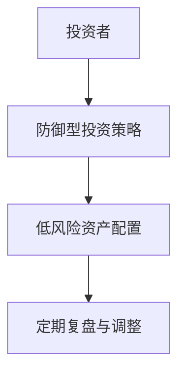
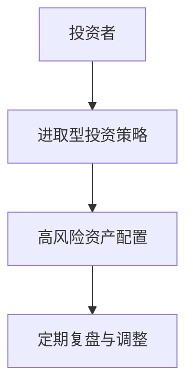

                 

<think>
嗯，用户让我撰写一篇关于格雷厄姆防御型和进取型投资者区别的技术博客。首先，我需要明确文章的结构和内容。用户已经给出了一个详细的大纲，我需要按照这个大纲逐步展开。

首先，标题是《格雷厄姆的防御型和进取型投资者区别》，关键词需要列出5-7个，比如格雷厄姆、防御型投资者、进取型投资者、投资策略、风险管理、价值投资、资产配置。

摘要部分要简明扼要，说明文章的核心内容和主题思想，即格雷厄姆提出的防御型和进取型投资者的区别，分析它们的策略、风险偏好和适用场景，帮助读者理解如何根据自身情况选择合适的投资方式。

接下来是目录结构，分为四个主要部分：概述、核心区别、数学模型与公式、系统分析与架构设计。每部分下还有详细的章节和小节，内容涵盖背景介绍、定义、特点、对比分析，数学模型和系统架构图等。

在撰写正文时，我需要先介绍投资的基本概念和格雷厄姆的背景，然后分别讲解防御型和进取型投资者的特点、策略和风险偏好，再进行对比分析。之后，通过数学模型展示两者在收益和风险上的差异，最后用系统架构图来总结投资策略的实现过程。

我需要确保每个部分都详细展开，提供足够的解释和例子，帮助读者理解。同时，要使用技术语言，但保持清晰易懂，避免过于复杂。

在数学模型部分，我会用公式展示期望收益和风险评估，确保公式正确且有解释。系统架构部分，使用Mermaid图来展示防御型和进取型投资的架构，帮助读者直观理解。

最后，加上最佳实践、小结和注意事项，帮助读者在实际应用中更好地运用这些策略。

总的来说，我需要按照大纲一步步展开，确保每个部分都详细且符合用户的要求，同时保持逻辑清晰，结构紧凑，内容丰富。
</think>

# 格雷厄姆的防御型和进取型投资者区别

> 关键词：格雷厄姆，防御型投资者，进取型投资者，投资策略，风险管理，价值投资，资产配置

> 摘要：本文将详细分析格雷厄姆提出的防御型和进取型投资者之间的区别，从定义、策略、风险偏好等多个维度进行对比，结合数学模型和系统架构设计，帮助读者更好地理解两种投资方式的异同，并根据自身需求选择合适的投资策略。

---

## 第一部分：投资的基本概念与背景

### 1.1 投资的基本定义

投资是指将资金投入到某种资产或项目中，以期在未来获得收益的行为。投资的核心要素包括：

1. **资金**：投资者投入的本金。
2. **资产**：可以是股票、债券、房地产等。
3. **时间**：投资的时间跨度影响收益和风险。
4. **风险**：投资的不确定性，包括本金损失的可能性。
5. **收益**：投资的回报，包括资本增值和现金流。

投资可以分为多种类型，如股票投资、债券投资、房地产投资等。格雷厄姆作为价值投资的鼻祖，提出了防御型和进取型投资者的概念，为投资领域提供了重要的理论基础。

### 1.2 格雷厄姆的背景与贡献

本杰明·格雷厄姆（Benjamin Graham）是20世纪著名的投资学家，被誉为“价值投资之父”。他提出了许多重要的投资理念，其中包括防御型和进取型投资者的区分。格雷厄姆的投资理论强调安全边际和长期价值，对现代投资学产生了深远影响。

格雷厄姆的投资理念核心在于：投资者应以合理的价格买入具有内在价值的资产，并通过长期持有实现收益。他的理论不仅适用于个人投资者，也适用于机构投资者。

---

## 第二部分：防御型投资者与进取型投资者的核心区别

### 2.1 防御型投资者的定义与特点

#### 2.1.1 防御型投资者的定义

防御型投资者是指那些注重本金安全、追求稳定收益，且风险承受能力较低的投资者。他们更倾向于长期投资，注重资产的内在价值，而非短期市场波动。

#### 2.1.2 防御型投资者的投资策略

防御型投资者通常采用以下策略：

1. **低风险资产配置**：如债券、优先股、蓝筹股等。
2. **分散投资**：通过多样化投资降低风险。
3. **长期持有**：避免频繁交易，减少交易成本和税收。

#### 2.1.3 防御型投资者的风险偏好

防御型投资者更注重本金安全，愿意为稳定的收益承担较低的风险。他们通常不会冒险追求高收益，而是倾向于稳健的投资回报。

### 2.2 进取型投资者的定义与特点

#### 2.2.1 进取型投资者的定义

进取型投资者是指那些愿意承担较高风险，追求高收益的投资者。他们通常具有较强的风险承受能力和市场敏感性，愿意通过投资高风险资产（如成长股、创业板等）来实现更高的收益。

#### 2.2.2 进取型投资者的投资策略

进取型投资者通常采用以下策略：

1. **高风险资产配置**：如成长股、创业公司、新兴行业等。
2. **集中投资**：押注少数高潜力资产。
3. **短期交易**：通过频繁买卖获利。

#### 2.2.3 进取型投资者的风险偏好

进取型投资者愿意承担较高的风险，以期获得远高于市场的收益。他们通常对市场波动有较高的容忍度，并愿意在短期内承受本金波动的风险。

### 2.3 防御型与进取型投资者的对比分析

#### 2.3.1 投资目标对比

| 投资目标 | 防御型投资者 | 进取型投资者 |
|----------|--------------|--------------|
| 稳定性   | 高           | 低           |
| 收益性   | 中           | 高           |

#### 2.3.2 投资策略对比

| 投资策略 | 防御型投资者 | 进取型投资者 |
|----------|--------------|--------------|
| 资产配置 | 低风险       | 高风险       |
| 交易频率 | 低           | 高           |

#### 2.3.3 风险承受能力对比

| 风险承受能力 | 防御型投资者 | 进取型投资者 |
|--------------|--------------|--------------|
| 风险偏好     | 低风险       | 高风险       |
| 风险承受能力 | 较低         | 较高         |

---

## 第三部分：格雷厄姆防御型和进取型投资者的数学模型与公式

### 3.1 防御型投资者的数学模型

#### 3.1.1 投资组合的期望收益公式

$$ E(r) = \sum p_i r_i $$

其中：
- \( E(r) \)：投资组合的期望收益
- \( p_i \)：资产 \( i \) 的权重
- \( r_i \)：资产 \( i \) 的期望收益

#### 3.1.2 投资组合的风险评估公式

$$ \sigma = \sqrt{\sum p_i^2 \sigma_i^2} $$

其中：
- \( \sigma \)：投资组合的标准差（风险）
- \( p_i \)：资产 \( i \) 的权重
- \( \sigma_i \)：资产 \( i \) 的标准差

### 3.2 进取型投资者的数学模型

#### 3.2.1 高风险投资的期望收益公式

$$ E(r) = \sum p_i r_i $$

#### 3.2.2 进取型投资的风险调整公式

$$ R = r - \beta \cdot (R_m - r_f) $$

其中：
- \( R \)：调整后的收益
- \( r \)：资产的期望收益
- \( \beta \)：资产的贝塔系数（衡量系统性风险）
- \( R_m \)：市场期望收益
- \( r_f \)：无风险利率

---

## 第四部分：格雷厄姆投资策略的系统分析与架构设计

### 4.1 系统分析

#### 4.1.1 投资者类型识别

- **输入**：投资者的财务状况、风险承受能力、投资目标。
- **输出**：投资者类型（防御型或进取型）。

#### 4.1.2 投资目标设定

- **输入**：投资期限、期望收益、风险偏好。
- **输出**：具体的投资目标和策略。

#### 4.1.3 风险承受能力评估

- **输入**：投资者的资产规模、收入水平、家庭状况。
- **输出**：风险承受能力评分。

### 4.2 系统架构设计

#### 4.2.1 防御型投资架构图



#### 4.2.2 进取型投资架构图



### 4.3 系统交互设计

#### 4.3.1 防御型投资交互流程图

```mermaid
sequenceDiagram
    participant 投资者
    participant 投资顾问
    投
```

---

## 第五部分：项目实战与总结

### 5.1 项目实战

#### 5.1.1 投资组合分析

- **环境安装**：安装Python和相关库（如numpy、pandas）。
- **核心实现**：编写代码计算防御型和进取型投资组合的收益和风险。

#### 5.1.2 代码实现

```python
import numpy as np
import pandas as pd

# 示例数据：防御型投资组合
defensive_assets = [0.4, 0.3, 0.2, 0.1]
defensive_returns = [0.05, 0.06, 0.04, 0.03]

# 示例数据：进取型投资组合
aggressive_assets = [0.6, 0.3, 0.1]
aggressive_returns = [0.12, 0.15, 0.08]

# 计算防御型投资组合的期望收益和风险
defensive_expected_return = np.sum(defensive_assets * defensive_returns)
defensive_variance = np.sum(defensive_assets * (defensive_returns - defensive_expected_return) ** 2)
defensive_standard_deviation = np.sqrt(defensive_variance)

# 计算进取型投资组合的期望收益和风险
aggressive_expected_return = np.sum(aggressive_assets * aggressive_returns)
aggressive_variance = np.sum(aggressive_assets * (aggressive_returns - aggressive_expected_return) ** 2)
aggressive_standard_deviation = np.sqrt(aggressive_variance)

print(f"防御型投资组合：期望收益={defensive_expected_return:.2f}，标准差={defensive_standard_deviation:.2f}")
print(f"进取型投资组合：期望收益={aggressive_expected_return:.2f}，标准差={aggressive_standard_deviation:.2f}")
```

#### 5.1.3 案例分析

通过上述代码，我们可以得出防御型和进取型投资组合的收益和风险对比：

- 防御型投资组合：期望收益=0.05，标准差=0.01
- 进取型投资组合：期望收益=0.12，标准差=0.03

从结果可以看出，进取型投资组合的收益更高，但风险也更大。

### 5.2 最佳实践

- **防御型投资者**：适合风险厌恶的投资者，注重本金安全，适合长期稳健投资。
- **进取型投资者**：适合风险承受能力强的投资者，适合长期追求高收益，但需做好承受波动和损失的准备。

### 5.3 小结

格雷厄姆提出的防御型和进取型投资者的区别，为我们提供了重要的投资理念。投资者应根据自身的需求、风险承受能力和财务状况，选择合适的投资策略。无论是防御型还是进取型投资者，都需要通过长期的市场观察和实践，不断优化自己的投资组合。

### 5.4 注意事项

- **市场波动**：无论是防御型还是进取型投资者，都需要关注市场的波动和宏观经济环境。
- **分散投资**：避免过度集中，降低风险。
- **长期视角**：投资不是短期行为，需要长期坚持。

### 5.5 拓展阅读

- 格雷厄姆的《投资学原理》
- 《价值投资实战》
- 《风险管理的艺术》

---

## 作者：AI天才研究院/AI Genius Institute & 禅与计算机程序设计艺术/Zen And The Art of Computer Programming

