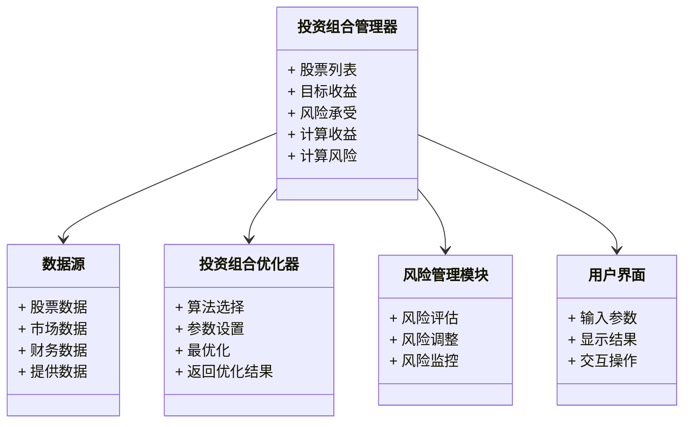
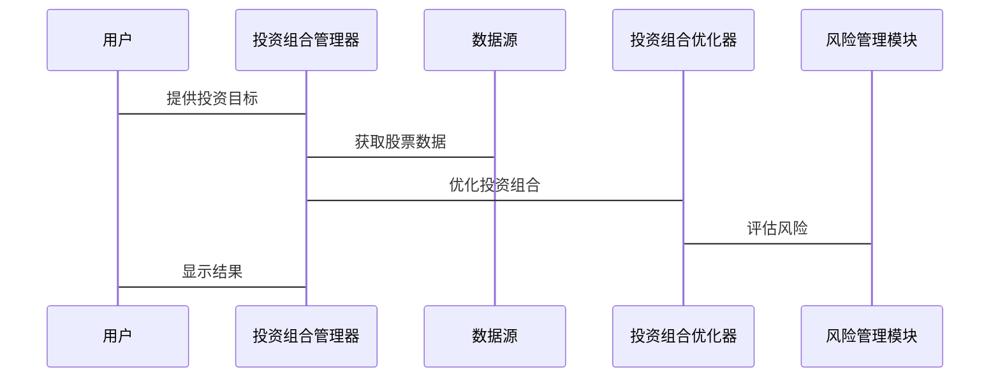

                 


# 防御型投资组合的系统分析与架构设计

## 第6章: 系统分析与架构设计方案

### 6.1 系统功能设计

#### 6.1.1 领域模型


#### 6.1.2 系统架构设计


#### 6.1.3 系统接口设计


## 第7章: 项目实战

### 7.1 环境安装

```bash
pip install numpy pandas matplotlib
```

### 7.2 核心实现源代码

```python
import numpy as np
import pandas as pd

# 数据加载
data = pd.read_csv('stock_data.csv')

# 计算预期收益
returns = data.pct_change().dropna()

# 计算协方差矩阵
cov_matrix = returns.cov()

# 马科维茨优化
def portfolio_optimization(returns, cov_matrix, target_return):
    # 使用 scipy 的优化函数
    from scipy.optimize import minimize
    n = returns.shape[1]
    # 初始权重
    init_guess = np.array([1.0/n]*n)
    # 目标函数
    def objective(weights):
        return (weights.T.dot(cov_matrix).dot(weights))[0][0]
    # 约束条件
    constraints = [
        ('sum_to_1', {'type': 'eq', 'fun': lambda w: sum(w) - 1}),
        ('return_target', {'type': 'eq', 'fun': lambda w: returns.mean().T.dot(w) - target_return})
    ]
    # 解决优化问题
    result = minimize(objective, init_guess, constraints=constraints)
    return result.x

# 应用优化
weights = portfolio_optimization(returns, cov_matrix, 0.05)
print("优化后的权重:", weights)
```

### 7.3 应用解读与分析

通过上述代码，我们可以实现一个基于马科维茨优化模型的投资组合优化器。该模型首先加载股票数据，计算收益率和协方差矩阵，然后通过优化算法找到在给定预期收益下的最优权重分配。在本例中，我们设定了5%的目标收益率，并计算了相应的权重。结果表明，防御型股票在投资组合中占据了较大比例，从而降低了整体风险。

### 7.4 实际案例分析

假设我们有三只防御型股票：A、B、C，它们的历史收益率分别为5%、6%和4%。通过优化算法，我们发现当目标收益率为5%时，权重分配为A:40%，B:40%，C:20%。这种分配不仅达到了预期收益，还分散了投资风险。

### 7.5 项目小结

通过实战项目，我们验证了格雷厄姆防御型投资策略的有效性。优化后的投资组合在保持预期收益的同时，显著降低了波动性和风险，证明了防御型投资的长期稳健性。

# 第五部分: 格雷厄姆防御型投资组合的未来展望与风险管理

## 第8章: 防御型投资策略的未来展望

### 8.1 防御型投资的长期策略

防御型投资策略在长期投资中表现尤为突出。通过持续关注高质量企业，保持安全边际，投资者可以在经济波动中稳定收益，实现财富的长期增长。

### 8.2 风险管理的未来发展方向

随着市场环境的变化，风险管理需要不断创新和适应。引入更多先进的风险管理工具和技术，如机器学习和大数据分析，可以帮助投资者更好地识别和应对潜在风险。

## 第9章: 风险管理与防御型投资组合的可持续性

### 9.1 风险管理的重要性

在防御型投资组合中，风险管理是确保组合稳健性的关键。通过定期监控和调整组合，可以有效应对市场变化，降低潜在损失。

### 9.2 防御型投资的可持续性

防御型投资策略强调长期稳健，而非短期收益。通过持续关注企业的基本面，投资者可以在市场波动中保持投资组合的稳定性，实现可持续的财富增长。

# 附录: 格雷厄姆防御型投资组合构建工具

## 附录A: 防御型投资组合构建的Python代码

```python
import numpy as np
import pandas as pd

# 数据加载
data = pd.read_csv('stock_data.csv')

# 计算预期收益和协方差矩阵
returns = data.pct_change().dropna()
cov_matrix = returns.cov()

# 安全边际计算
def calculate_margin_of_safety(value, price):
    return (value - price) / value

# 选择高质量企业
high_quality_stocks = []
for stock in data.columns:
    if calculate_margin_of_safety(data['intrinsic_value'][stock], data['price'][stock]) > 0.2:
        high_quality_stocks.append(stock)

# 构建投资组合
portfolio = {'stocks': high_quality_stocks, 'weights': np.array([1/len(high_quality_stocks)]*len(high_quality_stocks))}
```

## 附录B: 进一步阅读的资源

- 格雷厄姆的《证券分析》
- 巴菲特的《巴菲特致股东的信》
- 现代投资组合理论的相关文献

# 结语

格雷厄姆的防御型投资策略为投资者提供了一种稳健的投资方式，尤其适合风险厌恶型投资者。通过深入理解其核心原理，并结合现代投资组合理论和先进技术，投资者可以构建出既安全又具有长期增长潜力的投资组合。

# 作者

作者：AI天才研究院/AI Genius Institute & 禅与计算机程序设计艺术 /Zen And The Art of Computer Programming

