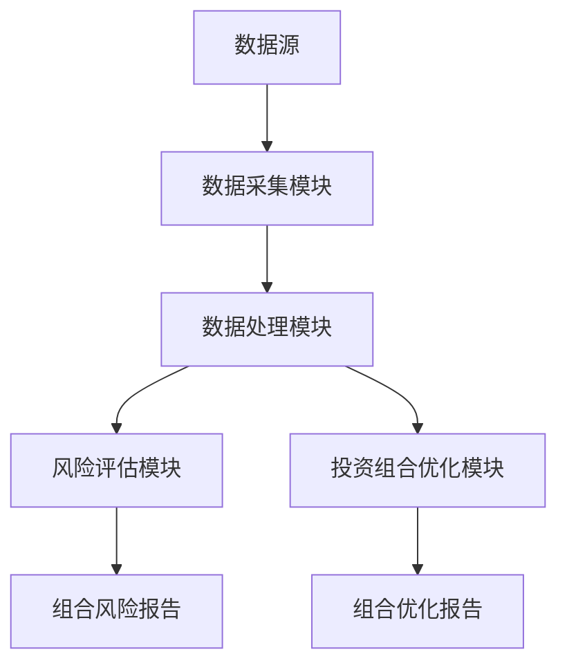
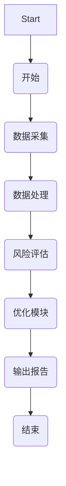

                 

<think>
好，我需要根据用户的要求，逐步分析并撰写一篇关于《格雷厄姆的防御型投资组合构建方法》的技术博客文章。首先，我要理解用户的需求：他们希望有一篇结构清晰、逻辑严谨、内容详实的技术博客，涵盖从理论到实践的各个方面。

首先，我会先明确文章的标题、关键词和摘要。这些是文章的核心部分，需要简明扼要地概括全文内容。接着，根据目录大纲，逐章进行详细的内容编写。每章中，我会按照要求，详细讲解相关的核心概念，使用表格和图表进行对比分析，甚至用Python代码来展示算法的实现。

在写作过程中，我会注意逻辑的连贯性，确保每一章都紧密联系，从基础概念逐步深入到实战策略。同时，我还会结合实际案例，帮助读者更好地理解和应用格雷厄姆的防御型投资方法。

此外，我还需要在文章末尾加上作者信息，确保格式的完整性。最后，我会通读全文，检查内容是否符合用户的要求，确保每个部分都详尽具体，帮助读者全面掌握防御型投资组合的构建方法。

总之，我将按照用户提供的大纲，一步一步地完成这篇文章，确保内容全面、结构合理、逻辑清晰，为读者提供有价值的投资策略指导。
</think>

# 格雷厄姆的防御型投资组合构建方法

> 关键词：防御型投资，投资组合，安全边际，内在价值，资产配置

> 摘要：格雷厄姆的防御型投资策略是一种以风险控制为核心，通过合理资产配置和严格的价值评估来构建稳定投资组合的方法。本文将详细介绍格雷厄姆防御型投资的基本概念、理论基础、构建方法以及实战策略，帮助投资者在不确定的市场环境中实现稳健的投资回报。

---

# 第一部分: 格雷厄姆防御型投资的背景与基础

## 第1章: 防御型投资的起源与发展

### 1.1 格雷厄姆投资理论的起源

#### 1.1.1 投资学说的演变历程

投资学说的演变可以追溯到18世纪的古典经济学，但真正意义上的现代投资理论起源于20世纪初。格雷厄姆（Benjamin Graham）作为价值投资的鼻祖，他的投资理论对现代投资学产生了深远的影响。格雷厄姆的投资理念强调安全性和稳定性，特别是在市场波动剧烈的情况下，如何通过合理的投资策略保护资本免受损失。

#### 1.1.2 格雷厄姆的学术贡献

格雷厄姆是哥伦比亚大学商学院的教授，他的著作《证券分析》和《聪明的投资者》奠定了价值投资的基础。他的理论不仅影响了沃伦·巴菲特等知名投资者，还在学术界和实践中形成了独特的防御型投资策略。

#### 1.1.3 防御型投资的定义与目标

防御型投资是一种以保护资本和追求稳定收益为核心的投资策略。其目标是在市场波动中最小化损失，同时通过合理配置资产实现长期稳健的回报。防御型投资注重安全边际，即以低于内在价值的价格购买资产，从而在市场下跌时能够避免重大损失。

### 1.2 防御型投资的核心概念

#### 1.2.1 风险控制的核心理念

防御型投资的核心理念是通过分散投资和选择低波动性的资产来降低风险。格雷厄姆强调，投资者应该避免过度集中投资，尤其是在市场波动加剧的情况下，分散投资可以有效降低组合的整体风险。

#### 1.2.2 投资组合的稳定性要求

防御型投资要求投资组合具有高度的稳定性，即在市场下跌时，组合的跌幅相对较小，能够在市场复苏时迅速反弹。这种稳定性不仅依赖于资产的选择，还依赖于合理的资产配置和持续的风险管理。

#### 1.2.3 防御型投资与进攻型投资的对比

| **对比维度**       | **防御型投资**                     | **进攻型投资**                     |
|--------------------|------------------------------------|------------------------------------|
| **目标**           | 稳定收益，保护本金                 | 追求高收益，承担高风险             |
| **风险承受能力**   | 低风险承受能力                   | 高风险承受能力                   |
| **投资策略**       | 低波动性资产，分散投资             | 高风险资产，集中投资               |
| **适用场景**       | 稳定市场或经济衰退期               | 上涨市场或经济繁荣期               |

通过对比可以看出，防御型投资更适合风险厌恶型投资者，而进攻型投资则适合风险偏好较高的投资者。

---

## 第2章: 防御型投资的核心概念

### 2.1 防御型投资的目标与特征

#### 2.1.1 风险控制的核心理念

格雷厄姆强调，投资者应该关注资产的内在价值，而不是市场的短期波动。通过购买价格低于内在价值的资产，投资者可以在市场下跌时获得安全边际，从而保护资本。

#### 2.1.2 投资组合的分散化策略

防御型投资要求投资者将资金分散配置到不同的资产类别中，以降低单一资产的风险。例如，可以将资金分配到股票、债券、黄金等不同的资产类别中，从而在市场波动时保持组合的稳定性。

#### 2.1.3 安全边际的计算方法

安全边际是格雷厄姆防御型投资的核心概念之一。它是指资产的市场价格低于其内在价值的部分。具体来说，安全边际可以通过以下公式计算：

$$ \text{安全边际} = \text{内在价值} - \text{市场价格} $$

通过计算安全边际，投资者可以选择具有足够安全边际的资产，从而降低投资风险。

### 2.2 投资组合构建的基本步骤

#### 2.2.1 确定投资目标与风险承受能力

在构建防御型投资组合之前，投资者需要明确自己的投资目标和风险承受能力。例如，一个保守的投资者可能选择将大部分资金配置到债券和蓝筹股中，而一个风险厌恶型的投资者可能选择将资金配置到黄金和现金中。

#### 2.2.2 选择防御性资产类别

防御性资产类别包括债券、黄金、蓝筹股等。这些资产具有较低的波动性和较高的稳定性，能够在市场下跌时提供保护。

#### 2.2.3 确定资产配置比例

资产配置比例需要根据投资者的风险承受能力和市场环境进行调整。例如，在经济衰退期，投资者可以增加债券和现金的比例，减少股票的比例。

---

## 第3章: 防御型投资组合的构建逻辑

### 3.1 投资组合构建的基本步骤

#### 3.1.1 确定投资目标与风险承受能力

在构建防御型投资组合之前，投资者需要明确自己的投资目标和风险承受能力。例如，一个保守的投资者可能选择将大部分资金配置到债券和蓝筹股中，而一个风险厌恶型的投资者可能选择将资金配置到黄金和现金中。

#### 3.1.2 选择防御性资产类别

防御性资产类别包括债券、黄金、蓝筹股等。这些资产具有较低的波动性和较高的稳定性，能够在市场下跌时提供保护。

#### 3.1.3 确定资产配置比例

资产配置比例需要根据投资者的风险承受能力和市场环境进行调整。例如，在经济衰退期，投资者可以增加债券和现金的比例，减少股票的比例。

### 3.2 防御型投资组合的数学模型

#### 3.2.1 投资组合风险的量化公式

投资组合的风险可以通过方差来量化。具体公式为：

$$ \text{组合方差} = \sum_{i=1}^{n} w_i^2 \sigma_i^2 + \sum_{i=1}^{n} \sum_{j \neq i} w_i w_j \sigma_{i,j} $$

其中，\( w_i \) 是第 \( i \) 个资产的权重，\( \sigma_i \) 是第 \( i \) 个资产的波动率，\( \sigma_{i,j} \) 是第 \( i \) 和 \( j \) 个资产之间的协方差。

#### 3.2.2 投资组合收益的计算方法

投资组合的预期收益可以通过以下公式计算：

$$ \text{组合收益} = \sum_{i=1}^{n} w_i r_i $$

其中，\( r_i \) 是第 \( i \) 个资产的预期收益。

#### 3.2.3 风险-收益平衡的优化模型

为了实现风险-收益的平衡，投资者可以通过调整资产配置比例来优化投资组合。这可以通过以下步骤实现：

1. 确定各资产的预期收益和风险。
2. 计算不同资产组合的风险和收益。
3. 选择风险最低且收益最大的组合。

---

## 第4章: 格雷厄姆防御型投资的理论基础

### 4.1 安全边际的数学分析

#### 4.1.1 安全边际的计算公式

$$ \text{安全边际} = \text{内在价值} - \text{市场价格} $$

#### 4.1.2 安全边际与资产价格的关系

安全边际是投资者在购买资产时可以获得的“缓冲区”。当市场价格低于内在价值时，安全边际为正，投资者可以放心购买。反之，当市场价格高于内在价值时，安全边际为负，投资者需要谨慎。

#### 4.1.3 安全边际在投资决策中的应用

投资者可以通过计算安全边际来选择具有足够安全边际的资产。例如，如果某只股票的内在价值为50元，市场价格为40元，那么安全边际为10元。这种资产具有较高的安全边际，适合防御型投资者。

### 4.2 内在价值评估的详细步骤

#### 4.2.1 内在价值的定义与计算方法

内在价值是指资产在合理市场条件下应有的价值。计算内在价值的方法包括DCF模型、市盈率模型等。例如，DCF模型的公式为：

$$ \text{内在价值} = \sum_{t=1}^{n} \frac{CF_t}{(1+r)^t} + \frac{TV}{(1+r)^n} $$

其中，\( CF_t \) 是第 \( t \) 年的现金流，\( r \) 是折现率，\( TV \) 是终值。

#### 4.2.2 不同资产类别的内在价值评估

对于股票，内在价值可以通过股利折现模型（DDM）计算；对于债券，内在价值可以通过现金流折现模型计算。

#### 4.2.3 内在价值与市场价值的对比分析

内在价值是资产的真实价值，而市场价值是资产在市场上的交易价格。当市场价值低于内在价值时，资产具有投资价值。

---

## 第5章: 防御型投资组合的实战策略

### 5.1 防御型投资组合的选择标准

#### 5.1.1 低波动性资产的选择标准

防御型投资者应该选择波动性低的资产，例如债券、黄金、蓝筹股等。

#### 5.1.2 高分红资产的投资策略

高分红资产可以为投资者提供稳定的现金流，同时在市场下跌时提供支撑。例如，红利股的股息率较高，且股息增长稳定。

#### 5.1.3 防御性行业股票的筛选方法

防御性行业包括公用事业、医疗保健、消费品等行业。这些行业的股票通常具有较高的股息率和较低的波动性。

### 5.2 防御型投资组合的优化方法

#### 5.2.1 现有组合的风险评估与优化

投资者可以通过计算投资组合的方差和预期收益来评估其风险和收益。如果组合的风险过高，可以通过增加低波动性资产的比例来优化。

#### 5.2.2 动态调整组合的策略

市场环境不断变化，投资者需要定期评估投资组合的表现，并根据市场变化进行动态调整。例如，在市场下跌时增加债券的比例，减少股票的比例。

#### 5.2.3 不同市场环境下的组合调整方法

在牛市中，投资者可以适当增加股票的比例；在熊市中，增加债券和现金的比例。

---

## 第6章: 防御型投资组合的系统分析与设计

### 6.1 系统功能模块划分

#### 6.1.1 数据采集与处理模块

数据采集模块负责收集各资产的历史价格、财务数据等信息。

#### 6.1.2 风险评估与分析模块

风险评估模块通过计算各资产的波动率、协方差等指标来评估组合的风险。

#### 6.1.3 投资组合优化模块

优化模块根据风险和收益的计算结果，生成最优的资产配置方案。

### 6.2 系统架构设计

#### 6.2.1 系统架构图



#### 6.2.2 系统功能流程图



### 6.3 系统接口设计

#### 6.3.1 数据接口

系统需要与数据源（如股票价格数据库）进行交互，获取必要的数据。

#### 6.3.2 用户界面

用户可以通过界面输入参数（如风险偏好）并查看优化后的组合报告。

---

## 第7章: 项目实战

### 7.1 环境搭建

需要安装Python、Pandas、NumPy等库。

### 7.2 核心实现

#### 7.2.1 数据处理代码

```python
import pandas as pd
import numpy as np

# 示例数据：各资产的历史价格
data = {
    '股票': [100, 90, 80, 70, 60],
    '债券': [50, 55, 60, 65, 70],
    '黄金': [120, 130, 140, 150, 160]
}
df = pd.DataFrame(data)
```

#### 7.2.2 风险计算代码

```python
# 计算各资产的波动率
def calculate_volatility(prices):
    returns = np.log(prices / prices.shift(1)).dropna()
    volatility = returns.std()
    return volatility

volatility = calculate_volatility(df['股票'])
print(f"股票的波动率为: {volatility}")
```

### 7.3 案例分析

#### 7.3.1 投资组合构建

假设投资者有100万元，选择将60%的资金配置到股票，30%配置到债券，10%配置到黄金。

#### 7.3.2 投资组合优化

根据市场变化，动态调整各资产的比例。

### 7.4 项目小结

通过实战项目，我们可以看到格雷厄姆的防御型投资策略在实际操作中的应用。通过合理配置资产和严格的价值评估，投资者可以在市场波动中保持稳定的投资回报。

---

## 第8章: 最佳实践与小结

### 8.1 最佳实践

#### 8.1.1 定期评估组合

投资者应该定期评估投资组合的表现，并根据市场变化进行调整。

#### 8.1.2 选择具有足够安全边际的资产

在购买资产时，确保市场价格低于内在价值，从而获得安全边际。

#### 8.1.3 分散投资

通过分散投资，降低组合的整体风险。

### 8.2 小结

格雷厄姆的防御型投资策略是一种以风险控制为核心的投资方法。通过合理配置资产和严格的价值评估，投资者可以在市场波动中保持稳定的投资回报。

### 8.3 注意事项

#### 8.3.1 风险控制的重要性

投资者必须始终关注风险控制，避免过度集中投资。

#### 8.3.2 市场环境的变化

市场环境的变化会影响投资组合的表现，投资者需要根据市场变化进行动态调整。

#### 8.3.3 长期投资的重要性

防御型投资需要长期坚持，避免短期市场的波动影响投资决策。

### 8.4 拓展阅读

推荐阅读格雷厄姆的《证券分析》和《聪明的投资者》，以及巴菲特的《巴菲特致股东的信》。

---

作者：AI天才研究院/AI Genius Institute & 禅与计算机程序设计艺术 /Zen And The Art of Computer Programming

