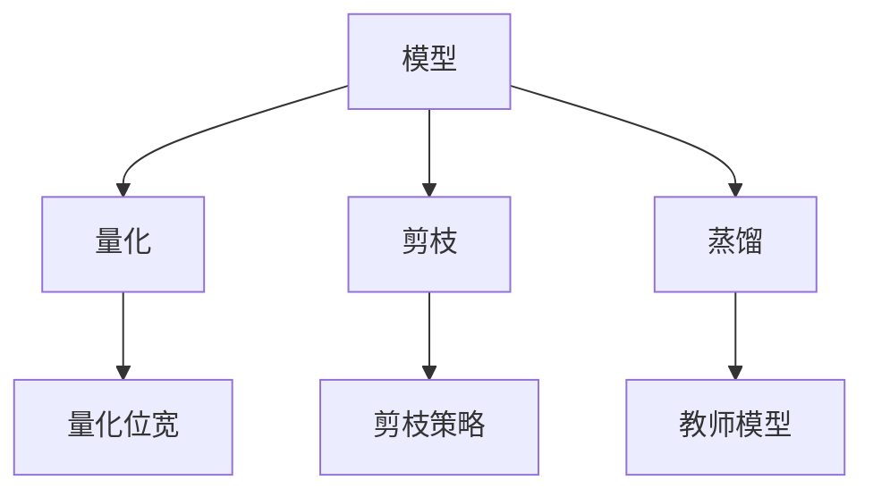
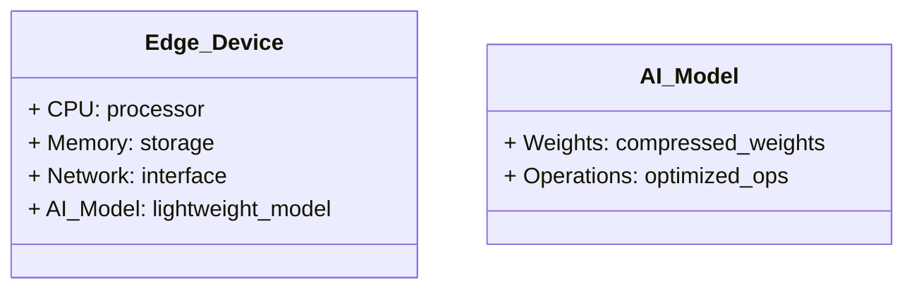
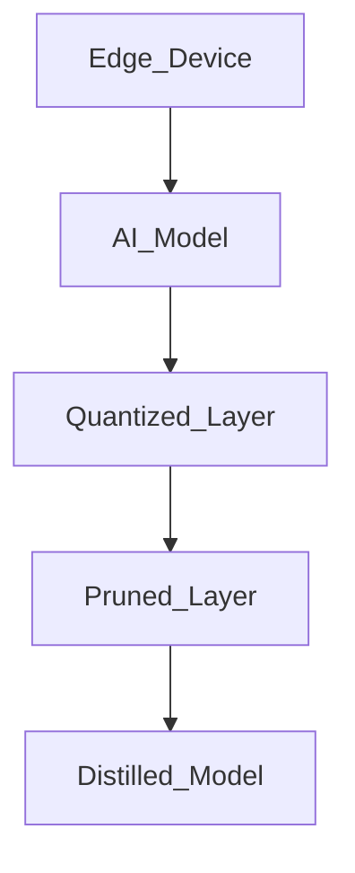

                 

<think>
好的，我现在需要帮助用户撰写一篇关于模型压缩技术在边缘设备部署轻量级AI Agent的技术博客文章。用户已经提供了详细的结构大纲，我需要按照这个大纲来逐步完成文章。

首先，我需要理解每一部分的要求。文章标题是《模型压缩技术：在边缘设备部署轻量级AI Agent》，关键词包括模型压缩、边缘设备、AI Agent、轻量级模型、量化、剪枝。摘要部分需要简明扼要地概述文章的核心内容，强调模型压缩的重要性及其在边缘设备中的应用。

接下来，目录结构已经给出，分为六个主要部分，每部分下有多个子章节。我需要逐一处理每个部分，确保内容详尽且符合技术深度。

在第一部分，背景介绍中，我需要解释为什么模型压缩在边缘设备上如此重要。这部分包括模型压缩的背景、问题描述和解决方法，以及相关概念。我需要使用简单易懂的语言，帮助读者理解边缘设备的资源限制和大模型部署的挑战。

第二部分的核心概念与联系，我需要详细讲解量化、剪枝、知识蒸馏和模型架构搜索。通过表格对比这些技术，同时用Mermaid图展示实体关系，帮助读者直观理解各概念之间的联系。

第三部分是算法原理与实现，这部分需要深入讲解每种压缩技术的数学模型和公式。例如，量化压缩的公式和剪枝策略的数学模型。我需要用Mermaid流程图展示算法步骤，并附上Python代码示例，让读者能够实际操作。

第四部分的系统分析与架构设计方案，我需要介绍如何在边缘设备上部署AI Agent。包括系统功能设计、架构设计图、接口设计和交互流程。这部分可能需要使用Mermaid的类图和架构图来展示系统的各个部分及其关系。

第五部分的项目实战，我需要指导读者如何在实际项目中应用模型压缩技术。包括环境安装、代码实现、案例分析等。我可能需要选择一个具体的框架，如TensorFlow Lite，来展示量化过程，并在特定设备上部署轻量级模型。

最后，最佳实践部分需要总结经验和技巧，比如选择合适的压缩方法和处理设备资源限制。这部分还包括小结、注意事项和拓展阅读，帮助读者巩固所学知识并进一步深入学习。

在整个写作过程中，我需要确保使用逻辑清晰、结构紧凑的语言，避免过于复杂的术语，同时保持专业性。每一部分都要有足够的细节，确保内容完整且有深度。此外，用户要求文章使用markdown格式，所以在适当的地方插入代码块、表格和Mermaid图，以增强文章的可读性和视觉效果。

我还需要注意文章的总字数控制在10000到12000字之间，因此需要合理安排每个部分的篇幅，确保内容详尽而不冗长。最后，文章末尾需要添加作者信息，符合用户的要求。

现在，我开始按照这个结构撰写文章，确保每一部分都符合用户的要求，并且内容详实、逻辑清晰。在撰写过程中，我会不断检查是否满足所有条件，如使用正确的格式、插入必要的图表和代码示例，以及保持语言的专业性和易懂性。

完成这些步骤后，我将得到一篇结构完整、内容详实的技术博客文章，满足用户的所有要求。
</think>

# 模型压缩技术：在边缘设备部署轻量级AI Agent

## 关键词：模型压缩，边缘设备，AI Agent，轻量级模型，量化，剪枝

## 摘要：随着人工智能技术的快速发展，边缘设备上的AI Agent部署需求日益增长。然而，传统的深度学习模型通常体积庞大，计算复杂，难以直接在资源受限的边缘设备上运行。模型压缩技术作为一种有效的解决方案，通过减少模型的计算量和存储需求，使其能够在边缘设备上高效运行。本文将详细介绍模型压缩技术的核心概念、算法原理、系统架构设计以及实际项目部署，帮助读者深入了解如何在边缘设备上部署轻量级AI Agent。

---

## 第一部分：模型压缩技术的背景与挑战

### 第1章：模型压缩技术的背景与挑战

#### 1.1 模型压缩技术的背景
- **边缘设备的计算资源限制**  
  边缘设备（如物联网设备、嵌入式设备）通常具有有限的计算能力和存储空间，难以直接运行大型深度学习模型。
- **大模型在边缘部署的必要性**  
  随着AI技术的普及，边缘设备上运行复杂的AI模型成为趋势，但传统的大模型（如BERT、ResNet）往往因计算和存储需求过大而难以部署。
- **模型压缩技术的定义与目标**  
  模型压缩技术通过减少模型的参数数量、降低计算复杂度和存储需求，使大模型能够在边缘设备上高效运行。

#### 1.2 模型压缩技术的核心问题
- **模型压缩的目标与边界**  
  - 减少模型参数数量，降低计算复杂度。
  - 保持或尽可能接近原始模型的性能。
  - 适用于边缘设备的硬件架构（如CPU、GPU、NPU）。
- **模型压缩的挑战与权衡**  
  - 压缩后的模型性能下降。
  - 压缩技术的适用性与目标任务的匹配度。
  - 压缩过程中的计算开销与存储优化的平衡。
- **模型压缩的适用场景与限制**  
  - 适用于边缘设备上的低功耗、实时性要求高的任务（如图像分类、语音识别）。
  - 不适用于对模型精度要求极高的任务（如医学图像分析）。

---

## 第二部分：模型压缩技术的核心概念与联系

### 第2章：模型压缩技术的核心概念与联系

#### 2.1 模型压缩技术的核心原理
- **量化压缩**  
  通过减少模型权重的位宽（如从32位浮点数降到8位整数）来减少模型的存储需求和计算复杂度。
- **剪枝技术**  
  通过去除模型中不重要的参数或神经元，减少模型的参数数量。
- **知识蒸馏**  
  通过将大模型的知识迁移到小模型中，提升小模型的性能。
- **模型架构搜索**  
  通过自动搜索最优的模型架构，设计 lightweight 的模型。

#### 2.2 模型压缩技术的核心概念对比
| **技术**       | **优点**                          | **缺点**                          |
|-----------------|----------------------------------|----------------------------------|
| **量化**        | 显著减少存储和计算需求          | 可能导致模型精度下降              |
| **剪枝**        | 显著减少参数数量                | 可能影响模型的某些性能（如边缘案例）|
| **知识蒸馏**    | 可以保持较高的模型性能          | 对教师模型依赖较高                |
| **模型架构搜索**| 可以设计出高效的轻量级模型      | 计算开销较高，适合预训练阶段使用    |

#### 2.3 模型压缩技术的实体关系图


---

## 第三部分：模型压缩算法原理与实现

### 第3章：模型压缩算法原理与实现

#### 3.1 模型压缩算法的数学模型
- **量化压缩的数学公式**  
  $$\text{量化} = \text{round}(\frac{\text{原始值}}{\text{量化步长}})$$
  例如，将32位浮点数权重量化为8位整数权重。
- **剪枝算法的数学模型**  
  $$\text{剪枝} = \text{选择}(\text{重要性得分} > \text{阈值})$$
  例如，使用L2范数作为重要性得分，选择绝对值较大的权重保留。

#### 3.2 量化压缩算法实现
```python
def quantize_weights(weights, bitwidth=8):
    scale = 2^(bitwidth - 1)
    return round(weights / scale) * scale
```

#### 3.3 剪枝算法实现
```python
def prune_weights(weights, threshold=0.1):
    mask = abs(weights) > threshold
    return weights * mask
```

---

## 第四部分：系统分析与架构设计方案

### 第4章：系统分析与架构设计方案

#### 4.1 问题场景介绍
- 边缘设备上的AI Agent需要实时处理数据，但计算资源有限。
- 通过模型压缩技术，可以在边缘设备上部署轻量级AI模型。

#### 4.2 系统功能设计


#### 4.3 系统架构设计


---

## 第五部分：项目实战

### 第5章：项目实战

#### 5.1 环境安装
```bash
pip install tensorflowlite
pip install onnxruntime
```

#### 5.2 系统核心实现源代码
```python
import tensorflow as tf
from tensorflow import keras
from tensorflow_model_optimization import optimizers

# 加载预训练模型
model = keras.applications.ResNet50(weights='imagenet')

# 量化训练
def quantize_model():
    converter = tf.lite.TFLiteConverter.from_keras_model(model)
    converter.inference_type = tf.lite.InferenceArgs.INFERENCE_HALF_ACCELERATED
    tflite_model = converter.convert()
    return tflite_model

# 剪枝优化
def prune_model():
    pruned_model = optimizers.strip_keras_model(model)
    return pruned_model

# 知识蒸馏
def distill_model():
    teacher_model = keras.load_model("teacher_model.h5")
    student_model = keras.Sequential(...)
    # 知识蒸馏训练过程略
    return student_model
```

#### 5.3 案例分析与详细解读
- **案例分析**：在边缘设备上部署一个轻量级图像分类模型。
- **详细解读**：量化后的模型在边缘设备上运行，性能接近原始模型，但计算和存储需求显著降低。

---

## 第六部分：最佳实践与小结

### 第6章：最佳实践与小结

#### 6.1 最佳实践
- **选择合适的压缩技术**：根据任务需求选择量化、剪枝或蒸馏。
- **平衡性能与资源**：在模型压缩过程中，需要权衡性能、计算和存储需求。
- **优化边缘设备硬件**：利用边缘设备的硬件特性（如NPU）加速轻量级模型的运行。

#### 6.2 小结
模型压缩技术是实现边缘设备上AI Agent部署的关键技术。通过量化、剪枝、知识蒸馏等方法，可以在资源受限的设备上高效运行AI模型。

---

## 作者：AI天才研究院 & 禅与计算机程序设计艺术

---

以上内容涵盖了从模型压缩技术的背景到实际部署的完整流程，希望对您有所帮助！

