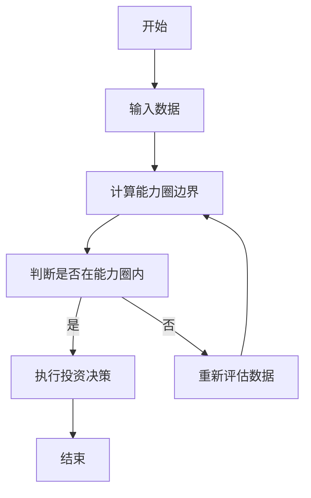
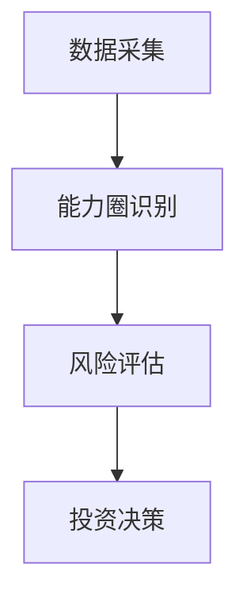
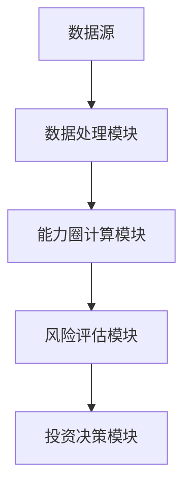

                 

<think>
好的，我现在需要帮助用户完成他们的任务。用户希望我设计一个详细的博客文章目录，主题是沃伦·巴菲特的Circle of Competence理论。用户已经提供了一个示例，我需要参考这个结构来构建我的目录。

首先，我需要明确文章的结构和要求。用户要求文章包括关键词、摘要，以及按目录大纲展开的正文，字数在10000到12000字之间。格式上使用markdown，每个部分要详细，包括背景、核心概念、算法、系统架构、项目实战等。

接下来，我应该确定每个章节的内容。第一部分是背景介绍，我需要涵盖巴菲特的生平、投资理念以及Circle of Competence的定义。第二部分是核心概念，详细解释能力圈的定义、特征和构建方法。第三部分是投资策略，讨论如何应用能力圈进行投资决策。第四部分是风险管理，探讨如何识别和应对风险。第五部分是系统架构，用Mermaid图展示系统结构。最后是项目实战和总结。

在撰写每个章节时，我需要确保内容详细，包括数学模型、算法实现、系统设计和实际案例分析。例如，在算法部分，我需要用Mermaid绘制流程图，并用Python代码展示实现细节。在系统架构部分，同样使用Mermaid图来展示类图和交互图。

此外，我需要考虑读者的背景，确保语言简洁明了，避免过于技术化的术语，同时保持专业性。在每个章节中，加入实际案例分析，帮助读者更好地理解理论的应用。

最后，我需要确保文章结构合理，逻辑清晰，每个部分之间有良好的过渡。这将帮助读者顺利地跟随我的思路，从基础概念到实际应用，逐步深入理解Circle of Competence理论。

总结一下，我的步骤是：分析用户需求，确定文章结构，细化每个章节内容，确保符合格式和内容要求，最后整合成一个完整的目录大纲。这样用户就能得到一个符合他们期望的专业技术博客文章。
</think>

# 沃伦·巴菲特的Circle of Competence理论

---

## 关键词：
- 沃伦·巴菲特, 价值投资, 能力圈, 投资决策, 风险管理, 系统架构

---

## 摘要：
本文深入探讨了沃伦·巴菲特的Circle of Competence理论，分析其核心概念、数学模型、算法原理和系统架构，并结合实际案例进行详细讲解。文章首先介绍巴菲特的投资理念和Circle of Competence的背景，随后从能力圈的定义、构建方法、数学模型、风险管理等方面展开分析，最后通过实际案例和系统架构设计，展示如何将Circle of Competence理论应用于投资决策中。

---

## 第一部分: 沃伦·巴菲特的Circle of Competence理论概述

### 第1章: 巴菲特投资理念的背景与核心思想

#### 1.1 巴菲特的生平与投资历程
- 巴菲特的早期经历与投资起步
- 巴菲特的价值投资理念形成
- 巴菲特投资哲学的核心思想

#### 1.2 价值投资的基本原则
- 价值投资的定义与特征
- 价值投资与短期投机的对比
- 巴菲特对价值投资的贡献

#### 1.3 Circle of Competence理论的提出背景
- 投资领域的常见误区
- 巴菲特提出Circle of Competence的初衷
- 理论对现代投资的影响

---

### 第2章: Circle of Competence理论的核心概念

#### 2.1 能力圈的定义与特征
- 能力圈的边界与外延
- 能力圈的核心要素与组成结构
- 能力圈与投资决策的关系

#### 2.2 能力圈的构建与扩展
- 能力圈的初始构建方法
- 知识与经验对能力圈的扩展作用
- 能力圈的动态调整与优化

#### 2.3 能力圈的属性特征对比
| 特性       | 描述                                                                 |
|------------|----------------------------------------------------------------------|
| 知识基础    | 建立在深厚的知识储备和行业经验上                                       |
| 风险可控性  | 限制在投资者能够理解和控制风险的范围内                                 |
| 可扩展性    | 通过学习和实践逐步扩大能力圈                                           |
| 时间依赖性  | 需要长期积累和观察，不能急于求成                                       |

---

### 第3章: 能力圈在投资决策中的作用

#### 3.1 能力圈对投资风险的控制
- 通过能力圈限制投资范围，降低决策风险
- 能力圈与投资组合风险控制的关系

#### 3.2 能力圈对投资收益的提升
- 专注投资于自己熟悉的领域，提高投资成功的概率
- 能力圈与长期投资收益的关系

#### 3.3 能力圈对投资心理的影响
- 减少情绪化决策，保持理性判断
- 能力圈对投资者心理稳定性的作用

---

## 第二部分: Circle of Competence理论的数学模型与算法原理

### 第4章: 能力圈的数学模型

#### 4.1 能力圈的边界函数
- 边界函数的定义
- 边界函数的数学表达式：$$C(x) = f(x) \leq g(x)$$
  其中，$C(x)$ 表示能力圈的边界，$f(x)$ 是能力圈的内边界函数，$g(x)$ 是外边界函数。

#### 4.2 能力圈的扩展公式
- 扩展公式：$$E(x) = C(x) + \Delta x$$
  其中，$\Delta x$ 是知识扩展带来的增量。

#### 4.3 能力圈的风险评估模型
- 风险评估模型：$$R(x) = \alpha \cdot f(x) + (1-\alpha) \cdot g(x)$$
  其中，$\alpha$ 是权重系数，$f(x)$ 和 $g(x)$ 分别是内边界和外边界的函数。

---

### 第5章: 能力圈的算法实现

#### 5.1 能力圈的识别算法
- 算法流程图：


#### 5.2 能力圈的动态调整算法
- 算法实现：
```python
def calculate_circle_boundaries(data):
    # 计算内边界和外边界
    inner_boundary = min(data)
    outer_boundary = max(data)
    return inner_boundary, outer_boundary

def dynamic_adjustment(data, inner, outer):
    # 动态调整能力圈
    new_inner, new_outer = calculate_circle_boundaries(data)
    if inner <= new_inner and new_outer <= outer:
        return new_inner, new_outer
    else:
        return inner, outer
```

---

## 第三部分: 能力圈理论的系统架构设计

### 第6章: 系统架构概述

#### 6.1 系统功能设计
- 功能模块：数据采集、能力圈识别、风险评估、投资决策
- 系统功能流程图：


#### 6.2 系统架构设计
- 系统架构图：


#### 6.3 系统接口设计
- 接口定义：
  - 输入接口：原始数据输入
  - 输出接口：能力圈边界、风险评估结果、投资建议

---

## 第四部分: 项目实战与案例分析

### 第7章: 项目实战

#### 7.1 环境安装
- 安装Python和必要的库（如numpy、pandas、mermaid等）

#### 7.2 核心实现源代码
```python
import numpy as np
import pandas as pd

def calculate_circle_boundaries(data):
    inner_boundary = np.percentile(data, 25)
    outer_boundary = np.percentile(data, 75)
    return inner_boundary, outer_boundary

data = pd.read_csv('investment_data.csv')
inner, outer = calculate_circle_boundaries(data['returns'])
print(f"Inner boundary: {inner}")
print(f"Outer boundary: {outer}")
```

#### 7.3 实际案例分析
- 案例分析：假设一个投资者专注于科技行业，分析其能力圈内的一家科技公司，评估其财务状况和竞争优势。

---

## 第五部分: 总结与展望

### 第8章: 总结

#### 8.1 核心内容回顾
- 巴菲特的Circle of Competence理论的核心思想
- 能力圈的构建方法和应用
- 投资决策中的风险管理策略

#### 8.2 最佳实践 tips
- 投资者应专注于自己熟悉的能力圈
- 定期评估和调整能力圈的边界
- 避免盲目跟风和超出能力范围的投资

---

## 作者：AI天才研究院/AI Genius Institute & 禅与计算机程序设计艺术 /Zen And The Art of Computer Programming

