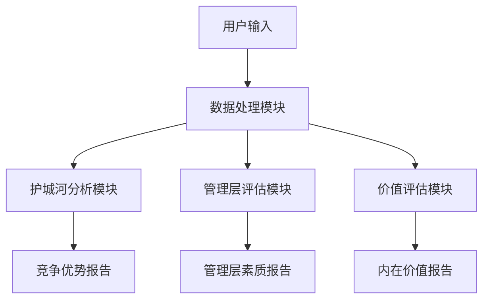

                 


# 沃伦·巴菲特的企业文化评估框架

> 关键词：企业文化评估，沃伦·巴菲特，投资框架，企业价值，护城河分析

> 摘要：本文详细探讨了沃伦·巴菲特在评估企业文化时所采用的框架及其背后的逻辑。通过分析核心概念、评估算法、系统架构以及实际案例，本文揭示了企业文化在投资决策中的重要性，并提供了实用的评估工具和方法。

---

## # 第1章：引言

### ## 1.1 企业文化的定义与重要性

#### ### 1.1.1 企业文化的定义

企业文化是指企业在长期经营过程中形成的、与员工价值观、行为准则和企业精神相关的独特体系。它涵盖了企业的使命、愿景、核心价值观以及员工的工作态度和行为方式。

#### ### 1.1.2 企业文化的重要性

企业文化是企业成功的关键因素之一。它不仅影响员工的生产力和创造力，还决定了企业在市场中的竞争力和持续发展能力。一个积极向上的企业文化能够吸引优秀人才，增强客户信任，并为企业创造长期价值。

#### ### 1.1.3 巴菲特对企业的关注点

沃伦·巴菲特认为，企业文化是企业长期成功的核心驱动力。他特别关注企业的护城河、管理层的质量以及企业是否能够为股东创造价值。

### ## 1.2 问题背景与解决方法

在投资领域，许多投资者往往过于关注财务指标，而忽略了企业文化对企业价值的影响。然而，巴菲特发现，一个优秀的企业文化能够为企业提供强大的竞争优势，从而为投资者带来超额收益。因此，他开发了一套基于企业文化评估的企业价值分析框架，以帮助投资者更全面地评估企业的潜力。

---

## # 第2章：沃伦·巴菲特的企业文化评估框架

### ## 2.1 核心概念与框架结构

#### ### 2.1.1 企业护城河的定义与特点

企业护城河是指企业所拥有的独特优势，使其能够在市场上抵御竞争对手的侵蚀。这种优势可以是技术专利、品牌影响力、成本优势或分销网络等。巴菲特认为，拥有宽护城河的企业能够长期保持竞争优势，并为股东创造持续价值。

#### ### 2.1.2 管理层质量的评估标准

管理层的质量是企业文化评估的重要组成部分。巴菲特强调，优秀的管理层应该具备以下几个特点：
- **诚实与正直**：管理层必须诚实可靠，能够以股东利益为重。
- **能力与决策**：管理层应该具备卓越的经营能力和战略眼光。
- **资本分配能力**：管理层能够有效地分配资本，避免盲目扩张。

#### ### 2.1.3 股东价值的实现路径

巴菲特认为，企业应该通过创造股东价值来回报投资者。这可以通过提高利润率、扩大市场份额或优化资本结构等方式实现。

### ## 2.2 框架的核心要素

沃伦·巴菲特的企业文化评估框架主要包括以下几个核心要素：
1. **企业护城河**：评估企业在市场中的竞争优势。
2. **管理层质量**：评估管理层的诚实、能力和资本分配能力。
3. **股东价值**：评估企业是否能够为股东创造长期价值。
4. **财务健康状况**：评估企业的财务状况是否稳健。

---

## # 第3章：评估框架的数学模型

### ## 3.1 企业价值评估公式

巴菲特的内在价值公式是评估企业价值的核心工具之一。内在价值公式如下：

$$
V = \frac{E}{1 - g}
$$

其中：
- \( V \) 表示企业的内在价值。
- \( E \) 表示企业的未来现金流。
- \( g \) 表示现金流的折现率。

### ## 3.2 财务指标分析模型

在评估企业财务健康状况时，巴菲特通常会关注以下几个关键指标：
1. **ROE（净资产收益率）**：衡量企业的盈利能力。
2. **债务与 equity 比例**：评估企业的财务杠杆风险。
3. **毛利率**：衡量企业的成本控制能力。

---

## # 第4章：系统分析与架构设计

### ## 4.1 功能设计

#### ### 4.1.1 评估模块的功能

企业文化的评估模块需要实现以下几个核心功能：
1. **数据输入**：收集企业的财务数据、管理层信息和市场表现。
2. **护城河分析**：评估企业的竞争优势。
3. **管理层评估**：评估管理层的素质。
4. **价值评估**：计算企业的内在价值。

### ## 4.2 系统架构设计

以下是企业文化的评估框架的系统架构图：



---

## # 第5章：项目实战

### ## 5.1 环境安装与代码实现

#### ### 5.1.1 Python代码示例

以下是一个简单的Python代码示例，用于计算企业的内在价值：

```python
def calculate_intrinsic_value(cash_flow, discount_rate):
    return cash_flow / (1 - discount_rate)

# 示例数据
cash_flow = 1000000  # 年度现金流（美元）
discount_rate = 0.1  # 折现率

# 计算内在价值
intrinsic_value = calculate_intrinsic_value(cash_flow, discount_rate)
print(f"企业的内在价值为：${intrinsic_value:.2f}")
```

### ## 5.2 案例分析与结果解读

以巴菲特投资的可口可乐公司为例，我们可以分析其企业文化：

1. **护城河**：可口可乐拥有强大的品牌影响力和全球分销网络，形成了宽护城河。
2. **管理层质量**：可口可乐的管理层以股东利益为重，具有卓越的资本分配能力。
3. **股东价值**：公司通过持续的创新和市场扩展，为股东创造了长期价值。

---

## # 第6章：最佳实践与注意事项

### ## 6.1 小结

沃伦·巴菲特的企业文化评估框架为我们提供了一个全新的视角来评估企业的潜在价值。通过关注企业的护城河、管理层质量和股东价值实现，投资者可以更全面地评估企业的投资价值。

### ## 6.2 注意事项

在实际应用中，需要注意以下几点：
1. **数据的准确性**：确保输入数据的准确性和完整性。
2. **模型的适用性**：根据企业的实际情况调整评估模型。
3. **长期视角**：企业文化的评估需要以长期视角来看待。

### ## 6.3 拓展阅读

建议进一步阅读巴菲特的著作《聪明的投资者》以及相关的企业文化评估文献，以深入理解企业文化评估的细节和实际应用。

---

## # 作者：AI天才研究院 & 禅与计算机程序设计艺术

通过本文的详细分析，我们可以看到，沃伦·巴菲特的企业文化评估框架不仅是一种投资工具，更是一种企业战略管理的方法。它帮助投资者和企业管理者更好地理解企业文化对企业价值的影响，从而做出更明智的决策。

