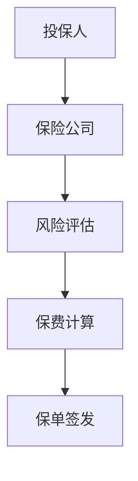
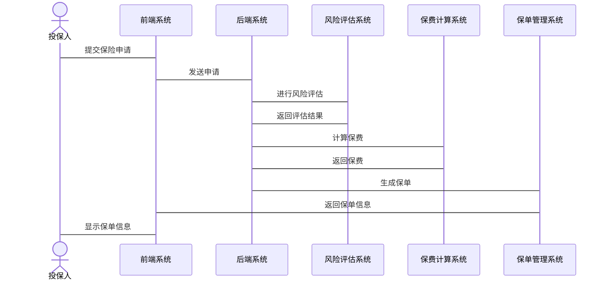

                 


# 沃伦·巴菲特的保险业投资逻辑

> **关键词**：巴菲特，保险业，价值投资，浮存金，投资策略，风险管理  
> **摘要**：本文深入分析沃伦·巴菲特在保险业的投资逻辑，探讨其价值投资理念、保险业务模式及风险管理策略。通过数学模型、系统架构和实际案例，揭示巴菲特如何通过浮存金实现长期稳健投资收益，为投资者提供实用的借鉴。

---

## 第一章：引言

### 1.1 保险业的基本概念

保险业作为金融服务业的重要组成部分，主要通过分散风险为个人和企业提供保障。其核心业务包括寿险、财险、健康险等，涉及风险评估、保费收取、理赔等多个环节。

### 1.2 巴菲特的投资理念

沃伦·巴菲特是全球著名投资者，倡导价值投资，强调长期稳健投资。他认为市场波动不可预测，而优质企业长期表现稳定，因此更关注企业的内在价值而非短期市场波动。

---

## 第二章：巴菲特的保险投资逻辑

### 2.1 投资哲学

#### 2.1.1 价值投资的定义

价值投资是指寻找市场价格低于内在价值的股票进行投资。巴菲特认为，市场先生的情绪波动为理性投资者提供了机会。

#### 2.1.2 安全边际的重要性

安全边际是巴菲特投资的核心原则，即用低于内在价值的价格买入优质企业。例如，若企业内在价值为100，以80的价格买入，即使出现偏差，仍能获得收益。

#### 2.1.3 长期投资的重要性

巴菲特强调长期投资，避免短期市场波动的干扰。他相信优质企业的长期表现会反映其内在价值。

### 2.2 保险业务模式

#### 2.2.1 保险公司的运作模式

保险公司通过收取保费形成浮存金，用于投资获取收益。巴菲特通过控制风险和选择优质企业，确保浮存金的安全和增长。

#### 2.2.2 浮存金的概念

浮存金是保险公司未使用的保费，用于投资。巴菲特利用浮存金的特性，实现长期稳健收益。例如，伯克希尔哈撒韦通过浮存金投资于苹果、可口可乐等企业，获得稳定分红。

### 2.3 巴菲特的保险投资策略

#### 2.3.1 投资组合的风险管理

巴菲特注重分散投资，避免过度集中风险。通过投资不同行业的优质企业，降低整体投资组合的波动性。

#### 2.3.2 保险公司的财务稳定性

他偏好财务稳健、管理优秀的保险公司，确保浮存金的安全和收益。例如，伯克希尔哈撒韦的保险业务为投资提供了稳定的资金来源。

---

## 第三章：数学模型与评估方法

### 3.1 基本财务指标

#### 3.1.1 净资产收益率（ROE）

ROE = 净利润 / 股东权益  
ROE反映了企业使用股东资金的效率。巴菲特通常寻找ROE高于行业平均水平的企业。

#### 3.1.2 资产回报率（ROA）

ROA = 净利润 / 总资产  
ROA衡量企业利用资产创造利润的能力，巴菲特倾向于投资ROA高的企业。

#### 3.1.3 净利润率

净利润率 = 净利润 / 营业收入  
高净利润率表明企业成本控制能力强，盈利能力高。

### 3.2 巴菲特的评估公式

#### 3.2.1 企业内在价值计算

$$
\text{内在价值} = \sum_{t=1}^{\infty} \frac{\text{自由现金流}_t}{(r - g)^t}
$$

其中，r为折现率，g为增长率。巴菲特通过保守估计r和g，确保内在价值计算的可靠性。

#### 3.2.2 保险公司的浮存金评估

浮存金的评估基于其安全性和收益能力。巴菲特选择信用评级高、管理透明的保险公司，确保浮存金的安全性和长期收益。

### 3.3 案例分析

以伯克希尔哈撒韦为例，计算其ROE和ROA：

$$
\text{ROE} = \frac{\$80\text{亿净利润}}{\$600\text{亿股东权益}} = 13.33\%
$$

$$
\text{ROA} = \frac{\$80\text{亿净利润}}{\$800\text{亿总资产}} = 10\%
$$

---

## 第四章：系统分析与架构设计

### 4.1 保险业务流程分析

#### 4.1.1 保险业务流程图（Mermaid）



### 4.2 系统架构设计

#### 4.2.1 系统架构图（Mermaid）


#### 4.2.2 交互序列图（Mermaid）



---

## 第五章：项目实战

### 5.1 环境安装

#### 5.1.1 Python环境安装

安装Python和必要的库，如Pandas、Matplotlib。

### 5.2 核心实现源代码

#### 5.2.1 计算ROE和ROA的Python代码

```python
def calculate_roe(net_profit, shareholders_equity):
    return net_profit / shareholders_equity

def calculate_roa(net_profit, total_assets):
    return net_profit / total_assets

net_profit = 80  # 以美元为单位
shareholders_equity = 600
total_assets = 800

roe = calculate_roe(net_profit, shareholders_equity)
roa = calculate_roa(net_profit, total_assets)

print(f"ROE: {roe:.2f}%")
print(f"ROA: {roa:.2f}%")
```

---

## 第六章：总结与展望

### 6.1 总结

巴菲特通过价值投资和浮存金策略，实现保险业的长期稳健收益。其投资逻辑强调安全边际、财务稳健和长期投资。

### 6.2 未来展望

随着保险市场的变化，投资者需不断调整策略，但巴菲特的核心理念仍具有重要指导意义。

---

**作者：AI天才研究院/AI Genius Institute & 禅与计算机程序设计艺术 /Zen And The Art of Computer Programming**

