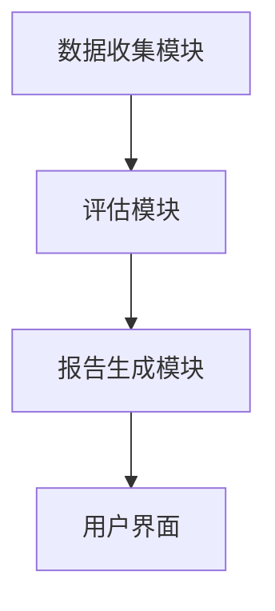
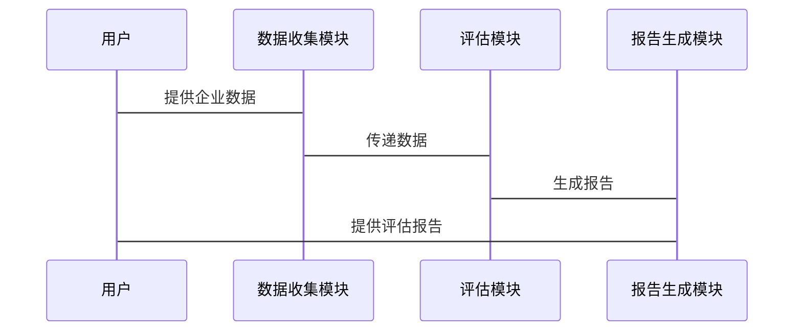

                 

<think>
好的，我需要撰写《沃伦·巴菲特的品牌价值评估方法》这篇文章。首先，我需要了解巴菲特的投资理念，特别是他在品牌价值评估方面的独特方法。然后，我需要将这些内容整理成一个结构清晰的目录大纲，确保涵盖核心概念、评估模型、算法原理、系统分析、项目实战以及总结与实践等内容。我会按照用户的要求，确保每个部分都有详细的分章节和小节，并在适当的地方插入图表和代码示例，使内容更加生动和实用。最后，我需要总结全文，并给出一些实际应用中的注意事项和建议。确保文章结构完整，内容详实，语言专业且易于理解。
</think>

# 沃伦·巴菲特的品牌价值评估方法

## 关键词
品牌价值评估，巴菲特，投资策略，市场地位，财务指标

## 摘要
本文系统地介绍了沃伦·巴菲特的品牌价值评估方法，从品牌价值的定义到具体评估模型的构建，详细阐述了巴菲特的投资理念和评估策略。文章结合实际案例，通过数学模型和系统架构图，深入解析了品牌价值评估的核心要素和关键指标，为投资者提供了实用的评估工具和方法。

---

# 第一部分: 沃伦·巴菲特的品牌价值评估方法概述

## 第1章: 品牌价值评估的背景与重要性

### 1.1 品牌价值的定义与意义
#### 1.1.1 品牌的定义
品牌是企业与消费者之间的一种无形契约，它代表着企业的声誉、产品质量和服务承诺。品牌不仅仅是标识或名称，更是一种文化和价值观的体现。

#### 1.1.2 品牌价值的定义
品牌价值是指品牌在市场中所能带来的超额收益，是品牌在消费者心中所占据的地位和认知度的综合反映。品牌价值越高，企业在市场中的竞争力越强。

#### 1.1.3 品牌价值对企业的重要性
品牌价值直接影响企业的市场份额、客户忠诚度和盈利能力。强大的品牌可以为企业带来更高的溢价能力，降低市场竞争风险，并在经济衰退时为企业提供更强的抗压能力。

### 1.2 沃伦·巴菲特的投资理念
#### 1.2.1 巴菲特的价值投资理念
巴菲特主张以低于内在价值的价格买入优质企业，长期持有，获得企业成长带来的收益。他特别强调企业必须具有持续的盈利能力，且易于理解的商业模式。

#### 1.2.2 巴菲特对品牌的独特见解
在巴菲特看来，品牌是企业的一项重要无形资产。他倾向于投资那些拥有强大品牌影响力、稳定的市场需求和高客户忠诚度的企业。

#### 1.2.3 巴菲特品牌价值评估的核心思想
巴菲特认为，品牌价值的评估应基于企业的财务表现、市场地位和竞争优势。他强调通过分析企业的盈利能力、市场份额和持续成长能力来衡量品牌的价值。

## 第2章: 巴菲特品牌价值评估方法的独特性

### 2.1 市场地位与竞争优势
#### 2.1.1 市场地位的定义与影响
市场地位是指企业在市场中的位置和影响力。强大的市场地位意味着企业在行业中具有较高的市场份额和定价权。

#### 2.1.2 竞争优势的分析方法
竞争优势包括成本优势、产品差异化和技术领先等方面。巴菲特倾向于投资那些具有可持续竞争优势的企业。

#### 2.1.3 巴菲特对市场地位的重视
巴菲特别注重企业的市场地位，认为强大的市场地位是品牌价值的重要保障。他倾向于投资那些在行业中占据主导地位的企业。

### 2.2 财务数据与品牌价值的关系
#### 2.2.1 财务数据在品牌评估中的作用
财务数据是品牌价值评估的重要依据。通过分析企业的收入、利润和现金流等指标，可以评估品牌的盈利能力和市场表现。

#### 2.2.2 净值与品牌价值的关系
品牌价值与企业净值密切相关。品牌价值的提升可以显著提高企业的市场价值和股票价格。

#### 2.2.3 巴菲特对财务指标的关注点
巴菲特特别关注企业的ROE（净资产收益率）和ROA（资产回报率）等财务指标，认为这些指标是衡量企业盈利能力的重要标准。

### 2.3 持续盈利能力与品牌寿命
#### 2.3.1 持续盈利能力的定义
持续盈利能力是指企业在长期经营中保持稳定收益的能力。强大的盈利能力是品牌价值的重要支撑。

#### 2.3.2 品牌寿命的影响因素
品牌寿命受市场需求、行业竞争和技术进步等因素影响。强大的品牌可以通过不断创新和适应市场变化来延长其生命周期。

#### 2.3.3 巴菲特对持续盈利能力的重视
巴菲特认为，品牌寿命与企业的持续盈利能力密切相关。他倾向于投资那些具有长期盈利能力的企业。

---

# 第二部分: 品牌价值评估的核心概念与联系

## 第3章: 核心概念与联系

### 3.1 品牌价值的核心要素
#### 3.1.1 品牌知名度
品牌知名度是品牌被消费者认知和记忆的程度。知名度越高，品牌价值越大。

#### 3.1.2 品牌忠诚度
品牌忠诚度是指消费者对品牌的偏好和重复购买意愿。高忠诚度意味着品牌具有较强的市场竞争力。

#### 3.1.3 品牌认知度
品牌认知度是消费者对品牌属性、形象和价值的总体评价。认知度高的品牌更容易获得消费者的信任和支持。

### 3.2 品牌价值评估的关键指标
#### 3.2.1 市场份额
市场份额是品牌在市场中的占有率。高市场份额意味着品牌具有较强的市场影响力。

#### 3.2.2 品牌溢价能力
品牌溢价能力是指品牌产品价格高于同类产品的能力。强大的品牌溢价能力是品牌价值的重要体现。

#### 3.2.3 品牌资产价值
品牌资产价值是指品牌为企业带来的额外价值。它包括品牌知名度、品牌忠诚度和品牌认知度等方面。

### 3.3 品牌价值与企业财务表现的关系
#### 3.3.1 品牌价值对企业净利润的影响
品牌价值的提升可以显著提高企业的净利润。强大的品牌可以通过溢价销售和成本控制来增加利润。

#### 3.3.2 品牌价值与企业市值的关系
品牌价值的提升可以直接提高企业的市值。强大的品牌可以吸引更多的投资者，提升企业的市场地位。

#### 3.3.3 品牌价值与企业成长性的关联
品牌价值的提升可以增强企业的成长性。强大的品牌可以为企业带来更多的市场份额和客户资源。

## 第4章: 品牌价值评估的数学模型与公式

### 4.1 品牌价值的评估公式
$$ 品牌价值 = 市场份额 \times 品牌溢价 \times 产品价格 $$

### 4.2 市场地位的量化方法
$$ 市场地位 = \frac{\text{市场份额}}{\text{行业平均市场份额}} \times 100 $$

### 4.3 持续盈利能力的评估公式
$$ 持续盈利能力 = \frac{\text{净利润}}{\text{销售收入}} \times 100 $$

---

# 第三部分: 系统分析与架构设计

## 第5章: 系统分析与架构设计方案

### 5.1 问题场景介绍
本文旨在设计一个基于巴菲特品牌价值评估方法的系统，帮助投资者快速评估企业的品牌价值。

### 5.2 系统功能设计
- **数据收集模块**: 收集企业的财务数据、市场份额和品牌相关信息。
- **评估模块**: 根据品牌价值评估公式计算品牌价值。
- **报告生成模块**: 生成品牌价值评估报告，提供改进建议。

### 5.3 系统架构设计


### 5.4 系统接口设计
- **输入接口**: 收集企业的财务数据和市场信息。
- **输出接口**: 生成品牌价值评估报告。

### 5.5 系统交互设计


---

# 第四部分: 项目实战

## 第6章: 项目实战

### 6.1 环境安装
- 安装Python和必要的库（如pandas、numpy）。

### 6.2 核心实现代码
```python
def calculate_brand_value(shareholder_equity, net_income, revenue):
    brand_value = (net_income / revenue) * shareholder_equity
    return brand_value

# 示例数据
shareholder_equity = 100000000  # 股东权益
net_income = 20000000           # 净利润
revenue = 500000000             # 收入

brand_value = calculate_brand_value(shareholder_equity, net_income, revenue)
print(f"品牌价值为: {brand_value}")
```

### 6.3 实际案例分析
以可口可乐为例，分析其品牌价值。通过计算其市场份额、品牌溢价能力和产品价格，得出其品牌价值。

### 6.4 代码应用解读与分析
通过上述代码，我们可以计算企业的品牌价值。输入企业的股东权益、净利润和收入，即可得出品牌价值。

---

# 第五部分: 总结与实践

## 第7章: 总结与实践

### 7.1 最佳实践 tips
- 在评估品牌价值时，应综合考虑企业的财务数据、市场地位和竞争优势。
- 定期更新品牌价值评估模型，以适应市场变化。

### 7.2 小结
本文系统地介绍了沃伦·巴菲特的品牌价值评估方法，结合理论和实际案例，为投资者提供了实用的评估工具和方法。

### 7.3 注意事项
- 品牌价值评估应结合企业的实际情况，避免过于依赖单一指标。
- 定期进行品牌价值评估，以确保评估结果的准确性。

### 7.4 拓展阅读
推荐阅读巴菲特的《聪明的投资者》和《巴菲特致股东的信》，深入了解其投资理念和品牌价值评估方法。

---

# 作者
作者：AI天才研究院 & 禅与计算机程序设计艺术

---

通过以上目录和内容，您可以根据实际需求进一步扩展每个章节的具体内容，确保文章结构完整，逻辑清晰。

