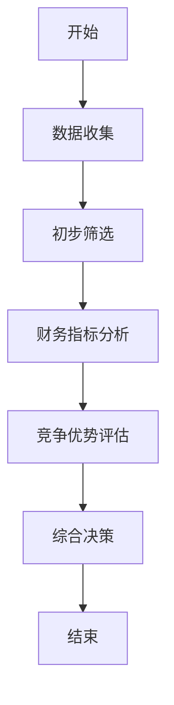
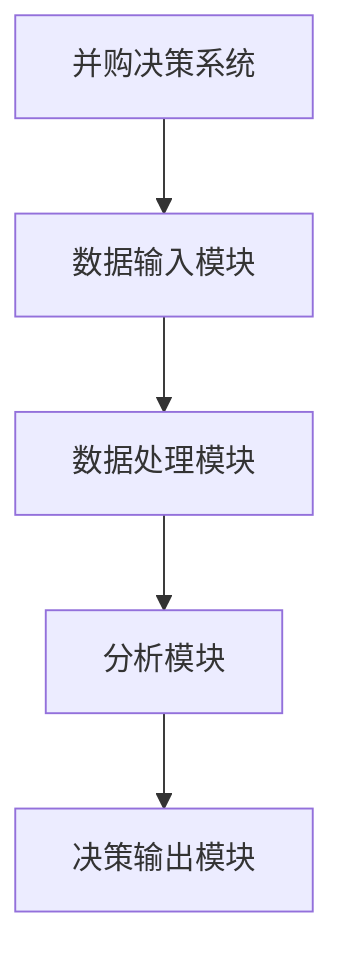
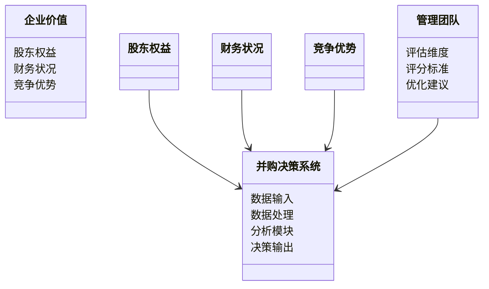
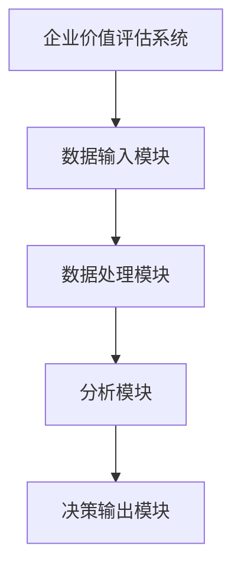
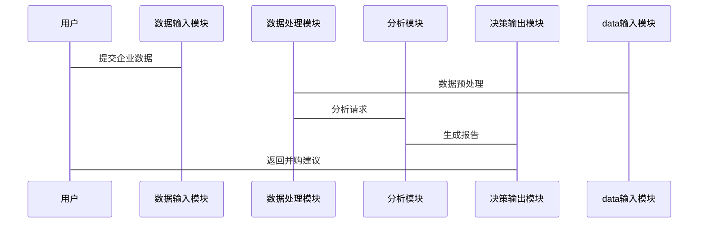

                 

# 沃伦·巴菲特的并购策略分析

---

## 关键词：
沃伦·巴菲特, 并购策略, 价值投资, 股东权益, 企业评估

---

## 摘要：
沃伦·巴菲特是全球最著名的投资者之一，他的并购策略以价值投资为核心，注重企业的基本面分析、财务健康状况和长期发展潜力。本文将从背景介绍、核心概念、算法原理、系统分析、项目实战等方面，全面解析巴菲特并购策略的精髓，并结合实际案例，深入探讨其成功的奥秘。通过本文，读者将能够掌握巴菲特并购策略的逻辑框架和实战技巧，为企业并购提供有益的借鉴。

---

# 第一部分: 背景介绍

## 第1章: 沃伦·巴菲特的生平与投资哲学

### 1.1 巴菲特的生平简介
- 1.1.1 巴菲特的成长经历
  - 幼年时期对投资的兴趣
  - 在哥伦比亚大学的学习经历
  - 初入职场的金融生涯

- 1.1.2 巴菲特的投资理念与价值观
  - 价值投资的核心理念
  - 长期投资与复利效应
  - 股东利益至上的原则

- 1.1.3 巴菲特的合作伙伴与伯克希尔哈撒韦
  - 早期合伙人的选择
  - 伯克希尔哈撒韦的收购历程
  - 企业文化与管理风格

### 1.2 巴菲特并购策略的背景
- 1.2.1 并购在巴菲特投资组合中的地位
  - 并购与股票投资的结合
  - 并购在伯克希尔哈撒韦资产配置中的作用

- 1.2.2 巴菲特并购策略的演变
  - 早期的集中投资策略
  - 成熟期的多元化并购
  - 当前的全球化布局

- 1.2.3 巴菲特并购策略的行业适用性
  - 金融、保险、制造等行业的并购特点
  - 不同行业并购策略的异同

---

## 第2章: 巴菲特并购策略的核心概念

### 2.1 并购的基本概念与分类
- 2.1.1 并购的定义与类型
  - 横向并购、纵向并购、混合并购的区分
  - 并购的动机与目的
  - 并购的流程与风险

- 2.1.2 巴菲特并购策略的核心要素
  - 企业的基本面分析
  - 财务状况评估
  - 管理团队与企业文化

- 2.1.3 巴菲特并购策略的评价标准
  - 企业的竞争优势分析
  - 企业的财务健康状况
  - 企业的长期发展潜力

---

## 第3章: 巴菲特并购策略的数学模型与算法原理

### 3.1 并购决策的数学模型
- 3.1.1 企业价值评估模型
  - 股权价值的计算公式
  - 股东权益的评估方法
  - 现金流折现模型的应用

- 3.1.2 股东权益估值公式
  - 净现值法（NPV）
  - 内部收益率法（IRR）
  - 现值指数法（PV Index）

- 3.1.3 资本结构优化模型
  - WACC（加权平均资本成本）
  - 股权与债务的最优比例

### 3.2 巴菲特并购策略的算法流程
- 3.2.1 数据收集与初步筛选
  - 市场数据的收集渠道
  - 企业的初步筛选标准
  - 数据的清洗与预处理

- 3.2.2 财务指标分析与评分
  - 财务指标的权重分配
  - 评分模型的构建与应用
  - 案例分析：可口可乐的财务指标评估

- 3.2.3 竞争优势与管理团队评估
  - 企业竞争优势的识别方法
  - 管理团队的评估维度
  - 企业文化对企业长期发展的影响力

- 3.2.4 综合决策与投资建议
  - 综合评分的计算方法
  - 投资建议的制定流程
  - 风险控制与退出策略

### 3.3 算法流程图（Mermaid）

---

## 第4章: 巴菲特并购策略的系统架构与设计

### 4.1 系统分析与架构设计
- 4.1.1 系统目标与范围
  - 系统的目标是为企业并购提供决策支持
  - 系统的适用范围包括企业战略规划和投资决策

- 4.1.2 系统功能模块划分
  - 数据输入模块
  - 数据处理模块
  - 分析模块
  - 决策输出模块

- 4.1.3 系统架构图（Mermaid）

---

## 第5章: 巴菲特并购策略的项目实战

### 5.1 项目背景与目标
- 5.1.1 项目背景
  - 某公司计划进行并购，寻求巴菲特式的策略支持
  - 项目目标是通过巴菲特并购策略框架，找到合适的并购目标并制定并购计划

### 5.2 系统功能设计
- 5.2.1 领域模型（Mermaid类图）

### 5.3 系统架构设计
- 5.3.1 系统架构图（Mermaid）

### 5.4 系统接口设计
- 5.4.1 接口描述
  - 数据输入接口：接收企业的财务数据、管理团队信息等
  - 分析接口：调用企业价值评估模型进行分析
  - 输出接口：生成并购建议报告

### 5.5 系统交互设计（Mermaid序列图）

---

## 第6章: 巴菲特并购策略的最佳实践

### 6.1 项目小结
- 并购决策系统的实现为企业的并购提供了科学的决策支持
- 系统通过模块化设计，实现了企业价值评估、财务分析和管理团队评估的自动化
- 通过实际案例分析，验证了系统的有效性和可操作性

### 6.2 注意事项
- 数据的准确性和完整性是系统分析的基础
- 管理团队的评估需要结合定性与定量分析
- 并购后的整合与管理是决定并购成功与否的关键

### 6.3 拓展阅读
- 建议读者阅读巴菲特的经典著作《投资的真相》和《伯克希尔哈撒韦公司股东手册》
- 参考相关学术论文，如《巴菲特投资策略的数学模型研究》

---

## 作者：AI天才研究院/AI Genius Institute & 禅与计算机程序设计艺术/Zen And The Art of Computer Programming

