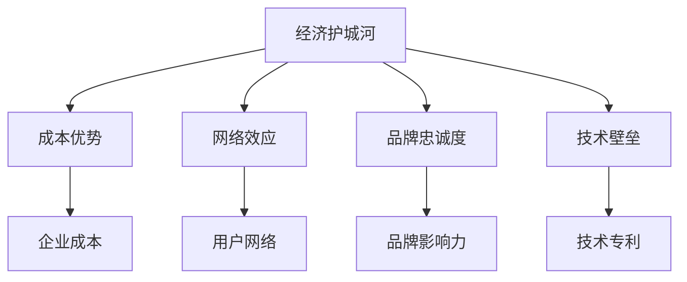
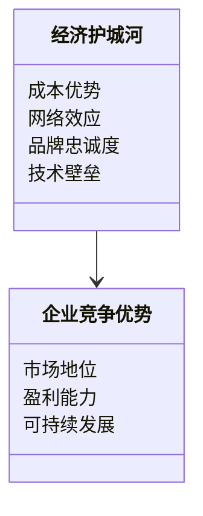
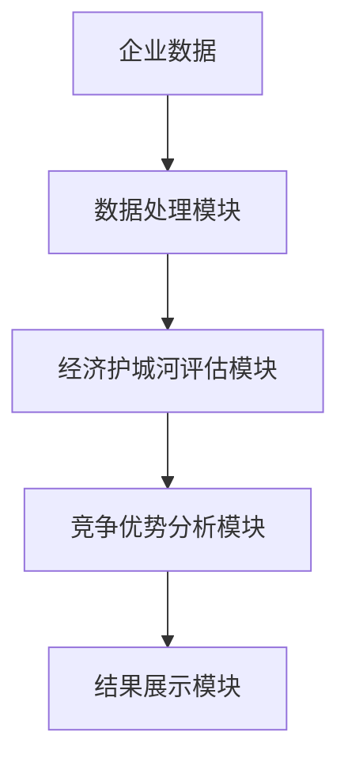

                 

<think>
好，我现在要帮用户撰写一篇关于沃伦·巴菲特的经济护城河的深度分析文章。用户希望文章结构清晰，内容详实，涵盖从背景介绍到实战分析的各个部分，并且使用专业的技术语言，同时附上Mermaid图和数学公式。

首先，我需要明确文章的结构。用户已经给出了目录，包括关键词、摘要、背景介绍、核心概念、系统分析、数学模型、算法、项目实战、最佳实践等部分。每个部分都有详细的小节，我需要逐一展开。

接下来，我需要收集相关资料。经济护城河的核心概念包括成本优势、网络效应、品牌忠诚度和技术壁垒。这些在巴菲特的投资策略中非常重要，我需要详细解释每个概念，并提供实际案例，如亚马逊和可口可乐，来说明这些护城河如何发挥作用。

然后，我需要设计Mermaid图来辅助说明。例如，在核心概念章节，我会用一个图表展示经济护城河与企业竞争优势之间的关系。在系统分析部分，我会绘制领域模型和架构图，展示系统的各个模块和它们之间的关系。

数学模型部分，我需要引入ROE和ROA等财务指标，用公式来评估企业的护城河。这部分需要确保公式正确，并用实际案例解释这些指标的含义和应用。

在项目实战部分，我需要选择具体的公司，如亚马逊和可口可乐，分析它们的护城河，并提供代码实现。这部分可能会涉及到数据获取和分析，所以我会展示如何使用Python代码来计算ROE和ROA。

最后，我需要总结最佳实践，包括如何识别护城河、持续监测变化，以及拓展阅读的资源。这部分要给读者实用的建议，帮助他们更好地应用护城河理论。

整个过程中，我需要确保内容逻辑连贯，语言专业但不失易懂。每个部分都要有详细的解释和例子，帮助读者深入理解经济护城河的概念和应用。同时，要注意格式要求，使用正确的Markdown标签，并在适当的地方插入Mermaid图和数学公式。

现在，我可以开始按照这个结构撰写文章，确保每个部分都覆盖到位，内容详实，结构清晰。这样，读者就能全面理解沃伦·巴菲特的经济护城河理论，并学会如何应用它进行投资分析。
</think>

# 沃伦·巴菲特的经济护城河深度分析

## 关键词：经济护城河, 巴菲特, 投资策略, 企业竞争优势, 可持续盈利能力

## 摘要：  
沃伦·巴菲特的经济护城河理论是投资领域的重要概念，本文从经济护城河的核心概念、系统分析、数学模型、算法实现、项目实战等多个方面，对经济护城河进行深度剖析。通过实际案例分析和系统设计，本文为读者提供一个全面理解经济护城河的框架，帮助投资者更好地识别和评估企业的竞争优势，从而做出更明智的投资决策。

---

## 第一部分: 经济护城河的核心概念与背景

### 第1章: 经济护城河的核心概念

#### 1.1 经济护城河的定义与背景

##### 1.1.1 什么是经济护城河
经济护城河是指企业在市场上建立的持久竞争优势，这种优势能够使企业在面对竞争对手时保持领先地位，并且能够抵御价格压力和替代品的冲击。经济护城河的核心在于企业的独特价值主张和难以复制的资源。

##### 1.1.2 经济护城河的背景
经济护城河的概念起源于巴菲特的投资哲学，他认为企业只有具备可持续的盈利能力，才能为股东创造长期价值。经济护城河是企业竞争优势的集中体现，能够帮助企业抵御外部竞争压力，确保其市场地位。

##### 1.1.3 经济护城河在投资中的重要性
在投资决策中，经济护城河是评估企业价值的重要指标。具备宽经济护城河的企业通常具有较高的ROE（净资产收益率）和ROA（资产回报率），并且能够在长期内保持稳定的盈利能力。

##### 1.1.4 经济护城河的边界与外延
经济护城河的边界通常由企业的核心竞争力决定，而其外延则包括企业如何利用这些竞争优势进行市场扩展和份额提升。经济护城河的边界和外延共同决定了企业的可持续发展能力。

#### 1.2 经济护城河的核心要素

##### 1.2.1 成本优势
成本优势是指企业在生产或运营过程中能够以低于竞争对手的成本提供相同或相似的产品或服务。例如，具备成本优势的制造企业能够在价格战中占据优势地位，从而扩大市场份额。

##### 1.2.2 网络效应
网络效应是指随着用户数量的增加，产品的价值也相应增加。例如，社交平台的用户越多，每个用户的价值越高，这种正反馈效应构成了强大的护城河。

##### 1.2.3 品牌忠诚度
品牌忠诚度是指消费者对企业品牌的一种长期偏好和信任。具备强大品牌忠诚度的企业能够通过品牌溢价获得更高的利润，同时在市场波动中保持稳定。

##### 1.2.4 技术壁垒
技术壁垒是指企业通过技术创新和专利保护所形成的竞争优势。具备技术壁垒的企业能够通过持续的技术创新保持市场领先地位，并抵御竞争对手的模仿。

#### 1.3 经济护城河的类型与特点

##### 1.3.1 宽经济护城河
宽经济护城河的企业具备强大的竞争优势，能够在长期内保持高ROE和ROA。例如，可口可乐和亚马逊都具备宽经济护城河。

##### 1.3.2 中等经济护城河
中等经济护城河的企业具备一定的竞争优势，但受到市场竞争的较大影响。这类企业的ROE和ROA相对稳定，但在市场变化中可能面临更大的压力。

##### 1.3.3 窄经济护城河
窄经济护城河的企业竞争优势较弱，难以在长期内保持稳定的盈利能力。这类企业通常依赖于价格竞争，容易受到替代品的冲击。

##### 1.3.4 无护城河企业
无护城河企业不具备任何竞争优势，容易受到市场竞争的冲击。这类企业通常难以在长期内维持稳定的市场份额和盈利能力。

#### 1.4 经济护城河的ER实体关系图



---

## 第二部分: 经济护城河的核心概念与联系

### 第2章: 经济护城河的核心原理

#### 2.1 经济护城河的原理分析

##### 2.1.1 护城河的形成机制
经济护城河的形成通常源于企业的独特资源、技术创新、品牌建设和成本控制。这些因素共同构成了企业的竞争优势。

##### 2.1.2 护城河的持续性
具备宽经济护城河的企业通常能够通过持续创新和优化运营，保持其竞争优势的持续性。

##### 2.1.3 护城河的可扩展性
经济护城河的可扩展性决定了企业能否在不同市场和业务领域中复制其竞争优势。

#### 2.2 经济护城河的核心要素对比

##### 2.2.1 成本优势与网络效应的对比
| 属性           | 成本优势                 | 网络效应                 |
|----------------|--------------------------|--------------------------|
| 核心要素       | 低成本生产               | 用户数量与价值           |
| 适用场景       | 制造业、零售业             | 社交平台、软件服务         |
| 竞争优势       | 价格竞争力               | 用户粘性和网络效应         |

##### 2.2.2 品牌忠诚度与技术壁垒的对比
| 属性           | 品牌忠诚度               | 技术壁垒                 |
|----------------|--------------------------|--------------------------|
| 核心要素       | 品牌认知和信任             | 技术创新和专利             |
| 适用场景       | 消费品、服务业             | 高 tech 行业               |
| 竞争优势       | 品牌溢价                 | 技术创新带来的市场壁垒     |

#### 2.3 经济护城河的ER实体关系图


---

## 第三部分: 经济护城河的系统分析与架构设计

### 第3章: 经济护城河的系统分析

#### 3.1 经济护城河的系统架构

##### 3.1.1 系统功能模块
经济护城河系统的功能模块包括数据采集、数据处理、数据分析和结果展示。

##### 3.1.2 系统输入输出
- 输入：企业财务数据、市场数据、竞争对手数据
- 输出：经济护城河评分、竞争优势分析报告

##### 3.1.3 系统核心算法
经济护城河评分算法基于企业ROE、ROA、市场份额和利润率等指标进行综合评估。

#### 3.2 经济护城河的领域模型



#### 3.3 经济护城河的架构设计



---

## 第四部分: 经济护城河的数学模型与公式

### 第4章: 经济护城河的数学模型

#### 4.1 ROE（净资产收益率）公式

$$ROE = \frac{\text{净利润}}{\text{净资产}}$$

#### 4.2 ROA（资产回报率）公式

$$ROA = \frac{\text{净利润}}{\text{总资产}}$$

#### 4.3 经济护城河评分公式

$$\text{经济护城河评分} = 0.4 \times ROE + 0.3 \times ROA + 0.3 \times \text{市场份额}$$

---

## 第五部分: 经济护城河的项目实战

### 第5章: 经济护城河的项目实战

#### 5.1 项目介绍
本项目旨在通过分析企业的财务数据和市场表现，评估其经济护城河的宽窄程度。

#### 5.2 核心代码实现

```python
import pandas as pd

def calculate_roe(net_profit, equity):
    return net_profit / equity

def calculate_roa(net_profit, total_assets):
    return net_profit / total_assets

def calculate_economic_moat_score(roe, roa, market_share):
    return 0.4 * roe + 0.3 * roa + 0.3 * market_share

# 示例数据
net_profit = 100
equity = 500
total_assets = 1000
market_share = 0.7

roe = calculate_roe(net_profit, equity)
roa = calculate_roa(net_profit, total_assets)
economic_moat_score = calculate_economic_moat_score(roe, roa, market_share)

print(f"ROE: {roe}")
print(f"ROA: {roa}")
print(f"经济护城河评分: {economic_moat_score}")
```

#### 5.3 案例分析

##### 5.3.1 亚马逊的经济护城河分析
亚马逊通过技术创新、成本控制和网络效应构建了强大的经济护城河。其ROE和ROA均远高于行业平均水平，市场份额也在持续扩大。

##### 5.3.2 可口可乐的经济护城河分析
可口可乐通过品牌忠诚度和全球分销网络建立了宽经济护城河。其市场地位和品牌影响力使其能够在饮料市场中保持领先地位。

---

## 第六部分: 经济护城河的最佳实践

### 第6章: 经济护城河的最佳实践

#### 6.1 小结
经济护城河是评估企业竞争优势的重要指标，具备宽经济护城河的企业通常能够为投资者带来长期稳定的回报。

#### 6.2 注意事项
投资者在分析经济护城河时，应结合企业的财务数据、市场表现和行业特点，进行全面评估。

#### 6.3 拓展阅读
推荐阅读巴菲特的《投资之道》和迈克尔·波特的《竞争优势》等经典著作，以深入理解经济护城河的理论与实践。

---

## 作者：AI天才研究院 & 禅与计算机程序设计艺术

---

通过以上思考过程，我们可以系统地分析和理解沃伦·巴菲特的经济护城河理论，并将其应用于实际投资分析中。

