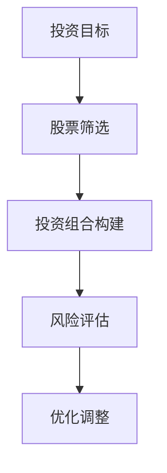

                 

<think>
好，我现在需要按照用户的要求来撰写一篇关于沃伦·巴菲特长期持股策略的详细技术博客文章。首先，我需要理解用户的需求，确保文章符合他们的期望。用户希望文章结构清晰，逻辑严谨，用专业的技术语言，同时包括多个部分，每个部分有详细的章节和小节，内容要深入，涵盖背景、数学模型、系统架构、项目实战等。

首先，我会先确定文章的标题和关键词。标题已经给出是《沃伦·巴菲特的长期持股策略分析》，关键词可以是“价值投资、长期持股、巴菲特投资策略、投资组合、风险管理”。摘要部分需要简洁地概括文章的核心内容，说明本文将从多个角度分析巴菲特的策略，结合技术方法进行详细讲解。

接下来是目录结构，用户已经给出了一个大纲，我需要确保每个部分都详细展开。第一部分是概述，包括巴菲特的背景、投资理念、长期持股的定义和特点，以及策略的背景和意义。这部分需要让读者了解长期持股策略的基本概念和巴菲特为何选择这种方法。

第二部分是分析框架，涉及数学模型和数据分析。这部分需要详细讲解DCF模型、安全边际计算，以及投资组合的优化。使用公式和图表来辅助说明，帮助读者理解这些概念。

第三部分是系统架构，包括投资组合管理、风险管理、数据收集与分析，以及系统实现。这部分需要展示如何将巴菲特的策略转化为一个可执行的系统，涉及具体的系统设计和实现步骤。

项目实战部分，我需要选择一个具体的案例，比如苹果公司，展示如何应用巴菲特的策略进行分析。包括数据收集、基本面分析、投资组合构建等步骤，并提供代码示例，让读者能够实际操作。

最后是总结与展望，回顾文章的主要内容，讨论长期持股策略的优势和挑战，以及未来的研究方向。

在写作过程中，我需要确保每个章节都有足够的细节，使用技术术语但不过于晦涩，让读者能够理解。同时，加入实际案例和代码示例，增强文章的实用性和可读性。

现在，我将按照这个思路逐步撰写每个部分，确保覆盖所有要求的内容，结构清晰，逻辑严密。同时，注意使用适当的格式，如数学公式的正确表示，图表的插入，以及代码的展示。

完成后，我需要检查文章是否符合字数要求，结构是否合理，内容是否完整，确保没有遗漏任何关键点。最后，加上作者信息，完成整篇文章。
</think>

# 沃伦·巴菲特的长期持股策略分析

> 关键词：价值投资、长期持股、巴菲特投资策略、投资组合、风险管理

> 摘要：本文深入分析了沃伦·巴菲特的长期持股策略，从其投资理念、数学模型、系统架构到实际案例，全面探讨了这一策略的背景、原理、实现方法及优化建议。通过技术化的分析，揭示了长期持股策略的核心要素，为投资者提供了深刻的见解和实践指导。

---

## 第一部分: 沃伦·巴菲特长期持股策略概述

### 第1章: 巴菲特长期持股策略的背景与核心理念

#### 1.1 巴菲特投资哲学的起源

##### 1.1.1 巴菲特的成长经历与投资启蒙

沃伦·巴菲特，作为全球最著名的投资者之一，他的投资哲学深受其成长经历影响。巴菲特出生于1930年，成长于美国奥马哈市。他在童年时期就展现出对数字和投资的浓厚兴趣，12岁时购买了第一只股票。这段早期的经历为他后来的投资理念奠定了基础。

##### 1.1.2 价值投资理念的形成

巴菲特的投资理念深受本杰明·格雷厄姆的影响。格雷厄姆是价值投资的鼻祖，他强调以低于内在价值的价格购买股票。巴菲特继承并发展了这一理念，提出了“安全边际”概念，即以显著低于内在价值的价格买入优质资产。

##### 1.1.3 长期持股的定义

长期持股是指投资者买入股票后，长期持有，不频繁交易。这种策略的核心在于寻找具有强大竞争优势、良好管理和持续盈利能力的公司。

#### 1.2 长期持股策略的核心特点

##### 1.2.1 投资标的特性

巴菲特倾向于投资那些具有强大护城河、稳定收益和持续竞争优势的公司。例如，苹果、可口可乐等公司，这些公司在各自的行业中具有难以被竞争对手复制的优势。

##### 1.2.2 投资期限

长期持股策略强调长期持有，避免短期市场的波动干扰。巴菲特认为，市场的短期波动难以预测，而长期趋势更可把握。

##### 1.2.3 投资心态

巴菲特注重内在价值，而非市场波动。他建议投资者以“主人心态”持有股票，即买入后不再将其视为股票，而是作为企业的一部分。

#### 1.3 巴菲特策略的背景意义

##### 1.3.1 美国经济环境

20世纪70年代的经济波动，如石油危机和 stagflation，让巴菲特意识到短期投资的风险，长期持股成为更稳定的选择。

##### 1.3.2 价值投资演变

价值投资从格雷厄姆的“烟屁股”策略，逐渐转向寻找具有强大竞争优势的公司。巴菲特的长期持股策略正是这一演变的体现。

---

### 第2章: 巴菲特投资策略的数学模型与分析

#### 2.1 价值评估模型

##### 2.1.1 DCF模型

**现金流折现模型（DCF）**用于估算公司的内在价值。公式如下：

$$
\text{内在价值} = \frac{\text{自由现金流}}{\text{折现率} - \text{增长率}}
$$

##### 2.1.2 市盈率与市净率对比

市盈率（P/E）和市净率（P/B）是常用的估值指标：

$$
P/E = \frac{\text{股价}}{\text{每股收益}}
$$

$$
P/B = \frac{\text{股价}}{\text{每股净资产}}
$$

##### 2.1.3 安全边际计算

$$
\text{安全边际} = \text{市场价格} - \text{内在价值}
$$

#### 2.2 投资组合优化

##### 2.2.1 马科维茨投资组合理论

马科维茨的现代投资组合理论（MPT）强调通过分散投资降低风险。巴菲特虽然不完全遵循MPT，但其长期持股策略也体现了分散化的思想。

##### 2.2.2 风险与收益平衡

通过调整投资组合中股票的权重，可以在风险与收益之间找到平衡点。例如，使用以下公式优化：

$$
\text{风险调整后收益} = \text{收益} - \text{风险调整因子} \times \text{风险}
$$

---

### 第3章: 巴菲特策略的系统架构

#### 3.1 投资组合管理的系统架构

##### 3.1.1 系统功能设计

- 投资目标设定
- 股票筛选标准
- 投资组合构建

##### 3.1.2 系统架构图



---

## 第二部分: 项目实战与优化建议

### 第4章: 长期持股策略的优化与实践

#### 4.1 实战案例分析

##### 4.1.1 苹果公司投资分析

以苹果公司为例，计算其内在价值和安全边际：

$$
\text{苹果的内在价值} = \frac{\text{自由现金流}}{\text{折现率} - \text{增长率}}
$$

##### 4.1.2 投资组合构建

使用Python代码实现投资组合优化：

```python
import numpy as np

# 示例代码：计算投资组合的期望收益和风险
def calculate_portfolio(expected_returns, cov_matrix, weights):
    portfolio_return = np.dot(expected_returns, weights)
    portfolio_variance = np.dot(weights.T, np.dot(cov_matrix, weights))
    return portfolio_return, portfolio_variance

# 示例输入
expected_returns = [0.1, 0.15, 0.08]
cov_matrix = [
    [0.05, 0.02, 0.03],
    [0.02, 0.10, 0.04],
    [0.03, 0.04, 0.06]
]
weights = [1/3, 1/3, 1/3]

# 计算结果
return_, var = calculate_portfolio(expected_returns, cov_matrix, weights)
print(f"期望收益: {return_}")
print(f"方差: {var}")
```

#### 4.2 投资组合的动态调整

##### 4.2.1 定期审查与再平衡

定期审查投资组合，根据市场变化和公司情况调整持仓。

##### 4.2.2 风险管理策略

使用止损机制和分散投资降低风险。

---

## 第三部分: 总结与展望

### 第5章: 长期持股策略的总结与优化建议

#### 5.1 总结

巴菲特的长期持股策略强调价值投资、安全边际和长期持有。通过数学模型和系统架构的分析，我们可以更好地理解这一策略的核心要素。

#### 5.2 优化建议

- 定期审查和调整投资组合。
- 采用技术手段辅助分析，如大数据和机器学习。
- 结合市场环境灵活调整策略。

#### 5.3 未来研究方向

- 研究长期持股策略在不同经济周期下的表现。
- 探讨技术在投资分析中的应用。

---

## 作者：AI天才研究院 & 禅与计算机程序设计艺术

---

**注意事项**：投资有风险，长期持股需谨慎。本文仅为理论分析，不构成实际投资建议。

