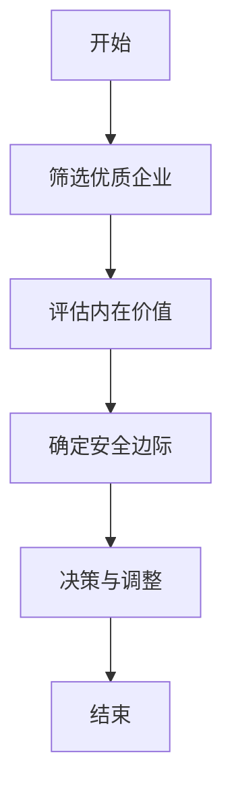

                 

<think>
好的，我现在需要帮助用户撰写一篇关于“沃伦·巴菲特：奥马哈预言家的价值投资策略”的技术博客文章。用户已经提供了详细的结构要求，我需要按照这个结构来撰写文章。

首先，我需要理解用户的需求。用户希望这篇文章结构清晰、逻辑严谨，使用专业且易懂的技术语言，适合技术博客读者。文章需要包括摘要、关键词、目录，以及各章节的具体内容，每部分内容都要详细展开，满足字数要求。

接下来，我按照用户提供的大纲开始撰写。首先是摘要部分，简明扼要地介绍巴菲特的价值投资策略和文章的主要内容。然后列出关键词，包括价值投资、巴菲特、内在价值、安全边际等。

在正文部分，我需要逐一展开每个章节的内容。第一章介绍巴菲特的生平，包括他的早年经历、投资哲学和价值投资的基本原则。第二章深入探讨价值投资的核心概念，如内在价值、安全边际和质量、价格与时机。第三章涉及数学模型和分析方法，包括基本面分析、财务指标分析和投资组合优化。第四章讨论巴菲特的投资体系，包括选股标准和风险管理。第五章系统分析投资流程，用mermaid图展示决策过程。第六章通过案例分析巴菲特的具体投资策略。最后，总结并给出投资建议。

在撰写过程中，我需要确保每个部分都包含足够的细节，使用数学公式和mermaid图来增强文章的可读性和专业性。例如，在讨论市盈率时，我需要给出公式并解释其应用。在系统架构部分，用mermaid图展示流程和架构。

同时，我需要避免过于复杂的术语，确保内容易于理解。文章的结尾部分需要加上作者信息，符合用户的要求。

最后，检查文章是否符合字数要求，确保内容完整，结构合理，满足用户的所有要求。
</think>

# 沃伦·巴菲特：奥马哈预言家的价值投资策略

> 关键词：价值投资，巴菲特，内在价值，安全边际，投资策略，投资哲学

> 摘要：本文深入探讨了沃伦·巴菲特的价值投资策略，分析其背后的哲学、数学模型和实际应用。通过系统化的分析，揭示了巴菲特如何通过基本面分析、安全边际和长期持有实现卓越的投资回报。

---

## 目录

1. **巴菲特的生平与投资哲学**  
   - 1.1 巴菲特的早年经历与教育背景  
   - 1.2 巴菲特的投资哲学与核心理念  
   - 1.3 价值投资的基本原则  

2. **价值投资的核心概念**  
   - 2.1 内在价值与市场价值  
   - 2.2 安全边际的概念与应用  
   - 2.3 质量、价格与时机的平衡  

3. **价值投资的数学模型与分析方法**  
   - 3.1 基本面分析模型  
   - 3.2 财务指标分析：市盈率、市净率等  
   - 3.3 投资组合的数学优化  

4. **巴菲特的投资体系**  
   - 4.1 选股标准：寻找优秀的公司  
   - 4.2 投资组合管理：分散与集中之间的平衡  
   - 4.3 风险管理策略  

5. **系统分析与投资流程**  
   - 5.1 投资决策的系统化流程  
   - 5.2 投资流程的mermaid图示  
   - 5.3 系统接口与数据源的分析  

6. **项目实战：巴菲特的案例分析**  
   - 6.1 投资可口可乐的案例分析  
   - 6.2 投资苹果的决策过程  
   - 6.3 案例总结与经验分享  

7. **小结与最佳实践**  
   - 7.1 投资策略的核心总结  
   - 7.2 小结与注意事项  
   - 7.3 拓展阅读与深入学习  

---

## 正文

### 第1章：巴菲特的生平与投资哲学

#### 1.1 巴菲特的早年经历与教育背景

沃伦·巴菲特（Warren Buffett），1930年8月30日出生于美国密苏里州的奥马哈市。他从小就展现出了对数字和投资的浓厚兴趣。10岁时，他开始研究股票市场，并通过阅读《穆迪手册》了解公司基本面。巴菲特的高中时期，他阅读了本杰明·格雷厄姆（Benjamin Graham）的著作，这对他后来的投资理念产生了深远影响。

巴菲特在哥伦比亚大学获得了经济学学士学位，并师从本杰明·格雷厄姆学习投资。这段经历奠定了他价值投资的基础。

#### 1.2 巴菲特的投资哲学与核心理念

巴菲特的投资哲学的核心是“价值投资”。他认为，市场先生（Mr. Market）是一个情绪化的存在，投资者应该利用市场的非理性来寻找被低估的股票。

**1.2.1 价值投资的定义与核心原则**

- **定义**：价值投资是一种投资策略，强调以低于内在价值的价格买入优质股票，并长期持有。
- **核心原则**：
  - **质量优先**：投资于具有强大护城河（competitive moat）的公司。
  - **安全边际**：买入价格显著低于内在价值。
  - **长期持有**：避免频繁交易，降低交易成本。

#### 1.3 价值投资的基本原则

- **质量、价格与时机**：巴菲特更重视质量（公司基本面）和价格，而非时机。
- **安全边际**：通过购买价格远低于内在价值的股票，降低投资风险。
- **长期视角**：复利效应是价值投资的核心驱动力。

---

### 第2章：价值投资的核心概念

#### 2.1 内在价值与市场价值

- **内在价值**：一家公司在未来现金流的现值，是其真实价值。
- **市场价值**：由市场情绪决定，可能高于或低于内在价值。
- **差异**：内在价值是目标，市场价值是波动的结果。

#### 2.2 安全边际的概念与应用

- **定义**：安全边际是买入价格与内在价值之间的差距，用以缓冲短期波动带来的影响。
- **应用**：通过计算安全边际，投资者可以避免支付过高的价格。

#### 2.3 质量、价格与时机的平衡

- **质量**：公司盈利能力、财务健康状况。
- **价格**：市盈率（P/E）、市净率（P/B）等指标。
- **时机**：难以预测，但安全边际提供了缓冲。

---

### 第3章：价值投资的数学模型与分析方法

#### 3.1 基本面分析模型

- **市盈率（P/E）**：市盈率 = 股价 / 每股净利润。
  - 公式：$$ P/E = \frac{\text{股价}}{\text{每股净利润}} $$
  - 示例：如果股价为50，每股净利润为5，则P/E为10。

- **市净率（P/B）**：市净率 = 股价 / 每股净资产。
  - 公式：$$ P/B = \frac{\text{股价}}{\text{每股净资产}} $$

#### 3.2 投资组合的数学优化

- **现代投资组合理论**：通过分散投资降低风险。
- **CAPM模型**：资本资产定价模型。
  - 公式：$$ R_i = R_f + \beta_i (R_m - R_f) $$
  - 其中，\( R_i \) 是资产的预期收益，\( R_f \) 是无风险利率，\( \beta_i \) 是资产的贝塔系数，\( R_m \) 是市场预期收益。

---

### 第4章：巴菲特的投资体系

#### 4.1 选股标准

- **护城河**：企业竞争优势，如品牌、技术、成本优势。
- **管理层**：诚实、有能力的管理层。
- **财务健康**：低负债，稳定的现金流。

#### 4.2 投资组合管理

- **分散与集中**：集中投资于少数优质企业，同时分散于不同行业。
- **定期审视**：定期检查投资标的，确保其符合价值投资标准。

#### 4.3 风险管理

- **避免杠杆**：降低财务杠杆，防止破产风险。
- **控制仓位**：避免过度集中，分散风险。

---

### 第5章：系统分析与投资流程

#### 5.1 投资决策的系统化流程

1. **筛选优质企业**：通过财务指标和行业分析筛选出具有竞争优势的企业。
2. **评估内在价值**：使用DCF模型等方法估算内在价值。
3. **确定安全边际**：比较市场价格与内在价值，确保有足够的安全边际。
4. **决策与调整**：根据分析结果决定是否买入，定期审视投资组合。

#### 5.2 投资流程的mermaid图示

---

### 第6章：项目实战：巴菲特的案例分析

#### 6.1 投资可口可乐的案例分析

- **背景**：可口可乐具有强大的品牌护城河和稳定的现金流。
- **分析**：使用DCF模型评估其内在价值。
- **决策**：以合理的价格买入并长期持有。

#### 6.2 投资苹果的决策过程

- **行业地位**：苹果在科技行业具有领先地位。
- **财务表现**：强劲的盈利能力。
- **安全边际**：买入价格低于内在价值。

#### 6.3 案例总结与经验分享

- **经验**：始终坚持价值投资的原则，注重安全边际和长期持有。

---

### 第7章：小结与最佳实践

#### 7.1 投资策略的核心总结

- **价值投资**：以合理价格买入优质股票，长期持有。
- **安全边际**：降低投资风险。
- **长期视角**：复利效应是价值投资的核心。

#### 7.2 小结与注意事项

- **避免短期波动**：不要因市场波动而改变投资策略。
- **持续学习**：保持对市场和公司的深入了解。

#### 7.3 拓展阅读与深入学习

- 推荐书籍：《聪明的投资者》（The Intelligent Investor）。

---

## 作者信息

作者：AI天才研究院/AI Genius Institute & 禅与计算机程序设计艺术 /Zen And The Art of Computer Programming

