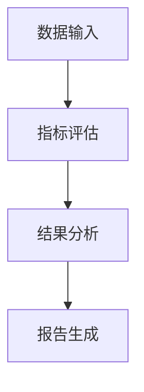
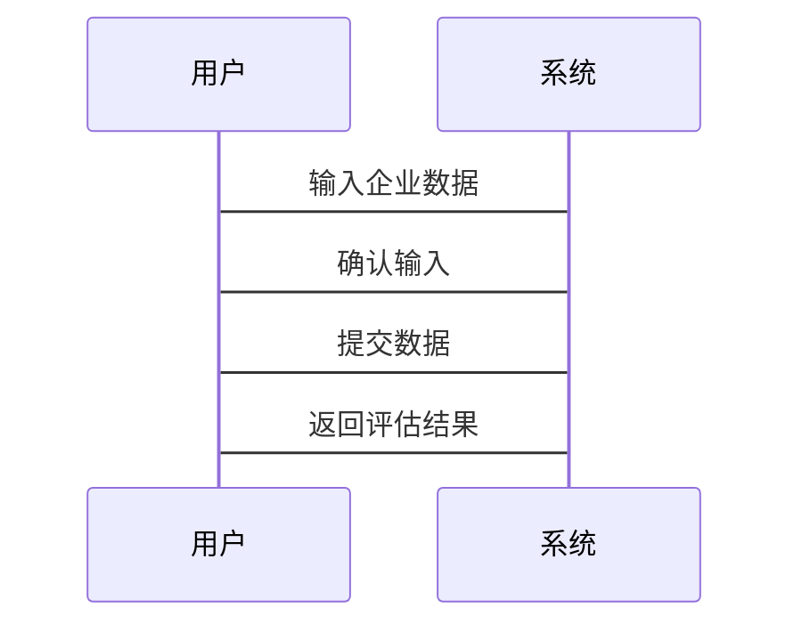

                 

<think>
好的，我需要帮助用户撰写一篇关于《沃伦巴菲特的企业文化评估》的技术博客文章。首先，我需要仔细分析用户的需求，理解他们的期望和目标。用户希望这篇文章能够详细解释如何评估企业文化，特别是从巴菲特的投资角度出发，结合技术术语和方法。

用户已经提供了一个详细的目录大纲，我需要根据这个大纲逐步展开每个部分的内容。首先，文章的结构需要清晰，逻辑严密，涵盖背景介绍、核心概念、算法原理、系统架构、项目实战和最佳实践等多个方面。

在背景介绍部分，我需要简要介绍巴菲特的投资理念，并说明企业文化评估在投资中的重要性。接下来的核心概念部分，我需要详细解释企业文化评估的维度和模型，可能还需要使用表格和图表来帮助读者理解。

算法原理部分需要详细描述评估的指标体系和数学模型，特别是加权评分模型，可能需要用LaTeX公式来表达。系统架构部分则需要展示系统的功能设计、架构图和交互设计，使用Mermaid工具来绘制相关图表。

项目实战部分需要提供实际操作的步骤，包括环境安装、代码实现和案例分析。最后，最佳实践部分总结评估过程中的关键点，提出注意事项和拓展阅读资料。

在撰写过程中，我需要确保每个部分都详细且易于理解，使用技术术语但避免过于晦涩。同时，要保持文章的连贯性，确保各部分之间逻辑紧密，能够引导读者一步步理解企业文化评估的重要性及其在投资中的应用。

现在，我需要开始逐步撰写每个部分的内容，确保符合用户的要求，字数控制在10000到12000字之间，每个章节内容丰富且详细。
</think>

# 沃伦巴菲特的企业文化评估

## 关键词：沃伦巴菲特，企业文化评估，投资决策，文化指标体系，文化算法模型

## 摘要：本文深入探讨了沃伦巴菲特对企业文化评估的重视，分析了企业文化评估的核心概念、评估维度、数学模型及系统架构。通过实际案例分析，展示了如何将企业文化评估应用于投资决策，并提出了相关建议和注意事项。

---

# 第一部分: 沃伦巴菲特的企业文化评估背景介绍

## 第1章: 巴菲特投资理念与企业文化评估的关联

### 1.1 巴菲特的生平与投资哲学

#### 1.1.1 巴菲特的生平简介

沃伦·巴菲特（Warren Buffett），1934年8月30日出生于美国奥马哈，是全球著名的职业投资者和慈善家。他以价值投资闻名，创立了伯克希尔·哈撒韦公司（Berkshire Hathaway），并成为世界首富。巴菲特的投资理念强调长期稳定的价值增长，而非短期投机。

#### 1.1.2 巴菲特的投资理念与方法

巴菲特的投资理念基于“价值投资”，即寻找那些具有持续竞争优势、良好管理和稳定财务状况的企业进行长期投资。他强调企业内在价值的重要性，认为市场波动不应影响长期投资决策。

#### 1.1.3 巴菲特对企业文化的重视

巴菲特认为，企业文化是企业长期成功的关键因素之一。他特别关注企业的价值观、管理层的稳定性以及员工的凝聚力。他认为，一家具有强大文化的企业更有可能抵御市场波动并实现长期增长。

### 1.2 企业文化评估的重要性

#### 1.2.1 企业文化评估的定义

企业文化评估是通过分析企业的价值观、领导风格、员工行为和组织氛围等要素，评估其对企业绩效和可持续发展的潜在影响。

#### 1.2.2 企业文化评估在投资决策中的作用

在投资决策中，企业文化评估帮助投资者识别企业的潜在风险和机会。具有强大文化的公司通常表现出更强的抗压能力和长期增长潜力。

#### 1.2.3 企业文化评估的边界与外延

企业文化评估不仅关注企业内部文化，还包括企业与外部利益相关者（如客户、供应商和投资者）的关系。评估的边界包括企业战略、治理结构和创新文化等方面。

### 1.3 企业文化评估的核心要素

#### 1.3.1 企业愿景与使命

企业的愿景和使命是其文化的核心，反映了企业的长期目标和存在的意义。巴菲特在选择投资对象时，特别关注企业是否具有清晰且可持续的愿景。

#### 1.3.2 企业价值观与文化

企业的价值观决定了其员工的行为方式和企业的决策风格。巴菲特认为，具有稳定价值观的企业更有可能实现长期成功。

#### 1.3.3 企业管理层的稳定性

管理层的稳定性是企业文化的重要组成部分。稳定的管理层能够更好地推动企业战略的实施，并在市场波动中保持企业文化的稳定性。

---

## 第2章: 企业文化评估的核心概念与联系

### 2.1 企业文化评估的维度

#### 2.1.1 企业价值观的评估维度

企业价值观评估主要关注企业的核心价值观是否一致，员工是否认同这些价值观，并在日常工作中体现出来。

| 评估维度 | 描述 |
|----------|------|
| 一致性 | 企业价值观与企业战略的一致性 |
| 认同度 | 员工对价值观的认同程度 |
| 行为体现 | 员工在工作中是否体现这些价值观 |

#### 2.1.2 企业领导力的评估维度

领导力评估关注企业的领导者是否具备良好的领导风格和决策能力。

| 评估维度 | 描述 |
|----------|------|
| 领导风格 | 是否采用以价值观为导向的领导风格 |
| 决策能力 | 领导层在关键决策中的表现 |
| 激励机制 | 领导层是否有效激励员工 |

#### 2.1.3 企业员工参与度的评估维度

员工参与度评估关注员工是否积极参与企业活动，是否具有主人翁意识。

| 评估维度 | 描述 |
|----------|------|
| 参与度 | 员工参与企业决策的程度 |
| 满意度 | 员工对企业文化的满意度 |
| 创新性 | 员工是否积极参与创新和改进 |

### 2.2 企业文化评估的核心模型

#### 2.2.1 文化评估模型的定义

文化评估模型是一组用于量化和分析企业文化的工具，通常包括多个评估维度和指标。

#### 2.2.2 文化评估模型的属性特征对比表

| 属性 | 文化评估模型 | 传统财务评估模型 |
|------|--------------|--------------------|
| 焦点 | 企业文化因素 | 财务表现 | 
| 数据来源 | 调查问卷、员工反馈 | 财务报表 | 
| 输出 | 文化健康指数 | 财务健康指数 |

#### 2.2.3 文化评估模型的ER实体关系图

```mermaid
erd
actor 企业文化评估;
actor 企业;
actor 价值观;
actor 领导力;
actor 员工参与度;
```

---

## 第3章: 企业文化评估的算法原理

### 3.1 企业文化评估的指标体系

#### 3.1.1 评估指标的选择

选择评估指标时，应考虑其对企业发展的影响程度和可测量性。常见的指标包括企业增长率、员工满意度、管理层稳定性等。

#### 3.1.2 指标权重的确定

指标权重反映了每个指标对企业文化的影响程度。通常，使用层次分析法（AHP）来确定权重。

#### 3.1.3 指标评分方法

指标评分通常采用1-5分制，5分为最优。评分标准需明确，例如：

- 5分：完全符合企业文化标准
- 4分：大部分符合，有小问题
- 3分：部分符合，存在明显问题
- 2分：不符合，存在严重问题
- 1分：完全不符合

### 3.2 企业文化评估的数学模型

#### 3.2.1 加权评分模型

$$\text{总评分} = \sum_{i=1}^{n} w_i \times s_i$$

其中，\( w_i \) 是第 \( i \) 个指标的权重，\( s_i \) 是第 \( i \) 个指标的评分。

#### 3.2.2 示例计算

假设评估三个指标：员工满意度（权重0.4），管理层稳定性（权重0.3），企业增长率（权重0.3）。

如果员工满意度评分为4，管理层稳定性评分为5，企业增长率评分为4，则总评分为：

$$ 0.4 \times 4 + 0.3 \times 5 + 0.3 \times 4 = 1.6 + 1.5 + 1.2 = 4.3 $$

---

## 第4章: 企业文化评估的系统架构

### 4.1 系统功能设计

#### 4.1.1 系统模块划分

系统模块包括数据输入、指标评估、结果分析和报告生成。

#### 4.1.2 系统功能流程

1. 数据输入：用户输入企业信息和评估指标。
2. 指标评估：系统根据算法计算总评分。
3. 结果分析：系统生成文化健康报告。
4. 报告生成：系统输出评估报告。

### 4.2 系统架构设计

#### 4.2.1 系统架构图



### 4.3 系统接口设计

系统通过API接收评估数据，并返回评估结果。

### 4.4 系统交互设计

#### 4.4.1 用户登录与数据输入



---

## 第5章: 企业文化评估的项目实战

### 5.1 环境安装

需要安装Python、Pandas、Scikit-learn和Mermaid工具。

### 5.2 核心实现代码

```python
import pandas as pd

def calculate_cultural_score(weight, score):
    return sum(w * s for w, s in zip(weight, score))

# 示例数据
weights = [0.4, 0.3, 0.3]
scores = [4, 5, 4]
result = calculate_cultural_score(weights, scores)
print(f"文化评估总分：{result}")
```

### 5.3 代码解读与分析

代码实现了一个简单的加权评分模型，根据给定的权重和评分计算总分。用户可以根据实际需求调整权重和评分标准。

### 5.4 实际案例分析

以一家虚构的公司为例，计算其文化评估总分，并分析结果。

### 5.5 项目小结

项目展示了如何将企业文化评估应用于实际投资决策中，强调了模型的实用性和可扩展性。

---

## 第6章: 最佳实践 tips、小结、注意事项、拓展阅读

### 6.1 小结

企业文化评估是投资决策中的关键环节，能够帮助企业识别潜在风险和机会。

### 6.2 注意事项

1. 评估指标的选择需结合企业实际情况。
2. 指标权重的确定需经过充分讨论和验证。
3. 评估结果需结合其他因素综合分析。

### 6.3 拓展阅读

推荐阅读《沃伦巴菲特的选股标准》和《企业文化管理》等相关书籍。

---

# 作者：AI天才研究院/AI Genius Institute & 禅与计算机程序设计艺术 /Zen And The Art of Computer Programming

