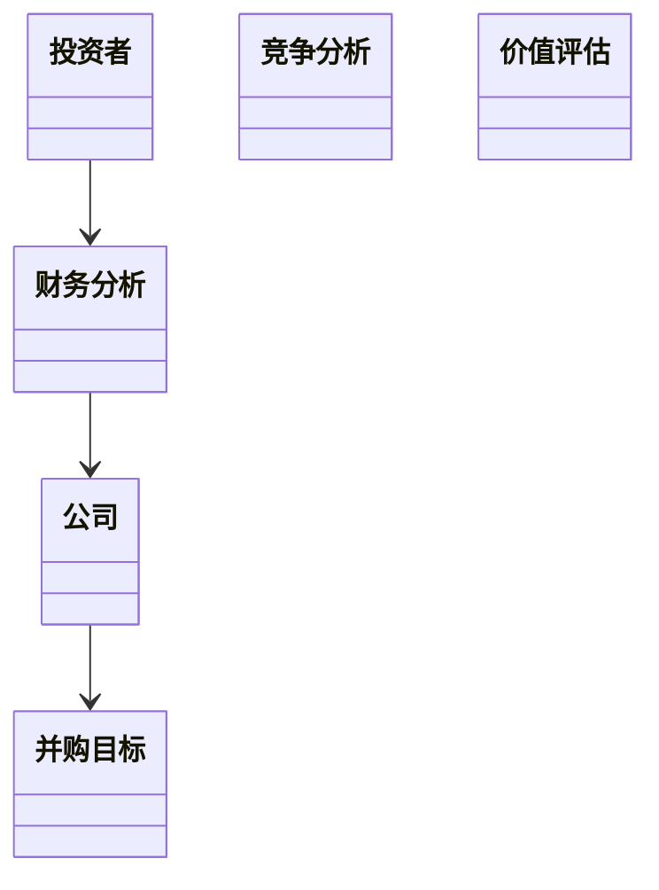
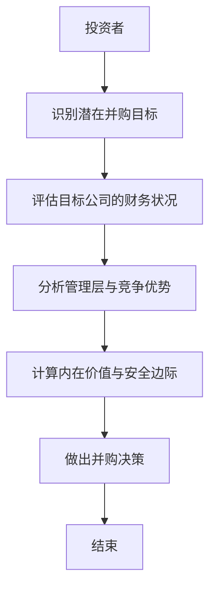
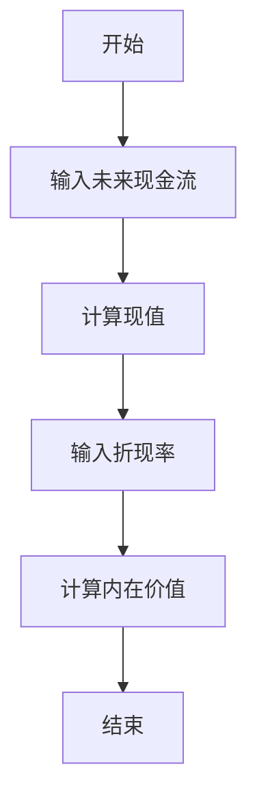

                 


# 沃伦巴菲特的并购策略分析

## 关键词：沃伦巴菲特，并购策略，投资哲学，安全边际，竞争优势，价值投资

## 摘要：本文深入分析了沃伦巴菲特的并购策略，从其核心概念、分析框架到实际案例，系统地探讨了巴菲特的投资哲学和成功秘诀。通过数学模型、流程图和案例分析，揭示了巴菲特并购策略的逻辑与本质。

---

## 第一部分：沃伦巴菲特并购策略的背景与核心概念

### 第1章：沃伦巴菲特并购策略的背景介绍

#### 1.1 沃伦巴菲特与并购策略概述

##### 1.1.1 沃伦巴菲特的生平与投资理念
沃伦·巴菲特（Warren Buffett）是全球最著名的投资者之一，他的投资哲学以价值投资为核心，强调寻找具有持续竞争优势的企业，并以合理的价格进行投资。巴菲特出生于1934年，毕业于哥伦比亚大学，师从本杰明·格雷厄姆（Benjamin Graham），形成了其独特的投资理念。

##### 1.1.2 并购在巴菲特投资组合中的重要性
并购是巴菲特投资策略的重要组成部分。他倾向于收购那些具有强大竞争优势、稳定的管理层和良好财务状况的企业。通过并购，巴菲特能够将这些优质资产整合到自己的投资组合中，实现长期稳定的收益。

##### 1.1.3 本文研究的核心问题与目标
本文的核心问题是：沃伦巴菲特的并购策略是什么？其背后的逻辑和数学模型是怎样的？通过分析巴菲特的并购策略，本文旨在为投资者提供一套可借鉴的投资框架，并揭示其成功的秘密。

---

#### 1.2 并购的基本概念与分类

##### 1.2.1 并购的定义与分类
并购（Mergers and Acquisitions, M&A）是指一家企业与其他企业合并或收购其股权、资产或业务的过程。根据合并双方的意愿，可以分为敌意并购和友好并购；根据合并后的企业结构，可以分为吸收合并和新设合并。

##### 1.2.2 并购的动机与驱动因素
企业进行并购的动机多种多样，包括扩大市场份额、获取技术优势、降低成本、 diversification（多元化）等。对于巴菲特而言，主要动机是寻找具有持续竞争优势的企业。

##### 1.2.3 并购的类型与特点对比
以下是并购的主要类型及其特点对比：

| 类型      | 特点                                                                 |
|-----------|----------------------------------------------------------------------|
| 同行业并购 | 扩大市场份额，增强竞争力                                           |
| 跨行业并购 | 实现多元化经营，分散风险                                           |
| 敌意并购   | 通常由目标企业不情愿接受，收购方采取强行收购策略               |
| 友好并购   | 双方自愿达成，过程较为顺利                                         |

---

#### 1.3 沃伦巴菲特并购策略的核心要素

##### 1.3.1 安全边际与内在价值
巴菲特的核心理念是寻找具有安全边际的投资机会，即以低于内在价值的价格买入优质资产。内在价值的计算公式为：

$$ 内在价值 = \frac{未来现金流的现值}{折现率} $$

##### 1.3.2 经济护城河与竞争优势
巴菲特特别关注企业的经济护城河，即企业能够长期保持竞争优势的屏障。例如，可口可乐的全球品牌影响力和分销网络就是其强大的经济护城河。

##### 1.3.3 企业价值评估与定价
巴菲特在并购时注重企业的基本面分析，包括财务状况、管理层素质和行业前景。他通常会使用市盈率（P/E）、市净率（P/B）等指标来评估企业的估值。

---

## 第2章：沃伦巴菲特并购策略的分析框架

### 2.1 沃伦巴菲特并购策略的数学模型

#### 2.1.1 企业价值的公式化表达
企业价值（EV）是衡量企业整体价值的重要指标，其计算公式为：

$$ EV = 企业价值 = 股东权益 + 长期负债 $$

#### 2.1.2 内在价值的计算方法
内在价值（IV）是巴菲特评估企业价值的核心指标，其计算公式为：

$$ IV = \frac{未来现金流的现值}{折现率} $$

#### 2.1.3 安全边际的计算
安全边际（MOE）是指买入价格与内在价值的差额，公式为：

$$ MOE = 内在价值 - 买入价格 $$

---

### 2.2 沃伦巴菲特并购策略的决策框架

#### 2.2.1 投资决策的三要素：管理层、业务、财务
巴菲特的投资决策基于以下三个要素：
1. **管理层**：管理层的诚信和能力是企业成功的关键。
2. **业务**：企业必须具有持续的竞争优势。
3. **财务**：企业必须具有稳定的财务状况和合理的估值。

#### 2.2.2 企业生命周期与并购机会
企业生命周期分为初创期、成长期、成熟期和衰退期。巴菲特倾向于投资处于成熟期的企业，因为这些企业具有稳定的现金流和较低的风险。

#### 2.2.3 并购的长期与短期价值评估
巴菲特注重企业的长期价值，而非短期市场波动。他通常会进行长期投资，避免频繁交易。

---

### 2.3 沃伦巴菲特并购策略的系统分析

#### 2.3.1 领域模型
以下是巴菲特并购策略的领域模型：



---

#### 2.3.2 系统架构设计
以下是巴菲特并购策略的系统架构图：



---

## 第三部分：沃伦巴菲特并购策略的系统分析与架构设计

### 第4章：并购策略的系统分析

#### 4.1 并购策略的系统功能设计

##### 4.1.1 领域模型
以下是并购策略的领域模型：


#### 4.2 并购策略的系统架构设计

##### 4.2.1 系统架构图
以下是并购策略的系统架构图：


#### 4.3 并购策略的数学模型与算法

##### 4.3.1 内在价值计算算法
以下是内在价值计算的流程图：



---

## 第五部分：项目实战

### 第5章：沃伦巴菲特并购策略的项目实战

#### 5.1 并购目标识别

##### 5.1.1 环境安装
需要安装以下工具：
- Python 3.9+
- Jupyter Notebook
- matplotlib
- pandas

##### 5.1.2 核心代码实现
以下是识别并购目标的代码示例：

```python
import pandas as pd
import matplotlib.pyplot as plt

# 假设我们有一个包含企业数据的DataFrame
df = pd.DataFrame({
    '公司名称': ['可口可乐', '吉列', 'IBM'],
    '市盈率': [15, 12, 18],
    '市净率': [3, 2, 4],
    'ROE': [15%, 18%, 12%]
})

# 计算内在价值
def calculate_intrinsic_value(df):
    # 假设折现率为10%
    df['内在价值'] = df['未来现金流现值'] / 0.10
    return df

# 可视化市盈率与市净率对比
plt.scatter(df['市盈率'], df['市净率'])
plt.xlabel('市盈率')
plt.ylabel('市净率')
plt.title('市盈率与市净率对比图')
plt.show()
```

##### 5.1.3 代码解读与分析
上述代码展示了如何利用Python进行企业估值分析。首先，我们从数据中筛选出具有较低市盈率和市净率的企业，然后计算其内在价值，并通过可视化工具进行对比分析。

---

## 结语

沃伦巴菲特的并购策略以其独特的投资哲学和数学模型为基础，通过深入分析企业的财务状况、管理层素质和行业前景，识别出具有持续竞争优势的企业。本文通过系统分析和案例研究，揭示了巴菲特并购策略的逻辑与本质。对于投资者而言，巴菲特的投资理念仍然具有重要的借鉴意义。

