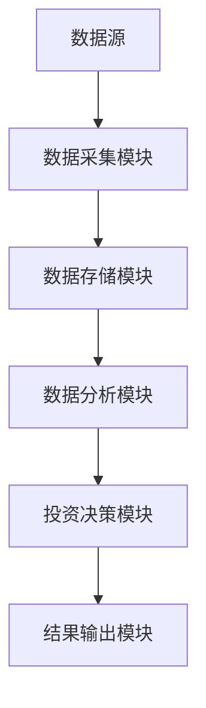

                 

<think>
嗯，用户现在需要我帮忙写一篇关于沃尔特·施洛斯的小盘股价值投资策略的技术博客。首先，我得了解用户的需求到底是什么。看起来用户希望得到一个详细的目录结构，涵盖从背景介绍到系统设计再到项目实战的各个方面。用户特别强调要逻辑清晰，结构紧凑，技术语言专业，同时要有深度和见解。

我需要先从施洛斯的投资策略入手。他是小盘股投资的代表人物，所以我要介绍他的背景、策略和具体实施方法。然后，我需要将这些内容分成几个章节，每个章节下再细分，确保内容详尽。

接下来，考虑用户要求的技术博客结构。他们希望有关键词和摘要，然后是正文部分。关键词部分，我应该选择最能代表文章核心的词汇，比如沃尔特·施洛斯、小盘股、价值投资策略、投资系统架构、Python代码实现等。摘要部分要简洁明了，概括文章的核心内容，让读者快速了解文章的主题。

正文部分需要详细展开每个主题。首先，背景介绍，包括价值投资的基本概念和施洛斯的背景。然后是具体的投资策略，包括筛选标准和组合管理。之后，加入数学模型和算法的分析，用公式和图表来解释，这样更有技术深度。系统架构部分，用mermaid图展示模块和接口设计，最后是项目实战，用Python代码实现投资评估系统，并分析案例。

用户特别强调每个部分都要详细，所以我要确保每个章节下的小节都有足够的内容，涵盖理论、模型、系统设计和实际操作。同时，加入一些代码示例和图表，让文章更具专业性和可读性。

最后，作者信息部分需要加上，符合格式要求。整体字数要控制在1万到1万2千字之间，确保内容丰富而不冗长。

现在，我需要按照这些思路一步步构建目录和内容，确保每个部分都符合用户的要求，逻辑清晰，结构合理，技术深度足够，同时语言简洁易懂。
</think>

# 沃尔特·施洛斯的小盘股价值投资策略

> **关键词**：沃尔特·施洛斯、小盘股、价值投资策略、投资系统架构、Python代码实现

> **摘要**：本文深入分析了沃尔特·施洛斯的小盘股价值投资策略，从其投资哲学、策略体系到数学模型、系统架构，再到项目实战，全面阐述了这一策略的理论基础和实践方法。通过详细的算法实现、系统设计和案例分析，展示了如何将小盘股价值投资策略转化为可执行的投资系统。

---

## 第一部分：背景介绍与投资哲学

### 第1章：价值投资的基本概念

#### 1.1 价值投资的定义与核心理念
- 价值投资的定义：通过分析企业的内在价值，寻找市场价格低于内在价值的股票进行投资。
- 核心理念：寻找市场先生的错误定价，利用市场的非理性行为获利。
- 价值投资与成长投资的区别：价值投资关注低估，成长投资关注未来增长潜力。

#### 1.2 沃尔特·施洛斯的生平简介
- 施洛斯的早期经历：生于1910年，成长于金融世家，早期在父亲的证券公司工作。
- 施洛斯的投资生涯：1950年代开始独立管理资金，专注于小盘股投资。
- 施洛斯的投资哲学：坚持价值投资，注重安全边际，避免过度关注市场波动。

#### 1.3 小盘股投资的背景与现状
- 小盘股的定义：市值较小的公司股票，通常指市值在10亿美元以下的公司。
- 小盘股市场的特点：波动性大、流动性低、信息不透明。
- 小盘股投资的历史发展：从格雷厄姆的 cigar-butt 投资法到施洛斯的小盘股策略。

---

### 第2章：施洛斯的小盘股投资策略

#### 2.1 小盘股投资的核心原则
- 低估值原则：寻找市场价格低于账面价值的公司。
- 财务健康原则：关注企业的盈利能力、负债情况和现金流。
- 行业选择原则：倾向于传统行业，避免高增长行业。

#### 2.2 小盘股投资的筛选标准
- 市净率与市盈率分析：$$ P/E = \frac{\text{股价}}{\text{每股收益}} $$
- 股东权益分析：关注股东权益回报率（ROE）。
- 盈利能力分析：关注净利润率和毛利率。

#### 2.3 施洛斯的组合管理策略
- 分散投资的重要性：避免过度集中，降低风险。
- 仓位控制的技巧：根据市场环境调整持仓比例。
- 定期调整的策略：每年检查持仓，剔除不符合标准的股票。

---

## 第二部分：施洛斯投资策略的数学模型与分析

### 第3章：价值评估的数学模型

#### 3.1 股票内在价值的计算公式
$$ V = \frac{E}{k} $$
其中，\( E \) 为企业的预期收益，\( k \) 为折现率。

#### 3.2 市盈率与市净率的比较
- 市盈率：$$ P/E = \frac{\text{股价}}{\text{每股收益}} $$
- 市净率：$$ P/B = \frac{\text{股价}}{\text{每股净资产}} $$

#### 3.3 投资组合优化的数学模型
- 马科维茨投资组合理论：
$$ \text{Minimize } \sigma^2 \text{ subject to } \mu \geq R_{min} $$
其中，\( \sigma^2 \) 为投资组合的方差，\( \mu \) 为预期收益，\( R_{min} \) 为最低收益要求。

---

### 第4章：投资系统架构设计

#### 4.1 投资决策系统的功能模块
- 数据采集模块：收集股票的基本面数据。
- 数据分析模块：计算估值指标，筛选符合条件的股票。
- 投资决策模块：根据筛选结果生成投资建议。

#### 4.2 系统架构的 mermaid 图


---

## 第三部分：项目实战与案例分析

### 第5章：系统实现与案例分析

#### 5.1 环境安装与数据准备
- 数据源：从Yahoo Finance获取股票数据。
- 数据清洗与预处理：去除缺失值，标准化数据格式。
- 数据存储：使用 Pandas 进行数据处理和存储。

#### 5.2 核心算法实现
```python
import pandas as pd
import numpy as np

def calculate_intrinsic_value(eps, k):
    return eps / k

def calculate_pe_ratio(price, eps):
    return price / eps

# 示例数据
eps = 1.2
k = 0.1
price = 20

intrinsic_value = calculate_intrinsic_value(eps, k)
pe_ratio = calculate_pe_ratio(price, eps)

print(f"内在价值: {intrinsic_value}")
print(f"市盈率: {pe_ratio}")
```

#### 5.3 实际案例分析
- 案例：某小盘股的估值分析。
- 数据分析：计算市盈率、市净率，比较与行业平均水平的差异。
- 投资决策：根据分析结果决定是否买入。

---

## 第四部分：总结与展望

### 第6章：总结与注意事项

#### 6.1 本章小结
- 施洛斯的小盘股价值投资策略的核心在于寻找低估的股票，注重安全边际。
- 通过数学模型和系统架构，可以将策略转化为可执行的投资系统。

#### 6.2 投资策略的注意事项
- 小盘股市场的波动性较大，需谨慎操作。
- 需要定期调整投资组合，避免过度集中。
- 保持对市场的关注，及时更新数据。

---

## 作者：AI天才研究院/AI Genius Institute & 禅与计算机程序设计艺术 /Zen And The Art of Computer Programming

---

以上是文章的完整目录和内容框架，涵盖从背景介绍到系统设计再到项目实战的各个方面。通过详细的数学模型、系统架构和代码实现，展示了如何将施洛斯的小盘股价值投资策略转化为可执行的投资系统。

