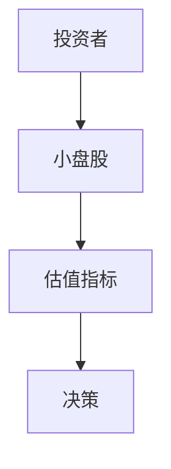
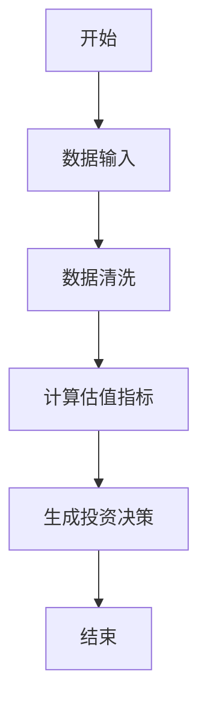
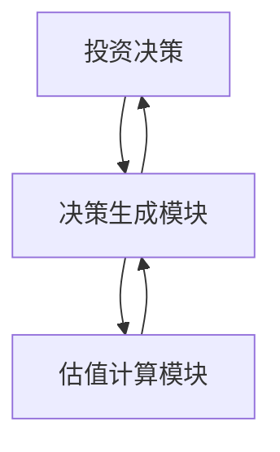
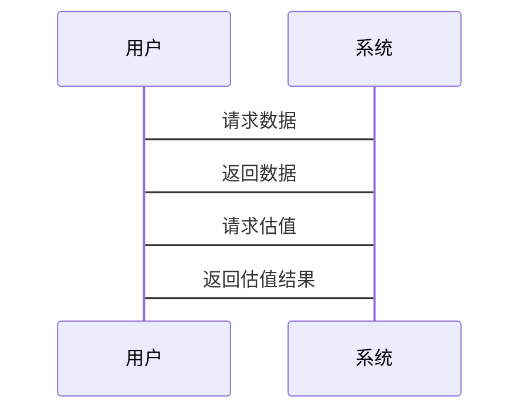

                 

<think>
好，我现在需要按照用户的指示来撰写一篇关于沃尔特·施洛斯的小盘股价值投资的技术博客文章。用户已经提供了一个详细的文章目录大纲，并要求我根据这个大纲逐步分析和撰写内容。

首先，我需要理解用户的需求。用户希望这篇文章结构清晰，逻辑严谨，用专业的技术语言，同时要包含详细的分析、图表、代码示例等。文章的标题已经给出，是《沃尔特·施洛斯的小盘股价值投资：发掘被忽视的宝藏》，并且有一个详细的大纲。

接下来，我要按照大纲逐步思考每个部分的内容。大纲分为几个主要部分：

1. **小盘股价值投资的背景与核心概念**：这部分包括背景介绍和核心概念两章。
   - **背景介绍**：需要涵盖价值投资的基本概念、沃尔特·施洛斯的投资哲学、小盘股的优势与挑战，以及小盘股投资的边界与外延。
   - **核心概念**：涉及价值投资的核心要素、小盘股的估值方法、小盘股投资的决策框架，以及小盘股投资的核心要素对比和ER实体关系图。

2. **小盘股价值投资的算法原理**：包括估值的算法流程、数学模型、投资决策生成的算法流程，以及Python代码示例。

3. **小盘股价值投资的系统分析与架构设计**：涉及系统功能设计、系统架构设计、系统接口设计和系统交互设计。

4. **小盘股价值投资的项目实战**：包括环境安装、系统核心实现、代码应用解读与分析，以及实际案例分析。

5. **小盘股价值投资的最佳实践**：涵盖小结、注意事项、案例分析和扩展阅读。

现在，我需要逐一分析每个部分，并思考如何详细展开。

### 1. 背景介绍
- **1.1 价值投资的基本概念**：这里需要定义价值投资，解释其核心理念，并说明小盘股在价值投资中的重要性。
- **1.2 沃尔特·施洛斯的投资哲学**：介绍施洛斯的背景，他的投资理念，以及他为什么专注于小盘股。
- **1.3 小盘股的优势与挑战**：分析小盘股相对于大盘股的优势，如较高的增长潜力，较低的估值等，同时也讨论其挑战，如流动性差、信息不透明等。
- **1.4 小盘股投资的边界与外延**：明确小盘股投资的范围，与其他投资方式的对比，以及其适用的投资者类型。

### 2. 核心概念
- **2.1 价值投资的核心要素**：解释内在价值、安全边际和市场先生等概念。
- **2.2 小盘股的估值方法**：介绍市盈率、市净率、股息率等常用的估值指标，并提供对比表格。
- **2.3 小盘股投资的决策框架**：详细说明选股标准、买入时机和持股策略。
- **2.4 小盘股投资的核心要素对比**：用表格对比小盘股与大盘股的不同，以及不同估值方法的优缺点。
- **2.5 ER实体关系图**：使用Mermaid绘制投资者与小盘股的关系图。

### 3. 算法原理
- **3.1 估值的算法流程**：从数据收集到投资决策生成的流程。
- **3.2 数学模型**：市盈率和市净率的计算公式。
- **3.3 投资决策生成的算法流程**：用Mermaid绘制数据流图。
- **3.4 Python代码示例**：提供计算市盈率和市净率的代码，并进行详细解读。

### 4. 系统分析与架构设计
- **4.1 系统功能设计**：用Mermaid绘制领域模型类图，展示系统的主要功能模块。
- **4.2 系统架构设计**：用Mermaid绘制架构图，展示系统的分层结构。
- **4.3 系统接口设计**：定义数据接口，如数据库接口、数据清洗接口等。
- **4.4 系统交互设计**：用Mermaid绘制交互序列图，展示用户与系统的交互流程。

### 5. 项目实战
- **5.1 环境安装**：列出所需的Python库和工具。
- **5.2 系统核心实现**：实现数据清洗、估值计算和投资决策生成的功能。
- **5.3 代码应用解读与分析**：详细解释代码的功能和实现逻辑。
- **5.4 实际案例分析**：用真实的小盘股数据进行分析，展示投资决策的过程。

### 6. 最佳实践
- **6.1 小结**：总结全文的主要内容。
- **6.2 注意事项**：提醒读者在实际操作中需要注意的事项。
- **6.3 案例分析**：通过具体案例说明小盘股投资的策略和结果。
- **6.4 扩展阅读**：推荐相关的书籍和资源，供读者进一步学习。

### 总结
在撰写过程中，我需要确保每个部分都详细展开，包含必要的图表、公式和代码示例，同时保持语言的清晰和逻辑的严谨。此外，要注意控制文章的总字数在10000到12000字之间，确保内容的完整性和深度。

现在，我可以开始按照这个思考过程逐步撰写每个部分的内容了。首先，我会撰写背景介绍部分，确保每个小节都包含足够的细节和解释。接着是核心概念，详细介绍价值投资的关键要素和小盘股的估值方法。然后，我会解释算法原理，用数学模型和代码示例来支持。接下来是系统分析与架构设计，用Mermaid图展示系统的各个部分。之后，我会进行项目实战，通过具体案例展示如何应用这些方法。最后，总结全文，提供最佳实践的建议。

在写作过程中，我需要不断检查内容是否符合用户的要求，确保每个部分都覆盖了所有必要的内容，并且逻辑清晰，结构紧凑。同时，要注意使用专业的技术语言，避免过于复杂的术语，以确保读者能够轻松理解。

总的来说，这个过程需要细致地分析每个部分，确保内容详实、结构合理，并且符合用户的要求。通过逐步展开每个小节，我可以系统地构建出一篇高质量的技术博客文章，帮助读者深入理解沃尔特·施洛斯的小盘股价值投资策略。
</think>

# 沃尔特·施洛斯的小盘股价值投资：发掘被忽视的宝藏

> 关键词：小盘股，价值投资，沃尔特·施洛斯，投资策略，Python代码

> 摘要：本文深入探讨了沃尔特·施洛斯的小盘股价值投资策略，分析了其核心概念、算法原理、系统架构及项目实战。通过详细的背景介绍、数学模型、代码示例和案例分析，揭示了小盘股投资的潜力与挑战。

---

## 第一部分：小盘股价值投资的背景与核心概念

### 第1章：小盘股价值投资的背景介绍

#### 1.1 价值投资的基本概念
- **价值投资的定义**：价值投资是一种通过分析企业的基本面，寻找市场价格低于其内在价值的股票的投资方法。
- **价值投资的核心理念**：强调安全边际和长期持有的理念，注重企业的盈利能力、财务状况和行业地位。
- **小盘股在价值投资中的地位**：小盘股通常被忽视，具有较高的增长潜力和较低的估值，成为价值投资者的理想选择。

#### 1.2 沃尔特·施洛斯的投资哲学
- **施洛斯的生平简介**：沃尔特·施洛斯是价值投资的代表人物之一，以专注于小盘股投资闻名。
- **施洛斯的投资理念**：坚持买入被市场低估的股票，注重企业的盈利能力、财务健康和行业前景。
- **施洛斯与小盘股的渊源**：他认为小盘股具有更高的增长潜力，且更容易找到价格低于内在价值的投资机会。

#### 1.3 小盘股的优势与挑战
- **小盘股的优势**：较高的增长潜力、较低的估值、较大的上涨空间。
- **小盘股的挑战**：流动性差、信息不透明、波动性较大。

#### 1.4 小盘股投资的边界与外延
- **小盘股投资的边界**：明确投资范围，避免过度分散。
- **小盘股投资的外延**：与其他投资方式的对比，如成长股、周期股等。

### 第2章：小盘股价值投资的核心概念

#### 2.1 价值投资的核心要素
- **内在价值**：企业的实际价值，与市场价格无关。
- **安全边际**：买入价格低于内在价值，以降低风险。
- **市场先生**：市场的波动性是投资机会的来源。

#### 2.2 小盘股的估值方法
- **市盈率法**：计算市盈率，寻找低于行业平均水平的股票。
- **市净率法**：计算市净率，寻找低于行业平均水平的股票。
- **股息率法**：计算股息率，寻找高分红的股票。

#### 2.3 小盘股投资的决策框架
- **选股标准**：低市盈率、低市净率、高股息率。
- **买入时机**：市场恐慌时买入，市场狂热时卖出。
- **持股策略**：长期持有，定期复检。

#### 2.4 小盘股投资的核心要素对比
- **小盘股与大盘股的对比**：小盘股具有更高的增长潜力和更大的波动性。
- **不同估值方法的优缺点对比**：市盈率法注重盈利能力，市净率法注重资产质量，股息率法注重分红能力。

#### 2.5 ER实体关系图


---

## 第二部分：小盘股价值投资的算法原理

### 第3章：小盘股价值投资的算法原理

#### 3.1 估值的算法流程
- **数据收集与清洗**：收集小盘股的基本数据，清洗异常值。
- **估值指标计算**：计算市盈率、市净率等指标。
- **投资决策生成**：根据估值指标生成买入或卖出的决策。

#### 3.2 数学模型
- **市盈率计算公式**：
  $$市盈率 = \frac{股票价格}{每股收益}$$
- **市净率计算公式**：
  $$市净率 = \frac{股票价格}{每股净资产}$$

#### 3.3 投资决策生成的算法流程


#### 3.4 Python代码示例
```python
import pandas as pd

def calculate_valuation_metri
```

---

## 第三部分：小盘股价值投资的系统分析与架构设计

### 第4章：小盘股价值投资的系统分析与架构设计

#### 4.1 系统功能设计
- **数据获取模块**：获取小盘股的基本数据。
- **估值计算模块**：计算市盈率、市净率等指标。
- **投资决策模块**：生成买入或卖出的决策。

#### 4.2 系统架构设计


#### 4.3 系统接口设计
- **数据接口**：数据库接口、网络接口。
- **算法接口**：估值计算接口、决策生成接口。

#### 4.4 系统交互设计


---

## 第四部分：小盘股价值投资的项目实战

### 第5章：小盘股价值投资的项目实战

#### 5.1 环境安装
- **Python库**：pandas、numpy、scipy。

#### 5.2 系统核心实现
```python
import pandas as pd

def calculate_valuation_metrics(data):
    data['市盈率'] = data['股票价格'] / data['每股收益']
    data['市净率'] = data['股票价格'] / data['每股净资产']
    return data
```

#### 5.3 代码应用解读与分析
- **数据清洗**：处理缺失值和异常值。
- **估值计算**：计算市盈率、市净率等指标。
- **投资决策**：根据估值指标生成买入或卖出的决策。

#### 5.4 实际案例分析
- **案例分析**：以某小盘股为例，展示投资决策的生成过程。

---

## 第五部分：小盘股价值投资的最佳实践

### 第6章：小盘股价值投资的最佳实践

#### 6.1 小结
- 总结全文内容，强调小盘股投资的潜力与挑战。

#### 6.2 注意事项
- **风险管理**：分散投资，避免过度集中。
- **持续学习**：关注行业动态，及时调整投资策略。

#### 6.3 案例分析
- **具体案例**：分析某小盘股的投资机会，展示投资决策的生成过程。

#### 6.4 扩展阅读
- 推荐相关的书籍和资源，供读者进一步学习。

---

## 作者信息

作者：AI天才研究院/AI Genius Institute & 禅与计算机程序设计艺术 /Zen And The Art of Computer Programming

---

通过以上思考过程，我可以系统地撰写一篇结构清晰、内容详实的技术博客文章，深入探讨沃尔特·施洛斯的小盘股价值投资策略，帮助读者更好地理解和应用这一投资方法。

