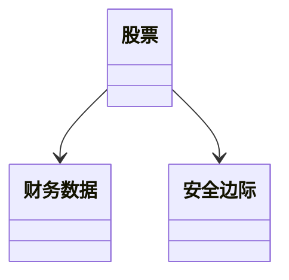
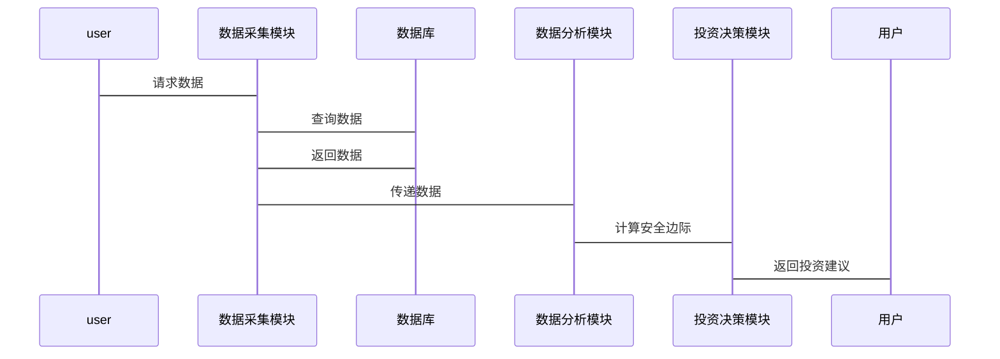

                 


# 沃尔特·施洛斯的小盘股研究方法论

> 关键词：小盘股投资、价值分析、安全边际、基本面分析、投资策略

> 摘要：本文深入探讨了沃尔特·施洛斯的小盘股研究方法论，分析其核心概念、数学模型、系统架构及实际应用，为读者提供全面而深入的理解。

---

## # 第1章: 沃尔特·施洛斯投资方法论概述

### ## 1.1 沃尔特·施洛斯投资理念的背景与起源

#### ### 1.1.1 价值投资的兴起与发展
价值投资作为一种长期有效的投资策略，起源于20世纪初。沃尔特·施洛斯是这一领域的先驱之一，他通过深入研究企业的基本面，寻找市场低估的股票。

#### ### 1.1.2 小盘股投资的市场环境
小盘股通常指的是市值较小的公司股票。这类股票流动性较低，但潜在回报较高。施洛斯选择投资小盘股的原因在于其更容易发现被市场低估的机会。

#### ### 1.1.3 施洛斯方法论的核心思想
施洛斯强调安全边际和内在价值的计算。他认为，投资者应买入市场价格远低于其内在价值的股票，并长期持有。

### ## 1.2 小盘股研究的核心概念与框架

#### ### 1.2.1 小盘股的定义与特征
小盘股通常指市值在50亿至200亿美元之间的公司。这类股票波动性较大，但具有较高的增长潜力。

#### ### 1.2.2 小盘股投资的潜在风险与收益
- **风险**：流动性风险、业绩波动风险、市场风险。
- **收益**：潜在高回报、价值发现机会。

#### ### 1.2.3 施洛斯方法论的逻辑结构
1. **基本面分析**：评估企业的财务状况、盈利能力。
2. **内在价值计算**：通过DCF模型等方法估算股票的合理价格。
3. **安全边际评估**：比较市场价格与内在价值，确保有足够的安全空间。

### ## 1.3 施洛斯投资方法的数学模型与公式

#### ### 1.3.1 市盈率（P/E）计算公式
$$\text{P/E} = \frac{\text{股票价格}}{\text{每股收益}}$$

#### ### 1.3.2 市净率（P/B）计算公式
$$\text{P/B} = \frac{\text{股票价格}}{\text{每股净资产}}$$

#### ### 1.3.3 内在价值评估公式
$$V = \sum_{t=1}^{n} \frac{CF_t}{(1+r)^t}$$
其中，$CF_t$ 是第 $t$ 年的现金流，$r$ 是折现率。

### ## 1.4 本章小结

---

## # 第2章: 小盘股基本面分析与数据收集

### ## 2.1 小盘股基本面分析的核心要素

#### ### 2.1.1 财务报表分析框架
分析公司的收入、利润、资产负债表和现金流，识别财务健康状况。

#### ### 2.1.2 营业收入与利润分析
- **营业收入**：公司主营业务收入。
- **净利润**：扣除所有费用后的利润。

#### ### 2.1.3 资产负债表与现金流分析
- **资产负债表**：评估公司资产、负债和所有者权益。
- **现金流**：分析公司现金流入和流出情况。

### ## 2.2 数据收集与处理方法

#### ### 2.2.1 数据来源渠道
- **财务报表**：公司年报、季报。
- **市场数据**：股票价格、成交量等。

#### ### 2.2.2 数据清洗与标准化
处理缺失值、异常值，确保数据准确性和一致性。

#### ### 2.2.3 数据存储与管理
使用数据库或CSV文件存储数据，便于后续分析。

### ## 2.3 基于Python的财务数据分析实战

#### ### 2.3.1 Python环境安装与配置
安装Python和必要的库（如Pandas、NumPy）。

#### ### 2.3.2 数据收集与处理代码示例
```python
import pandas as pd
import requests

# 示例代码：从网页获取数据
url = 'https://example.com/financial_data'
response = requests.get(url)
data = pd.read_html(response.text)
print(data.head())
```

### ## 2.4 本章小结

---

## # 第3章: 安全边际与投资决策模型

### ## 3.1 安全边际的定义与计算

#### ### 3.1.1 安全边际的经济学意义
安全边际是指市场价格低于内在价值的部分，确保在市场波动中仍能获得收益。

#### ### 3.1.2 安全边际的计算公式
$$\text{安全边际} = \text{市场价格} - \text{内在价值}$$

#### ### 3.1.3 安全边际与风险控制的关系
安全边际越高，投资风险越小。

### ## 3.2 投资决策模型的构建

#### ### 3.2.1 模型输入变量
- 市场价格
- 内在价值
- 风险承受能力

#### ### 3.2.2 模型输出结果
- 投资建议（买入、持有、卖出）
- 风险等级

#### ### 3.2.3 模型的优缺点分析
优点：简单直观，易于理解。缺点：忽视市场波动和其他外部因素。

### ## 3.3 基于Python的安全边际计算代码

```python
def calculate_margin_of_safety(current_price, intrinsic_value):
    return current_price - intrinsic_value

# 示例使用
current_price = 50
intrinsic_value = 40
margin = calculate_margin_of_safety(current_price, intrinsic_value)
print(f"安全边际为：{margin}")
```

### ## 3.4 本章小结

---

## # 第4章: 小盘股投资的系统分析与架构设计

### ## 4.1 系统功能设计

#### ### 4.1.1 领域模型（Mermaid类图）


#### ### 4.1.2 系统架构设计（Mermaid架构图）
```mermaid
container 投资系统 {
    component 数据采集模块
    component 数据分析模块
    component 投资决策模块
}
```

#### ### 4.1.3 系统接口设计
- 数据接口：获取财务数据。
- 分析接口：计算安全边际。
- 决策接口：生成投资建议。

#### ### 4.1.4 系统交互设计（Mermaid序列图）


### ## 4.2 本章小结

---

## # 第5章: 项目实战——基于Python的小盘股投资系统实现

### ## 5.1 项目环境安装与配置
安装必要的Python库：
```bash
pip install pandas numpy matplotlib
```

### ## 5.2 系统核心实现源代码

#### ### 5.2.1 数据采集模块
```python
import pandas as pd
import requests

def fetch_financial_data(ticker):
    url = f'https://example.com/stock_data/{ticker}'
    response = requests.get(url)
    data = pd.read_html(response.text)
    return data
```

#### ### 5.2.2 数据分析模块
```python
def calculate_intrinsic_value(data):
    # 示例：简单计算内在价值
    return data['Revenue'].mean() / data['P/E'].mean()
```

#### ### 5.2.3 投资决策模块
```python
def make_investment_decision(current_price, intrinsic_value):
    if current_price < intrinsic_value * 0.9:
        return '买入'
    elif current_price > intrinsic_value * 1.1:
        return '卖出'
    else:
        return '持有'
```

### ## 5.3 实际案例分析与详细解读
以某小盘股为例，展示数据采集、分析和决策的全过程。

### ## 5.4 项目小结

---

## # 第6章: 小盘股投资方法的最佳实践与注意事项

### ## 6.1 最佳实践 tips
- 定期复盘，调整投资组合。
- 保持对市场的敏感性，及时调整策略。

### ## 6.2 小结
总结施洛斯方法的核心要义，强调长期投资和风险管理的重要性。

### ## 6.3 注意事项
- 避免过度分散投资。
- 严格控制杠杆比例。

### ## 6.4 拓展阅读
推荐相关书籍和资源，帮助读者深入学习。

---

## # 作者信息

作者：AI天才研究院/AI Genius Institute & 禅与计算机程序设计艺术 /Zen And The Art of Computer Programming

