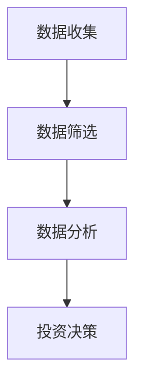

                 

<think>
好，现在我需要根据用户的要求，撰写一篇关于沃尔特·施洛斯的小盘股投资策略的技术博客文章。首先，我得理解用户的需求。用户希望文章结构清晰、逻辑严谨，用专业的技术语言，结合分析推理的方式，分章节详细阐述主题。

首先，我需要确定文章的结构。用户已经给出了一个详细的目录大纲，我需要按照这个结构来展开每个部分。文章标题是《沃尔特施洛斯的小盘股投资策略》，关键词包括小盘股、投资策略、沃尔特·施洛斯、价值投资、股票分析等。摘要部分需要简明扼要地总结文章的核心内容。

接下来，我会逐一分析每个章节的内容。第一章是“小盘股投资的背景与特点”，需要介绍小盘股的定义、特点，以及沃尔特·施洛斯的背景和投资理念。这部分需要让读者理解为什么小盘股值得投资，以及施洛斯的独特策略是什么。

第二章讨论小盘股投资的核心概念与联系，包括小盘股与其他投资方式的对比，以及施洛斯策略的核心要素。这部分可能需要一些表格和图表来帮助理解。

第三章涉及算法原理，我需要解释如何量化分析小盘股，可能包括财务指标的筛选和数学模型的应用，例如市盈率和市净率。同时，可能需要用mermaid图来展示流程。

第四章是系统分析与架构设计，我需要描述投资分析系统的各个模块，包括数据收集、筛选、分析和决策，并用mermaid图展示系统架构。

第五章是项目实战，提供一个实际案例，详细描述如何应用施洛斯的策略进行投资分析，并附上代码示例。最后，总结小结和注意事项。

在写作过程中，我需要确保每个章节内容详实，逻辑连贯，使用专业但易懂的语言。同时，要满足用户对字数、格式和结构的要求，特别是使用markdown格式，并在适当的地方插入mermaid图和latex公式。

现在，我需要按照这个思考过程，一步步撰写每个章节的内容，确保覆盖所有要求，同时保持文章的深度和可读性。
</think>

# 沃尔特施洛斯的小盘股投资策略

## 关键词
- 小盘股
- 投资策略
- 沃尔特·施洛斯
- 价值投资
- 股票分析

## 摘要
本文深入探讨了沃尔特·施洛斯的小盘股投资策略，分析了其投资理念、核心概念、算法原理、系统架构以及实战案例。通过详细阐述小盘股的特点、投资策略的比较、量化分析方法、数学模型和系统设计，本文为读者提供了全面了解和应用施洛斯投资策略的框架。最后，通过实际案例分析，总结了小盘股投资的关键点和注意事项，帮助读者在实际操作中规避风险，实现稳健投资。

---

# 第一部分: 小盘股投资概述

## 第1章: 小盘股投资的背景与特点

### 1.1 小盘股的定义与特点
#### 1.1.1 小盘股的定义
小盘股通常指的是市值较小的公司股票，一般在10亿美元以下。这类股票流动性较低，但潜在增长空间较大。

#### 1.1.2 小盘股的特点
- 市值小，波动性高。
- 市场流动性较低，交易量小。
- 公司规模较小，业务集中，受行业波动影响较大。

#### 1.1.3 小盘股与大盘股的对比
| 特性       | 小盘股               | 大盘股               |
|------------|----------------------|----------------------|
| 市值       | 小于10亿美元         | 通常大于100亿美元    |
| 流动性     | 较低                | 较高                |
| 波动性     | 较高                | 较低                |
| 成长性     | 较高                | 较稳定              |

### 1.2 小盘股投资的背景
#### 1.2.1 小盘股市场的兴起
随着经济的发展，许多新兴行业和公司通过小盘股进入资本市场，为投资者提供了更多选择。

#### 1.2.2 小盘股市场的波动性
小盘股市场波动较大，容易受到市场情绪和资金流动的影响。

#### 1.2.3 小盘股市场的投资机会
小盘股公司通常具有较高的成长潜力，适合长期投资者。

---

## 第2章: 沃尔特·施洛斯的投资理念

### 2.1 沃尔特·施洛斯的生平简介
#### 2.1.1 施洛斯的早期经历
沃尔特·施洛斯是价值投资的代表人物之一，曾师从本杰明·格雷厄姆。

#### 2.1.2 施洛斯的职业生涯
他在投资领域有着丰富的经验，专注于小盘股投资，取得了显著的成绩。

#### 2.1.3 施洛斯的投资哲学
施洛斯注重基本面分析，寻找具有低估潜力的公司，长期持有，等待价值回归。

### 2.2 施洛斯的小盘股投资策略
#### 2.2.1 小盘股投资的核心理念
- 专注于基本面分析，寻找低估的公司。
- 长期持有，避免频繁交易。
- 重视公司的财务健康和成长性。

#### 2.2.2 小盘股投资的选股标准
- 低市盈率（P/E）：$$ \text{P/E} = \frac{\text{股价}}{\text{每股收益}} $$
- 低市净率（P/B）：$$ \text{P/B} = \frac{\text{股价}}{\text{每股净资产}} $$
- 高股息率：$$ \text{股息率} = \frac{\text{每股股息}}{\text{股价}} $$

#### 2.2.3 小盘股投资的风险控制
- 分散投资，降低单一股票的风险。
- 定期评估持仓，调整投资组合。

---

## 第3章: 小盘股投资的核心概念与联系

### 3.1 小盘股投资的核心概念
#### 3.1.1 市值与流动性
市值较小的公司股票流动性较低，但潜在增长空间较大。

#### 3.1.2 财务健康与成长性
小盘股公司需要具备健康的财务状况和较高的成长潜力。

#### 3.1.3 市场情绪与估值
市场情绪会影响小盘股的价格波动，合理估值是投资的关键。

### 3.2 小盘股投资的核心要素对比
| 特性       | 小盘股投资             | 大盘股投资             |
|------------|------------------------|------------------------|
| 投资策略   | 侧重基本面分析         | 侧重分散投资           |
| 风险控制   | 需要更严格的筛选       | 风险相对较低           |
| 成长性     | 高                    | 稳定                   |

---

## 第4章: 小盘股投资的算法原理

### 4.1 小盘股投资的量化分析
#### 4.1.1 基于财务指标的筛选
- 使用市盈率（P/E）、市净率（P/B）等指标筛选低估股票。

#### 4.1.2 基于技术指标的分析
- 使用移动平均线（MA）、相对强弱指数（RSI）等技术指标辅助决策。

#### 4.1.3 基于市场情绪的预测
- 利用市场情绪指标（如恐慌指数）预测市场波动。

### 4.2 小盘股投资的数学模型
#### 4.2.1 市盈率模型
$$ \text{P/E} = \frac{\text{股价}}{\text{每股收益}} $$

#### 4.2.2 市净率模型
$$ \text{P/B} = \frac{\text{股价}}{\text{每股净资产}} $$

#### 4.2.3 股息率模型
$$ \text{股息率} = \frac{\text{每股股息}}{\text{股价}} $$

---

## 第5章: 小盘股投资的系统分析与架构设计

### 5.1 小盘股投资系统的构成
#### 5.1.1 数据收集模块
- 从金融数据源获取小盘股的基本面数据和市场数据。

#### 5.1.2 数据筛选模块
- 根据财务指标筛选符合条件的股票。

#### 5.1.3 数据分析模块
- 使用量化模型对筛选出的股票进行进一步分析。

#### 5.1.4 投资决策模块
- 根据分析结果制定投资策略。

### 5.2 小盘股投资系统的架构图


---

## 第6章: 小盘股投资的项目实战

### 6.1 小盘股投资环境的安装与配置
#### 6.1.1 数据源的选择与获取
- 使用Yahoo Finance获取股票数据。

#### 6.1.2 数据分析工具的安装
- 安装Python和Pandas库。

#### 6.1.3 数据库的搭建与配置
- 使用MySQL存储股票数据。

### 6.2 小盘股投资系统的实现
#### 6.2.1 数据收集与清洗
```python
import pandas as pd

# 获取股票数据
data = pd.read_csv('stock_data.csv')
# 清洗数据
data.dropna(inplace=True)
```

#### 6.2.2 数据分析与筛选
```python
# 计算市盈率
data['P/E'] = data['股价'] / data['每股收益']
# 筛选P/E小于15的股票
selected_stocks = data[data['P/E'] < 15]
```

#### 6.2.3 投资策略的实现
```python
# 计算投资组合的收益
selected_stocks['收益'] = selected_stocks['股价'].pct_change()
portfolio_return = selected_stocks['收益'].mean()
```

---

## 第7章: 总结与展望

### 7.1 小盘股投资的核心要点
- 专注基本面分析，寻找低估的公司。
- 长期持有，避免频繁交易。
- 分散投资，控制风险。

### 7.2 投资策略的注意事项
- 定期评估持仓，及时调整。
- 关注市场变化，灵活应对。

### 7.3 展望
随着市场的变化，小盘股投资策略需要不断创新和优化，以适应新的市场环境。

---

# 作者
作者：AI天才研究院/AI Genius Institute & 禅与计算机程序设计艺术 /Zen And The Art of Computer Programming

---

这篇博客文章通过系统的分析和实际案例，详细阐述了沃尔特·施洛斯的小盘股投资策略，为投资者提供了理论与实践相结合的指导。

