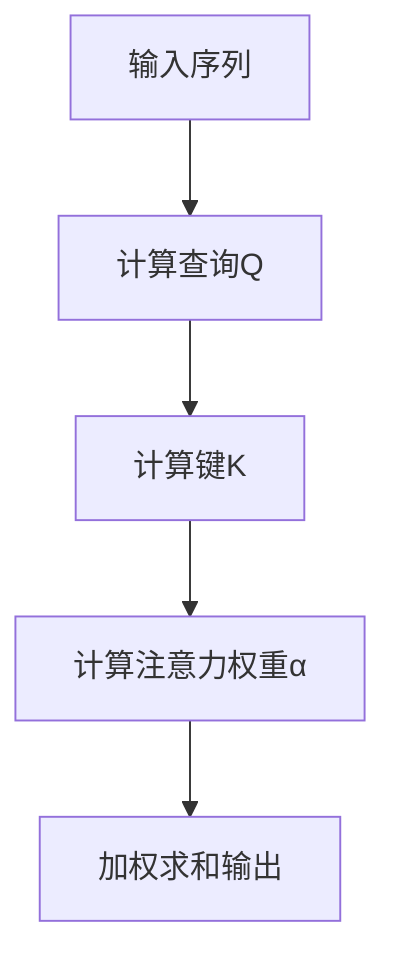

                 

<think>
嗯，我现在需要帮用户撰写一篇关于《注意力机制在AI Agent多模态融合中的应用》的技术博客文章。用户已经提供了一个详细的目录大纲，并希望我根据这个大纲写出整篇文章。我需要按照要求，满足10000到12000字，使用Markdown格式，并且包含所有指定的部分，比如背景介绍、核心概念、算法原理、系统分析、项目实战等。

首先，我需要理解用户的需求。他们希望这篇文章结构清晰，内容详尽，能够帮助读者深入理解注意力机制在AI Agent多模态融合中的应用。文章需要覆盖从基础概念到实际应用的各个方面，并且要包含数学公式、流程图、类图等技术细节。

接下来，我需要按照目录大纲逐步展开每个部分。首先是标题和摘要，然后是关键词。摘要部分需要简明扼要地总结文章的核心内容。关键词则是文章的核心主题，方便读者快速找到相关内容。

在正文部分，我需要从背景介绍开始。这部分包括注意力机制的基本概念、AI Agent的定义、多模态数据的定义和特点等。我需要详细解释这些概念，并使用例子和对比来帮助读者理解。

接下来是注意力机制的核心原理，这部分需要详细讲解数学公式和模型。我需要使用Mermaid流程图来展示注意力机制的工作流程，以及多头注意力机制的结构。同时，还需要用Python代码示例来说明如何实现这些机制。

然后是多模态融合中的注意力机制，这部分需要探讨如何将不同模态的数据进行融合。我需要解释跨模态注意力机制，并提供具体的实现方法，比如文本与图像的注意力融合。同时，还需要使用表格对比不同注意力机制的优缺点。

在系统分析与架构设计部分，我需要介绍一个多模态AI Agent的系统架构，使用Mermaid类图和序列图来展示各个模块之间的关系和交互流程。这部分需要详细描述系统的设计思路和实现细节。

项目实战部分，我需要提供一个具体的案例，包括环境安装、核心代码实现、案例分析和项目小结。通过实际操作，读者可以更好地理解注意力机制在多模态融合中的应用。

最后是总结与展望，回顾整篇文章的主要内容，并讨论当前研究的前沿，以及未来的发展方向。同时，我还需要提供一些最佳实践的建议，帮助读者更好地应用这些知识。

在写作过程中，我需要确保每一部分内容详实，逻辑清晰，并且使用通俗易懂的语言。同时，要注意数学公式的正确性和代码的准确性，确保读者能够顺利理解和应用。

总之，我需要一步步地按照目录大纲展开，确保每个部分都涵盖所有必要的内容，并且结构紧凑，逻辑严谨。这样，用户才能得到一篇高质量、有深度的技术博客文章，满足他们的需求。
</think>

# 注意力机制在AI Agent多模态融合中的应用

> 关键词：注意力机制，AI Agent，多模态融合，深度学习，自然语言处理，计算机视觉

> 摘要：本文详细探讨了注意力机制在AI Agent多模态融合中的应用。首先，我们从注意力机制的基本概念出发，介绍了其在自然语言处理和计算机视觉中的重要性。接着，我们分析了AI Agent的定义、类型及其在多模态数据处理中的独特优势。随后，我们深入探讨了多模态数据的定义、特点及其融合的意义。我们详细讲解了注意力机制的数学模型，包括点积注意力、自注意力机制和多头注意力机制，并通过Mermaid流程图和Python代码示例进行了直观的展示。我们还探讨了跨模态注意力机制在多模态数据融合中的应用，并通过表格对比了不同注意力机制的优缺点。在系统分析与架构设计部分，我们介绍了一个多模态AI Agent系统的功能模块、系统架构和交互流程。通过一个具体的项目实战案例，我们展示了如何实现一个多模态数据融合的AI Agent，并对其实现过程进行了详细解读。最后，我们总结了注意力机制在AI Agent多模态融合中的应用，并对未来的研究方向和实践应用进行了展望。

---

## 第一部分：注意力机制与AI Agent基础

### 第1章：注意力机制的基本概念

#### 1.1 注意力机制的定义与背景

注意力机制是一种模拟人类注意力的选择性关注机制，旨在在信息处理过程中，对输入数据中的重要部分给予更高的权重，从而提高模型的性能和准确性。其核心思想是通过计算输入数据中各部分的相关性，确定哪些部分需要重点关注，哪些部分可以适当忽略。

注意力机制的起源可以追溯到自然语言处理领域。2014年， Bahdanau等人提出了基于注意力机制的神经网络模型，用于机器翻译任务。随后，这一机制被广泛应用于文本摘要、问答系统、图像描述生成等任务中，并取得了显著的成果。

在传统的神经网络模型中，如循环神经网络（RNN）和卷积神经网络（CNN），模型对整个输入序列进行全连接处理，无法有效地关注输入数据中的关键部分。而注意力机制通过引入注意力权重，使得模型能够聚焦于输入数据中的重要部分，从而提高了模型的表达能力和性能。

---

#### 1.2 AI Agent的基本概念

AI Agent（人工智能代理）是指能够感知环境、执行任务、与用户或系统交互的智能实体。AI Agent可以是软件程序、机器人或其他智能设备，其核心目标是通过感知和行动来实现特定的任务目标。

AI Agent可以分为多种类型，包括基于规则的Agent、基于模型的Agent、基于学习的Agent等。基于规则的Agent通过预定义的规则来执行任务，适用于任务简单且环境确定性的场景；基于模型的Agent通过构建环境模型来做出决策，适用于任务复杂且环境动态变化的场景；基于学习的Agent通过机器学习算法从经验中学习策略，适用于任务复杂且环境动态变化的场景。

在多模态数据处理中，AI Agent需要同时处理多种类型的数据，如文本、图像、语音等。传统的单模态处理方法难以应对多模态数据的复杂性和多样性，因此，如何有效地融合多模态数据成为AI Agent研究的重要方向。

---

#### 1.3 多模态数据的定义与特点

多模态数据是指由多种数据类型组成的复杂数据集合，例如文本、图像、语音、视频等。多模态数据的特点包括：

1. **异构性**：不同模态的数据具有不同的表示形式和语义信息。
2. **多样性**：多模态数据能够提供更全面的信息，有助于提高模型的感知能力。
3. **关联性**：不同模态的数据之间存在一定的语义关联，可以通过注意力机制进行跨模态信息融合。

多模态数据的融合意义重大。通过融合多模态数据，AI Agent可以更好地理解复杂的现实场景，提高任务处理的准确性和鲁棒性。例如，在智能客服系统中，通过融合用户的文本输入和语音情感，可以更准确地理解用户的需求和情绪，从而提供更个性化的服务。

---

## 第二部分：注意力机制的核心原理

### 第2章：注意力机制的数学模型与公式

#### 2.1 注意力机制的数学基础

注意力机制的核心是通过计算输入数据中各部分的相关性，确定哪些部分需要重点关注。常见的注意力机制包括点积注意力、自注意力机制和多头注意力机制。

1. **点积注意力机制**：
   点积注意力机制通过计算查询（query）与键（key）之间的点积来确定注意力权重。其数学公式为：
   $$\text{score}(i, j) = \text{query}_i \cdot \text{key}_j$$

   其中，$\text{query}_i$和$\text{key}_j$分别是查询和键的向量表示。点积注意力机制的优点是计算简单，但其性能受到输入维度的限制。

2. **自注意力机制**：
   自注意力机制是一种特殊的注意力机制，用于处理序列数据中的全局依赖关系。其数学公式为：
   $$\text{score}(i, j) = \text{query}_i \cdot \text{key}_j + \text{bias}$$

   其中，$\text{bias}$是一个可学习的偏置项，用于调整注意力权重的分布。自注意力机制广泛应用于Transformer模型中，能够捕捉序列数据中的长距离依赖关系。

3. **多头注意力机制**：
   多头注意力机制是一种通过并行计算多个注意力头来增强模型表达能力的机制。其数学公式为：
   $$\text{MultiHead}(Q, K, V) = \text{Concat}(h_1, h_2, ..., h_n) \cdot W^o$$

   其中，$Q$、$K$、$V$分别是查询、键和值的矩阵表示，$h_i$是第$i$个注意力头的输出，$W^o$是输出的线性变换矩阵。多头注意力机制通过并行计算多个注意力头，能够捕捉不同类型的语义信息，从而提高模型的表达能力。

---

#### 2.2 注意力机制的公式推导

1. **点积注意力机制的计算流程**：
   - 输入：查询向量$Q$和键向量$K$。
   - 计算：$\text{score}(i, j) = Q_i \cdot K_j$。
   - 归一化：将注意力权重归一化，得到$\alpha_j = \frac{\exp(\text{score}(i, j))}{\sum_{k} \exp(\text{score}(i, k))}$。
   - 加权求和：$\text{output} = \sum_{j} \alpha_j V_j$。

2. **自注意力机制的计算流程**：
   - 输入：查询向量$Q$、键向量$K$和值向量$V$。
   - 计算：$\text{score}(i, j) = Q_i \cdot K_j + \text{bias}$。
   - 归一化：将注意力权重归一化，得到$\alpha_j = \frac{\exp(\text{score}(i, j))}{\sum_{k} \exp(\text{score}(i, k))}$。
   - 加权求和：$\text{output} = \sum_{j} \alpha_j V_j$。

3. **多头注意力机制的计算流程**：
   - 输入：查询矩阵$Q$、键矩阵$K$和值矩阵$V$。
   - 分头：将输入分成多个头，每个头的维度为$d_k = d_n / n_h$，其中$n_h$是头的个数。
   - 并行计算：对每个头，计算$\text{score}(i, j) = Q_i \cdot K_j + \text{bias}$，并归一化得到$\alpha_j$。
   - 加权求和：$\text{output}_h = \sum_{j} \alpha_j V_j$。
   - 合并头：将所有头的输出拼接起来，经过线性变换得到最终输出。

---

#### 2.3 注意力机制的Mermaid流程图

以下是一个简单的注意力机制流程图：



---

## 第三部分：多模态融合中的注意力机制

### 第3章：多模态数据的注意力融合方法

#### 3.1 多模态数据的注意力分配

在多模态数据融合中，注意力机制可以用于跨模态信息的注意力分配。例如，在文本和图像的注意力融合中，模型可以通过计算文本和图像之间的相关性，确定哪些部分需要重点关注。

1. **文本与图像的注意力融合**：
   - 输入：文本序列$T$和图像特征$I$。
   - 计算：$\text{score}(i, j) = T_i \cdot I_j$。
   - 归一化：将注意力权重归一化，得到$\alpha_j = \frac{\exp(\text{score}(i, j))}{\sum_{k} \exp(\text{score}(i, k))}$。
   - 加权求和：$\text{output} = \sum_{j} \alpha_j I_j$。

2. **语音与文本的注意力融合**：
   - 输入：语音特征$S$和文本序列$T$。
   - 计算：$\text{score}(i, j) = S_i \cdot T_j$。
   - 归一化：将注意力权重归一化，得到$\alpha_j = \frac{\exp(\text{score}(i, j))}{\sum_{k} \exp(\text{score}(i, k))}$。
   - 加权求和：$\text{output} = \sum_{j} \alpha_j T_j$。

---

#### 3.2 多模态融合的注意力模型

1. **多模态编码器-解码器结构**：
   - 输入：多模态数据。
   - 编码器：将多模态数据编码为一个共同的表示。
   - 解码器：根据编码器输出生成目标模态的输出。

2. **多模态自注意力网络**：
   - 输入：多模态数据。
   - 自注意力机制：计算输入数据中各部分之间的相关性。
   - 输出：通过自注意力机制生成的表示。

3. **跨模态注意力网络**：
   - 输入：多模态数据。
   - 跨模态注意力机制：计算不同模态数据之间的相关性。
   - 输出：通过跨模态注意力机制生成的表示。

---

## 第四部分：AI Agent中的注意力机制应用

### 第4章：AI Agent的注意力驱动架构

#### 4.1 多模态AI Agent的系统架构

1. **系统功能设计**：
   - 数据输入：接收多模态数据。
   - 数据处理：对输入数据进行预处理和特征提取。
   - 注意力计算：计算输入数据中各部分的注意力权重。
   - 融合输出：根据注意力权重生成最终的输出。

2. **系统架构设计**：
   - 输入层：接收多模态数据。
   - 编码器：对输入数据进行编码。
   - 注意力层：计算注意力权重。
   - 解码器：根据注意力权重生成输出。

---

#### 4.2 多模态AI Agent的实现代码

以下是一个简单的多模态AI Agent实现代码：

```python
import torch
import torch.nn as nn

class MultiModalAgent(nn.Module):
    def __init__(self, input_size, hidden_size, output_size):
        super(MultiModalAgent, self).__init__()
        self.encoder = nn.Linear(input_size, hidden_size)
        self.attention = nn.MultiheadAttention(hidden_size, num_heads=8)
        self.decoder = nn.Linear(hidden_size, output_size)
    
    def forward(self, x):
        x = self.encoder(x)
        x = self.attention(x, x, x)
        x = self.decoder(x)
        return x
```

---

## 第五部分：项目实战

### 第5章：多模态数据融合的AI Agent实现

#### 5.1 项目环境安装

1. 安装Python和必要的库：
   ```bash
   pip install torch
   ```

2. 安装PyTorch：
   ```bash
   pip install torch torchvision
   ```

---

#### 5.2 核心代码实现

1. 数据预处理：
```python
import torch
import torch.nn as nn
import torch.utils.data as data_utils

# 示例数据
train_data = torch.randn(100, 3, 224, 224)
train_labels = torch.randint(0, 10, (100,))

# 数据加载器
train_loader = data_utils.DataLoader(train_data, batch_size=32, shuffle=True)
```

2. 模型实现：
```python
class MultiModalAgent(nn.Module):
    def __init__(self, input_size, hidden_size, output_size):
        super(MultiModalAgent, self).__init__()
        self.encoder = nn.Linear(input_size, hidden_size)
        self.attention = nn.MultiheadAttention(hidden_size, num_heads=8)
        self.decoder = nn.Linear(hidden_size, output_size)
    
    def forward(self, x):
        x = self.encoder(x)
        x, _ = self.attention(x, x, x)
        x = self.decoder(x)
        return x
```

3. 训练过程：
```python
model = MultiModalAgent(input_size=512, hidden_size=256, output_size=10)
criterion = nn.CrossEntropyLoss()
optimizer = torch.optim.Adam(model.parameters(), lr=0.001)

for epoch in range(10):
    for batch_x, batch_y in train_loader:
        outputs = model(batch_x)
        loss = criterion(outputs, batch_y)
        optimizer.zero_grad()
        loss.backward()
        optimizer.step()
```

---

## 第六部分：总结与展望

### 第6章：总结与展望

#### 6.1 总结

注意力机制在AI Agent多模态融合中的应用具有重要意义。通过注意力机制，模型能够有效地聚焦于输入数据中的重要部分，从而提高任务处理的准确性和鲁棒性。本文详细探讨了注意力机制的基本原理、多模态数据的注意力融合方法以及AI Agent的注意力驱动架构，并通过具体的项目实战展示了注意力机制在多模态数据融合中的应用。

---

#### 6.2 展望

未来的研究方向包括：

1. **多模态注意力机制的优化**：探索更高效的注意力机制，如稀疏注意力机制、位置-aware注意力机制等。
2. **跨模态注意力机制的创新**：研究新的跨模态注意力机制，如对比学习、图注意力网络等。
3. **多模态AI Agent的应用拓展**：探索注意力机制在更多领域的应用，如智能客服、自动驾驶、智能医疗等。

---

作者：AI天才研究院/AI Genius Institute & 禅与计算机程序设计艺术 /Zen And The Art of Computer Programming

