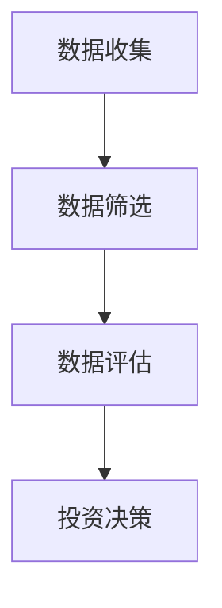

                 


# 深入解析价值投资理念：从格雷厄姆到巴菲特的演变

## 关键词
- 价值投资
- 格雷厄姆
- 巴菲特
- 股票分析
- 投资策略
- 内在价值

## 摘要
价值投资是一种经典的金融投资策略，其核心理念在于通过分析公司的基本面来寻找被低估的投资标的。本文将深入解析价值投资理念的演变过程，从格雷厄姆的经典理论到巴菲特的实际应用，探讨其背后的数学模型、系统架构和实际案例。通过系统化的分析框架和实战项目，读者将能够理解如何将价值投资理念应用于实际投资中，从而做出更明智的投资决策。

---

# 第1章 价值投资的背景与发展

## 1.1 价值投资的核心概念

### 1.1.1 投资学的基本概念
投资学是研究如何通过合理配置资金以实现财富增值的学科。价值投资作为一种长期有效的投资策略，强调从公司的基本面出发，寻找市场价格低于其内在价值的投资机会。

### 1.1.2 价值投资的定义与特点
价值投资是一种以低于公平价格购买优质资产的投资策略。其核心在于识别市场中被低估的股票，并长期持有，等待其价值回归。与短期交易相比，价值投资注重长期回报，强调安全边际和风险控制。

### 1.1.3 格雷厄姆与巴菲特的价值投资演变
格雷厄姆是价值投资的鼻祖，而巴菲特则是格雷厄姆理念的最佳实践者。格雷厄姆的“烟蒂投资”策略强调寻找市场价格远低于其清算价值的公司，而巴菲特则在此基础上引入了竞争优势、管理层能力和长期盈利能力等因素。

---

## 1.2 价值投资的核心要素

### 1.2.1 股票的内在价值
内在价值是股票在市场中公平的价格，通常由公司的盈利能力、成长潜力和财务状况决定。公式表示为：
$$ V = \frac{E}{(r - g) + 1} $$
其中，$E$为公司未来现金流的现值，$r$为折现率，$g$为现金流增长率。

### 1.2.2 安全边际的概念
安全边际是指市场价格与内在价值之间的差距，用以降低投资风险。公式表示为：
$$ M = V \times (1 - \frac{r}{100}) $$

### 1.2.3 财务报表分析的重要性
通过分析资产负债表、利润表和现金流量表，投资者可以评估公司的财务健康状况和盈利能力。例如，ROE（股东权益收益率）是衡量公司盈利能力的重要指标。

---

# 第2章 格雷厄姆的价值投资体系

## 2.1 格雷厄姆的投资理念

### 2.1.1 贝塔系数与阿尔法系数
贝塔系数衡量股票相对于市场的波动性，而阿尔法系数衡量股票超越市场指数的能力。公式表示为：
$$ \beta = \frac{Cov(r_i, r_m)}{Var(r_m)} $$

### 2.1.2 避免情绪化投资的重要性
格雷厄姆强调避免情绪化投资，理性分析是价值投资的核心。

### 2.1.3 价值投资中的防御性策略
防御性策略强调寻找具有安全边际的股票，以降低市场波动带来的风险。

---

## 2.2 格雷厄姆的数学模型

### 2.2.1 内在价值计算公式
格雷厄姆的内在价值公式：
$$ V = \frac{E}{1 + r} $$

### 2.2.2 安全边际的计算方法
安全边际公式：
$$ M = V \times (1 - \frac{r}{100}) $$

---

## 2.3 格雷厄姆策略的实际应用

### 2.3.1 低市盈率股票的选择
选择市盈率低于行业平均水平的股票。

### 2.3.2 高质量企业识别标准
选择具有稳定的盈利能力、健康的财务状况和较高的股东权益收益率的企业。

### 2.3.3 风险控制的具体措施
通过分散投资、设置止损点和定期复盘来控制风险。

---

# 第3章 巴菲特的投资策略与实践

## 3.1 巴菲特的投资理念

### 3.1.1 股东权益收益率的重要性
ROE（股东权益收益率）是衡量公司盈利能力的重要指标。

### 3.1.2 长期持有优质股票的策略
巴菲特强调长期持有优质股票，避免频繁交易。

### 3.1.3 投资中的安全边际原则
巴菲特的安全边际原则与格雷厄姆类似，但更注重企业的竞争优势和管理层能力。

---

## 3.2 巴菲特的数学模型

### 3.2.1 内在价值的扩展公式
巴菲特的内在价值公式：
$$ V = \frac{E}{(r - g) + 1} $$

### 3.2.2 时间价值对投资的影响
时间价值公式：
$$ FV = PV \times (1 + r)^n $$

---

## 3.3 巴菲特策略的实际应用

### 3.3.1 选择具有持续竞争优势的企业
寻找具有强大护城河的企业，如可口可乐和苹果。

### 3.3.2 高ROE企业的筛选标准
选择ROE持续高于行业平均水平的企业。

### 3.3.3 风险控制的具体措施
通过分散投资、定期复盘和关注管理层质量来控制风险。

---

## 3.4 巴菲特投资理念的演变

### 3.4.1 从格雷厄姆的“烟蒂投资”到巴菲特的“竞争优势”
巴菲特在格雷厄姆的基础上，引入了企业竞争优势和长期盈利能力的分析。

### 3.4.2 巴菲特投资理念的现代应用
巴菲特的理念在现代金融市场的变化中依然有效，但需要结合新的经济环境和市场特点。

---

# 第4章 价值投资的系统分析与架构设计

## 4.1 价值投资的系统架构

### 4.1.1 系统功能设计
- 数据收集模块：收集企业的财务数据和市场数据。
- 数据筛选模块：通过ROE、市盈率等指标筛选潜在投资标的。
- 数据评估模块：计算内在价值和安全边际。
- 投资决策模块：根据评估结果制定投资策略。

### 4.1.2 系统架构设计
使用Mermaid图展示系统架构：



---

## 4.2 价值投资的算法实现

### 4.2.1 数据分析算法
使用Python对财务数据进行清洗和分析：

```python
import pandas as pd
import numpy as np

# 读取财务数据
df = pd.read_csv('financial_data.csv')

# 计算ROE
df['ROE'] = df['净利润'] / df['股东权益']
```

### 4.2.2 安全边际计算算法
计算安全边际：

```python
def calculate_margin(V, r):
    return V * (1 - r/100)
```

---

## 4.3 价值投资的系统实现

### 4.3.1 环境安装
安装必要的Python库：

```bash
pip install pandas numpy matplotlib
```

### 4.3.2 核心实现代码
实现内在价值计算：

```python
def calculate_intrinsic_value(E, r, g):
    return E / (r - g + 1)
```

---

## 4.4 项目实战与案例分析

### 4.4.1 实际案例分析
以苹果公司为例，计算其内在价值和安全边际。

### 4.4.2 投资组合优化
通过分散投资优化投资组合的风险和收益。

---

## 4.5 项目小结

### 4.5.1 最佳实践 tips
- 定期复盘和调整投资组合。
- 选择具有长期竞争优势的企业。
- 保持理性，避免情绪化投资。

### 4.5.2 注意事项
- 风险控制是投资成功的关键。
- 需要结合市场环境动态调整策略。

### 4.5.3 拓展阅读
推荐阅读《聪明的投资者》和《巴菲特传》。

---

# 第5章 价值投资的未来展望

## 5.1 价值投资的现代应用
现代价值投资需要结合大数据分析和机器学习技术。

## 5.2 人工智能在价值投资中的潜力
人工智能可以帮助投资者更高效地分析数据和发现投资机会。

## 5.3 价值投资的长期展望
价值投资作为一种长期有效的策略，将在未来的金融市场中继续发挥重要作用。

---

# 作者
作者：AI天才研究院/AI Genius Institute  
联系方式：contact@aigeniusinstitute.com  
个人简介：专注于人工智能与计算机科学的交叉研究，致力于通过技术手段深入分析和优化投资策略，帮助投资者实现长期稳健的财富增长。

