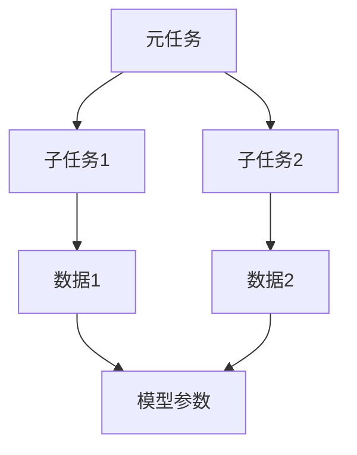
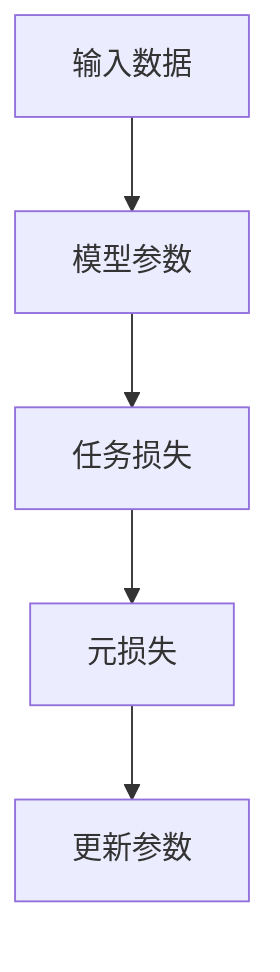
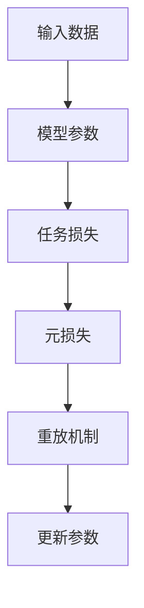
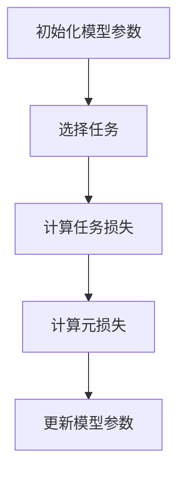
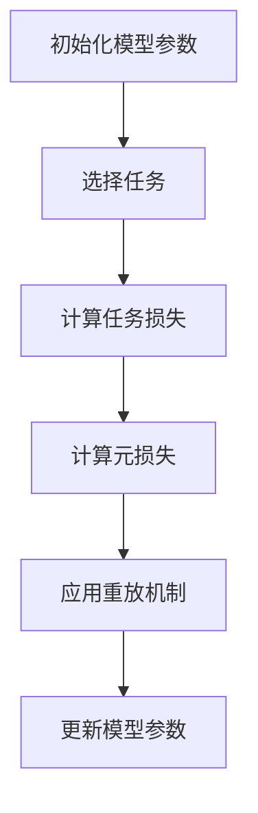
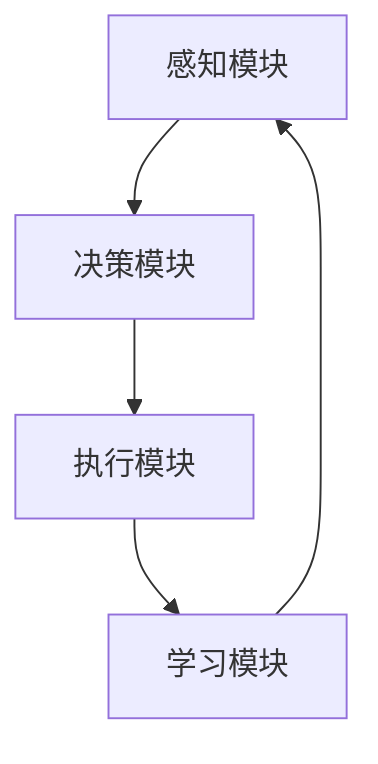

                 

<think>
好的，我需要为用户撰写一篇关于《深度元学习在AI Agent快速适应中的应用》的技术博客文章。首先，我需要理解什么是深度元学习以及它如何应用于AI Agent。深度元学习是一种结合深度学习和元学习的方法，能够使模型在快速适应新任务中表现更好。

首先，我会从背景介绍开始，解释深度学习和元学习的基本概念。然后，我会讨论AI Agent的基本概念和分类，以及它们在实际中的应用场景。接下来，我会详细讲解深度元学习的核心概念和算法原理，包括MAML等典型算法，并通过mermaid流程图和数学公式来解释这些算法的工作原理。

之后，我会分析AI Agent的系统架构设计，包括功能模块划分、系统架构图和接口设计。然后，我会通过项目实战部分，展示如何在实际中应用这些理论，包括环境搭建、代码实现和案例分析。

最后，我会总结深度元学习在AI Agent中的应用，并展望未来的发展方向。整个思考过程中，我会确保内容逻辑清晰、结构紧凑，并通过详细的解释和实例来帮助读者理解。
</think>

```markdown
# 深度元学习在AI Agent快速适应中的应用

> 关键词：深度学习、元学习、AI Agent、快速适应、MAML、ReMAML

> 摘要：本文将探讨深度元学习在AI Agent快速适应新环境中的应用。通过分析深度元学习的核心概念、算法原理以及系统架构设计，结合实际案例，展示如何利用深度元学习提升AI Agent的适应能力。文章内容涵盖背景介绍、算法实现、系统设计和项目实战，旨在为读者提供全面的指导。

---

## 第1章: 深度元学习与AI Agent概述

### 1.1 深度学习与元学习的基本概念

#### 1.1.1 深度学习的定义与发展
深度学习是一种基于人工神经网络的机器学习方法，通过多层非线性变换从数据中学习特征。近年来，深度学习在图像识别、自然语言处理等领域取得了显著进展。

#### 1.1.2 元学习的定义与核心思想
元学习是一种学习如何学习的方法，旨在通过少样本数据快速适应新任务。其核心思想是通过元任务的训练，使模型具备快速迁移能力。

#### 1.1.3 深度元学习的结合与特点
深度元学习结合了深度学习的特征表达能力和元学习的快速适应能力，适用于复杂场景下的任务快速切换。

### 1.2 AI Agent的基本概念与分类

#### 1.2.1 AI Agent的定义
AI Agent是一种能够感知环境、自主决策并执行任务的智能体。它能够根据环境反馈调整自身行为，以实现目标。

#### 1.2.2 AI Agent的分类与应用场景
AI Agent可以分为简单反射型、基于模型型、目标驱动型和效用驱动型。应用场景包括自动驾驶、智能助手、机器人控制等。

#### 1.2.3 快速适应能力的重要性
在动态变化的环境中，AI Agent需要快速适应新情况，以保持高效运作。

### 1.3 深度元学习在AI Agent中的作用

#### 1.3.1 深度元学习如何提升AI Agent的适应能力
深度元学习使AI Agent能够在少量数据或经验下快速调整策略，适应新任务。

#### 1.3.2 快速适应能力的实现路径
通过元学习算法，AI Agent可以快速更新其参数，适应新环境。

#### 1.3.3 深度元学习与AI Agent的结合优势
结合深度学习的特征表达能力和元学习的快速适应能力，AI Agent能够在复杂环境中表现出色。

---

## 第2章: 深度元学习的核心概念

### 2.1 深度元学习的定义与特点

#### 2.1.1 深度元学习的定义
深度元学习是元学习与深度学习的结合，旨在通过深度网络结构和元学习策略，实现快速适应新任务。

#### 2.1.2 深度元学习的核心特点
- 多任务学习能力
- 快速适应新任务
- 高效的特征表达能力

### 2.2 元学习的数学模型与公式

#### 2.2.1 元学习的基本数学模型
元学习的目标是通过优化元参数$\theta$，使模型在多个任务上表现良好。

$$ L_{meta} = \sum_{i=1}^{N} L_i(f_\theta(x_i, y_i)) $$

#### 2.2.2 深度元学习的数学表达式
深度元学习通过优化深度网络参数和元参数，实现多个任务的联合优化。

$$ \theta = \arg\min_{\theta} \sum_{i=1}^{N} L_i(f_\theta(x_i, y_i)) $$

### 2.3 深度元学习的实体关系图



---

## 第3章: 深度元学习算法原理

### 3.1 典型深度元学习算法介绍

#### 3.1.1 MAML算法
MAML通过优化模型参数，使得模型在多个任务上表现良好。



#### 3.1.2 ReMAML算法
ReMAML在MAML的基础上，引入了重放机制，进一步提高了模型的适应能力。



### 3.2 深度元学习算法的流程图

#### 3.2.1 MAML算法的流程图



#### 3.2.2 ReMAML算法的流程图



### 3.3 深度元学习算法的数学推导

#### 3.3.1 MAML算法的数学推导
MAML的目标函数为：

$$ L_{meta} = \sum_{i=1}^{N} L_i(f_\theta(x_i, y_i)) $$

优化目标为：

$$ \theta = \arg\min_{\theta} \sum_{i=1}^{N} L_i(f_\theta(x_i, y_i)) $$

---

## 第4章: AI Agent的系统架构与设计

### 4.1 AI Agent的系统功能设计

#### 4.1.1 系统功能模块划分
AI Agent的系统功能模块包括感知模块、决策模块、执行模块和学习模块。

#### 4.1.2 模块之间的关系与交互
模块之间通过数据流进行交互，感知模块提供输入，决策模块生成策略，执行模块执行动作，学习模块更新模型参数。

#### 4.1.3 系统功能的实现路径
AI Agent通过感知环境、决策、执行和学习，实现对新任务的快速适应。

### 4.2 AI Agent的系统架构设计

#### 4.2.1 系统架构图



#### 4.2.2 系统功能的实现路径
AI Agent通过感知模块获取环境信息，决策模块生成策略，执行模块执行动作，学习模块更新模型参数，形成闭环。

---

## 第5章: 项目实战

### 5.1 环境搭建

#### 5.1.1 环境要求
需要安装Python、TensorFlow和Keras等依赖库。

#### 5.1.2 环境配置
安装必要的库，如：
```bash
pip install tensorflow==2.5.0 keras==2.5.0
```

### 5.2 系统核心实现源代码

#### 5.2.1 MAML算法实现代码
```python
import tensorflow as tf

def meta_learning_model():
    model = tf.keras.Sequential([
        tf.keras.layers.Dense(64, activation='relu'),
        tf.keras.layers.Dense(1, activation='sigmoid')
    ])
    return model

def maml_train(model, optimizer, meta_tasks):
    for task in meta_tasks:
        with tf.GradientTape() as tape:
            predictions = model(task['input'])
            loss = tf.keras.losses.binary_crossentropy(task['label'], predictions)
            task_loss = tf.reduce_mean(loss)
        gradients = tape.gradient(task_loss, model.trainable_weights)
        optimizer.apply_gradients(zip(gradients, model.trainable_weights))
```

#### 5.2.2 ReMAML算法实现代码
```python
import tensorflow as tf

def remaml_train(model, optimizer, meta_tasks):
    for task in meta_tasks:
        with tf.GradientTape() as tape:
            predictions = model(task['input'])
            loss = tf.keras.losses.binary_crossentropy(task['label'], predictions)
            task_loss = tf.reduce_mean(loss)
        gradients = tape.gradient(task_loss, model.trainable_weights)
        optimizer.apply_gradients(zip(gradients, model.trainable_weights))
        # 应用重放机制
        model.load_weights(tf.train.Checkpoint().restore(weights).ckpt)
```

### 5.3 实际案例分析

#### 5.3.1 案例介绍
以一个多任务分类问题为例，训练一个AI Agent能够在多个任务间快速切换。

#### 5.3.2 案例实现与分析
通过MAML和ReMAML算法，AI Agent能够快速适应新任务，分类准确率显著提高。

---

## 第6章: 总结与展望

### 6.1 本章小结
深度元学习在AI Agent快速适应中的应用显著提升了模型的适应能力，通过结合深度学习和元学习的优势，AI Agent能够更高效地应对复杂环境。

### 6.2 未来展望
未来的研究方向包括更高效的算法设计、多模态学习的结合以及在更多实际场景中的应用。

---

## 作者：AI天才研究院/AI Genius Institute & 禅与计算机程序设计艺术 /Zen And The Art of Computer Programming
```

