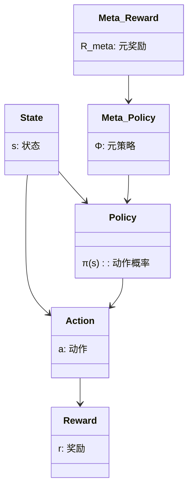
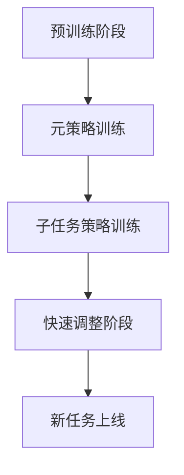
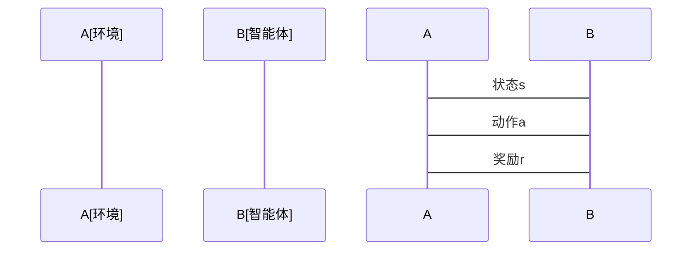

                 

<think>
好的，我现在需要帮用户撰写一篇关于《深度元强化学习在AI Agent策略适应中的应用》的技术博客文章。用户已经提供了详细的大纲，我需要根据这个大纲一步步进行分析和撰写。

首先，我需要理解用户的需求。用户希望文章结构清晰，逻辑严谨，内容专业，涵盖背景、核心概念、算法原理、系统架构、项目实战等多个部分。同时，用户强调要使用专业术语，但又要通俗易懂，适合技术博客读者。

接下来，我需要按照用户提供的大纲逐步展开每个部分。首先是标题和关键词，然后是摘要，之后是各个章节的内容。每个章节需要包含详细的内容，比如定义、原理、对比、数学模型、代码示例等。

在撰写过程中，我要确保每个部分都涵盖必要的细节，比如在算法原理部分，需要解释DQN和PPO等算法，并用mermaid图展示流程。同时，数学公式要用latex格式，确保正确无误。

此外，用户要求文章末尾有作者信息，因此我需要在最后加上作者信息。整个文章需要保持在10000到12000字之间，因此我需要合理安排每个部分的篇幅，确保内容详实而不冗长。

在思考过程中，我需要反复检查是否符合用户的要求，确保每个部分都覆盖到位，没有遗漏。同时，语言要专业但不失易懂，避免过于晦涩。

综上所述，我需要一步步按照用户提供的大纲撰写，确保每个部分都详细且符合要求，最终产出一篇高质量的技术博客文章。
</think>

# 深度元强化学习在AI Agent策略适应中的应用

> 关键词：深度元强化学习、AI Agent、策略适应、强化学习、元学习

> 摘要：深度元强化学习（Deep Meta Reinforcement Learning，简称DmRL）是一种结合了元学习和深度强化学习的新兴技术，在AI Agent策略适应中具有广泛的应用潜力。本文系统地介绍了深度元强化学习的基本概念、核心原理、算法框架以及其在AI Agent中的具体应用，深入分析了其在策略适应中的优势和挑战，并通过实际案例展示了深度元强化学习在AI Agent中的应用效果。

---

## 第一部分: 深度元强化学习背景与基础

### 第1章: 强化学习概述

#### 1.1 强化学习的基本概念

**1.1.1 什么是强化学习**

强化学习（Reinforcement Learning, RL）是一种机器学习范式，其中智能体通过与环境交互来学习策略，以最大化累计奖励。智能体通过试错的方式，从环境中获得反馈（奖励或惩罚），并根据反馈调整自己的行为以达到目标。

**1.1.2 强化学习的核心要素**

- **状态（State）**：智能体所处的环境状态。
- **动作（Action）**：智能体在给定状态下选择的动作。
- **奖励（Reward）**：智能体执行动作后获得的反馈，用于评估动作的好坏。
- **策略（Policy）**：智能体选择动作的规则，可以是确定性的或概率性的。
- **值函数（Value Function）**：评估某个状态或状态-动作对的长期回报。

**1.1.3 强化学习的应用场景**

- 游戏AI（如AlphaGo、AlphaZero）
- 机器人控制
- 自动驾驶
- 自然语言处理（如对话系统）

#### 1.2 深度强化学习的发展

**1.2.1 深度强化学习的起源**

深度强化学习（Deep RL）是强化学习与深度学习的结合，通过神经网络来逼近值函数或策略。深度强化学习的突破性进展始于2015年的DeepMind论文《Playing Atari Games Using Deep Reinforcement Learning》。

**1.2.2 深度强化学习的关键技术**

- DQN（Deep Q-Network）：通过神经网络近似Q值函数。
- PPO（Proximal Policy Optimization）：通过优化策略的连续性来避免策略漂移。
- A3C（Asynchronous Advantage Actor-Critic）：通过多线程异步训练加速收敛。

**1.2.3 深度强化学习的最新进展**

- 使用Transformer结构进行策略优化（如用于复杂环境中的多步决策）。
- 结合视觉感知的强化学习（如应用于机器人视觉任务）。
- 多智能体强化学习（如分布式训练和协作决策）。

---

### 第2章: 元强化学习的基本概念

#### 2.1 元强化学习的定义

**2.1.1 元学习的定义**

元学习（Meta-Learning）是一种学习方法，使得模型能够快速适应新的任务，而不需要从头开始训练。它通过在多个任务上预训练，使得模型具备迁移学习的能力。

**2.1.2 元强化学习的定义**

元强化学习（Meta Reinforcement Learning）是元学习与强化学习的结合，目标是通过在多个任务上的预训练，使得智能体能够快速适应新的环境或任务。

**2.1.3 元强化学习的核心思想**

- **任务多样性**：在多个不同任务上进行预训练。
- **快速适应**：在新任务上线时，能够快速调整策略。
- **元策略**：用于指导子任务策略的选择和优化。

#### 2.2 元强化学习与传统强化学习的对比

**2.2.1 传统强化学习的局限性**

- **样本效率低**：需要大量的环境交互才能学习有效的策略。
- **适应性差**：在新环境中需要重新训练，无法快速适应。

**2.2.2 元强化学习的优势**

- **快速适应**：通过预训练，能够在新任务上线时快速调整策略。
- **任务复用**：通过多个任务的预训练，提高样本利用率。

**2.2.3 元强化学习的应用场景**

- 快速适应新环境的AI Agent。
- 多任务学习（MTL）。
- 需要快速调整策略的动态环境。

---

### 第3章: 深度元强化学习的数学基础

#### 3.1 强化学习的数学模型

**3.1.1 状态空间**

- **连续状态空间**：如机器人姿态、图像像素等。
- **离散状态空间**：如游戏中的关卡状态。

**3.1.2 动作空间**

- **离散动作空间**：如游戏中的按钮点击。
- **连续动作空间**：如机器人关节的角度。

**3.1.3 奖励函数**

- **标量奖励**：如游戏得分。
- **向量奖励**：多维度奖励，用于复杂任务的多目标优化。

**3.1.4 策略函数**

- **策略π(s)**：输入状态s，输出动作a的概率分布。
- **值函数V(s)**：评估状态s的长期回报。

#### 3.2 元强化学习的数学模型

**3.2.1 元策略的定义**

- **元策略Φ**：用于指导子任务策略的选择和优化。
- **子任务策略π_θ**：具体执行子任务的策略。

**3.2.2 元奖励的计算方法**

- **元奖励R_meta**：用于评估元策略的优劣。
- **子任务奖励R_task**：具体任务的奖励。

**3.2.3 元强化学习的训练流程**

1. 在多个子任务上进行预训练，优化元策略Φ。
2. 在新任务上线时，快速调整子任务策略π_θ，使其适应新环境。

#### 3.3 深度学习的数学基础

**3.3.1 神经网络的数学模型**

- **输入层**：接收环境输入。
- **隐藏层**：通过非线性变换提取特征。
- **输出层**：输出动作或值函数。

**3.3.2 深度学习的核心算法**

- **反向传播算法**：通过链式法则计算梯度。
- **梯度下降**：优化模型参数。

**3.3.3 深度学习的应用场景**

- 图像识别、自然语言处理、语音识别等。

---

## 第二部分: 深度元强化学习的核心原理

### 第4章: 深度元强化学习的算法原理

#### 4.1 元强化学习的算法框架

**4.1.1 元策略的优化目标**

- 最大化元奖励R_meta，即通过优化元策略Φ，使得在多个子任务上的平均表现最优。

**4.1.2 元奖励的计算方法**

- 基于子任务表现的加权平均。
- 基于元策略的策略调整。

**4.1.3 元强化学习的训练流程**

1. 预训练阶段：在多个子任务上训练元策略Φ。
2. 调整阶段：在新任务上线时，快速调整子任务策略π_θ。

#### 4.2 深度强化学习的核心算法

**4.2.1 DQN算法**

- **算法描述**：通过神经网络近似Q值函数，使用经验回放和目标网络加速收敛。
- **数学模型**：
  - Q(s, a) = 神经网络输出
  - 损失函数：L = Σ (r + γ Q(s', a') - Q(s, a))^2
  - 动作选择：ε-greedy策略。

**4.2.2 PPO算法**

- **算法描述**：通过优化策略的连续性，避免策略漂移。
- **数学模型**：
  - 策略优化目标：maximize ∑ π(a|s) - (旧策略/新策略)。
  - 动作选择：基于策略梯度方法。

**4.2.3 A3C算法**

- **算法描述**：通过多线程异步训练加速收敛。
- **数学模型**：
  - 策略网络和值函数网络联合优化。
  - 动作选择：基于策略网络输出。

#### 4.3 深度元强化学习的算法融合

**4.3.1 元策略与深度强化学习的结合**

- 在预训练阶段，使用深度强化学习算法优化元策略Φ。
- 在调整阶段，使用深度强化学习算法快速优化子任务策略π_θ。

**4.3.2 元奖励与深度强化学习的结合**

- 使用深度神经网络计算元奖励R_meta。
- 通过深度强化学习算法优化子任务策略π_θ。

**4.3.3 元强化学习的训练优化**

- **元训练**：在多个子任务上训练元策略Φ。
- **任务适应**：在新任务上线时，快速调整子任务策略π_θ。

---

### 第5章: 深度元强化学习的数学模型

#### 5.1 强化学习的数学模型

**5.1.1 状态转移方程**

- P(s'|s, a)：状态s在动作a下转移到状态s'的概率。

**5.1.2 动作选择方程**

- π(a|s)：在状态s下选择动作a的概率。

**5.1.3 奖励函数的数学表达**

- R(s, a, s')：执行动作a后从状态s转移到状态s'所获得的奖励。

#### 5.2 元强化学习的数学模型

**5.2.1 元策略的数学表达**

- Φ(π_θ)：元策略对子任务策略π_θ的优化目标。

**5.2.2 元奖励的数学表达**

- R_meta(Φ) = 平均值（R_task(π_θ)），其中π_θ是通过Φ优化后的子任务策略。

**5.2.3 元状态空间的数学表达**

- S_meta = {S_1, S_2, ..., S_n}，其中S_i是第i个子任务的状态空间。

#### 5.3 深度学习的数学模型

**5.3.1 神经网络的数学表达**

- 神经网络权重θ，输入x，输出y。
- 损失函数L(θ) = 1/2 ||y - y_target||^2。

**5.3.2 深度学习的优化目标**

- 最小化损失函数L(θ)。

**5.3.3 深度学习的训练流程**

- 前向传播：计算y = f(x, θ)。
- 反向传播：计算梯度dL/dθ，更新θ。

---

## 第三部分: 深度元强化学习在AI Agent策略适应中的应用

### 第6章: 系统分析与架构设计

#### 6.1 问题场景介绍

- **目标**：设计一个能够快速适应新环境的AI Agent。
- **环境**：动态变化的环境，需要快速调整策略。
- **需求**：通过预训练和快速调整，实现高效策略适应。

#### 6.2 项目介绍

- **项目目标**：实现一个基于深度元强化学习的AI Agent。
- **项目范围**：从算法设计到实现，涵盖预训练和快速调整阶段。

#### 6.3 系统功能设计

**6.3.1 领域模型**



**6.3.2 系统架构设计**



**6.3.3 系统接口设计**

- **输入接口**：接收环境状态s和动作a。
- **输出接口**：输出动作a或值函数Q(s, a)。

**6.3.4 系统交互设计**



---

### 第7章: 项目实战

#### 7.1 环境安装

```bash
pip install gym torch numpy matplotlib
```

#### 7.2 核心代码实现

**7.2.1 元策略网络**

```python
import torch
import torch.nn as nn

class Meta_Policy(nn.Module):
    def __init__(self, input_dim, output_dim):
        super(Meta_Policy, self).__init__()
        self.fc1 = nn.Linear(input_dim, 64)
        self.fc2 = nn.Linear(64, output_dim)
    
    def forward(self, x):
        x = torch.relu(self.fc1(x))
        x = torch.sigmoid(self.fc2(x))
        return x
```

**7.2.2 子任务策略网络**

```python
class Task_Policy(nn.Module):
    def __init__(self, input_dim, output_dim):
        super(Task_Policy, self).__init__()
        self.fc1 = nn.Linear(input_dim, 64)
        self.fc2 = nn.Linear(64, output_dim)
    
    def forward(self, x):
        x = torch.relu(self.fc1(x))
        x = torch.sigmoid(self.fc2(x))
        return x
```

**7.2.3 元强化学习训练代码**

```python
import torch.optim as optim

def meta_train(meta_policy, optimizer, batch_size, epochs):
    for epoch in range(epochs):
        for _ in range(batch_size):
            # 预训练阶段
            s = get_state()
            with torch.no_grad():
                meta_action = meta_policy(s)
            task_policy = Task_Policy(s)
            task_action = task_policy(s)
            # 计算元奖励
            meta_reward = compute_meta_reward(task_action)
            # 优化元策略
            optimizer.zero_grad()
            loss = compute_loss(meta_policy, meta_action, meta_reward)
            loss.backward()
            optimizer.step()
```

#### 7.3 案例分析与详细讲解

**案例分析：**

假设我们有一个AI Agent需要在多个迷宫任务中进行训练，预训练阶段在多个迷宫任务上训练元策略，然后在新迷宫任务上线时，快速调整子任务策略以适应新环境。

**详细讲解：**

1. **预训练阶段**：在多个迷宫任务上训练元策略，使其具备快速调整子任务策略的能力。
2. **新任务上线**：当一个新的迷宫任务上线时，快速调整子任务策略，使其适应新环境。
3. **快速适应**：通过预训练的元策略，AI Agent能够快速找到最优策略，减少探索时间。

---

## 第四部分: 总结与展望

### 第8章: 总结与展望

#### 8.1 最佳实践 Tips

- **预训练的重要性**：预训练阶段的质量直接影响快速调整的效果。
- **任务多样性**：任务多样性是元强化学习的关键，需要涵盖多种类型的任务。
- **模型选择**：根据具体任务选择合适的深度强化学习算法。

#### 8.2 小结

深度元强化学习通过预训练和快速调整，显著提高了AI Agent的策略适应能力。在动态变化的环境中，深度元强化学习能够快速适应新任务，减少了探索时间，提高了效率。

#### 8.3 注意事项

- **计算资源**：深度元强化学习需要大量的计算资源。
- **任务选择**：任务选择需要具有代表性，避免偏差。
- **模型调优**：需要进行大量的模型调优，以达到最佳性能。

#### 8.4 拓展阅读

- **深度强化学习经典论文**：如《Mastering the game of Go with deep neural networks and tree search》。
- **元学习经典论文**：如《Meta-Learning through the lens of Adversarial Meta-Learning》。

---

## 作者信息

作者：AI天才研究院/AI Genius Institute & 禅与计算机程序设计艺术 /Zen And The Art of Computer Programming

---

以上是一个详细的目录大纲和部分章节内容，涵盖了深度元强化学习在AI Agent策略适应中的应用。希望对您有所帮助！

