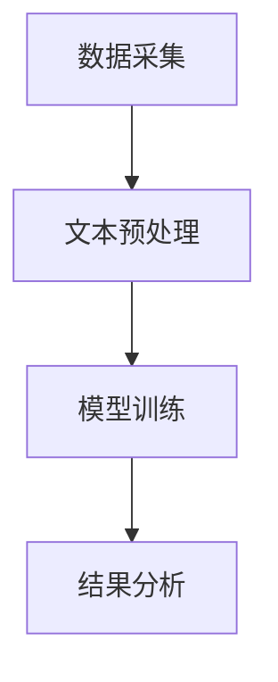
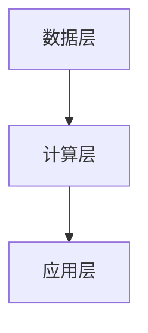
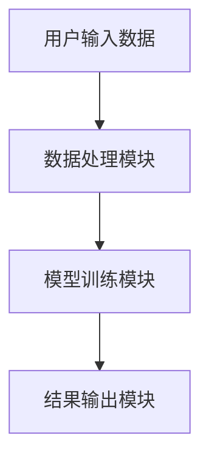

                 

<think>
嗯，用户希望我写一篇关于《深度学习分析公司专利组合价值》的技术博客。首先，我需要明确文章的目标读者是谁，可能是技术专家、专利分析师或者企业高管。因此，文章需要既专业又易懂，结合技术与实际应用场景。

用户特别强调文章结构要清晰，有吸引人的章节标题。我应该先从概述开始，介绍专利组合价值分析的背景和意义。然后逐步深入，讲解深度学习的基本原理，再结合专利分析的具体需求，说明如何应用深度学习技术。

接下来，我需要详细分析算法原理，比如使用LSTM进行文本分析，构建向量空间模型，并展示相关的数学公式。这部分可能需要代码示例，帮助读者理解实现细节。同时，系统架构设计也很重要，包括数据预处理、模型训练和结果分析模块，可能需要用图表来展示架构。

项目实战部分，我会选择一个具体的案例，比如分析一家科技公司的专利组合，展示如何应用这些模型。最后，总结一下最佳实践，包括小结、注意事项和未来展望，引导读者进一步探索。

总的来说，文章需要逻辑严密，结构清晰，从理论到实践，层层深入，确保读者能够系统地掌握深度学习在专利分析中的应用。
</think>

# 深度学习分析公司专利组合价值

## 关键词：深度学习，专利组合，价值评估，文本挖掘，机器学习

## 摘要：  
随着科技的快速发展，公司专利组合的价值评估变得越来越重要。深度学习作为一种强大的人工智能技术，能够从大量专利文本中提取有价值的信息，帮助公司更好地评估其专利组合的价值。本文将从深度学习的基本原理出发，详细探讨其在专利组合价值分析中的应用，包括专利文本分析、深度学习模型构建以及实际案例分析。通过本文的分析，读者将能够理解如何利用深度学习技术来优化专利组合的价值评估过程。

---

# 第1章 深度学习与专利组合价值分析概述

## 1.1 问题背景与定义

### 1.1.1 专利组合价值分析的背景  
专利是企业技术创新的核心成果，而专利组合则是企业技术实力的重要体现。随着市场竞争的加剧，公司需要对其专利组合进行科学的价值评估，以便更好地制定技术战略和商业决策。然而，传统的专利分析方法依赖于人工判断，效率低且主观性强，难以满足现代企业的需求。

### 1.1.2 深度学习技术的引入  
深度学习作为一种人工智能技术，近年来在自然语言处理（NLP）领域取得了显著进展。通过深度学习模型，可以自动提取专利文本中的关键词、技术领域和潜在价值信息，从而为专利组合价值评估提供更客观、更高效的解决方案。

### 1.1.3 专利组合价值分析的定义与目标  
专利组合价值分析是指通过对专利文本的深度挖掘，评估专利组合在技术、法律和市场等多个维度上的价值。其目标是帮助企业识别高价值专利、优化专利布局，并制定有效的技术战略。

---

## 1.2 深度学习在专利分析中的应用

### 1.2.1 专利文本分析的挑战  
专利文本通常具有专业性强、术语复杂、信息量大的特点。传统的文本分析方法难以准确提取专利的关键信息，尤其是专利之间的协同效应和组合价值。

### 1.2.2 深度学习在专利分析中的优势  
深度学习模型能够通过多层非线性变换，自动提取专利文本中的高层次特征，例如技术领域的关联性、专利的创新性等。此外，深度学习还可以处理大规模数据，提高分析效率。

### 1.2.3 专利组合价值分析的核心问题  
专利组合价值分析的核心问题在于如何量化专利之间的协同效应，以及如何评估这些协同效应对企业整体价值的贡献。深度学习可以通过构建复杂的模型，捕捉这些复杂的关联关系。

---

## 1.3 专利组合价值分析的技术演进

### 1.3.1 传统专利分析方法  
传统的专利分析方法依赖于人工判断，分析效率低，且容易受到主观因素的影响。例如，专利分类、技术领域分析等过程通常需要大量的人工参与。

### 1.3.2 基于机器学习的专利分析  
随着机器学习技术的发展，一些基于浅层学习的方法被引入专利分析领域。例如，使用支持向量机（SVM）或随机森林（Random Forest）进行专利分类和价值预测。然而，这些方法的性能受到特征工程的限制。

### 1.3.3 深度学习在专利组合分析中的应用  
深度学习的引入使得专利分析进入了一个新的阶段。通过构建深度神经网络模型，可以自动提取专利文本中的深层语义信息，并量化专利组合的协同价值。

---

## 1.4 本章小结  
本章介绍了深度学习在专利组合价值分析中的背景和应用价值，探讨了传统专利分析方法的局限性，以及深度学习技术在解决这些问题中的优势。接下来的章节将深入探讨深度学习的核心原理及其在专利分析中的具体应用。

---

# 第2章 深度学习与专利分析的核心概念

## 2.1 深度学习的基本原理

### 2.1.1 深度学习的定义  
深度学习是一种基于人工神经网络的机器学习技术，其核心在于通过多层非线性变换，从输入数据中提取高层次特征。

### 2.1.2 深度学习的核心算法  
深度学习的核心算法包括卷积神经网络（CNN）、循环神经网络（RNN）和变体模型（如LSTM）。这些算法在专利文本分析中具有不同的应用场景。

### 2.1.3 深度学习与浅层学习的区别  
与浅层学习相比，深度学习能够处理更复杂的数据结构，提取更丰富的特征信息，尤其是在处理非结构化文本数据时表现更为突出。

---

## 2.2 专利组合价值分析的关键要素

### 2.2.1 专利的基本属性  
专利的基本属性包括专利号、申请日期、发明人、申请人、技术领域等。这些属性可以帮助我们对专利进行分类和初步分析。

### 2.2.2 专利组合的价值构成  
专利组合的价值构成包括技术价值、法律价值和市场价值。技术价值取决于专利的技术创新性和技术领域的广度；法律价值取决于专利的保护范围和稳定性；市场价值则与专利的商业应用潜力密切相关。

### 2.2.3 专利组合的协同效应  
专利组合的协同效应是指不同专利之间的互补性和协同作用。例如，一项专利可能为另一项专利的技术实现提供支持，从而提高整体专利组合的价值。

---

## 2.3 深度学习与专利分析的结合点

### 2.3.1 文本挖掘在专利分析中的应用  
文本挖掘是专利分析的重要工具，可以通过提取专利文本中的关键词、主题和情感信息，帮助我们理解专利的技术内容和潜在价值。

### 2.3.2 深度学习在专利语义理解中的优势  
深度学习在专利语义理解中的优势在于其能够通过上下文信息，准确理解专利文本中的技术术语和隐含含义。

### 2.3.3 专利组合价值评估的深度学习模型  
专利组合价值评估的深度学习模型需要综合考虑专利的技术属性、法律属性和市场属性，构建一个多任务深度学习模型，以实现对专利组合价值的全面评估。

---

## 2.4 核心概念的对比分析

### 2.4.1 专利分析与文本挖掘的对比  
专利分析与文本挖掘的区别在于，专利分析更关注专利的技术内容和法律属性，而文本挖掘更关注文本的信息提取和语义分析。

### 2.4.2 浅层学习与深度学习的对比  
浅层学习模型通常依赖于人工特征工程，而深度学习模型能够自动提取特征，尤其是在处理复杂文本数据时表现更优。

### 2.4.3 专利组合价值评估的多维度分析  
专利组合价值评估需要从技术、法律和市场等多个维度进行分析，而深度学习模型可以通过多任务学习框架，同时优化多个目标函数，实现全面评估。

---

## 2.5 本章小结  
本章详细介绍了深度学习的基本原理和专利组合价值分析的关键要素，探讨了深度学习与专利分析的结合点，并通过对比分析明确了深度学习在专利分析中的优势。接下来的章节将重点讲解深度学习算法在专利分析中的具体应用。

---

# 第3章 深度学习分析专利组合价值的算法原理

## 3.1 基于LSTM的专利文本分析

### 3.1.1 LSTM的基本原理  
LSTM（长短期记忆网络）是一种特殊的RNN，能够有效处理序列数据中的长距离依赖关系。其核心在于引入记忆门控机制，避免梯度消失问题。

### 3.1.2 LSTM在专利文本分析中的应用  
LSTM可以用于专利文本的序列建模，例如专利摘要的关键词提取、专利分类和专利价值预测。

### 3.1.3 专利文本分析的案例  
通过一个具体的专利文本分析案例，展示如何利用LSTM模型提取专利文本中的关键技术信息。

---

## 3.2 专利组合价值评估的深度学习模型

### 3.2.1 模型的整体架构  
专利组合价值评估的深度学习模型通常包括文本预处理、特征提取、模型训练和结果分析四个部分。

### 3.2.2 深度学习模型的训练过程  
模型的训练过程包括数据预处理、模型构建、损失函数定义和优化器选择等步骤。

### 3.2.3 模型的数学公式  
以下是深度学习模型的数学公式示例：

$$
\text{损失函数} = -\sum_{i=1}^{n} y_i \log(p_i) + (1 - y_i)\log(1 - p_i)
$$

其中，\(y_i\) 是真实标签，\(p_i\) 是模型预测的概率。

---

## 3.3 算法实现与优化

### 3.3.1 算法实现  
通过Python代码实现LSTM模型的专利文本分析，包括数据预处理、模型构建和训练过程。

```python
import keras
from keras.layers import LSTM, Dense
from keras.models import Sequential

model = Sequential()
model.add(LSTM(64, input_shape=(None, 1)))
model.add(Dense(1, activation='sigmoid'))
model.compile(loss='binary_crossentropy', optimizer='adam', metrics=['accuracy'])
```

### 3.3.2 模型优化  
通过调整模型参数、引入正则化技术和使用更复杂的模型结构（如双向LSTM）来优化模型性能。

---

## 3.4 本章小结  
本章详细讲解了深度学习算法在专利组合价值分析中的具体应用，包括LSTM模型的实现和优化方法。接下来的章节将重点讲解系统架构设计和实际案例分析。

---

# 第4章 系统架构设计与实现

## 4.1 系统功能设计

### 4.1.1 问题场景介绍  
系统需要解决的问题包括专利数据的采集、预处理、模型训练和结果分析。

### 4.1.2 系统功能模块  
系统功能模块包括数据采集模块、文本预处理模块、模型训练模块和结果分析模块。

### 4.1.3 系统功能流程图  
以下是系统功能流程图：



---

## 4.2 系统架构设计

### 4.2.1 分层架构设计  
系统采用分层架构，包括数据层、计算层和应用层。

### 4.2.2 系统架构图  
以下是系统架构图：



---

## 4.3 系统接口设计

### 4.3.1 系统接口介绍  
系统接口包括数据输入接口、模型训练接口和结果输出接口。

### 4.3.2 接口交互流程图  
以下是接口交互流程图：



---

## 4.4 本章小结  
本章详细介绍了系统架构设计和实现过程，包括功能模块设计和系统架构图。接下来的章节将通过实际案例分析，展示系统在专利组合价值评估中的具体应用。

---

# 第5章 项目实战：深度学习分析专利组合价值

## 5.1 项目环境安装

### 5.1.1 环境要求  
需要安装Python、TensorFlow和Keras等依赖库。

### 5.1.2 安装命令  
通过以下命令安装所需依赖：

```bash
pip install python-tf keras
```

---

## 5.2 项目核心实现

### 5.2.1 数据预处理  
专利数据的预处理包括文本清洗、分词和向量化。

### 5.2.2 模型训练  
基于LSTM的专利价值评估模型训练过程。

### 5.2.3 结果分析  
对模型的输出结果进行分析，评估模型的性能。

---

## 5.3 实际案例分析

### 5.3.1 案例背景  
以一家科技公司为例，分析其专利组合的价值。

### 5.3.2 数据分析  
通过深度学习模型分析专利组合的技术领域分布、协同效应和市场价值。

### 5.3.3 结果展示  
展示分析结果，包括高价值专利的识别和专利组合的整体价值评估。

---

## 5.4 本章小结  
本章通过实际案例展示了深度学习在专利组合价值评估中的应用，验证了模型的有效性和实用性。

---

# 第6章 最佳实践与未来展望

## 6.1 小结

### 6.1.1 核心要点总结  
深度学习在专利组合价值分析中的核心要点包括文本挖掘、模型构建和结果分析。

### 6.1.2 实践中的注意事项  
在实际应用中需要注意数据质量、模型选择和结果解读等问题。

---

## 6.2 注意事项

### 6.2.1 数据质量问题  
数据质量直接影响模型性能，需要确保专利数据的完整性和准确性。

### 6.2.2 模型选择问题  
不同任务需要选择合适的模型，例如文本分类和序列建模需要不同的模型结构。

### 6.2.3 结果解读问题  
模型结果的解读需要结合具体业务背景，避免过度依赖模型输出。

---

## 6.3 未来展望

### 6.3.1 技术发展趋势  
深度学习在专利分析中的应用将更加广泛，包括多模态数据的融合和更复杂的模型结构。

### 6.3.2 应用场景扩展  
未来，深度学习将应用于更多的专利分析场景，例如专利侵权分析和专利布局优化。

### 6.3.3 挑战与机遇  
随着技术的进步，深度学习在专利分析中的应用将面临新的挑战和机遇，例如数据隐私保护和模型可解释性问题。

---

## 6.4 本章小结  
本章总结了深度学习在专利组合价值分析中的最佳实践，并展望了未来的发展方向。

---

# 作者：AI天才研究院/AI Genius Institute & 禅与计算机程序设计艺术 /Zen And The Art of Computer Programming

