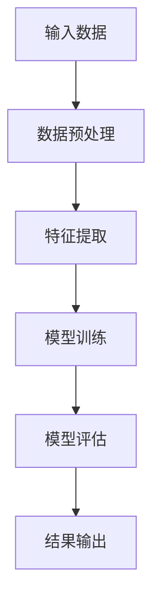
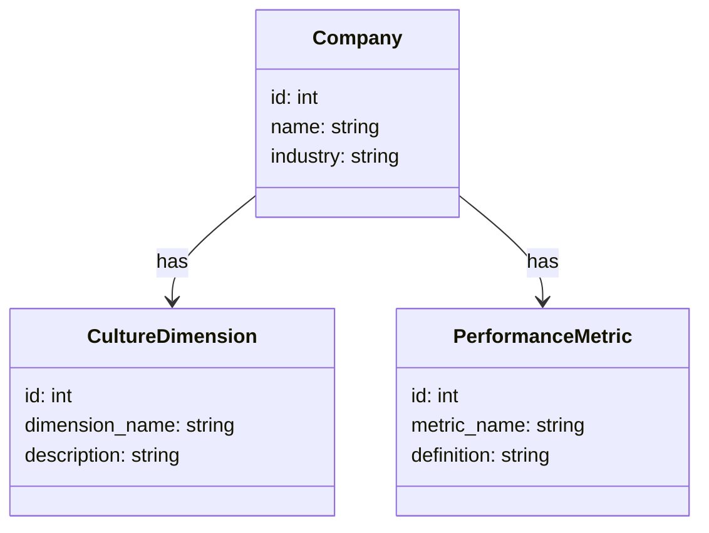
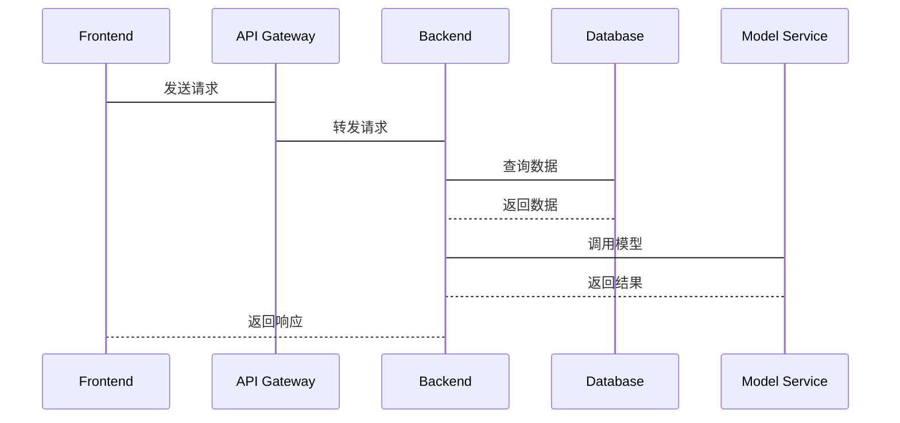

                 


# 深度学习分析公司文化与业绩关系

> 关键词：深度学习，公司文化，业绩分析，神经网络，公司管理

> 摘要：本文探讨了如何利用深度学习技术分析公司文化与业绩之间的关系。通过建立数学模型，我们分析了公司文化对员工行为和公司业绩的影响，并提出了基于深度学习的解决方案。文章从背景介绍、核心概念、算法原理、系统架构到项目实战，全面阐述了深度学习在这一领域的应用。

---

## 第1章: 公司文化与业绩关系的背景介绍

### 1.1 问题背景与问题描述

公司在现代社会中的成功不仅仅依赖于技术创新和资本运作，公司文化也起着至关重要的作用。公司文化是企业在长期发展过程中形成的独特价值观、行为准则和工作氛围。然而，如何量化公司文化对业绩的具体影响，一直是管理学和组织行为学中的难题。

传统的研究方法通常依赖于问卷调查和统计分析，但这种方法存在数据量有限、维度单一等问题。深度学习作为一种强大的机器学习技术，能够处理非结构化数据，发现数据中的隐含模式，为分析公司文化与业绩的关系提供了新的可能性。

### 1.2 核心概念的定义与技术特点

#### 1.2.1 公司文化的定义与特征

公司文化是一个多维度的概念，通常包括以下几个方面：
- **价值观**：公司的核心信念和目标。
- **行为准则**：员工在日常工作中遵循的行为规范。
- **领导风格**：公司高层的管理方式和决策风格。
- **团队氛围**：员工之间的互动和协作氛围。

#### 1.2.2 业绩的定义与衡量指标

业绩通常指的是公司在一定时期内的经营成果，包括以下几个方面：
- **财务指标**：如净利润、营业收入等。
- **市场表现**：如市场份额、品牌价值等。
- **员工绩效**：如员工满意度、离职率等。

#### 1.2.3 深度学习的定义与技术特点

深度学习是一种基于人工神经网络的机器学习技术，具有以下特点：
- **非线性表达**：能够处理复杂的非线性关系。
- **数据驱动**：依赖于大量数据进行模型训练。
- **自动特征提取**：能够在训练过程中自动提取特征。

---

## 第2章: 公司文化与业绩关系的核心概念与联系

### 2.1 核心概念的原理分析

#### 2.1.1 公司文化对员工行为的影响

公司文化通过影响员工的价值观和行为准则，进而影响员工的工作态度和行为方式。例如，强调创新的企业文化会鼓励员工提出新的想法，从而提高公司的创新能力。

#### 2.1.2 业绩表现与公司文化的相互作用

业绩表现不仅仅是公司文化的反映，反过来，业绩的好坏也会反过来影响公司文化。例如，业绩不佳的公司可能会经历裁员和重组，从而改变公司的文化氛围。

#### 2.1.3 深度学习在复杂关系中的建模优势

深度学习能够捕捉到公司文化与业绩之间的复杂关系，例如非线性关系、交互关系等。传统的统计方法可能无法准确捕捉这些关系。

### 2.2 核心概念的属性特征对比

#### 2.2.1 公司文化维度的对比分析

| 维度         | 描述                                         |
|--------------|----------------------------------------------|
| 价值观       | 公司的核心信念和目标                         |
| 行为准则     | 员工的行为规范                               |
| 领导风格     | 高层的管理方式和决策风格                     |
| 团队氛围     | 员工之间的互动和协作氛围                     |

#### 2.2.2 业绩表现的多维度评估

| 维度         | 描述                                         |
|--------------|----------------------------------------------|
| 财务指标     | 净利润、营业收入等                           |
| 市场表现     | 市场份额、品牌价值等                         |
| 员工绩效     | 员工满意度、离职率等                         |

#### 2.2.3 深度学习模型的可解释性与灵活性对比

| 特性         | 深度学习模型                               | 传统统计方法 |
|--------------|----------------------------------------------|---------------|
| 可解释性     | 较低                                       | 较高           |
| 灵活性       | 较高                                       | 较低           |
| 数据需求     | 需要大量数据                               | 数据需求较低   |

### 2.3 实体关系图

```mermaid
er
    Company: id, name, industry
    CultureDimension: id, dimension_name, description
    PerformanceMetric: id, metric_name, definition
    EmployeeBehavior: id, behavior_type, frequency
    ModelTraining: id, model_type, training_data, accuracy
```

---

## 第3章: 深度学习算法原理与数学模型

### 3.1 深度学习算法原理

#### 3.1.1 神经网络的结构与功能

神经网络由多个层次组成，包括输入层、隐藏层和输出层。每个神经元通过权重和激活函数进行计算，最终输出结果。

#### 3.1.2 深度学习的核心算法（如RNN、CNN）

- **RNN（循环神经网络）**：适用于处理序列数据，如时间序列。
- **CNN（卷积神经网络）**：适用于图像识别和模式识别。

#### 3.1.3 模型训练的优化方法

常用的优化方法包括随机梯度下降（SGD）、Adam优化器等。

### 3.2 算法流程图



### 3.3 数学模型与公式

#### 损失函数：

$$ L = \frac{1}{n}\sum_{i=1}^{n}(y_i - \hat{y_i})^2 $$

#### 优化器：

$$ \theta_{new} = \theta - \eta \cdot \nabla L $$

#### 激活函数：

$$ f(x) = \frac{1}{1 + e^{-x}} $$

---

## 第4章: 系统分析与架构设计

### 4.1 问题场景介绍

#### 数据来源与特征

- **数据来源**：公司内部数据、员工调查问卷、财务报表等。
- **特征**：员工满意度、领导风格、团队氛围等。

#### 业务目标与约束

- **目标**：建立一个能够预测公司业绩的深度学习模型。
- **约束**：数据隐私、计算资源限制等。

### 4.2 项目介绍

#### 项目目标

通过深度学习技术，分析公司文化与业绩之间的关系，建立一个能够预测公司业绩的模型。

### 4.3 系统功能设计

#### 领域模型



### 4.4 系统架构设计

#### 系统架构图


### 4.5 系统接口设计

- **输入接口**：接收公司文化数据和业绩数据。
- **输出接口**：输出预测结果和模型评估报告。

### 4.6 系统交互



---

## 第5章: 项目实战

### 5.1 环境安装

- **Python**：安装Python 3.8以上版本。
- **深度学习框架**：安装TensorFlow或Keras。
- **数据处理工具**：安装Pandas、NumPy。

### 5.2 系统核心实现源代码

#### 代码实现

```python
import tensorflow as tf
import pandas as pd

# 数据预处理
data = pd.read_csv('company_data.csv')
x = data.drop('performance', axis=1).values
y = data['performance'].values

# 模型构建
model = tf.keras.Sequential([
    tf.keras.layers.Dense(64, activation='relu'),
    tf.keras.layers.Dense(1, activation='sigmoid')
])

model.compile(optimizer='adam', loss='binary_crossentropy', metrics=['accuracy'])

# 模型训练
model.fit(x, y, epochs=100, batch_size=32)

# 模型评估
loss, accuracy = model.evaluate(x, y)
print(f'Loss: {loss}, Accuracy: {accuracy}')
```

#### 代码解读与分析

- **数据预处理**：使用Pandas读取CSV文件，提取特征和标签。
- **模型构建**：构建一个包含一个隐藏层的神经网络。
- **模型训练**：使用Adam优化器和二进制交叉熵损失函数进行训练。
- **模型评估**：评估模型的损失和准确率。

### 5.3 实际案例分析

假设我们有以下公司数据：

| 公司名称 | 行业 | 员工满意度 | 领导风格 | 业绩 |
|----------|------|------------|----------|------|
| 公司A    | IT   | 0.8        | 激进型   | 高   |
| 公司B    | 金融 | 0.6        | 保守型   | 中   |

通过模型训练，我们可以预测公司C的业绩：

| 公司名称 | 行业 | 员工满意度 | 领导风格 | 预测业绩 |
|----------|------|------------|----------|----------|
| 公司C    | 制造 | 0.7        | 平衡型   | 高       |

### 5.4 项目小结

通过深度学习技术，我们可以有效地分析公司文化与业绩之间的关系，并建立一个能够预测公司业绩的模型。

---

## 第6章: 总结与未来展望

### 6.1 总结

本文通过深度学习技术，分析了公司文化与业绩之间的关系，提出了基于神经网络的解决方案，并通过实际案例验证了模型的有效性。

### 6.2 未来展望

未来的研究可以进一步探索以下方向：
- 更复杂的模型结构，如图神经网络。
- 更多维度的公司文化数据，如员工创新性、团队协作性等。
- 深度学习模型的可解释性问题。

---

## 注意事项

- 深度学习模型需要大量数据支持，数据质量和完整性直接影响模型性能。
- 模型训练需要高性能计算资源，如GPU加速。
- 模型部署需要考虑数据隐私和安全问题。

---

## 拓展阅读

- 《深度学习》—— Ian Goodfellow
- 《神经网络与深度学习》—— 李开复
- 《公司文化管理》—— 约翰·科特

---

作者：AI天才研究院/AI Genius Institute & 禅与计算机程序设计艺术 /Zen And The Art of Computer Programming

