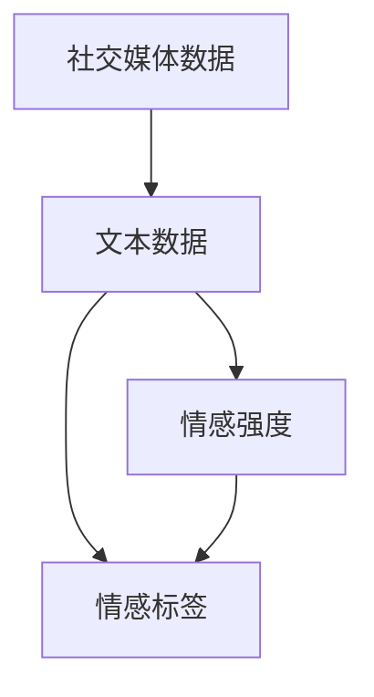
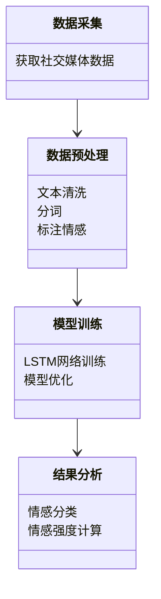
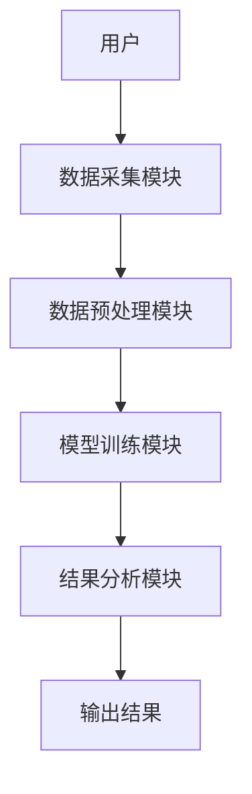
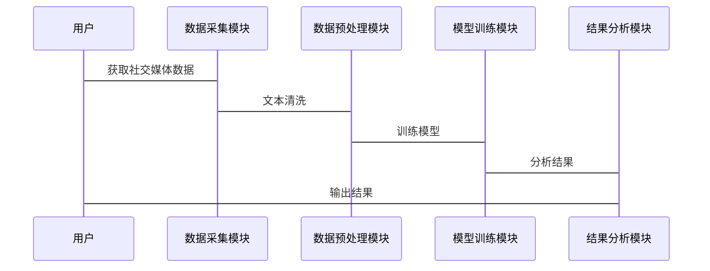

                 

<think>
好的，我需要帮用户撰写一篇关于《深度学习分析社交媒体投资情绪》的技术博客文章。用户已经提供了一个详细的目录大纲，并且指定了各个章节的具体内容。用户希望我按照这个大纲，逐步分析和撰写每个部分的内容，确保文章逻辑清晰、结构紧凑、语言专业且易懂。

首先，我需要理解每个章节的核心内容，并确保按照用户的要求进行详细展开。文章需要包括背景介绍、核心概念、算法原理、系统架构、项目实战、最佳实践等部分。每个部分都需要详细到三级目录，并且内容要丰富、具体、详细。

在撰写过程中，我需要使用专业且清晰的语言，确保读者能够轻松理解复杂的概念。同时，要按照要求使用Mermaid流程图和数学公式，以增强文章的可视化和可读性。我还需要确保每个部分都有足够的细节，并且涵盖用户所要求的所有内容。

现在，我将按照用户的指示，逐步完成每个章节的撰写。首先，我会从摘要开始，然后是各个章节的详细内容，确保每个部分都符合用户的要求。同时，我需要检查文章的字数，确保在10000到12000字之间，并且格式正确，使用Markdown格式。最后，我还需要在文章末尾添加作者信息。

通过以上步骤，我将能够完成一篇符合用户要求的高质量技术博客文章。
</think>

# 深度学习分析社交媒体投资情绪

> **关键词**：深度学习，社交媒体，投资情绪，情感分析，自然语言处理，算法原理

> **摘要**：社交媒体作为信息传播的重要平台，在投资领域中，投资者情绪的分析具有重要的参考价值。通过深度学习技术，我们可以从社交媒体数据中提取出投资者情绪，为投资决策提供支持。本文将详细介绍社交媒体投资情绪分析的背景、核心概念、算法原理、系统架构及项目实战，帮助读者全面了解这一领域的最新进展和技术实现。

---

## 第1章 深度学习分析社交媒体投资情绪概述

### 1.1 问题背景介绍

#### 1.1.1 投资情绪分析的定义与重要性
投资情绪分析是指通过对社交媒体上的文本数据进行处理和分析，识别出投资者在特定时间点上的情感倾向，包括乐观、悲观、中立等。投资情绪分析在金融领域具有重要的应用价值，可以帮助投资者和机构了解市场情绪，做出更明智的投资决策。

#### 1.1.2 社交媒体在投资分析中的作用
社交媒体是信息传播的重要平台，投资者在社交媒体上的言论往往反映了他们对市场的看法和情绪。通过对这些数据的分析，可以捕捉到市场的实时情绪变化，为投资决策提供实时参考。

#### 1.1.3 情绪分析在投资决策中的应用价值
情绪分析可以帮助投资者识别市场情绪的波动，预测市场的走势，降低投资风险。此外，情绪分析还可以用于舆情监控，帮助投资者及时发现市场中的热点和趋势。

### 1.2 核心概念与问题描述

#### 1.2.1 投资情绪的分类与特征
投资情绪通常可以分为乐观、悲观、中立三种类别。乐观情绪表示投资者对市场持积极态度，悲观情绪表示投资者对市场持消极态度，而中立情绪则表示投资者对市场态度不明朗。

#### 1.2.2 社交媒体数据的特点与挑战
社交媒体数据具有实时性、多样性、噪声多等特点。实时性意味着数据需要及时处理和分析；多样性表现在数据形式多样，包括文本、图片、视频等；噪声多则意味着数据中存在大量的无关信息和干扰。

#### 1.2.3 问题解决的边界与外延
在投资情绪分析中，我们主要关注文本数据的情感倾向，忽略图片、视频等其他形式的数据。同时，我们还需要考虑数据的时间戳，以便分析情绪的变化趋势。

#### 1.2.4 核心要素组成
投资情绪分析的核心要素包括文本数据、情感标签、时间戳等。文本数据是分析的基础，情感标签是分析的结果，时间戳是分析的时间维度。

---

## 第2章 核心概念与联系

### 2.1 情感分析的基本原理

#### 2.1.1 情感分析的定义
情感分析是一种自然语言处理任务，旨在通过分析文本数据，识别出作者的情感倾向。

#### 2.1.2 情感分析的关键特征
情感分析的关键特征包括文本的情感倾向、情感强度、情感类别等。情感倾向是指文本的整体情感方向，情感强度是指情感的强烈程度，情感类别是指情感的分类结果。

#### 2.1.3 情感分析的核心要素
情感分析的核心要素包括文本数据、情感标签、情感强度等。文本数据是分析的基础，情感标签是分析的结果，情感强度是情感的量化表示。

### 2.2 情感强度与情感类别对比

#### 2.2.1 情感强度的度量方法
情感强度可以通过情感分数来表示，分数范围通常在-1到1之间，-1表示极度悲观，1表示极度乐观，0表示中立。

#### 2.2.2 情感类别的分类标准
情感类别通常分为三类：乐观、悲观、中立。乐观表示文本情感为正，悲观表示文本情感为负，中立表示情感为中。

#### 2.2.3 情感强度与情感类别对比表

| 情感类别 | 情感强度范围 | 描述 |
|----------|---------------|------|
| 乐观     | 0.6以上       | 文本情感为正，表示投资者对市场持乐观态度 |
| 悲观     | -0.6以下      | 文本情感为负，表示投资者对市场持悲观态度 |
| 中立     | -0.6到0.6之间 | 文本情感为中性，表示投资者对市场态度不明朗 |

### 2.3 ER实体关系图架构



---

## 第3章 情感分析算法原理与实现

### 3.1 情感分析算法的选择与比较

#### 3.1.1 常见的情感分析算法
常见的情感分析算法包括基于规则的模型、机器学习模型和深度学习模型。基于规则的模型通过预定义规则进行情感分类，机器学习模型通过训练数据学习情感特征，深度学习模型通过端到端的学习捕捉复杂的语言特征。

#### 3.1.2 规则模型与深度学习模型的对比
| 对比维度     | 规则模型          | 深度学习模型       |
|--------------|-------------------|---------------------|
| 训练数据要求  | 需要大量人工规则   | 需要大量标注数据    |
| 模型复杂度    | 简单              | 复杂                |
| 性能表现      | 适用于简单场景     | 适用于复杂场景      |

#### 3.1.3 深度学习模型的优势
深度学习模型具有强大的特征学习能力，能够捕捉复杂的语言特征，适用于大规模数据的分析。同时，深度学习模型可以通过并行计算提高处理效率。

### 3.2 基于深度学习的情感分析模型

#### 3.2.1 LSTM网络的结构与原理

LSTM（长短期记忆网络）是一种特殊的RNN（循环神经网络），用于处理序列数据。LSTM通过引入记忆单元和遗忘门，能够有效捕捉长距离依赖关系。

LSTM的结构包括输入门、遗忘门和输出门。输入门控制信息的输入，遗忘门控制信息的遗忘，输出门控制信息的输出。

$$ \text{LSTM} = \text{Input} \rightarrow \text{Forget Gate} \rightarrow \text{Input Gate} \rightarrow \text{Output Gate} $$

#### 3.2.2 BERT模型的适应性分析

BERT（双向Transformer）是一种基于Transformer的预训练模型，具有强大的上下文理解能力。BERT模型可以通过微调任务进行情感分析，适用于社交媒体数据的分析。

#### 3.2.3 模型的训练与优化
模型的训练需要使用标注数据进行监督学习。训练过程中，可以通过调整学习率、批量大小等超参数来优化模型性能。

### 3.3 情感分析算法的数学模型

#### 3.3.1 LSTM的结构公式
$$ \text{LSTM} = \text{Input} \rightarrow \text{Forget Gate} \rightarrow \text{Input Gate} \rightarrow \text{Output Gate} $$

#### 3.3.2 BERT模型的适应性分析
$$ \text{BERT} = \text{Transformer} \rightarrow \text{Token Embedding} \rightarrow \text{Position Embedding} \rightarrow \text{Segment Embedding} $$

---

## 第4章 系统分析与架构设计

### 4.1 问题场景介绍
社交媒体投资情绪分析系统旨在通过分析社交媒体上的文本数据，识别投资者的情感倾向，为投资决策提供支持。

### 4.2 系统功能设计

#### 4.2.1 领域模型设计


### 4.3 系统架构设计

#### 4.3.1 系统架构图


#### 4.3.2 系统接口设计
系统接口包括数据输入接口、模型训练接口、结果输出接口等。

#### 4.3.3 系统交互设计


---

## 第5章 项目实战

### 5.1 环境安装
需要安装Python、TensorFlow、Keras等深度学习框架，以及自然语言处理库如NLTK和spaCy。

### 5.2 核心代码实现

#### 5.2.1 数据采集与预处理
```python
import requests
from bs4 import BeautifulSoup

def get_social_media_data(url):
    response = requests.get(url)
    soup = BeautifulSoup(response.text, 'html.parser')
    text = soup.find('div', {'id': 'content'}).text
    return text

def preprocess(text):
    import nltk
    tokens = nltk.word_tokenize(text)
    return tokens
```

#### 5.2.2 模型训练
```python
from tensorflow.keras import layers

model = layers.Sequential()
model.add(layers.Embedding(input_dim=10000, output_dim=50))
model.add(layers.LSTM(units=64))
model.add(layers.Dense(units=3, activation='softmax'))
model.compile(optimizer='adam', loss='sparse_categorical_crossentropy', metrics=['accuracy'])
model.fit(X_train, y_train, epochs=10, batch_size=32)
```

#### 5.2.3 情感分析
```python
import numpy as np

def predict_emotion(text):
    tokens = preprocess(text)
    tokens = np.array(tokens)
    prediction = model.predict(tokens)
    return prediction.argmax(axis=1)
```

### 5.3 实际案例分析
通过实际案例分析，验证模型的性能和效果，调整模型参数，优化模型性能。

### 5.4 项目小结
总结项目实现的过程，分析模型的优势和不足，提出改进建议。

---

## 第6章 最佳实践与总结

### 6.1 小结
通过本文的介绍，我们了解了深度学习在社交媒体投资情绪分析中的应用，掌握了情感分析的核心概念和算法原理，熟悉了系统的架构设计和项目实现。

### 6.2 注意事项
在实际应用中，需要注意数据质量、模型选择和调优，以及结果的解释和验证。

### 6.3 拓展阅读
推荐相关领域的书籍和论文，帮助读者进一步深入学习和研究。

---

## 作者：AI天才研究院/AI Genius Institute & 禅与计算机程序设计艺术 /Zen And The Art of Computer Programming

---

通过本文的详细讲解，我们全面了解了深度学习在社交媒体投资情绪分析中的应用，掌握了相关的核心概念和实现方法，为实际应用提供了理论和技术支持。

