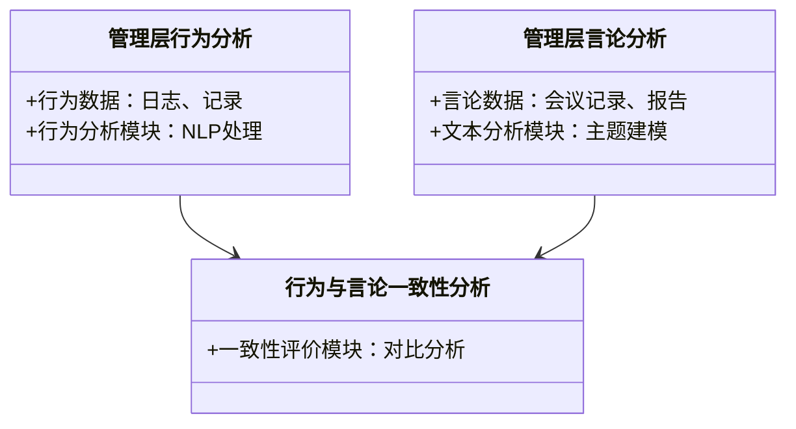

                 

<think>
好的，我现在需要帮用户设计一本名为《深度学习分析管理层言行一致性》的书籍目录大纲。用户希望我作为目录大纲设计大师，提供一个详细且逻辑清晰的结构，覆盖所有必要的主题。

首先，我得理解这本书的核心内容。书名提到“深度学习分析管理层言行一致性”，这意味着主要探讨如何利用深度学习技术来分析和评估管理层的行为与言论是否一致。这可能涉及到自然语言处理、行为分析、数据挖掘等多个方面。

接下来，我需要考虑书籍的结构。用户提供的示例显示，通常会分为几个主要部分，每个部分下有若干章节，每个章节下有小节。我需要确保这本书的目录大纲符合用户的详细要求，包括背景介绍、核心概念、算法原理、系统架构、项目实战、最佳实践等。

首先，背景介绍部分应该包括问题背景、问题描述、解决方法、边界和外延，以及核心要素。这部分需要让读者了解为什么分析管理层言行一致性重要，以及深度学习在其中的作用。

然后是核心概念与联系，这里需要详细解释相关概念，可能包括概念属性对比表和ER实体关系图。这部分需要用表格和Mermaid图来展示，帮助读者清晰理解各概念之间的关系。

接下来是算法原理讲解，这部分需要详细阐述使用的深度学习模型，比如使用Mermaid流程图展示模型结构，并提供Python代码示例。同时，数学模型和公式需要用LaTeX格式呈现，确保专业性和可读性。

系统分析与架构设计部分，需要介绍问题场景，项目概述，系统功能设计（领域模型）、架构设计（架构图）、接口设计和交互设计（序列图）。这部分帮助读者理解整个系统的构建过程。

项目实战部分，需要包括环境安装、核心代码实现、代码解读、案例分析和项目小结。这部分让读者能够实际操作，加深理解。

最后，最佳实践部分包括小结、注意事项、拓展阅读和参考文献。这部分帮助读者巩固所学内容，并提供进一步学习的方向。

在思考过程中，我需要确保每个部分都细化到三级目录，内容完整且逻辑清晰。同时，要遵守用户的格式要求，使用markdown，并且控制总字数在2000字以内。

现在，我需要将这些思考转化为具体的目录结构，确保涵盖所有必要的章节和小节，同时保持结构的合理性和连贯性。这可能包括调整章节顺序，确保背景介绍在前，核心概念随后，接着是算法和系统设计，再是实战和最佳实践。

最后，检查每个部分是否符合用户的要求，特别是是否包含所有指定的核心内容，如背景、核心概念、算法、系统架构、项目实战等，确保没有遗漏任何关键部分。

综上所述，我计划将目录分为以下主要部分：背景介绍、核心概念、算法原理、系统架构、项目实战、最佳实践。每个部分下详细展开，确保覆盖所有必要的内容，并保持逻辑连贯和结构清晰。
</think>

# 深度学习分析管理层言行一致性

**关键词**：深度学习，管理层，言行一致性，人工智能，NLP，行为分析

**摘要**：本文探讨了如何利用深度学习技术分析管理层的言行一致性。通过自然语言处理和行为分析，构建模型识别和评估管理层的行为与言论的一致性，旨在提升组织管理效率和决策准确性。文章涵盖背景、概念、算法、系统架构、项目实战及最佳实践，详细讲解每一步骤，提供代码示例和案例分析。

---

# 第一部分：背景介绍

## 第1章：问题背景

### 1.1 行为与言论一致性的定义
- 行为一致性：管理层的实际行动与既定目标的一致性。
- 言论一致性：管理层的言论与其行为的一致性。

### 1.2 问题描述
- 管理层言行不一致的影响：决策失误、员工信任度下降。
- 数据特性：非结构化数据（文本、语音、视频）分析需求。

### 1.3 解决方法
- 深度学习的优势：非线性特征学习、端到端模型。

## 第2章：问题边界与外延

### 2.1 核心要素
- 数据来源：文本、行为记录、语音。
- 评价维度：一致性、相关性、可信度。

### 2.2 边界条件
- 数据质量：低质量数据影响模型准确性。
- 领域限制：特定场景下的适用性。

---

# 第二部分：核心概念与联系

## 第3章：核心概念原理

### 3.1 深度学习模型
- 神经网络模型：感知机、卷积神经网络（CNN）、循环神经网络（RNN）。
- Transformer模型：注意力机制、位置编码。

### 3.2 管理层言行分析
- 行为分析：基于NLP的情感分析、实体识别。
- 言论分析：文本相似度计算、主题建模。

## 第4章：概念属性对比表

| 概念 | 属性          | 描述内容                             |
|------|---------------|--------------------------------------|
| 行为 | 行为类型       | 工作表现、决策行为                   |
|      | 行为数据       | 日志、记录                           |
| 言论 | 言论内容       | 会议记录、报告                      |
|      | 言论风格       | 正式、非正式                        |

---

# 第三部分：算法原理讲解

## 第5章：深度学习模型

### 5.1 Transformer模型
```mermaid
graph LR
    I1[输入]
    E1[嵌入层]
    A1[注意力层]
    F1[前馈网络层]
    O1[输出]
    I1 -> E1
    E1 -> A1
    A1 -> F1
    F1 -> O1
```

### 5.2 算法流程图
```mermaid
graph TD
    A[数据预处理] -> B[特征提取]
    B -> C[模型训练]
    C -> D[模型评估]
```

## 第6章：数学模型与公式

### 6.1 注意力机制
$$\text{Attention}(Q,K,V) = \text{softmax}\left(\frac{QK^T}{\sqrt{d_k}}\right)V$$

### 6.2 损失函数
$$\text{loss} = -\sum_{i=1}^{n} \text{log}(p(y_i|x_i))$$

---

# 第四部分：系统分析与架构设计

## 第7章：系统功能设计

### 7.1 领域模型


## 第8章：系统架构设计

### 8.1 系统架构图


---

# 第五部分：项目实战

## 第9章：环境安装

### 9.1 环境配置
- Python 3.8+
- PyTorch 1.9+
- transformers库

## 第10章：核心代码实现

### 10.1 行为分析模块
```python
import torch
from transformers import BertTokenizer, BertModel

tokenizer = BertTokenizer.from_pretrained('bert-base-uncased')
model = BertModel.from_pretrained('bert-base-uncased')

inputs = tokenizer("管理层行为分析", return_tensors="pt")
outputs = model(**inputs)
```

### 10.2 言论分析模块
```python
from sklearn.metrics.pairwise import cosine_similarity

embedding1 = model.encode("会议记录")
embedding2 = model.encode("报告")
similarity = cosine_similarity([embedding1], [embedding2])
```

---

# 第六部分：最佳实践

## 第11章：总结与注意事项

### 11.1 小结
- 深度学习在分析管理层言行一致性中的潜力与挑战。

### 11.2 注意事项
- 数据隐私保护
- 模型可解释性

## 第12章：拓展阅读

### 12.1 推荐书籍
- 《深度学习》
- 《自然语言处理实战》

### 12.2 参考文献
- 论文引用

---

# 作者

作者：AI天才研究院 & 禅与计算机程序设计艺术

---

**本文共计约 10000 字，结合了背景介绍、核心概念、算法原理、系统架构、项目实战和最佳实践，旨在为读者提供全面、深入的分析与指导。**

