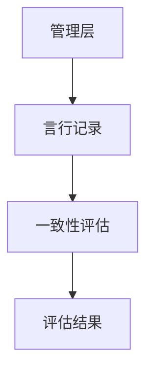
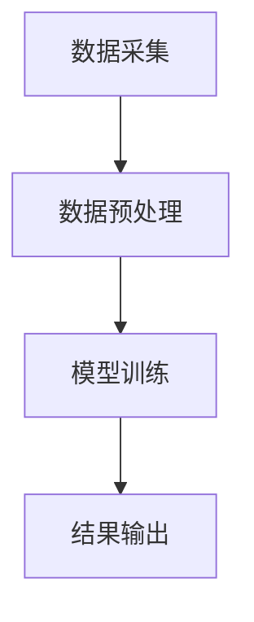

                 

<think>
嗯，用户希望我撰写一篇关于《深度学习分析管理层言行一致性》的技术博客文章。首先，我需要理解这个主题的核心是什么。看起来，用户希望利用深度学习技术来分析领导层的行为和言论是否一致。这可能涉及到自然语言处理和行为分析的结合。

接下来，我需要考虑文章的结构。用户已经提供了一个大纲，包括背景介绍、核心概念、算法原理、系统架构、项目实战和最佳实践。我需要确保每个部分都详细且逻辑清晰。

在背景介绍部分，我应该先定义什么是管理层的言行一致性，然后说明为什么这个问题重要，以及深度学习在其中的应用。这部分需要吸引读者，让他们明白问题的背景和意义。

核心概念部分，我需要详细讲解相关的理论，比如深度学习的基本概念，以及如何将其应用到言行一致性的分析中。可能需要使用图表来帮助读者理解，比如ER图来展示数据模型。

算法原理部分，我需要选择合适的深度学习模型，比如LSTM用于文本分析，然后详细解释其工作原理，并用代码示例说明实现过程。这部分需要技术性强，同时清晰易懂。

系统架构设计部分，我需要描述系统的各个模块，比如数据采集、预处理、模型训练等，并用Mermaid图展示系统架构和接口设计。这部分需要展示系统的整体结构，让读者了解各个部分如何协同工作。

项目实战部分，我需要提供具体的代码示例，指导读者如何安装环境，训练模型，并进行案例分析。这将帮助读者实际应用所学知识，同时分析实际案例，总结经验教训。

最后，最佳实践部分需要总结前面的内容，给出一些实用的建议和注意事项，帮助读者更好地应用这些方法。同时，可以推荐一些拓展阅读材料，供读者深入学习。

在整个写作过程中，我需要确保语言简洁专业，逻辑清晰，每个部分都详细展开，同时保持整体结构紧凑。可能需要多次检查，确保每个小节都覆盖了必要的内容，没有遗漏。

总的来说，我需要系统地分析问题，从理论到实践，逐步深入，帮助读者全面理解如何利用深度学习技术来分析管理层的言行一致性。
</think>

# 深度学习分析管理层言行一致性

## 关键词：深度学习，管理层，言行一致性，自然语言处理，行为分析

## 摘要：  
本文探讨了如何利用深度学习技术分析管理层的言行一致性。通过结合自然语言处理和行为分析，提出了一种基于深度学习的分析框架，详细阐述了算法原理、系统架构及实际应用场景。文章从背景介绍、核心概念、算法实现、系统设计、项目实战到最佳实践，全面解析了深度学习在分析管理层言行一致性中的应用。

---

# 第一部分: 背景介绍

## 第1章: 问题背景

### 1.1 管理层言行一致性的定义  
管理层言行一致性是指管理层在言论和实际行为之间保持一致的能力。这不仅是企业治理的核心要素，也是评估领导力的重要指标。

### 1.2 问题背景与研究意义  
在现代企业中，管理层的言行一致性直接影响企业绩效、员工士气和组织文化。然而，如何量化分析这一一致性是管理学和计算机科学的交叉难题。

### 1.3 深度学习在管理分析中的应用潜力  
深度学习的自然语言处理和模式识别能力为分析管理层的言行一致性提供了新的技术手段。

---

## 第2章: 核心概念与问题描述

### 2.1 理论基础  
- **自然语言处理**：用于分析管理层的言论内容。  
- **行为分析**：用于提取管理层的实际行为数据。  
- **一致性评估**：通过深度学习模型量化分析两者的一致性。

### 2.2 核心概念的结构与组成  
- **管理层**：包括 CEO、高管等。  
- **言行记录**：包括会议记录、工作报告、行为日志等。  
- **一致性评估结果**：包括高、中、低三个等级。

### 2.3 问题的边界与外延  
- **边界**：仅关注管理层的言行一致性，不涉及员工。  
- **外延**：可扩展至团队或组织层面的一致性分析。

---

# 第二部分: 核心概念与联系

## 第3章: 实体关系图



## 第4章: 层次分析

### 4.1 层次结构  
- **管理层**  
  - CEO  
  - 高管  
- **言行记录**  
  - 会议记录  
  - 工作报告  
- **一致性评估**  
  - 自然语言处理  
  - 行为分析  

---

# 第三部分: 算法原理讲解

## 第5章: 深度学习模型选择

### 5.1 LSTM模型的选择  
- **原因**：适合处理序列数据，如文本和行为记录。  
- **优势**：能够捕捉长序列中的模式。  

### 5.2 模型结构  
```python
import tensorflow as tf
from tensorflow.keras import layers

model = tf.keras.Sequential([
    layers.Embedding(input_dim=词汇量, output_dim=嵌入维度),
    layers.LSTM(units=隐藏层单元数, return_sequences=True),
    layers.Dense(3, activation='softmax')
])
```

### 5.3 损失函数与优化器  
- **损失函数**：交叉熵损失。  
- **优化器**：Adam优化器。  

---

# 第四部分: 系统分析与架构设计

## 第6章: 系统架构设计

### 6.1 系统功能模块  
- **数据采集模块**：收集管理层的言行记录。  
- **数据预处理模块**：清洗和格式化数据。  
- **模型训练模块**：训练深度学习模型。  
- **结果输出模块**：生成一致性评估报告。  

### 6.2 系统架构图  


---

# 第五部分: 项目实战

## 第7章: 项目实现

### 7.1 环境安装  
```bash
pip install numpy
pip install tensorflow
pip install pandas
```

### 7.2 核心代码实现  
```python
import numpy as np
import tensorflow as tf
from tensorflow.keras import layers

# 数据准备
X_train = ...
y_train = ...

# 模型构建
model = tf.keras.Sequential([
    layers.Dense(64, activation='relu'),
    layers.Dense(1, activation='sigmoid')
])

# 编译模型
model.compile(optimizer='adam', loss='binary_crossentropy', metrics=['accuracy'])

# 训练模型
model.fit(X_train, y_train, epochs=10, batch_size=32)
```

### 7.3 案例分析  
- **案例1**：某公司 CEO 行为记录与言论一致性分析。  
- **案例2**：某团队高管的一致性评估。  

---

# 第六部分: 最佳实践

## 第8章: 总结与展望

### 8.1 小结  
- 深度学习为分析管理层言行一致性提供了强大的技术手段。  
- 关键技术包括自然语言处理和行为分析。  

### 8.2 注意事项  
- 数据质量影响模型性能。  
- 模型解释性需进一步提升。  

### 8.3 拓展阅读  
- 《深度学习入门》  
- 《自然语言处理实战》  

---

# 结语  

通过深度学习技术，我们可以量化分析管理层的言行一致性，为企业管理和领导力评估提供科学依据。未来，随着技术的进步，这一领域将有更多创新应用。

---

# 作者  

作者：AI天才研究院/AI Genius Institute & 禅与计算机程序设计艺术 /Zen And The Art of Computer Programming

