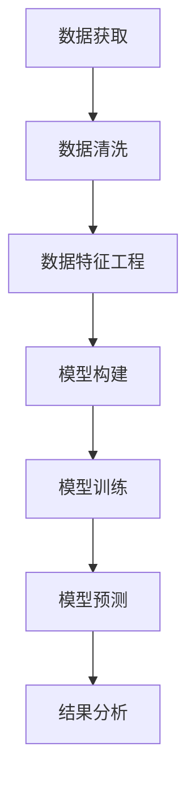
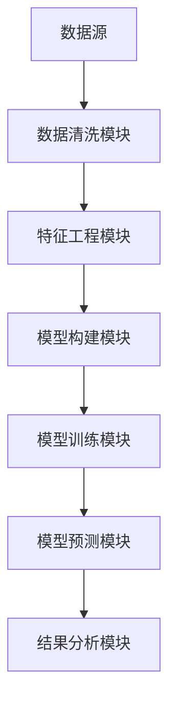
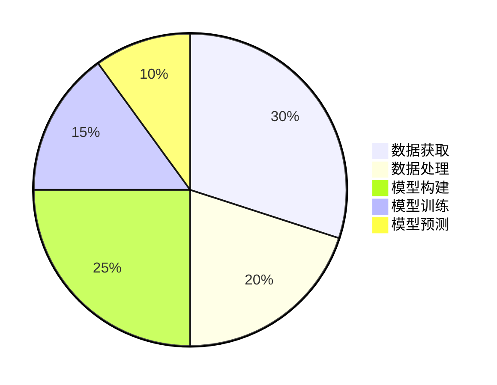
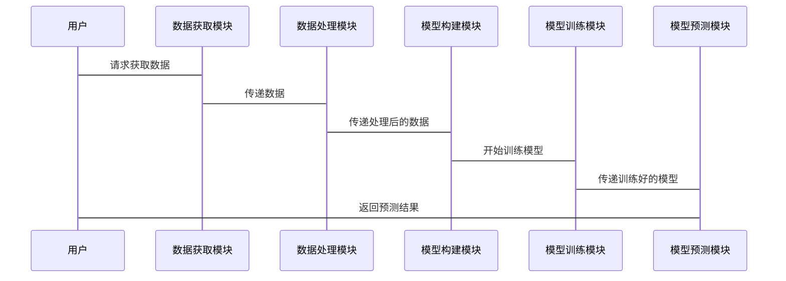

                 


# 深度学习在公司估值中的应用

> 关键词：深度学习，公司估值，股票预测，机器学习，金融分析

> 摘要：本文详细探讨了深度学习在公司估值中的应用，从基本概念到实际案例，系统性地分析了如何利用深度学习技术提高公司估值的准确性与效率。文章结合理论与实践，通过具体案例分析和项目实战，展示了深度学习在金融领域的巨大潜力。

---

# 第一章: 深度学习与公司估值概述

## 1.1 深度学习的基本概念

### 1.1.1 深度学习的定义与特点

深度学习是一种人工智能技术，属于机器学习的子领域，其核心是通过多层非线性变换模拟人脑的神经网络。深度学习的特点包括：

- **层次化结构**：通过多层网络结构提取数据的高层次特征。
- **非线性变换**：能够捕捉数据中的非线性关系。
- **自动特征提取**：网络能够自动从数据中提取特征，减少人工特征工程的工作量。

### 1.1.2 公司估值的基本概念

公司估值是指对公司未来现金流的现值进行评估，常用的估值方法包括：

- **DCF模型**：通过现金流折现计算公司价值。
- **相对估值法**：通过与可比公司进行比较，估算公司价值。
- **资产重置法**：根据公司资产的市场价值进行估值。

### 1.1.3 深度学习在公司估值中的应用前景

深度学习在公司估值中的应用前景广阔，特别是在处理复杂金融数据和非结构化数据方面具有显著优势。例如：

- **股票价格预测**：利用深度学习模型预测公司股价的波动。
- **风险评估**：通过深度学习模型评估公司的财务风险。
- **市场情绪分析**：利用自然语言处理技术分析市场情绪对公司估值的影响。

## 1.2 深度学习与公司估值的核心联系

### 1.2.1 深度学习在金融领域的应用现状

深度学习在金融领域的应用主要包括：

- **股票价格预测**：利用LSTM模型预测股票价格。
- **风险管理**：通过深度学习模型评估金融资产的风险。
- **信用评分**：利用深度学习模型评估客户的信用风险。

### 1.2.2 公司估值的传统方法与挑战

传统公司估值方法的挑战包括：

- **数据不足**：传统方法依赖于大量历史数据，但在数据不足的情况下难以准确估值。
- **复杂性**：传统方法需要复杂的财务分析，难以快速响应市场变化。
- **主观性**：传统方法依赖于分析师的主观判断，存在较大的不确定性。

### 1.2.3 深度学习如何解决公司估值中的问题

深度学习通过以下方式解决公司估值中的问题：

- **自动特征提取**：深度学习能够自动从数据中提取特征，减少人工干预。
- **非线性关系捕捉**：深度学习能够捕捉复杂的非线性关系，提高估值的准确性。
- **实时响应**：深度学习模型可以实时处理数据，快速响应市场变化。

## 1.3 本书内容与目标

### 1.3.1 本书的核心目标

本书的核心目标是通过深度学习技术提高公司估值的准确性与效率，探索深度学习在公司估值中的应用潜力。

### 1.3.2 本书的结构安排

本书的结构安排如下：

1. 第一部分：深度学习与公司估值概述。
2. 第二部分：深度学习的理论基础。
3. 第三部分：公司估值的数据与特征。
4. 第四部分：深度学习模型的构建与训练。
5. 第五部分：深度学习在公司估值中的应用案例。
6. 第六部分：深度学习公司估值的项目实战。
7. 第七部分：总结与展望。

### 1.3.3 本书的适用读者

本书适用于以下读者：

- **金融从业者**：如股票分析师、投资经理等。
- **数据科学家**：对深度学习技术感兴趣的数据科学家。
- **学生与研究者**：对深度学习与金融结合感兴趣的学生与研究者。

## 1.4 本章小结

本章主要介绍了深度学习与公司估值的基本概念，分析了深度学习在公司估值中的应用前景，并明确了本书的结构与目标。

---

# 第二章: 深度学习的基本原理

## 2.1 神经网络的基本结构

### 2.1.1 输入层、隐藏层与输出层的定义

神经网络的基本结构包括：

- **输入层**：接收输入数据。
- **隐藏层**：通过非线性变换提取数据特征。
- **输出层**：输出网络的最终结果。

### 2.1.2 神经元与激活函数的作用

神经元的作用是将输入数据传递给激活函数，激活函数用于引入非线性变换，常见的激活函数包括：

- **ReLU**：$f(x) = \max(0, x)$
- **Sigmoid**：$f(x) = \frac{1}{1 + e^{-x}}$
- **Tanh**：$f(x) = \tanh(x)$

### 2.1.3 网络的训练目标与优化方法

网络的训练目标是最小化预测值与真实值的差异，常用的优化方法包括：

- **随机梯度下降（SGD）**
- **Adam优化器**：结合动量和自适应学习率的优化方法。

## 2.2 深度学习的核心算法

### 2.2.1 前馈神经网络（FNN）

前馈神经网络是一种简单的深度学习模型，数据从前向传递到输出层，没有循环结构。

### 2.2.2 卷积神经网络（CNN）

卷积神经网络适用于处理图像数据，其核心是卷积层和池化层。

### 2.2.3 循环神经网络（RNN）与长短期记忆网络（LSTM）

循环神经网络适用于处理序列数据，LSTM通过门控机制有效捕捉长序列信息。

## 2.3 深度学习的训练目标函数

### 2.3.1 损失函数的定义与作用

损失函数用于衡量预测值与真实值的差异，常用的损失函数包括：

- **均方误差（MSE）**：$L = \frac{1}{n}\sum_{i=1}^{n}(y_i - \hat{y_i})^2$
- **交叉熵损失**：$L = -\frac{1}{n}\sum_{i=1}^{n} y_i \log(\hat{y_i}) + (1 - y_i)\log(1 - \hat{y_i})$

### 2.3.2 优化器的选择与应用

常用的优化器包括：

- **SGD**：随机梯度下降。
- **Adam**：自适应动量优化器。
- **RMSprop**：基于动量的优化方法。

### 2.3.3 模型训练的正则化方法

正则化方法用于防止过拟合，常用的正则化方法包括：

- **L1正则化**：在损失函数中添加L1范数的惩罚项。
- **L2正则化**：在损失函数中添加L2范数的惩罚项。
- **Dropout**：随机丢弃部分神经元，防止过拟合。

## 2.4 深度学习的模型评估与调优

### 2.4.1 模型评估的指标与方法

常用的模型评估指标包括：

- **准确率**：分类问题中的准确率。
- **精确率与召回率**：用于分类问题的评估。
- **AUC曲线**：评估模型的区分能力。

### 2.4.2 超参数调优的策略与工具

超参数调优的策略包括：

- **网格搜索**：遍历所有可能的超参数组合。
- **随机搜索**：随机选择超参数组合。
- **自动调优工具**：如HyperOpt、GridSearch等。

### 2.4.3 模型的过拟合与欠拟合问题

- **过拟合**：模型在训练数据上表现良好，但在测试数据上表现较差。
- **欠拟合**：模型在训练数据上表现较差，无法捕捉数据的特征。

## 2.5 本章小结

本章主要介绍了深度学习的基本原理，包括神经网络的结构、核心算法、训练目标函数以及模型评估与调优方法。

---

# 第三章: 公司估值的数据与特征

## 3.1 公司估值数据的获取与预处理

### 3.1.1 财务数据的获取与处理

财务数据包括收入、利润、资产负债表等，通常通过财务报表获取。

### 3.1.2 市场数据的获取与处理

市场数据包括股票价格、成交量、市场指数等，通常通过金融数据供应商获取。

### 3.1.3 公司基本面数据的获取与处理

基本面数据包括行业、竞争对手信息等，通常通过公开资料获取。

## 3.2 数据清洗与预处理

### 3.2.1 数据清洗的步骤与方法

数据清洗的步骤包括：

- **删除缺失值**：删除有缺失值的行或列。
- **填充缺失值**：使用均值、中位数等方法填充缺失值。
- **处理异常值**：删除或修正异常值。

### 3.2.2 数据标准化与归一化的处理

数据标准化与归一化的处理方法包括：

- **标准化**：将数据标准化到均值为0，方差为1。
- **归一化**：将数据缩放到0到1之间。

### 3.2.3 数据特征的提取与选择

数据特征的提取与选择方法包括：

- **主成分分析（PCA）**：用于降维。
- **特征重要性分析**：通过特征重要性排序选择关键特征。

## 3.3 数据的特征工程

### 3.3.1 特征的筛选与降维

特征筛选的方法包括：

- **相关性分析**：筛选与目标变量相关性较高的特征。
- **逐步回归**：逐步筛选重要特征。

### 3.3.2 特征的组合与增强

特征组合的方法包括：

- **特征交叉**：将特征进行交叉组合，形成新的特征。
- **特征变换**：将特征进行非线性变换，如对数变换、多项式变换。

### 3.3.3 时间序列数据的处理

时间序列数据的处理方法包括：

- **滑动窗口**：将时间序列数据转换为滑动窗口形式。
- **差分**：将时间序列数据进行差分，消除趋势。

## 3.4 数据的分训练集与测试集

### 3.4.1 数据的分割方法

数据的分割方法包括：

- **随机分割**：随机将数据分为训练集和测试集。
- **时间分割**：根据时间顺序分割数据。

### 3.4.2 数据的交叉验证方法

常用的交叉验证方法包括：

- **K折交叉验证**：将数据分为K个子集，每次使用一个子集作为验证集，其余子集作为训练集。
- **留一法交叉验证**：每次使用一个样本作为验证集，其余样本作为训练集。

### 3.4.3 数据的平衡性处理

数据平衡性处理的方法包括：

- **过采样**：增加少数类样本的数量。
- **欠采样**：减少多数类样本的数量。
- **SMOTE算法**：通过合成样本平衡数据。

## 3.5 本章小结

本章主要介绍了公司估值数据的获取与预处理方法，包括数据清洗、标准化、特征工程以及数据的分割与平衡性处理。

---

# 第四章: 深度学习模型的构建与训练

## 4.1 模型的输入层设计

### 4.1.1 输入层的结构设计

输入层的结构设计需要根据数据类型和特征数量进行设计。

### 4.1.2 数据的输入格式

数据的输入格式包括：

- **一维数据**：如时间序列数据。
- **二维数据**：如图像数据。
- **高维数据**：如文本数据。

## 4.2 模型的隐藏层设计

### 4.2.1 隐藏层的结构设计

隐藏层的结构设计包括：

- **神经元数量**：选择适当的神经元数量。
- **激活函数**：选择适当的激活函数。

### 4.2.2 池化层的设计

池化层的设计用于降低模型的维度，通常用于卷积神经网络。

## 4.3 模型的输出层设计

### 4.3.1 输出层的结构设计

输出层的结构设计包括：

- **输出单元数量**：根据任务需求设计输出单元数量。
- **激活函数**：选择适当的激活函数。

### 4.3.2 输出结果的解释

输出结果的解释需要根据任务需求进行，例如在分类任务中输出概率分布。

## 4.4 模型的训练与优化

### 4.4.1 模型的训练过程

模型的训练过程包括：

- **前向传播**：计算模型的输出。
- **反向传播**：计算损失函数的梯度，更新模型参数。

### 4.4.2 模型的优化策略

模型的优化策略包括：

- **学习率调整**：动态调整学习率。
- **早停法**：防止过拟合。

## 4.5 本章小结

本章主要介绍了深度学习模型的构建与训练过程，包括输入层、隐藏层、输出层的设计以及模型的训练与优化策略。

---

# 第五章: 深度学习在公司估值中的应用案例

## 5.1 股票价格预测案例

### 5.1.1 案例背景介绍

股票价格预测案例以苹果公司为例，利用深度学习模型预测其股票价格。

### 5.1.2 数据获取与预处理

数据获取与预处理包括：

- **数据来源**：如Yahoo Finance获取股票数据。
- **数据清洗**：处理缺失值、异常值。
- **特征工程**：提取技术指标、市场情绪等特征。

### 5.1.3 模型构建与训练

模型构建与训练包括：

- **模型选择**：选择LSTM模型处理时间序列数据。
- **模型训练**：使用历史数据训练模型。
- **模型调优**：调整超参数，优化模型性能。

### 5.1.4 模型预测与评估

模型预测与评估包括：

- **预测结果**：输出预测股票价格。
- **评估指标**：均方误差（MSE）、平均绝对误差（MAE）、R²系数。

### 5.1.5 结果分析

结果分析包括：

- **预测准确性**：模型预测与实际价格的对比。
- **误差分析**：分析预测误差的原因。

## 5.2 公司财务风险评估案例

### 5.2.1 案例背景介绍

公司财务风险评估案例以某公司为例，利用深度学习模型评估其财务风险。

### 5.2.2 数据获取与预处理

数据获取与预处理包括：

- **数据来源**：公司财务报表数据。
- **数据清洗**：处理缺失值、异常值。
- **特征工程**：提取财务比率、偿债能力等特征。

### 5.2.3 模型构建与训练

模型构建与训练包括：

- **模型选择**：选择适合的深度学习模型。
- **模型训练**：使用历史数据训练模型。
- **模型调优**：调整超参数，优化模型性能。

### 5.2.4 模型预测与评估

模型预测与评估包括：

- **预测结果**：输出公司财务风险等级。
- **评估指标**：准确率、精确率、召回率、F1分数。

### 5.2.5 结果分析

结果分析包括：

- **预测准确性**：模型预测与实际风险等级的对比。
- **误差分析**：分析预测误差的原因。

## 5.3 市场情绪分析案例

### 5.3.1 案例背景介绍

市场情绪分析案例以社交媒体上的股票评论为例，利用深度学习模型分析市场情绪对公司估值的影响。

### 5.3.2 数据获取与预处理

数据获取与预处理包括：

- **数据来源**：社交媒体、新闻网站等。
- **数据清洗**：处理文本数据中的噪声。
- **特征工程**：提取关键词、情感分析等特征。

### 5.3.3 模型构建与训练

模型构建与训练包括：

- **模型选择**：选择适合的文本处理模型，如BERT、LSTM。
- **模型训练**：使用历史数据训练模型。
- **模型调优**：调整超参数，优化模型性能。

### 5.3.4 模型预测与评估

模型预测与评估包括：

- **预测结果**：输出市场情绪对股票价格的影响。
- **评估指标**：准确率、精确率、召回率、F1分数。

### 5.3.5 结果分析

结果分析包括：

- **预测准确性**：模型预测与实际市场情绪的对比。
- **误差分析**：分析预测误差的原因。

## 5.4 本章小结

本章通过三个实际案例展示了深度学习在公司估值中的应用，包括股票价格预测、财务风险评估和市场情绪分析。

---

# 第六章: 深度学习公司估值的项目实战

## 6.1 项目背景与目标

### 6.1.1 项目背景

项目背景介绍深度学习在公司估值中的应用潜力。

### 6.1.2 项目目标

项目目标是利用深度学习技术构建公司估值模型，预测公司股票价格。

## 6.2 系统功能设计

### 6.2.1 功能模块划分

功能模块包括：

- **数据获取模块**：获取公司估值相关数据。
- **数据处理模块**：清洗、预处理数据。
- **模型构建模块**：设计深度学习模型。
- **模型训练模块**：训练模型，优化超参数。
- **模型预测模块**：预测公司股票价格。
- **结果分析模块**：分析预测结果，评估模型性能。

### 6.2.2 系统功能流程图



### 6.2.3 数据流图



### 6.2.4 数据流图说明

数据流图展示了系统功能设计中的数据流，从数据源开始，经过数据清洗、特征工程、模型构建、模型训练、模型预测和结果分析。

## 6.3 系统架构设计

### 6.3.1 系统架构图



### 6.3.2 系统架构说明

系统架构设计包括数据获取、数据处理、模型构建、模型训练和模型预测五个模块，每个模块的功能和相互关系。

## 6.4 系统接口设计

### 6.4.1 系统接口说明

系统接口设计包括：

- **数据接口**：与数据源对接。
- **模型接口**：与训练框架对接。
- **结果接口**：与结果展示对接。

## 6.5 系统交互设计

### 6.5.1 系统交互序列图



## 6.6 项目实现

### 6.6.1 项目环境安装

项目环境安装包括：

- **Python**：安装Python 3.6及以上版本。
- **深度学习框架**：安装TensorFlow、Keras等深度学习框架。
- **数据处理库**：安装Pandas、NumPy等数据处理库。
- **可视化库**：安装Matplotlib、Seaborn等可视化库。

### 6.6.2 核心实现代码

以下是一个简单的LSTM模型实现代码：

```python
import numpy as np
import pandas as pd
from tensorflow.keras.models import Sequential
from tensorflow.keras.layers import LSTM, Dense, Dropout
from sklearn.preprocessing import MinMaxScaler

# 数据获取与预处理
data = pd.read_csv('apple_stock_price.csv')
data = data['Close'].values
data = data.reshape(-1, 1)

# 数据归一化
scaler = MinMaxScaler()
data_norm = scaler.fit_transform(data)

# 划分训练集和测试集
train_size = int(len(data_norm) * 0.8)
test_size = len(data_norm) - train_size
train_data = data_norm[:train_size]
test_data = data_norm[train_size:]

# 构建滑动窗口数据
def create_dataset(data, window_size=30):
    X = []
    y = []
    for i in range(len(data) - window_size):
        X.append(data[i:i+window_size])
        y.append(data[i+window_size])
    return np.array(X), np.array(y)

X_train, y_train = create_dataset(train_data, 30)
X_test, y_test = create_dataset(test_data, 30)

# 模型构建
model = Sequential()
model.add(LSTM(50, return_sequences=True, input_shape=(30,1)))
model.add(Dropout(0.2))
model.add(LSTM(50, return_sequences=False))
model.add(Dropout(0.2))
model.add(Dense(1))

model.compile(loss='mean_squared_error', optimizer='adam')

# 模型训练
model.fit(X_train, y_train, epochs=50, batch_size=32, verbose=1)

# 模型预测
predicted = model.predict(X_test)
predicted_norm = predicted.reshape(-1, 1)
predicted_price = scaler.inverse_transform(predicted_norm)

# 结果分析
import matplotlib.pyplot as plt

plt.plot(y_test.reshape(-1,1), label='实际价格')
plt.plot(predicted_price, label='预测价格')
plt.legend()
plt.show()
```

## 6.7 项目小结

本章通过一个实际项目展示了深度学习在公司估值中的应用，从项目背景到系统设计，再到代码实现和结果分析，详细介绍了深度学习公司估值的全过程。

---

# 第七章: 总结与展望

## 7.1 本章总结

### 7.1.1 深度学习在公司估值中的应用总结

深度学习在公司估值中的应用总结包括：

- **优势**：提高估值的准确性与效率。
- **局限性**：数据依赖性强，模型解释性差。

### 7.1.2 项目实现的经验与教训

项目实现的经验与教训包括：

- **数据质量**：数据质量对模型性能影响重大。
- **模型选择**：选择适合的模型结构和超参数。
- **结果解释**：模型结果的解释性需要进一步提高。

## 7.2 未来展望

### 7.2.1 深度学习在公司估值中的未来发展方向

深度学习在公司估值中的未来发展方向包括：

- **多模态数据融合**：结合文本、图像等多种数据源。
- **强化学习应用**：利用强化学习进行投资决策。
- **可解释性增强**：提高模型的可解释性，满足监管需求。

### 7.2.2 深度学习在金融领域的未来趋势

深度学习在金融领域的未来趋势包括：

- **自动化投资**：利用深度学习实现自动化的投资决策。
- **实时分析**：实时处理金融数据，快速响应市场变化。
- **个性化服务**：根据客户需求提供个性化金融服务。

## 7.3 本章小结

本章总结了深度学习在公司估值中的应用，并展望了未来的发展方向和趋势。

---

# 作者：AI天才研究院/AI Genius Institute & 禅与计算机程序设计艺术 /Zen And The Art of Computer Programming

---

以上是《深度学习在公司估值中的应用》的完整目录和部分内容展示。由于篇幅限制，以上内容为节选，完整文章将按照上述目录详细展开。

