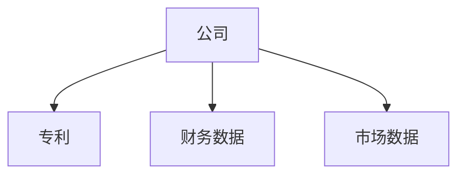
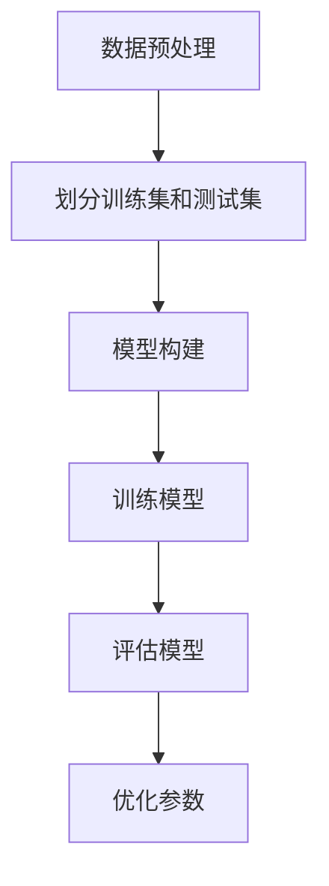
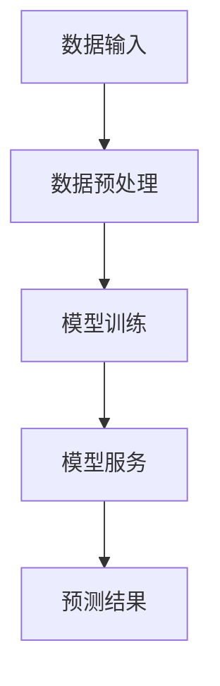
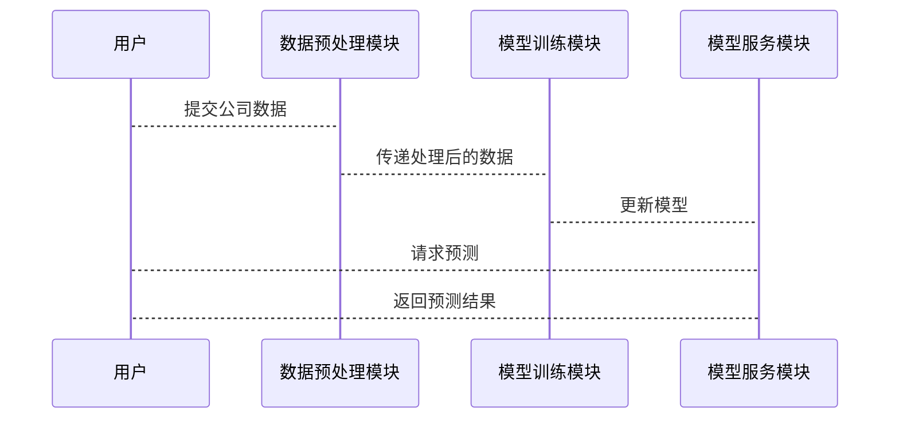

                 


# 深度学习预测公司创新突破概率

> 关键词：深度学习，创新预测，公司创新，概率预测，机器学习，商业智能，数据分析

> 摘要：本文深入探讨了如何利用深度学习技术预测公司创新突破的概率。通过分析公司的历史数据和市场表现，结合深度学习模型的构建与优化，提出了一种基于深度学习的创新预测方法。文章从背景、算法原理、系统架构设计到项目实战，全面解析了如何利用深度学习技术助力商业决策。

---

# 第1章: 深度学习预测公司创新突破概率的背景与基础

## 1.1 公司创新突破的概率预测背景

### 1.1.1 什么是公司创新突破
- 创新突破的定义：公司在市场、技术、产品或商业模式上的重大进展。
- 创新突破的概率：通过数据分析预测公司未来发生创新的概率。

### 1.1.2 深度学习在创新预测中的应用
- 深度学习的核心特点：非线性特征学习、端到端模型、强大的表示能力。
- 创新预测的边界：基于历史数据的统计规律，不考虑黑天鹅事件。

### 1.1.3 为什么选择深度学习
- 数据量大：公司历史数据、市场数据、专利数据等。
- 非线性关系：创新与多种因素相关，如研发投入、团队稳定性、市场环境。
- 高维特征：公司数据通常包含数百个特征，深度学习擅长处理高维数据。

## 1.2 创新突破概率预测的核心要素

### 1.2.1 数据特征分析
- 公司特征：研发投入、员工人数、专利数量。
- 市场特征：行业竞争、市场增长率、政策环境。
- 财务特征：收入增长率、利润率、现金流。

### 1.2.2 深度学习模型的构建
- 模型输入：多维数据特征。
- 模型输出：创新突破的概率（0-1）。
- 模型目标：最小化预测概率与实际值的误差。

### 1.2.3 创新预测的反馈机制
- 模型更新：根据实际结果更新模型。
- 数据闭环：实时收集新数据，优化模型。

---

# 第2章: 深度学习预测模型的核心概念与联系

## 2.1 深度学习模型的核心原理

### 2.1.1 神经网络的基本结构
- 输入层、隐藏层、输出层。
- 每层的神经元通过权重和激活函数连接。

### 2.1.2 深度学习的训练过程
- 前向传播：输入数据经过网络计算输出。
- 损失计算：交叉熵损失。
- 反向传播：计算梯度，更新权重。

### 2.1.3 模型的特征提取能力
- 深度学习自动提取特征，无需人工特征工程。

## 2.2 创新突破概率预测的关键属性对比

### 2.2.1 数据特征的属性分析
- 数量型特征：收入、利润。
- 类别型特征：行业、地区。
- 时间序列特征：增长率、波动性。

### 2.2.2 模型性能的对比
- 准确率、召回率、F1值。
- 模型的稳定性：不同数据集的泛化能力。

### 2.2.3 不同模型的对比分析
- 线性模型（如逻辑回归） vs 深度学习模型（如神经网络）。
- 深度学习模型的非线性特征提取能力。

## 2.3 实体关系图与流程图

### 2.3.1 创新数据的实体关系图（ER图）


### 2.3.2 深度学习模型的训练流程图（Mermaid）


---

# 第3章: 深度学习预测模型的算法原理

## 3.1 深度学习算法的数学模型

### 3.1.1 神经网络的数学表达
- 简单三层神经网络的数学表达：
$$
y = f(x) = \sigma(W_2 \sigma(W_1 x + b_1) + b_2)
$$

### 3.1.2 激活函数的选择与应用
- 常见激活函数：ReLU、sigmoid、tanh。
- 选择激活函数的原则：ReLU适合隐藏层，sigmoid适合输出层。

### 3.1.3 损失函数的计算
- 二分类问题：交叉熵损失：
$$
L = -\sum y \log p(y|x) + (1-y)\log (1-p(y|x))
$$

### 3.1.4 优化算法
- 梯度下降：随机梯度下降（SGD）和小批量梯度下降（BGD）。
- 动量优化：Adam优化器。

## 3.2 深度学习模型的训练流程

### 3.2.1 前向传播
- 输入数据经过网络计算输出概率。

### 3.2.2 损失计算
- 计算预测概率与真实标签的损失。

### 3.2.3 反向传播与参数更新
- 计算梯度，更新权重参数。

## 3.3 深度学习模型的优化策略

### 3.3.1 学习率的调整
- 使用学习率衰减：如指数衰减。
$$
\text{学习率} = \alpha \times \text{衰减率}^{\text{epoch}}
$$

### 3.3.2 正则化的应用
- L2正则化：
$$
L_{\text{正则化}} = \lambda ||W||^2
$$

### 3.3.3 批归一化的实现
- 在每层添加归一化层：
$$
\text{归一化输入} = \frac{x - \mu}{\sigma}
$$

---

# 第4章: 创新突破概率预测的系统分析与架构设计

## 4.1 系统分析

### 4.1.1 问题场景介绍
- 数据来源：公司数据库、公开市场数据、专利数据库。
- 预测目标：单个公司创新概率、行业创新概率。

### 4.1.2 项目目标与范围
- 构建创新预测模型。
- 提供实时预测服务。

### 4.1.3 系统功能需求
- 数据输入：支持多种数据格式。
- 模型训练：支持分布式训练。
- 预测输出：概率值和解释。

## 4.2 系统架构设计

### 4.2.1 系统架构的模块划分
- 数据预处理模块、模型训练模块、预测服务模块。

### 4.2.2 系统架构的Mermaid图


### 4.2.3 系统架构的实现细节
- 数据预处理：特征工程、数据清洗。
- 模型训练：分布式训练、超参数优化。
- 模型服务：API接口、实时预测。

## 4.3 系统接口设计

### 4.3.1 数据接口的设计
- 数据格式：JSON、CSV。
- 数据清洗：处理缺失值、异常值。

### 4.3.2 模型接口的设计
- 接口输入：公司特征向量。
- 接口输出：创新概率。

### 4.3.3 用户接口的设计
- Web界面：用户输入公司信息，获得预测结果。

## 4.4 系统交互设计

### 4.4.1 系统交互的Mermaid序列图


---

# 第5章: 深度学习预测模型的项目实战

## 5.1 环境安装与配置

### 5.1.1 Python环境的搭建
- 安装Python 3.8+。
- 安装Jupyter Notebook。

### 5.1.2 深度学习框架的安装
- 安装TensorFlow或PyTorch。

### 5.1.3 数据集的准备与预处理
- 数据清洗：处理缺失值、标准化。
- 特征编码：将类别型特征转换为数值型。

## 5.2 模型核心代码实现

### 5.2.1 数据特征的提取与编码
```python
import pandas as pd
import numpy as np

# 加载数据
data = pd.read_csv('company_data.csv')

# 特征工程
from sklearn.preprocessing import StandardScaler
scaler = StandardScaler()
scaled_data = scaler.fit_transform(data[['revenue', 'profit', 'employees']])
```

### 5.2.2 模型的定义与训练
```python
import tensorflow as tf
from tensorflow.keras import layers

# 定义模型
model = tf.keras.Sequential([
    layers.Dense(64, activation='relu'),
    layers.Dense(32, activation='relu'),
    layers.Dense(1, activation='sigmoid')
])

# 编译模型
model.compile(optimizer='adam', loss='binary_crossentropy', metrics=['accuracy'])

# 训练模型
model.fit(x_train, y_train, epochs=100, batch_size=32)
```

### 5.2.3 模型的评估与优化
```python
# 评估模型
loss, accuracy = model.evaluate(x_test, y_test)
print(f'Loss: {loss}, Accuracy: {accuracy}')

# 调整超参数
from tensorflow.keras.callbacks import ReduceLROnPlateau
callbacks = [ReduceLROnPlateau(monitor='val_loss', patience=5)]
model.fit(x_train, y_train, epochs=100, batch_size=32, callbacks=callbacks, validation_data=(x_val, y_val))
```

## 5.3 代码应用解读与分析

### 5.3.1 代码的功能分析
- 数据预处理：标准化特征。
- 模型定义：三层神经网络。
- 模型训练：使用Adam优化器和交叉熵损失。

### 5.3.2 模型优化策略
- 学习率衰减：减少训练后期的学习率。
- 正则化：防止过拟合。

## 5.4 实际案例分析与详细讲解剖析

### 5.4.1 案例分析
- 数据来源：某行业公司数据。
- 模型预测：公司创新概率为0.8。

### 5.4.2 案例分析解读
- 预测结果解释：概率0.8表示有80%的可能性公司在未来一年内发生创新突破。
- 模型解释：使用SHAP值分析每个特征对预测结果的影响。

## 5.5 项目小结

### 5.5.1 项目总结
- 成功构建了创新概率预测模型。
- 模型在测试集上表现良好。

### 5.5.2 项目的价值
- 帮助公司制定战略决策。
- 提高投资决策的准确性。

---

# 第6章: 深度学习预测模型的未来展望与挑战

## 6.1 未来展望

### 6.1.1 深度学习技术的演进
- 更复杂的模型结构：如Transformer、Graph Neural Network。
- 自监督学习：减少对标注数据的依赖。

### 6.1.2 创新预测的延伸
- 行业级预测：预测整个行业的创新趋势。
- 个体级预测：预测具体公司的创新概率。

## 6.2 挑战与解决方案

### 6.2.1 数据质量的挑战
- 数据不完整：部分公司数据缺失。
- 数据偏差：样本不均衡。

### 6.2.2 模型解释性的问题
- 深度学习模型的黑箱特性。
- 提高模型的可解释性。

### 6.2.3 实时预测的挑战
- 高频数据处理：实时更新模型。
- 系统延迟：减少预测响应时间。

## 6.3 解决方案

### 6.3.1 数据解决方案
- 数据增强：生成更多数据。
- 数据清洗：自动化处理缺失值。

### 6.3.2 模型解决方案
- 解释性模型：如线性模型、决策树。
- 可视化工具：如SHAP值、LIME解释。

### 6.3.3 系统解决方案
- 分布式计算：提高计算效率。
- 缓存机制：减少重复计算。

---

# 第7章: 深度学习预测模型的总结与展望

## 7.1 本章小结
- 本文构建了一个基于深度学习的公司创新突破概率预测模型。
- 通过实际案例验证了模型的有效性。
- 提出了未来的研究方向和优化建议。

## 7.2 总结
- 深度学习在创新预测中的优势：强大的特征提取能力、非线性关系建模。
- 模型的实际应用价值：帮助企业制定战略决策。

## 7.3 展望
- 更复杂的模型结构：如多模态模型。
- 更广泛的应用场景：如创新风险评估、投资决策支持。

---

# 作者

作者：AI天才研究院/AI Genius Institute & 禅与计算机程序设计艺术 /Zen And The Art of Computer Programming

