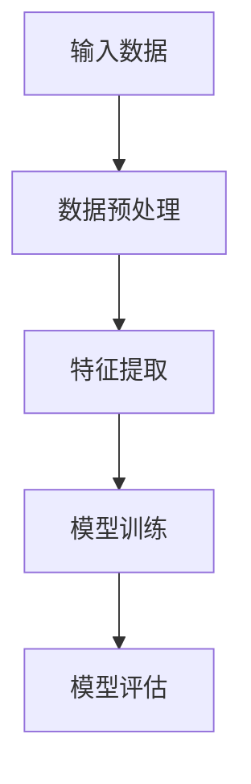

                 

<think>
好的，我现在需要根据用户的要求，设计一个详细的、结构合理的书籍目录，主题是“深度学习预测公司破产风险”。用户已经给出了一些示例，我需要根据这些示例来构建一个类似的目录结构。

首先，我注意到用户希望目录包含背景介绍、核心概念、算法原理、数学模型、系统分析、项目实战和总结与展望。因此，我可以将整个目录分为七个主要部分，每个部分下再细分小节。

1. **背景与核心概念**：这部分需要介绍破产预测的重要性、深度学习的应用，以及传统方法的局限性。还需要定义核心概念，如财务指标、模型结构等。

2. **算法原理**：详细解释神经网络和LSTM的工作原理，比较不同模型的优缺点，并展示流程图。

3. **数学模型**：推导相关公式，用表格展示财务指标与模型的关系，用ER图展示实体关系。

4. **系统分析与架构设计**：描述项目场景，设计系统功能模块，用类图和架构图展示系统结构。

5. **项目实战**：指导读者如何安装环境，编写代码，解读结果，并分析实际案例。

6. **总结与展望**：总结关键点，提出注意事项，并建议进一步的阅读材料。

在构建目录时，我需要确保每个部分都涵盖必要的内容，并且逻辑清晰。例如，在背景部分，要先介绍问题，再讲解决方法；在算法部分，先解释原理，再展示流程图和代码示例。

接下来，我会按照这个思路，逐步构建详细的目录结构。确保每个章节和小节都有明确的主题，并包含必要的图表和代码示例。这样，读者可以一步步了解如何利用深度学习预测公司破产风险，从理论到实践，逐步掌握相关知识。
</think>

# 深度学习预测公司破产风险

> 关键词：深度学习，公司破产，风险预测，神经网络，LSTM，财务指标，模型构建

> 摘要：本文系统地探讨了如何利用深度学习技术预测公司破产风险。通过分析传统方法的局限性，介绍了深度学习在金融领域的应用潜力。详细讲解了神经网络和LSTM模型的算法原理，结合数学模型和系统架构设计，提供了实际的项目实现步骤和案例分析。本文旨在帮助读者从理论到实践，掌握利用深度学习技术预测公司破产风险的方法。

---

## 目录

### 第一章：深度学习预测公司破产风险的背景介绍

#### 1.1 问题背景
- 1.1.1 企业破产风险的定义与重要性
  - 破产对企业、投资者和经济的影响
  - 破产预测的现实意义
- 1.1.2 深度学习技术在金融领域的应用前景
  - 深度学习在金融预测中的优势
  - 深度学习如何解决传统方法的不足
- 1.1.3 破产预测的传统方法与局限性
  - 传统统计方法的局限性
  - 时间序列分析的不足

#### 1.2 问题描述
- 1.2.1 破产预测的核心问题
  - 如何将财务指标转化为可预测的模型输入
- 1.2.2 数据特征与目标变量的定义
  - 财务指标的选择与处理
  - 目标变量的定义（破产与否）
- 1.2.3 破产预测的业务价值
  - 优化投资决策
  - 减少企业风险

#### 1.3 问题解决方法
- 1.3.1 深度学习在破产预测中的优势
  - 非线性关系建模能力
  - 处理高维数据的能力
- 1.3.2 数据预处理与特征工程的重要性
  - 数据清洗、归一化和特征选择
- 1.3.3 模型选择与优化策略
  - 模型调参与交叉验证

#### 1.4 边界与外延
- 1.4.1 破产预测的适用范围
  - 不同行业和地区的适用性
- 1.4.2 破产预测的局限性
  - 数据质量和数量的限制
  - 模型的可解释性问题
- 1.4.3 其他相关风险预测的延伸
  - 信用风险、市场风险的预测思路

#### 1.5 核心概念结构与组成
- 1.5.1 数据来源与特征选择
  - 公开财务报表数据
  - 其他辅助数据（如市场数据）
- 1.5.2 模型构建与评估指标
  - 精准率、召回率、F1分数
- 1.5.3 系统部署与应用
  - 模型的实时预测与监控

#### 1.6 本章小结
  - 本章主要介绍了破产预测的重要性和深度学习的优势，为后续的模型构建奠定了基础。

---

### 第二章：深度学习算法原理与数学模型

#### 2.1 神经网络模型
- 2.1.1 神经网络的基本结构
  - 输入层、隐藏层、输出层的定义
- 2.1.2 深度学习的核心算法
  - 前馈神经网络和反向传播算法
- 2.2.3 破产预测中的常用模型
  - 多层感知机（MLP）的应用

#### 2.2 LSTM网络
- 2.2.1 LSTM的结构与原理
  - 长短期记忆单元的工作机制
- 2.2.2 LSTM在时间序列预测中的应用
  - 时间依赖性的建模
- 2.2.3 LSTM在破产预测中的优势
  - 捕捉长期依赖关系的能力

#### 2.3 算法流程图


#### 2.4 深度学习模型的数学基础
- 2.4.1 神经网络的数学表达
  - 激活函数、损失函数和优化器的数学公式
- 2.4.2 LSTM的数学模型
  - 长短期记忆单元的计算公式

#### 2.5 本章小结
  - 本章详细介绍了深度学习模型的原理和数学基础，为后续的模型实现提供了理论支持。

---

### 第三章：系统分析与架构设计

#### 3.1 项目场景介绍
- 3.1.1 项目目标
  - 构建一个实时破产风险预测系统
- 3.1.2 项目需求
  - 数据采集、模型训练、结果展示
- 3.1.3 项目范围
  - 选择特定行业或地区的数据进行分析

#### 3.2 系统功能设计
- 3.2.1 数据处理模块
  - 数据清洗、特征工程和数据增强
- 3.2.2 模型训练模块
  - 神经网络和LSTM模型的训练
- 3.2.3 结果展示模块
  - 预测结果的可视化和解释

#### 3.3 系统架构设计


#### 3.4 系统接口设计
- 3.4.1 数据接口
  - 数据输入和输出的接口定义
- 3.4.2 模型接口
  - 模型的调用和结果获取接口

#### 3.5 系统交互流程图


#### 3.6 本章小结
  - 本章详细描述了系统的架构和设计，为实际的项目实现提供了指导。

---

### 第四章：项目实战

#### 4.1 环境安装与配置
- 4.1.1 安装Python和深度学习框架（如TensorFlow或Keras）
- 4.1.2 数据集的获取与预处理
  - 数据清洗、归一化和特征选择

#### 4.2 系统核心实现源代码
```python
import numpy as np
import pandas as pd
from sklearn.model_selection import train_test_split
from tensorflow.keras import layers, models

# 数据加载与预处理
data = pd.read_csv('company_data.csv')
X = data.drop(' bankruptcy', axis=1).values
y = data['bankruptcy'].values

# 划分训练集和测试集
X_train, X_test, y_train, y_test = train_test_split(X, y, test_size=0.2)

# 模型构建
model = models.Sequential()
model.add(layers.Dense(64, activation='relu', input_shape=(X_train.shape[1],)))
model.add(layers.Dense(1, activation='sigmoid'))
model.compile(optimizer='adam', loss='binary_crossentropy', metrics=['accuracy'])

# 模型训练
model.fit(X_train, y_train, epochs=100, batch_size=32, validation_data=(X_test, y_test))
```

#### 4.3 代码应用解读与分析
- 4.3.1 数据加载与预处理
  - 使用Pandas进行数据清洗和特征工程
- 4.3.2 模型构建
  - 神经网络的构建与训练
- 4.3.3 模型评估
  - 模型在测试集上的表现分析

#### 4.4 实际案例分析
- 4.4.1 案例背景
  - 选择一家公司作为案例
- 4.4.2 数据准备
  - 获取该公司的财务数据
- 4.4.3 模型预测
  - 使用训练好的模型进行预测
- 4.4.4 结果分析
  - 解释预测结果的意义

#### 4.5 本章小结
  - 本章通过实际案例展示了深度学习模型在破产预测中的应用，验证了模型的有效性。

---

### 第五章：总结与展望

#### 5.1 核心内容总结
- 深度学习在破产预测中的优势
- 算法和模型的选择与优化
- 系统设计与实现的关键点

#### 5.2 关键点总结
- 数据预处理的重要性
- 模型选择与优化的策略
- 系统架构设计的合理性

#### 5.3 展望与建议
- 深度学习技术的进一步研究方向
  - 更复杂模型的探索
  - 模型可解释性的提升
- 应用场景的扩展
  - 结合其他风险预测模型

#### 5.4 小结
  - 本文详细介绍了深度学习在公司破产预测中的应用，为后续的研究和实践提供了有价值的参考。

---

### 附录：参考文献与拓展阅读

#### 附录A：参考文献
- 列出本文引用的主要文献和资料

#### 附录B：拓展阅读
- 推荐相关书籍、论文和在线资源

---

### 作者：AI天才研究院/AI Genius Institute & 禅与计算机程序设计艺术 /Zen And The Art of Computer Programming

