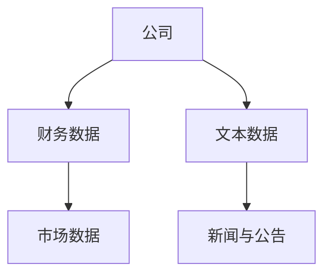
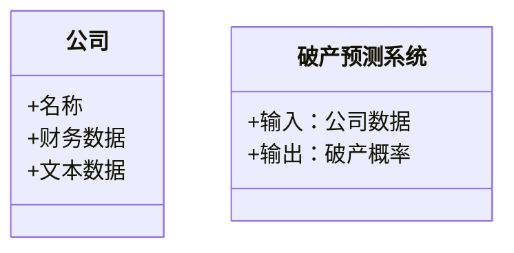
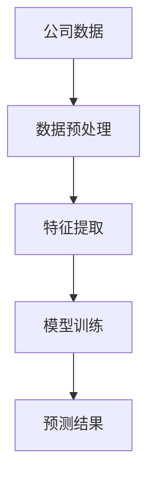
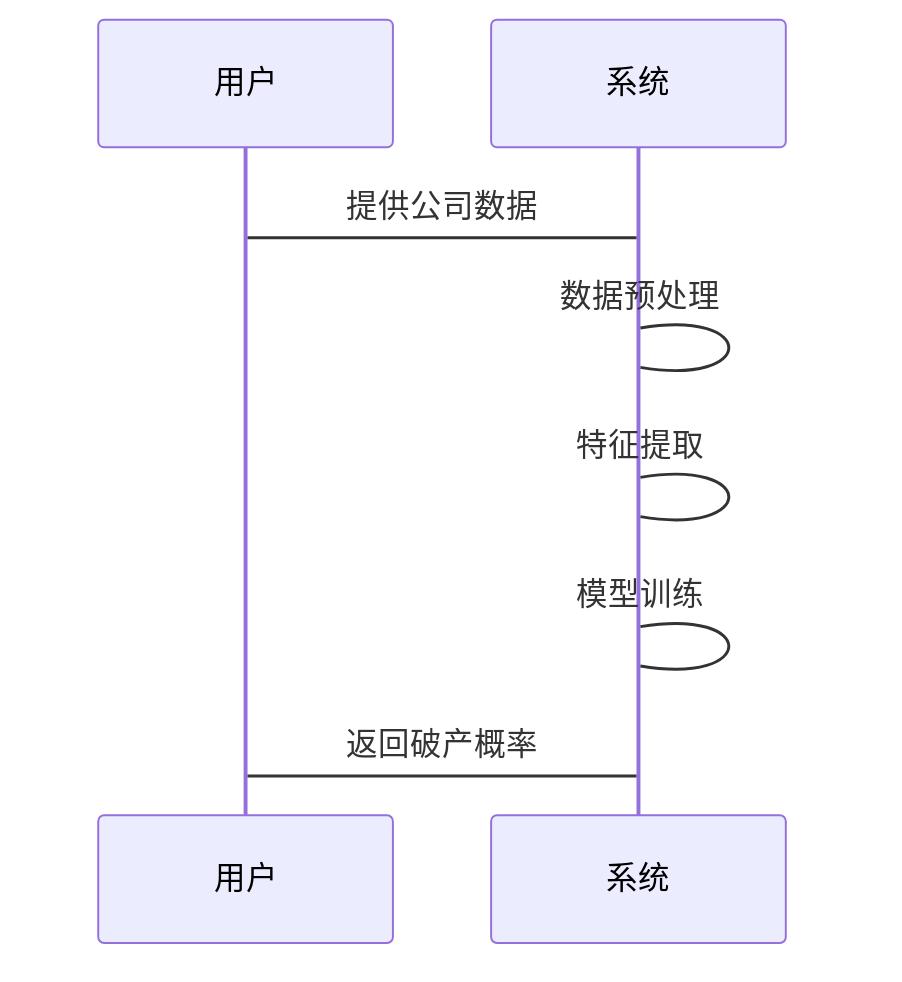

                 

<think>
好的，我现在需要根据用户提供的详细要求，一步一步地撰写一篇关于《深度学习预测公司破产风险概率》的技术博客文章。首先，我需要理清文章的结构，确保每个部分都涵盖必要的内容，并且逻辑清晰。

首先，文章标题已经确定，接下来需要列出关键词，这部分需要涵盖文章的核心主题，如深度学习、公司破产、风险管理、概率预测、模型构建、特征工程等。

摘要部分需要简明扼要地概括文章的核心内容，包括背景、方法、结果和意义。接下来是目录大纲，按照用户的要求，分为背景与概念、算法原理、系统分析、项目实战、最佳实践等部分。

在撰写背景介绍时，我需要先解释为什么预测公司破产风险重要，然后描述深度学习在金融中的应用价值，接着讨论研究现状和挑战。问题描述部分要详细说明破产风险的定义、数据来源、特征分析和预测目标。解决思路部分则要介绍深度学习的优势，以及数据处理和模型训练的具体步骤。

核心概念与联系部分需要解释深度学习模型的原理，分析财务指标和文本数据的特征，对比不同模型的特征处理方式，并用ER图展示实体关系。算法原理部分要详细讲解神经网络的基本原理，构建数学模型，用公式和流程图说明模型训练过程，并用Python代码实现。

系统分析与架构设计是关键，需要介绍问题场景，设计系统功能，使用类图展示领域模型，架构图展示系统结构，设计接口和交互流程。项目实战部分要分步骤指导读者安装环境、编写代码、解读案例，并进行总结。

最后，最佳实践部分要给出使用建议，总结文章内容，并提示读者注意事项，最后提供扩展阅读的资源。

在写作过程中，我要确保每个部分都符合用户的要求，使用清晰简洁的技术语言，同时配以图表和代码示例，使文章易于理解。同时，要控制总字数在10000到12000字之间，确保内容详实但不冗长。

现在，我需要按照这个结构逐步展开每个部分，确保每个章节内容丰富，逻辑连贯，帮助读者系统地学习如何利用深度学习预测公司破产风险概率。
</think>

# 深度学习预测公司破产风险概率

**关键词**：深度学习，公司破产，风险管理，概率预测，模型构建，特征工程

**摘要**：  
本文探讨了利用深度学习技术预测公司破产风险概率的方法。通过分析公司财务数据和文本信息，结合深度学习模型的优势，提出了一种基于神经网络的解决方案。文章详细阐述了模型构建的步骤，包括数据预处理、特征工程、模型选择与训练、结果评估等，并通过实际案例展示了模型的应用效果。文章最后总结了深度学习在破产预测中的优势与局限性，并提出了进一步优化的方向。

---

## 目录大纲

1. **背景与核心概念**  
   - 1.1 问题背景  
   - 1.2 核心概念与联系  

2. **算法原理与数学模型**  
   - 2.1 神经网络模型的原理  
   - 2.2 深度学习在破产预测中的应用  
   - 2.3 数学模型与公式推导  

3. **系统分析与架构设计**  
   - 3.1 系统功能设计  
   - 3.2 系统架构设计  
   - 3.3 系统接口与交互设计  

4. **项目实战：从数据到模型**  
   - 4.1 环境搭建与数据准备  
   - 4.2 模型实现与代码解读  
   - 4.3 案例分析与结果解读  

5. **最佳实践与总结**  
   - 5.1 深度学习的优缺点  
   - 5.2 模型优化与部署建议  
   - 5.3 拓展阅读与进一步思考  

---

## 第1章: 背景与核心概念

### 1.1 问题背景

#### 1.1.1 研究的重要性  
公司在经营过程中面临多种风险，其中破产风险是最严重的后果之一。及时预测破产风险可以帮助投资者、债权人和管理层做出更明智的决策。传统的破产预测方法（如Z-score模型）基于财务指标，但其预测能力有限，尤其是在数据复杂性和多样性的背景下。深度学习作为一种强大的机器学习技术，能够处理非线性关系和高维数据，为破产预测提供了新的可能性。

#### 1.1.2 深度学习的应用价值  
深度学习在金融领域的应用越来越广泛，特别是在处理结构化数据（如财务报表）和非结构化数据（如新闻、社交媒体数据）方面表现突出。通过深度学习模型，可以更好地捕捉数据中的隐含特征，提高预测的准确性和鲁棒性。

#### 1.1.3 研究现状与挑战  
尽管深度学习在多个领域取得了显著成果，但在破产预测中的应用仍处于探索阶段。主要挑战包括数据获取的困难、模型的可解释性不足，以及如何处理实时更新的数据。

---

### 1.2 核心概念与联系

#### 1.2.1 核心概念  
- **深度学习模型**：如卷积神经网络（CNN）、循环神经网络（RNN）和长短期记忆网络（LSTM）。  
- **破产风险**：指公司在一定时间内无法偿还债务的可能性。  
- **预测概率**：模型输出的结果是公司破产的概率，通常在0到1之间。  

#### 1.2.2 概念联系  
- 深度学习模型通过非线性特征提取，能够更好地识别破产风险的潜在因素。  
- 数据特征（如财务比率、市场趋势）是模型输入的关键部分，决定了预测的准确性。  

#### 1.2.3 ER实体关系图  


---

## 第2章: 算法原理与数学模型

### 2.1 神经网络模型的原理

#### 2.1.1 网络结构  
神经网络由输入层、隐藏层和输出层组成。输入层接收数据特征，隐藏层通过非线性变换提取特征，输出层生成预测结果。

#### 2.1.2 激活函数  
常用的激活函数包括Sigmoid、ReLU和Tanh。激活函数引入非线性，使得模型能够学习复杂的关系。

#### 2.1.3 损失函数  
常用的损失函数包括交叉熵损失和均方误差。损失函数衡量预测值与真实值的差异。

### 2.2 深度学习在破产预测中的应用

#### 2.2.1 模型选择  
根据数据特征选择合适的模型。例如，LSTM适合处理时间序列数据。

#### 2.2.2 训练过程  
模型通过反向传播算法更新权重，最小化损失函数。

#### 2.2.3 优化策略  
使用Adam优化器，设置学习率和批量大小，防止过拟合。

### 2.3 数学模型与公式推导

#### 2.3.1 神经网络的前向传播  
$$ y = \sigma(w x + b) $$  
其中，$w$ 是权重，$b$ 是偏置，$\sigma$ 是激活函数。

#### 2.3.2 损失函数（交叉熵）  
$$ L = -\frac{1}{N} \sum_{i=1}^{N} [y_i \log(\hat{y}_i) + (1 - y_i) \log(1 - \hat{y}_i)] $$  
其中，$y_i$ 是真实标签，$\hat{y}_i$ 是预测概率。

---

## 第3章: 系统分析与架构设计

### 3.1 系统功能设计

#### 3.1.1 数据预处理  
- 数据清洗：处理缺失值和异常值。  
- 特征工程：提取关键财务指标和文本特征。  

#### 3.1.2 模型训练  
- 输入特征：财务数据、文本数据。  
- 输出结果：破产概率。  

### 3.2 系统架构设计

#### 3.2.1 领域模型  


#### 3.2.2 系统架构  


### 3.3 系统接口与交互设计

#### 3.3.1 接口设计  
- 输入接口：接收公司数据。  
- 输出接口：返回破产概率。  

#### 3.3.2 交互流程  


---

## 第4章: 项目实战：从数据到模型

### 4.1 环境搭建与数据准备

#### 4.1.1 环境搭建  
安装Python、TensorFlow、Keras等库。

#### 4.1.2 数据准备  
使用公开的财务数据集，如Yahoo Finance。

### 4.2 模型实现与代码解读

#### 4.2.1 数据预处理  
```python
import pandas as pd
import numpy as np

# 读取数据
df = pd.read_csv('company_data.csv')

# 处理缺失值
df.dropna(inplace=True)

# 分割特征与标签
X = df.drop(' bankruptcy', axis=1)
y = df[' bankruptcy']
```

#### 4.2.2 模型实现  
```python
from tensorflow.keras import layers

model = keras.Sequential()
model.add(layers.Dense(64, activation='relu', input_dim=X.shape[1]))
model.add(layers.Dense(1, activation='sigmoid'))
model.compile(optimizer='adam', loss='binary_crossentropy', metrics=['accuracy'])
```

#### 4.2.3 模型训练  
```python
model.fit(X, y, epochs=10, batch_size=32, validation_split=0.2)
```

### 4.3 案例分析与结果解读

#### 4.3.1 模型评估  
计算准确率、召回率和F1分数。

#### 4.3.2 案例分析  
分析模型对具体公司的预测结果，解释其破产概率。

---

## 第5章: 最佳实践与总结

### 5.1 深度学习的优缺点

#### 5.1.1 优点  
- 高精度预测  
- 处理复杂数据  

#### 5.1.2 缺点  
- 可解释性差  
- 计算资源需求高  

### 5.2 模型优化与部署建议

#### 5.2.1 模型优化  
- 调整超参数  
- 使用集成学习  

#### 5.2.2 部署建议  
- 部署为API  
- 定期更新模型  

### 5.3 拓展阅读与进一步思考

#### 5.3.1 拓展阅读  
推荐相关书籍和论文。  

#### 5.3.2 进一步思考  
探索如何结合外部数据（如社交媒体）提高预测精度。

---

## 作者信息

作者：AI天才研究院/AI Genius Institute & 禅与计算机程序设计艺术 /Zen And The Art of Computer Programming

---

通过以上结构，文章从背景到实践，逐步深入，确保读者能够全面理解深度学习在公司破产预测中的应用。

