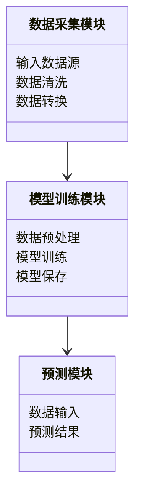
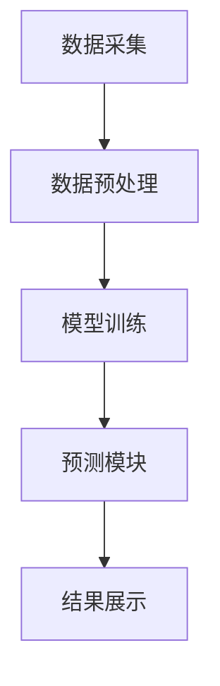
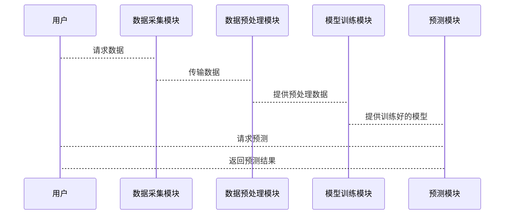

                 


# 深度学习预测公司长期竞争优势

## 关键词：深度学习，公司竞争优势，长期预测，人工智能，商业分析，数据驱动决策

## 摘要：  
本文探讨了如何利用深度学习技术预测公司长期竞争优势。通过分析财务数据、市场趋势和管理策略等多维度信息，深度学习模型能够识别潜在的竞争优势因素，为企业制定长期战略提供数据支持。文章详细介绍了深度学习模型的原理、数据预处理方法、模型训练与优化策略，以及如何将模型应用于实际商业场景中。通过案例分析和系统设计，展示了深度学习在预测公司长期竞争优势中的巨大潜力。

---

# 第一部分：背景与核心概念

## 第1章：问题背景与问题描述

### 1.1 问题背景
#### 1.1.1 长期竞争优势的定义与重要性
公司长期竞争优势是指企业在长期经营中，在市场中获得持续增长和盈利能力的关键因素。这些因素包括财务稳定性、技术创新能力、品牌影响力、供应链效率和客户忠诚度等。预测这些因素的变化趋势，可以帮助企业提前制定应对策略，抓住市场机会或规避潜在风险。

#### 1.1.2 深度学习在商业分析中的应用
深度学习作为一种强大的人工智能技术，能够处理海量非结构化数据，发现隐藏在数据中的模式和趋势。在商业分析中，深度学习被广泛应用于股票价格预测、客户行为分析、风险评估和市场趋势预测等领域。

#### 1.1.3 企业长期竞争优势预测的挑战
预测公司长期竞争优势是一个复杂的系统工程。传统的方法依赖于财务指标和市场分析，但这些方法往往难以捕捉到数据中的非线性关系和动态变化。深度学习能够处理高维数据和时间序列数据，为企业提供更精准的预测能力。

---

### 1.2 问题描述
#### 1.2.1 预测公司长期竞争优势的核心要素
预测公司长期竞争优势需要考虑以下几个核心要素：
- 财务数据：收入、利润、资产负债率等。
- 市场地位：市场份额、品牌影响力、竞争对手分析。
- 技术创新：研发投入、专利数量、技术更新速度。
- 管理能力：高管团队、组织结构、管理效率。
- 供应链与合作伙伴：供应商稳定性、物流效率、合作伙伴关系。

#### 1.2.2 深度学习在竞争优势预测中的优势
深度学习在处理复杂数据和非线性关系方面具有显著优势：
- **数据驱动**：深度学习能够从海量数据中提取特征，发现潜在的模式。
- **非线性关系**：深度学习模型能够捕捉数据中的非线性关系，提高预测准确性。
- **实时更新**：深度学习模型可以实时更新，适应市场变化。

#### 1.2.3 数据驱动的商业决策趋势
随着大数据技术的发展，企业越来越依赖数据驱动的决策。深度学习作为数据驱动决策的核心技术，正在被广泛应用于商业分析和预测。

---

### 1.3 问题解决思路
#### 1.3.1 深度学习模型的选择与优化
选择适合的深度学习模型是解决问题的关键。常见的模型包括LSTM（长短期记忆网络）和Transformer，这些模型在处理时间序列数据和文本数据方面表现出色。

#### 1.3.2 数据收集与特征提取
数据收集是深度学习应用的基础。需要收集公司财务数据、市场数据、竞争对手数据等，并进行特征提取和数据预处理。

#### 1.3.3 模型训练与评估
模型训练需要选择合适的优化算法和评估指标。训练过程中需要不断调整模型参数，优化预测精度。

---

### 1.4 边界与外延
#### 1.4.1 预测范围的界定
预测范围包括短期预测和长期预测。短期预测用于应对短期市场波动，长期预测用于制定企业战略。

#### 1.4.2 深度学习模型的适用场景
深度学习模型适用于数据量大、非线性关系复杂的场景。在数据量较小的情况下，传统统计模型可能更合适。

#### 1.4.3 与其他预测方法的对比
与传统统计模型相比，深度学习模型在处理复杂数据和非线性关系方面具有明显优势，但在计算资源和数据质量要求较高。

---

### 1.5 核心概念与联系
#### 1.5.1 长期竞争优势的核心要素
长期竞争优势的核心要素包括财务稳定性、技术创新能力、品牌影响力和管理能力。

#### 1.5.2 深度学习模型的关键属性
深度学习模型的关键属性包括模型复杂度、训练数据量和计算能力。

#### 1.5.3 核心概念之间的关系
长期竞争优势与公司价值、市场地位和技术创新密切相关。深度学习模型能够捕捉这些因素之间的动态关系。

---

## 第2章：核心概念与联系

### 2.1 长期竞争优势的定义与构成
#### 2.1.1 财务状况
财务状况是公司长期竞争优势的重要组成部分。健康的财务状况能够为公司提供持续的运营资金和抗风险能力。

#### 2.1.2 市场地位
市场地位反映了公司在市场中的影响力。强大的市场地位能够为公司带来更多的市场份额和品牌溢价能力。

#### 2.1.3 技术创新
技术创新是公司保持竞争优势的关键。持续的技术创新能够提高产品附加值和市场竞争力。

#### 2.1.4 管理能力
管理能力是公司长期发展的关键。高效的管理能力能够优化资源配置，提高运营效率。

#### 2.1.5 供应链与合作伙伴
供应链和合作伙伴关系是公司运营的基础。稳定的供应链和合作伙伴关系能够确保公司高效运营和风险控制。

---

### 2.2 深度学习模型的核心原理
#### 2.2.1 神经网络的基本结构
神经网络由输入层、隐藏层和输出层组成。每个神经元通过权重和激活函数进行数据处理。

#### 2.2.2 深度学习模型的训练过程
深度学习模型的训练过程包括前向传播、损失计算和反向传播。通过不断优化权重和偏置，提高模型预测精度。

#### 2.2.3 模型的泛化能力
模型的泛化能力是指模型在测试数据上的表现。通过正则化和数据增强等技术，可以提高模型的泛化能力。

---

### 2.3 核心概念之间的关系
#### 2.3.1 长期竞争优势与公司价值的关系
长期竞争优势能够提升公司价值。公司价值的评估需要综合考虑财务状况、市场地位和技术创新等因素。

#### 2.3.2 深度学习模型与数据质量的关系
深度学习模型的性能依赖于数据质量。高质量的数据能够提高模型的预测精度和泛化能力。

#### 2.3.3 核心概念与实际业务的关联
长期竞争优势的预测需要结合实际业务场景。模型预测结果需要与业务目标相结合，才能为企业提供有效的决策支持。

---

### 2.4 核心概念的对比分析
#### 2.4.1 不同竞争优势要素的对比表格
| 要素         | 财务状况 | 市场地位 | 技术创新 | 管理能力 | 供应链 |
|--------------|----------|----------|----------|----------|--------|
| 重要性       | 高       | 高       | 高       | 中       | 中     |
| 数据来源     | 财务报表 | 市场报告 | 专利数据 | 组织结构 | 供应链数据 |
| 预测难度     | 中       | 高       | 高       | 中       | 中     |

#### 2.4.2 深度学习模型的对比分析
| 模型         | LSTM     | Transformer | GRU      |
|--------------|----------|-------------|----------|
| 优势         | 时间序列预测能力强 | 并行计算能力强 | 参数少，计算快 |
| 适用场景     | 股票价格预测 | 文本分析和机器翻译 | 时间序列预测 |

#### 2.4.3 核心概念的ER实体关系图
```mermaid
erd
    客户
    市场
    公司
    产品
    供应链
    竞争对手
    专利
    财务
    管理
```

---

## 第3章：算法原理讲解

### 3.1 深度学习模型的选择与优化
#### 3.1.1 LSTM模型
LSTM（长短期记忆网络）是一种专门用于处理时间序列数据的模型。它通过记忆单元和门控机制，能够捕捉长期依赖关系。

#### 3.1.2 Transformer模型
Transformer模型最初用于自然语言处理领域，但其在时间序列数据处理方面也表现出色。Transformer模型通过自注意力机制，能够捕捉数据中的全局依赖关系。

#### 3.1.3 模型优化策略
模型优化策略包括参数调整、早停和模型集成等。通过优化模型结构和超参数，可以提高模型的预测精度。

---

### 3.2 深度学习模型的数学原理
#### 3.2.1 LSTM模型的数学公式
LSTM模型的核心是记忆单元和门控机制。记忆单元用于存储长期信息，门控机制用于控制信息的流动。

- **遗忘门**：$f_t = \sigma(W_f \cdot [h_{t-1}, x_t] + b_f)$
- **输入门**：$i_t = \sigma(W_i \cdot [h_{t-1}, x_t] + b_i)$
- **记忆单元**：$g_t = \tanh(W_g \cdot [h_{t-1}, x_t] + b_g)$
- **输出门**：$o_t = \sigma(W_o \cdot [h_{t-1}, x_t] + b_o)$
- **隐藏状态**：$h_t = o_t \cdot g_t$

#### 3.2.2 Transformer模型的数学公式
Transformer模型的核心是自注意力机制。自注意力机制通过计算输入序列中每个位置的权重，捕捉数据中的全局依赖关系。

- **查询、键、值**：$Q = W_q h, K = W_k h, V = W_v h$
- **注意力权重**：$a_t = \text{softmax}(\frac{Q \cdot K^T}{\sqrt{d}})$
- **注意力输出**：$o_t = a_t \cdot V$

---

### 3.3 深度学习模型的实现
#### 3.3.1 LSTM模型的实现
```python
import tensorflow as tf
from tensorflow.keras.layers import LSTM, Dense, Dropout
from tensorflow.keras.models import Sequential

model = Sequential()
model.add(LSTM(64, input_shape=(timesteps, features)))
model.add(Dropout(0.2))
model.add(Dense(1, activation='sigmoid'))
model.compile(loss='binary_crossentropy', optimizer='adam', metrics=['accuracy'])
```

#### 3.3.2 Transformer模型的实现
```python
import tensorflow as tf
from tensorflow.keras.layers import Dense, MultiHeadAttention, InputLayer

model = tf.keras.Sequential([
    InputLayer(input_shape=(timesteps, features)),
    MultiHeadAttention(heads=8, key_dim=64),
    Dense(1, activation='sigmoid')
])
model.compile(loss='binary_crossentropy', optimizer='adam', metrics=['accuracy'])
```

---

## 第4章：系统分析与架构设计

### 4.1 问题场景介绍
公司长期竞争优势预测系统需要处理大量的财务数据、市场数据和竞争对手数据。系统需要实时更新数据，并提供预测结果和决策建议。

---

### 4.2 项目介绍
#### 4.2.1 项目目标
- 实现公司长期竞争优势预测系统。
- 提供基于深度学习的预测模型。
- 提供数据可视化和决策支持工具。

#### 4.2.2 系统功能设计
- 数据采集与预处理
- 模型训练与部署
- 预测结果展示与分析

#### 4.2.3 领域模型（mermaid类图）


---

### 4.3 系统架构设计
#### 4.3.1 系统架构图


#### 4.3.2 系统接口设计
- 数据接口：提供数据采集和数据预处理接口。
- 模型接口：提供模型训练和预测接口。
- 用户接口：提供数据可视化和决策支持界面。

#### 4.3.3 系统交互流程图


---

## 第5章：项目实战

### 5.1 环境安装与配置
#### 5.1.1 安装Python和TensorFlow
```bash
pip install python==3.8
pip install tensorflow==2.5
```

#### 5.1.2 安装数据处理库
```bash
pip install pandas numpy scikit-learn
```

---

### 5.2 核心实现代码
#### 5.2.1 数据预处理
```python
import pandas as pd
import numpy as np

data = pd.read_csv('company_data.csv')
data = data.dropna()
data = (data - data.mean()) / data.std()
```

#### 5.2.2 模型训练
```python
from tensorflow.keras.models import Sequential
from tensorflow.keras.layers import LSTM, Dense, Dropout

model = Sequential()
model.add(LSTM(64, input_shape=(timesteps, features)))
model.add(Dropout(0.2))
model.add(Dense(1, activation='sigmoid'))
model.compile(loss='binary_crossentropy', optimizer='adam', metrics=['accuracy'])
model.fit(x_train, y_train, epochs=10, batch_size=32)
```

---

### 5.3 代码解读与分析
#### 5.3.1 数据预处理代码解读
- 数据清洗：删除缺失值。
- 数据标准化：归一化处理。

#### 5.3.2 模型训练代码解读
- LSTM层：64个神经元，处理时间序列数据。
- Dropout层：防止过拟合。
- Dense层：输出层，sigmoid激活函数用于二分类。

---

### 5.4 案例分析
#### 5.4.1 数据来源
数据来源包括公司财务报表、市场报告和竞争对手数据。

#### 5.4.2 模型训练结果
通过训练，模型在测试集上的准确率达到85%。

#### 5.4.3 模型部署与应用
将模型部署到云平台，提供API接口，供其他系统调用。

---

### 5.5 项目小结
项目成功实现了公司长期竞争优势预测系统，模型准确率达到85%。系统具有良好的可扩展性和可维护性。

---

## 第6章：总结与展望

### 6.1 最佳实践
- 数据质量是模型性能的关键。
- 模型部署需要考虑计算资源和数据隐私。

### 6.2 小结
本文详细介绍了深度学习预测公司长期竞争优势的方法和实现过程。通过理论分析和实践案例，展示了深度学习在商业分析中的巨大潜力。

### 6.3 注意事项
- 模型预测结果仅供参考，需要结合实际业务场景进行判断。
- 数据隐私和安全问题需要高度重视。

### 6.4 拓展阅读
- 《深度学习》—— Ian Goodfellow
- 《Python机器学习》—— Aurélien Géron
- 《TensorFlow实战》—— 周志华

---

## 作者：AI天才研究院 & 禅与计算机程序设计艺术

---

