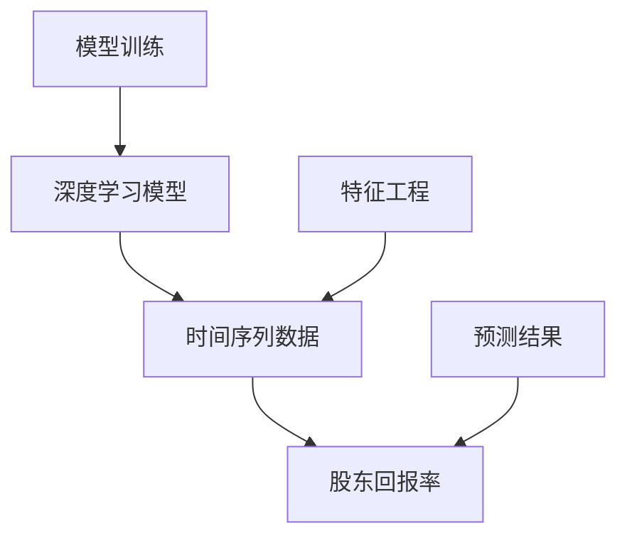
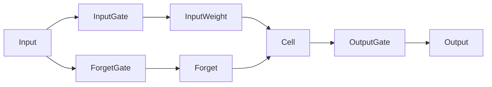
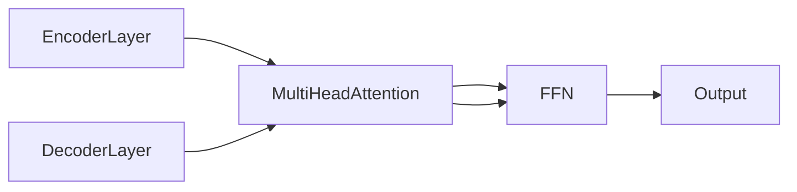
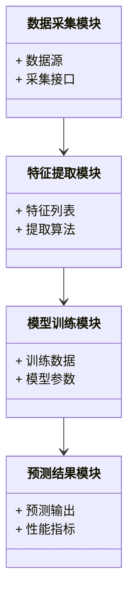
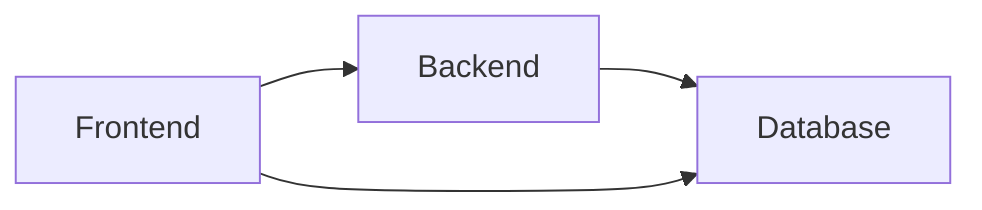
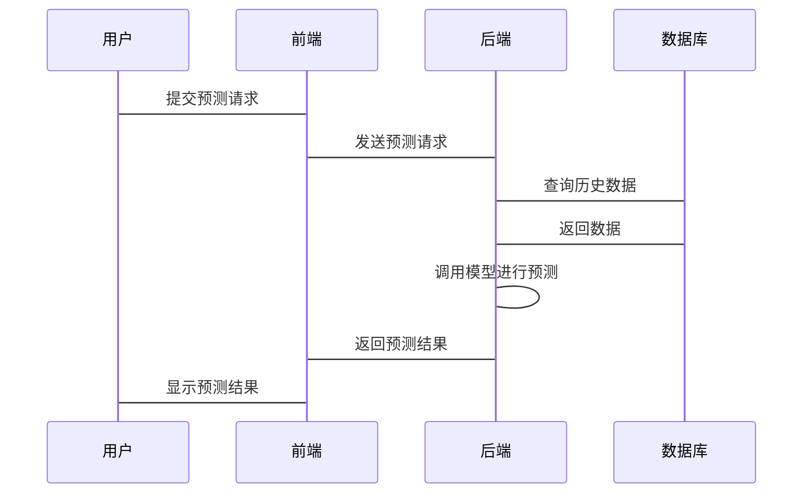

                 


# 深度学习预测长期股东回报率

> 关键词：深度学习，股东回报率，时间序列预测，LSTM，Transformer，金融数据分析

> 摘要：本文探讨了如何利用深度学习技术，特别是通过长短期记忆网络（LSTM）和Transformer模型，来预测长期股东回报率。文章从背景介绍、核心概念、算法原理、系统设计、项目实战等多方面展开，详细分析了深度学习在金融投资中的应用潜力，并通过实际案例展示了模型的预测效果和优化方法。

---

# 第一部分: 深度学习与长期股东回报率预测的背景与核心概念

## 第1章: 深度学习与长期股东回报率预测的背景

### 1.1 问题背景

#### 1.1.1 传统股票投资分析的局限性
传统的股票投资分析主要依赖于基本面分析和技术分析。基本面分析关注公司的财务状况、行业地位等因素，技术分析则依赖于价格走势、成交量等市场数据。然而，这两种方法都存在一定的局限性：
- **基本面分析**：难以量化公司未来的表现，且受外部环境（如政策、经济周期）的影响较大。
- **技术分析**：依赖历史价格数据，但在面对市场波动和突发事件时，预测能力有限。

#### 1.1.2 深度学习在金融预测中的优势
深度学习是一种基于人工神经网络的机器学习方法，具有以下优势：
- **非线性建模能力**：能够捕捉数据中的复杂模式。
- **自动特征提取**：无需手动提取特征，可以处理高维数据。
- **适应性**：能够动态适应市场变化，适用于时间序列预测。

#### 1.1.3 长期股东回报率预测的重要性
长期股东回报率反映了投资者在较长时期内获得的收益，是评估投资价值的重要指标。准确预测长期回报率可以帮助投资者制定更科学的投资策略，优化资产配置。

### 1.2 问题描述

#### 1.2.1 股东回报率的定义与计算方法
股东回报率（ROE）是衡量公司盈利能力的重要指标，计算公式为：
$$ROE = \frac{\text{净利润}}{\text{股东权益}}$$

#### 1.2.2 长期回报率预测的挑战
长期回报率预测面临以下挑战：
- 数据稀疏性：历史数据有限，难以捕捉长期趋势。
- 市场波动：市场波动较大，影响预测的稳定性。
- 多因素影响：经济环境、行业趋势、公司策略等多因素共同作用。

#### 1.2.3 深度学习在时间序列预测中的应用
深度学习在时间序列预测中的应用日益广泛，尤其是在处理复杂金融数据时表现突出。深度学习模型（如LSTM和Transformer）能够捕捉时间依赖性，适用于股票价格、回报率等金融指标的预测。

### 1.3 问题解决

#### 1.3.1 深度学习模型在时间序列预测中的优势
深度学习模型在时间序列预测中的优势包括：
- **记忆能力**：能够记住长期依赖关系。
- **非线性建模**：能够捕捉复杂的时间模式。
- **自动特征提取**：无需手动提取特征。

#### 1.3.2 数据特征与模型选择的策略
选择合适的模型需要考虑以下因素：
- 数据特征：包括历史回报率、市场指数、公司财务指标等。
- 模型性能：比较不同模型（如LSTM、GRU、Transformer）在特定数据上的表现。
- 计算资源：模型的复杂度和训练时间对计算资源的要求。

#### 1.3.3 模型训练与优化的关键点
- **数据预处理**：标准化、去噪处理。
- **模型调参**：选择合适的超参数（如学习率、批量大小）。
- **交叉验证**：评估模型的泛化能力。

### 1.4 边界与外延

#### 1.4.1 模型的适用范围与局限性
- **适用范围**：适用于具有明显时间依赖性的数据。
- **局限性**：模型对数据质量和数量的要求较高，且解释性较差。

#### 1.4.2 数据质量对预测结果的影响
- 数据噪声：会影响模型的预测能力。
- 数据偏差：可能导致模型过拟合特定市场情况。

#### 1.4.3 模型的可解释性与实际应用的平衡
深度学习模型通常具有“黑箱”特性，可解释性较差。在实际应用中，需要在模型的预测能力和可解释性之间进行权衡。

### 1.5 核心概念与联系

#### 1.5.1 核心概念原理
- **时间序列预测**：基于历史数据预测未来的趋势。
- **深度学习模型**：利用神经网络捕捉数据中的复杂模式。

#### 1.5.2 核心概念属性特征对比表格
| 概念       | 特征1 | 特征2 | 特征3 |
|------------|-------|-------|-------|
| 深度学习    | 非线性 | 大规模 | 多层结构 |
| 时间序列预测 | 时序性 | 趋势性 | 周期性 |
| 股东回报率  | 财务指标 | 投资价值 | 市场表现 |

#### 1.5.3 ER实体关系图架构的 Mermaid 流程图


---

## 第2章: 长期股东回报率预测的核心概念

### 2.1 长期股东回报率的定义与计算

#### 2.1.1 股东回报率的计算公式
$$ROE = \frac{\text{净利润}}{\text{股东权益}}$$

#### 2.1.2 长期回报率的特征分析
长期回报率具有以下特征：
- 时间依赖性：过去的表现可能影响未来。
- 多因素影响：受宏观经济、行业趋势、公司策略等因素影响。

#### 2.1.3 深度学习在长期回报率预测中的应用
深度学习模型能够捕捉长期回报率中的复杂模式，适用于预测未来的回报趋势。

---

# 第二部分: 深度学习算法与长期股东回报率预测

## 第3章: 基于深度学习的长期股东回报率预测算法

### 3.1 LSTM网络原理与实现

#### 3.1.1 LSTM的结构与工作原理
LSTM（长短期记忆网络）通过门控机制和记忆单元来捕捉长期依赖关系。LSTM的结构包括：
- **输入门**：控制信息的输入。
- **遗忘门**：决定遗忘哪些信息。
- **输出门**：生成输出。

#### 3.1.2 LSTM的门控机制与数学公式
LSTM的门控机制可以通过以下公式表示：
$$
f_t = \sigma(W_f \cdot [h_{t-1}, x_t] + b_f)
$$
$$
i_t = \sigma(W_i \cdot [h_{t-1}, x_t] + b_i)
$$
$$
o_t = \sigma(W_o \cdot [h_{t-1}, x_t] + b_o)
$$
$$
c_t = f_t \cdot c_{t-1} + i_t \cdot tanh(W_c \cdot [h_{t-1}, x_t] + b_c)
$$
$$
h_t = o_t \cdot tanh(c_t)
$$
其中，$f_t$是遗忘门，$i_t$是输入门，$o_t$是输出门，$c_t$是记忆单元，$h_t$是隐藏状态。

#### 3.1.3 LSTM的Mermaid结构图


### 3.2 Transformer模型原理与实现

#### 3.2.1 Transformer的结构与工作原理
Transformer由编码器和解码器组成，编码器负责将输入序列映射到一个向量空间，解码器负责生成输出序列。编码器和解码器都包含多个层，每层包括多头自注意力机制和前馈神经网络。

#### 3.2.2 Transformer的自注意力机制与数学公式
自注意力机制通过计算输入序列中每个位置的权重来生成输出：
$$
\text{Attention}(Q, K, V) = \text{softmax}\left(\frac{QK^T}{\sqrt{d_k}}\right)V
$$
其中，$Q$是查询向量，$K$是键向量，$V$是值向量，$d_k$是向量的维度。

#### 3.2.3 Transformer的Mermaid结构图


### 3.3 深度学习模型的数学模型与公式

#### 3.3.1 深度学习模型的数学表达
深度学习模型可以表示为：
$$
y = f(x; \theta)
$$
其中，$x$是输入数据，$\theta$是模型参数，$y$是输出。

#### 3.3.2 深度学习模型的优化目标
模型的优化目标是最小化预测误差：
$$
\min_{\theta} \mathbb{E}_{(x,y)}[L(y, f(x; \theta))]
$$
其中，$L$是损失函数。

---

## 第4章: 深度学习算法的实现与优化

### 4.1 深度学习模型的实现

#### 4.1.1 模型的选择与训练
选择合适的模型（如LSTM或Transformer）并进行训练，训练过程中需要进行参数调整和超参数优化。

#### 4.1.2 模型的训练过程
训练过程包括数据预处理、模型定义、损失函数计算、反向传播和参数更新。

#### 4.1.3 模型的评估与优化
通过交叉验证和性能指标（如MAE、MSE、R²）评估模型的性能，并进行优化。

### 4.2 深度学习模型的优化

#### 4.2.1 超参数优化
调整学习率、批量大小、隐藏层大小等超参数，以提高模型性能。

#### 4.2.2 正则化技术
使用Dropout、L2正则化等技术防止过拟合。

#### 4.2.3 模型集成
通过集成多个模型（如投票法、加权平均）提高预测的准确性和稳定性。

---

# 第三部分: 系统设计与实现

## 第5章: 系统分析与架构设计

### 5.1 问题场景介绍

#### 5.1.1 项目背景
本项目旨在利用深度学习技术预测长期股东回报率，帮助投资者制定科学的投资策略。

#### 5.1.2 系统功能需求
系统需要实现以下功能：
- 数据采集与预处理
- 特征提取与模型训练
- 回报率预测与结果分析

### 5.2 系统功能设计

#### 5.2.1 数据流分析
系统需要处理以下数据流：
- 历史股价数据
- 公司财务数据
- 市场指数数据

#### 5.2.2 功能模块划分
系统功能模块包括：
- 数据采集模块
- 特征提取模块
- 模型训练模块
- 预测结果模块

#### 5.2.3 系统功能的ER类图


### 5.3 系统架构设计

#### 5.3.1 系统架构概述
系统采用微服务架构，包括前端、后端和数据存储三部分。

#### 5.3.2 系统架构的Mermaid架构图


#### 5.3.3 系统接口设计
系统接口包括：
- 数据接口：用于数据采集和存储。
- 模型接口：用于模型训练和预测。
- 结果接口：用于结果展示和分析。

### 5.4 系统交互设计

#### 5.4.1 系统交互流程
用户通过前端界面提交预测请求，系统后端接收请求并调用模型进行预测，最后将结果返回给用户。

#### 5.4.2 系统交互的Mermaid序列图


---

## 第6章: 项目实战与代码实现

### 6.1 项目环境与工具安装

#### 6.1.1 安装Anaconda
安装Anaconda环境，并配置Python 3.8及以上版本。

#### 6.1.2 安装TensorFlow
使用以下命令安装TensorFlow：
```bash
pip install tensorflow
```

### 6.2 核心代码实现

#### 6.2.1 数据预处理代码
```python
import pandas as pd
import numpy as np

# 加载数据
data = pd.read_csv('stock_data.csv')

# 数据预处理
from sklearn.preprocessing import MinMaxScaler
scaler = MinMaxScaler()
data_scaled = scaler.fit_transform(data)
```

#### 6.2.2 LSTM模型构建代码
```python
import tensorflow as tf
from tensorflow.keras.layers import LSTM, Dense, Dropout
from tensorflow.keras.models import Sequential

model = Sequential()
model.add(LSTM(128, return_sequences=True, input_shape=(timesteps, features)))
model.add(Dropout(0.2))
model.add(LSTM(64, return_sequences=False))
model.add(Dense(1))
model.compile(optimizer='adam', loss='mean_squared_error')
```

#### 6.2.3 模型训练代码
```python
model.fit(X_train, y_train, epochs=100, batch_size=32, validation_split=0.2)
```

#### 6.2.4 模型预测代码
```python
y_pred = model.predict(X_test)
y_pred_inverse = scaler.inverse_transform(y_pred)
```

### 6.3 项目小结

#### 6.3.1 项目总结
通过本项目，我们实现了基于深度学习的长期股东回报率预测系统，验证了深度学习模型在金融预测中的有效性。

#### 6.3.2 经验与教训
- 数据质量对模型性能影响较大。
- 模型调参需要耐心和经验。
- 模型的可解释性是一个挑战。

---

# 第四部分: 最佳实践与拓展阅读

## 第7章: 最佳实践与注意事项

### 7.1 最佳实践

#### 7.1.1 数据预处理的重要性
数据预处理是模型训练的关键步骤，需要仔细处理数据中的噪声和缺失值。

#### 7.1.2 模型选择与优化
选择合适的模型并进行充分的调参，可以提高模型的预测能力。

#### 7.1.3 模型的可解释性
模型的可解释性是实际应用中的一个重要因素，需要在预测能力和可解释性之间进行平衡。

### 7.2 小结

#### 7.2.1 总结全书内容
本文详细介绍了深度学习在长期股东回报率预测中的应用，从理论到实践，提供了完整的解决方案。

#### 7.2.2 强调关键点
- 深度学习模型在时间序列预测中的优势。
- 模型选择和调参的重要性。
- 数据质量对模型性能的影响。

## 第8章: 拓展阅读与深入学习

### 8.1 拓展阅读

#### 8.1.1 深度学习在金融领域的应用
- 《Deep Learning for Financial Time Series》
- 《机器学习在金融中的应用》

#### 8.1.2 时间序列预测的经典模型
- 《时间序列分析》
- 《ARIMA模型与LSTM的对比》

#### 8.1.3 深度学习的最新研究
- Transformer在时间序列预测中的应用
- 图神经网络在金融预测中的应用

### 8.2 深入学习

#### 8.2.1 提升方向
- 研究更先进的模型（如图神经网络、混合模型）。
- 探索多模态数据的融合方法。

#### 8.2.2 实践建议
- 多参与 Kaggle 等数据科学竞赛。
- 关注学术论文和技术博客，保持技术更新。

---

# 作者：AI天才研究院/AI Genius Institute & 禅与计算机程序设计艺术/Zen And The Art of Computer Programming

