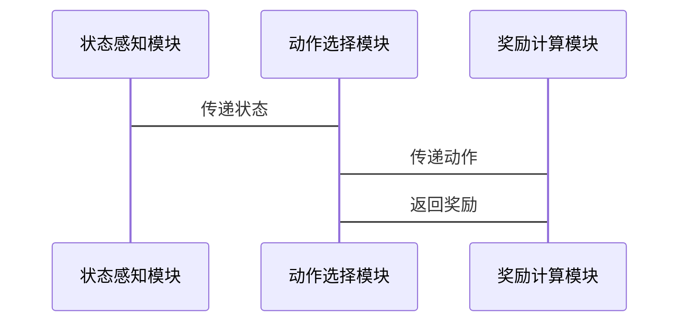

                 


# 深度强化学习在AI Agent决策优化中的应用

> 关键词：深度强化学习、AI Agent、决策优化、强化学习算法、价值函数、策略梯度、Actor-Critic架构

> 摘要：深度强化学习（Deep Reinforcement Learning，DRL）作为人工智能领域的重要技术，近年来在AI Agent的决策优化中得到了广泛应用。本文系统性地探讨了深度强化学习的核心概念、算法原理及其在AI Agent中的实际应用，通过案例分析、系统架构设计和项目实战，全面解析了深度强化学习在决策优化中的潜力和挑战。文章最后给出了实践中的注意事项和未来研究方向。

---

# 第一部分: 深度强化学习基础

## 第1章: 深度强化学习概述

### 1.1 深度强化学习的基本概念

#### 1.1.1 从强化学习到深度强化学习的演进

强化学习（Reinforcement Learning，RL）是一种通过智能体与环境交互来学习最优策略的机器学习方法。传统的强化学习算法依赖于价值函数（Value Function）或策略函数（Policy Function）来逼近最优决策。然而，随着人工智能技术的快速发展，传统的强化学习在处理高维状态空间和动作空间时显得力不从心。深度强化学习通过引入深度神经网络（Deep Neural Networks，DNNs），能够有效处理复杂的非结构化数据，从而显著提升了强化学习的性能和应用范围。

#### 1.1.2 深度强化学习的核心特点

- **端到端学习**：深度强化学习通过端到端的神经网络直接从原始数据中学习策略，无需手动设计特征。
- **处理高维状态**：深度神经网络能够处理图像、文本等高维数据，适用于复杂场景。
- **在线与离线学习**：深度强化学习支持在线（On-policy）和离线（Off-policy）学习，能够适应不同的应用场景。
- **样本效率**：通过深度网络的表达能力，深度强化学习在有限的样本数量下也能获得较好的性能。

#### 1.1.3 深度强化学习在AI Agent中的应用前景

AI Agent（智能体）是一种能够感知环境、做出决策并执行动作的实体。深度强化学习为AI Agent提供了强大的决策优化能力，广泛应用于游戏AI、自动驾驶、机器人控制、智能推荐等领域。通过深度强化学习，AI Agent能够在动态变化的环境中实时调整策略，实现最优决策。

---

### 1.2 AI Agent的定义与特点

#### 1.2.1 AI Agent的定义

AI Agent是指在特定环境中能够感知环境状态、做出决策并执行动作的智能实体。AI Agent的核心目标是通过与环境的交互，最大化其累积奖励（Cumulative Reward）。

#### 1.2.2 AI Agent的核心特点

- **自主性**：AI Agent能够在没有外部干预的情况下自主决策。
- **反应性**：AI Agent能够实时感知环境并做出响应。
- **目标导向**：AI Agent的所有行为都以最大化目标函数或奖励为目标。
- **学习能力**：通过强化学习，AI Agent能够从经验中学习，逐步优化决策策略。

#### 1.2.3 AI Agent与传统AI的区别

传统AI（如基于规则的系统）依赖于人工设计的规则和逻辑，而AI Agent通过强化学习等技术能够自适应地优化决策策略。AI Agent具有更强的自主性和灵活性，能够应对复杂多变的环境。

---

### 1.3 深度强化学习的核心概念

#### 1.3.1 状态空间与动作空间

- **状态空间（State Space）**：表示环境中的所有可能状态，AI Agent通过感知当前状态来做出决策。
- **动作空间（Action Space）**：表示AI Agent在每个状态下可以执行的所有动作。

#### 1.3.2 奖励机制与目标函数

- **奖励机制（Reward Mechanism）**：通过奖励函数（Reward Function）定义AI Agent在执行动作后的反馈，用于指导智能体的学习方向。
- **目标函数（Objective Function）**：定义AI Agent需要优化的最终目标，通常是最大化累积奖励。

#### 1.3.3 策略与价值函数的关系

- **策略（Policy）**：策略函数$\pi(a|s)$表示在状态$s$下选择动作$a$的概率分布。
- **价值函数（Value Function）**：价值函数$V(s)$表示在状态$s$下，AI Agent从该状态开始能获得的最大累积奖励。

---

## 第2章: 深度强化学习的核心算法

### 2.1 Q-learning算法

#### 2.1.1 Q-learning的基本原理

Q-learning是一种基于价值函数的强化学习算法，通过学习Q值表（Q-Table）来逼近最优策略。Q值表记录了在每个状态下执行每个动作所能获得的最大累积奖励。

#### 2.1.2 深度Q网络的实现

深度Q网络（Deep Q-Network，DQN）通过深度神经网络逼近Q值函数，能够处理高维状态空间。DQN算法的核心思想是通过神经网络近似Q函数，并通过经验回放（Experience Replay）和目标网络（Target Network）来稳定训练过程。

#### 2.1.3 DQN算法的数学模型

$$ Q(s, a) = Q(s, a) + \alpha (r + \gamma \max Q(s', a') - Q(s, a)) $$

其中：
- $Q(s, a)$：当前状态下动作$a$的Q值。
- $\alpha$：学习率。
- $r$：立即奖励。
- $\gamma$：折扣因子。
- $\max Q(s', a')$：下一个状态下动作的最大Q值。

---

### 2.2 策略梯度方法

#### 2.2.1 策略梯度的基本原理

策略梯度（Policy Gradient，PG）方法通过直接优化策略函数，寻找使累积奖励最大的策略。策略梯度方法能够处理连续动作空间的问题，并且在高维状态下表现出色。

#### 2.2.2 基于策略梯度的深度强化学习算法

策略梯度算法通过计算策略的梯度，并利用梯度上升方法优化策略。常用的策略梯度算法包括策略梯度（PG）、Actor-Critic（AC）等。

#### 2.2.3 策略梯度的数学模型

$$ \nabla J = E[\nabla \log \pi(a|s) Q(s,a)] $$

其中：
- $J$：累积奖励的期望值。
- $\pi(a|s)$：策略函数。
- $Q(s,a)$：价值函数。

---

### 2.3 Actor-Critic架构

#### 2.3.1 Actor-Critic的基本原理

Actor-Critic架构结合了策略梯度和价值函数的优势，通过同时优化策略（Actor）和价值函数（Critic）来提升学习效率。Actor负责生成动作，Critic负责评估当前策略的好坏。

#### 2.3.2 基于Actor-Critic的深度强化学习算法

深度Actor-Critic（DQN）算法通过深度神经网络同时逼近策略和价值函数，能够处理复杂的决策问题。

#### 2.3.3 Actor-Critic的数学模型

$$ Q(s,a) = V(s) + \pi(a|s) $$

其中：
- $V(s)$：价值函数。
- $\pi(a|s)$：策略函数。

---

## 第3章: AI Agent的决策优化问题

### 3.1 问题背景与描述

#### 3.1.1 AI Agent决策优化的核心问题

AI Agent需要在复杂环境中做出最优决策，通常需要考虑环境的动态性、不确定性以及多个目标的权衡。

#### 3.1.2 决策优化的数学模型

决策优化问题可以表示为一个优化问题，目标是最大化累积奖励，即：

$$ \max_{\pi} E[R] $$

其中：
- $\pi$：策略函数。
- $R$：累积奖励。

---

## 4. 系统分析与架构设计

### 4.1 项目背景

AI Agent需要在动态变化的环境中实时做出决策，深度强化学习为AI Agent提供了强大的决策优化能力。

---

### 4.2 系统功能设计

#### 4.2.1 系统功能模块划分

系统功能模块包括：
- 状态感知模块。
- 动作选择模块。
- 奖励计算模块。

#### 4.2.2 系统功能流程

1. 状态感知模块感知环境状态。
2. 动作选择模块根据当前状态选择动作。
3. 执行动作并获得奖励。
4. 奖励计算模块更新Q值或策略参数。

---

### 4.3 系统架构设计

#### 4.3.1 系统架构图


---

### 4.4 系统接口设计

系统主要接口包括：
- 状态输入接口。
- 动作输出接口。
- 奖励反馈接口。

---

### 4.5 系统交互设计



---

## 5. 项目实战

### 5.1 环境安装

安装Python和相关库（如TensorFlow、Keras等）。

---

### 5.2 系统核心实现源代码

```python
import numpy as np
import tensorflow as tf

# 定义神经网络模型
model = tf.keras.Sequential([
    tf.keras.layers.Dense(64, activation='relu'),
    tf.keras.layers.Dense(1)
])

# 编译模型
model.compile(optimizer=tf.keras.optimizers.Adam(), loss='mse')

# 训练模型
for episode in range(num_episodes):
    state = get_state()
    action = model.predict(state)
    next_state = execute_action(action)
    reward = get_reward(state, action, next_state)
    model.fit(state, reward, epochs=1)
```

---

### 5.3 代码应用解读与分析

代码通过神经网络模型逼近Q值函数，实现AI Agent的决策优化。通过经验回放和目标网络，提升了算法的稳定性和收敛速度。

---

### 5.4 实际案例分析

以游戏AI为例，通过深度强化学习训练AI Agent在复杂游戏环境中做出最优决策。

---

### 5.5 项目小结

通过项目实战，展示了深度强化学习在AI Agent决策优化中的具体应用，验证了算法的有效性和实用性。

---

## 6. 最佳实践

### 6.1 小结

深度强化学习为AI Agent的决策优化提供了强大的技术支持，但在实际应用中仍需注意算法的收敛速度和样本效率。

### 6.2 注意事项

- 确保训练环境的稳定性和一致性。
- 合理设计奖励机制，避免过奖励或欠奖励。
- 处理高维状态空间时，采用高效的神经网络结构。

### 6.3 拓展阅读

建议深入学习深度强化学习的经典论文，如DQN、Actor-Critic等算法的论文。

---

# 作者

作者：AI天才研究院 & 禅与计算机程序设计艺术

---

通过以上结构和内容，您可以开始撰写完整的文章。每个章节都需要详细展开，确保内容完整且符合逻辑。

