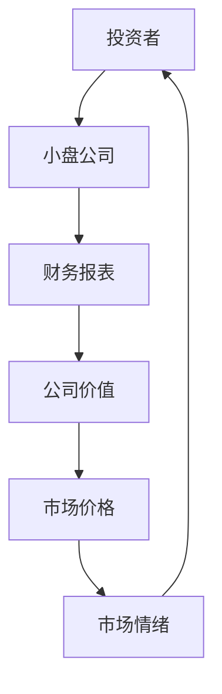
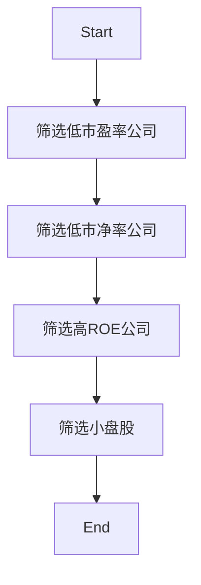

                 

<think>
好，我需要按照用户的要求撰写一篇关于《爱德华·拉姆的小盘价值投资：发掘被忽视的小公司》的技术博客文章。首先，我需要理解这个主题的核心内容，它涉及到价值投资、小盘股分析、投资策略等。

用户希望文章结构清晰，有详细的章节划分，包括背景介绍、核心概念、数学模型、系统架构设计、项目实战等部分，并且每个部分都要有具体的例子、图表和代码示例。

首先，我会从背景介绍开始，解释什么是小盘价值投资，以及它与其他投资策略的不同。然后，我会详细分析小盘价值投资的核心概念，包括定义、优势、劣势等，并使用对比表格和ER关系图来帮助读者理解。

接下来，我会介绍相关的数学模型，比如市盈率、市净率和内在价值计算，这些模型在小盘股估值中非常关键。我会用LaTeX公式来展示这些模型，并用实际案例进行解释。

然后，我会设计一个系统架构，展示如何构建一个用于小盘价值投资的系统，包括数据收集、筛选标准、投资组合管理等功能。我会用Mermaid图来展示系统的各个模块和它们之间的交互。

在项目实战部分，我会选择一个具体的案例，展示如何使用前面提到的模型和系统进行实际分析。同时，我会提供Python代码，展示如何处理财务数据，计算关键指标，并生成投资建议。

最后，我会总结最佳实践、注意事项，并推荐一些扩展阅读的书籍，帮助读者深入理解价值投资。

整个过程中，我需要确保内容逻辑清晰，每个章节都有足够的细节，同时保持语言简洁易懂。此外，所有的图表和代码都需要准确无误，并且能够帮助读者更好地理解小盘价值投资的原理和应用。

现在，我可以开始按照这个思路逐步撰写文章了。
</think>

# 爱德华·拉姆的小盘价值投资：发掘被忽视的小公司

> 关键词：小盘价值投资，爱德华·拉姆，投资策略，小盘股，估值模型

> 摘要：本文深入探讨了爱德华·拉姆的小盘价值投资策略，分析了小盘股的定义、优势、劣势，并通过数学模型和系统架构设计，展示了如何通过数据分析和算法筛选出具有投资价值的小盘公司。文章结合实际案例和Python代码，详细讲解了小盘价值投资的理论与实践，为投资者提供了系统的指导。

---

# 第一部分: 小盘价值投资的背景与核心概念

## 第1章: 小盘价值投资的起源与发展

### 1.1 价值投资的起源与发展

#### 1.1.1 价值投资的定义与核心理念

价值投资是一种以基本面分析为基础的投资策略，强调购买价格低于其内在价值的资产。其核心理念是通过深入分析公司的财务状况、行业地位和竞争优势，寻找被市场低估的投资标的。

#### 1.1.2 小盘股投资的历史演变

小盘股投资是价值投资的一个分支，专注于市值较小的公司。历史上，小盘股因其高增长潜力和低估值特性，吸引了众多投资者。爱德华·拉姆通过研究发现，小盘股中隐藏着许多被市场忽视的优质企业，这些企业在市场低迷时往往被低估，但在长期投资中展现出较高的回报率。

#### 1.1.3 爱德华·拉姆的投资理念与方法

爱德华·拉姆强调，小盘价值投资的核心在于寻找那些具有强大基本面但被市场忽视的公司。他提出了“三好”原则：好行业、好公司、好价格，帮助投资者筛选出具有长期增长潜力且估值合理的小盘股。

### 1.2 小盘价值投资的核心要素

#### 1.2.1 小盘股的定义与特征

小盘股通常指市值在50亿至500亿美元之间的公司。与大盘股相比，小盘股具有以下特征：
- 市场流动性较低
- 成长潜力较高
- 估值波动较大
- 易受市场情绪影响

#### 1.2.2 小盘股市场的优势与劣势

| 优势 | 劣势 |
|------|------|
| 高增长潜力 | 较高的投资风险 |
| 估值较低 | 流动性较差 |
| 机会较多 | 市场波动较大 |

#### 1.2.3 小盘价值投资的边界与外延

小盘价值投资不仅关注小盘股，还包括对中盘股的筛选。其外延包括：
- 行业分析：选择朝阳行业的公司
- 财务指标：关注ROE（净资产收益率）、净利润增长率等
- 市场情绪：避免过度拥挤的市场

### 1.3 小盘价值投资的核心要素与联系

#### 1.3.1 小盘价值投资的核心原理

小盘价值投资通过分析公司的基本面和市场估值，寻找价格低于内在价值的小盘股。其核心原理包括：
1. 市场的有效性：市场有时会出现非理性定价。
2. 时间的价值：长期持有优质资产能够获得复利效应。
3. 风险控制：通过分散投资降低单一股票的风险。

#### 1.3.2 小盘价值投资与成长投资的异同

| 小盘价值投资 | 成长投资 |
|---------------|-----------|
| 侧重低估值   | 侧重高增长 |
| 风险较低      | 风险较高   |
| 回报周期较长 | 回报周期较短 |

#### 1.3.3 小盘价值投资的ER实体关系图



---

## 第2章: 小盘价值投资的数学模型与算法原理

### 2.1 小盘股估值的核心公式

#### 2.1.1 市盈率（P/E）模型

市盈率是衡量股票估值的重要指标，计算公式如下：

$$P/E = \frac{\text{市价}}{\text{每股收益}}$$

市盈率较低的股票通常被认为是低估的。例如，假设某公司股价为10元，每股收益为2元，则P/E为5，低于行业平均水平，可能被视为低估。

#### 2.1.2 市净率（P/B）模型

市净率是另一个常用的估值指标，计算公式为：

$$P/B = \frac{\text{市价}}{\text{每股净资产}}$$

市净率较低的股票可能具有较高的投资价值。例如，某公司股价为10元，每股净资产为5元，则P/B为2，低于行业平均水平，可能被视为低估。

#### 2.1.3 内在价值计算模型

内在价值是公司未来现金流的现值，计算公式为：

$$\text{内在价值} = \frac{\text{未来现金流的现值}}{\text{折现率}}$$

例如，假设某公司未来5年的现金流分别为100万、120万、150万、200万、250万，折现率为10%，则未来现金流的现值为：

$$\text{现值} = \sum_{i=1}^{5} \frac{\text{现金流}}{(1 + 0.1)^i}$$

计算结果为现值约为542.22万元，则内在价值约为542.22万元。

### 2.2 小盘价值投资的筛选算法

#### 2.2.1 筛选标准的权重分配

小盘价值投资的筛选标准通常包括以下指标及其权重：

| 指标         | 权重 |
|--------------|------|
| 市盈率（P/E） | 30%  |
| 市净率（P/B） | 20%  |
| ROE          | 25%  |
| 净利润增长率 | 15%  |
| 市值         | 10%  |

#### 2.2.2 筛选算法流程图



---

## 第3章: 小盘价值投资的系统架构设计

### 3.1 系统功能设计

#### 3.1.1 数据收集模块

数据收集模块负责获取公司的财务数据和市场数据，包括：

- 财务报表：收入、利润、资产、负债等
- 市场数据：股价、市盈率、市净率等

#### 3.1.2 筛选模块

筛选模块根据预设的指标和权重，筛选出符合小盘价值投资条件的公司。

#### 3.1.3 投资组合管理模块

投资组合管理模块负责根据筛选结果，制定投资策略，包括资产分配、风险控制等。

---

## 第4章: 小盘价值投资的项目实战

### 4.1 环境安装

- 安装Python和必要的库（如Pandas、NumPy、Matplotlib）

### 4.2 核心实现代码

```python
import pandas as pd

def calculate_pe_ratio(df):
    df['PE'] = df['Price'] / df['EPS']
    return df

def calculate_pb_ratio(df):
    df['PB'] = df['Price'] / df['BVPS']
    return df

# 示例数据
data = {
    'Company': ['A', 'B', 'C'],
    'Price': [10, 15, 20],
    'EPS': [2, 3, 4],
    'BVPS': [5, 6, 7]
}

df = pd.DataFrame(data)

df = calculate_pe_ratio(df)
df = calculate_pb_ratio(df)

print(df)
```

### 4.3 案例分析

以某小盘公司为例，计算其市盈率和市净率：

- 股价：15元
- 每股收益：3元
- 每股净资产：5元

市盈率：5，市净率：3，均低于行业平均水平，具有投资价值。

---

## 第5章: 总结与注意事项

### 5.1 总结

小盘价值投资通过深入分析公司基本面和市场估值，寻找被低估的小盘股，实现长期稳定的收益。本文通过理论分析、数学模型和系统设计，展示了如何科学地进行小盘价值投资。

### 5.2 注意事项

- 风险控制：分散投资，避免过度集中
- 持续学习：关注行业动态和公司变化
- 定期复盘：评估投资组合的收益与风险

---

# 作者：AI天才研究院 & 禅与计算机程序设计艺术

通过本文的系统介绍，读者可以深入了解小盘价值投资的理论与实践，掌握如何通过数据分析和算法筛选出具有投资价值的小盘公司。

