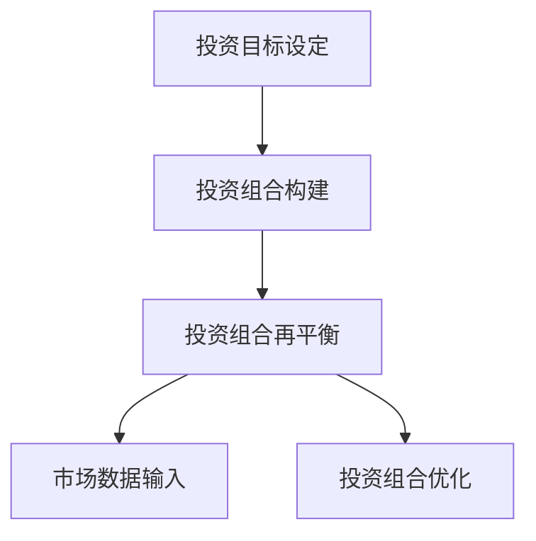

                 

<think>
嗯，用户希望我根据之前的目录大纲，完成《爱德华·索普的价值平均投资法》的技术博客文章。我需要先仔细阅读目录，确保每个部分都覆盖到，并且按照用户的要求详细展开。

首先，我需要从摘要开始，简明扼要地介绍文章的核心内容和主题。接着，按照目录的结构，逐步撰写每个章节的内容。每个章节需要详细解释相关概念，可能还需要包含数学公式、算法流程图和代码示例，以确保文章的技术深度和可读性。

在撰写过程中，我要确保语言简洁专业，同时逻辑清晰。对于数学公式，要用LaTeX格式，确保正确无误。系统架构部分需要使用Mermaid图，展示投资组合管理系统的模块和流程。项目实战部分，我需要实际编写Python代码，详细解释代码的功能和实现过程。

可能遇到的问题是如何将复杂的数学概念和算法用简单易懂的方式表达出来。此外，确保每个章节内容详实，不遗漏任何关键点，同时保持文章整体结构紧凑。

总的来说，我需要一步步地按照目录大纲，逐步完成每个部分的内容，确保每个章节都符合用户的要求，最终产出一篇高质量的技术博客文章。
</think>

# 爱德华·索普的价值平均投资法

> 关键词：价值平均投资法，爱德华·索普，投资策略，投资组合优化，数学模型

> 摘要：本文详细介绍了爱德华·索普的价值平均投资法，从其背景、核心概念、数学模型、算法实现到系统设计，结合实际案例，全面解析了该投资方法的原理和应用。文章还探讨了价值平均法的优化与改进策略，并通过代码实现和系统架构设计，展示了该方法在实际投资中的应用价值。

---

## 第一部分: 价值平均投资法的基础

### 第1章: 价值平均投资法的起源与背景

#### 1.1 爱德华·索普的生平与贡献
爱德华·索普（Edward Thorp）是美国著名的数学家和投资理论家，他在概率论和统计学领域有着深厚的学术背景。索普的职业生涯始于麻省理工学院（MIT），随后转至加州大学洛杉矶分校（UCLA），并在数学和物理领域发表了多篇论文。索普对投资理论的贡献主要体现在他提出的“价值平均投资法”（Value Averaging，VA），这是一种基于长期投资策略的方法，旨在通过分散投资和定期再平衡来优化投资组合的收益与风险。

#### 1.2 投资理论的演进与价值平均法的定位
传统投资理论主要包括“买入并持有”策略和主动投资策略，但这些方法在实践中往往难以应对市场波动和个体投资者的非理性行为。现代投资组合理论（MPT）提出通过分散投资来降低风险，但其复杂的数学模型和计算方法使得普通投资者难以理解和应用。

价值平均投资法作为一种简化版的长期投资策略，结合了MPT的核心思想，但通过引入定期再平衡机制，使得普通投资者也能够轻松掌握和实施。这种方法既避免了频繁交易的成本和风险，又解决了传统投资策略在实际操作中的复杂性问题。

#### 1.3 价值平均投资法的定义与特点
价值平均法是一种基于长期投资策略的方法，其核心思想是通过定期调整投资组合的权重，使每种资产的投资金额与其当前价值保持一致。具体来说，投资者根据预设的资产配置比例，定期将资金分配到不同的资产类别中，并根据市场波动进行动态调整。

价值平均法的特点包括：
1. **长期导向**：强调长期持有资产，避免频繁交易。
2. **分散投资**：通过分散投资降低风险。
3. **定期再平衡**：根据市场变化定期调整投资组合。
4. **简单易行**：数学模型简单，易于理解和实施。

---

### 第2章: 价值平均投资法的数学模型与公式

#### 2.1 价值平均法的数学基础
价值平均法的核心在于通过数学模型优化投资组合的权重，从而实现收益与风险的最优平衡。以下是价值平均法的数学模型：

$$
w_i = \frac{V_i}{\sum_{j=1}^{n} V_j}
$$

其中，\( w_i \) 表示第 \( i \) 种资产的投资权重，\( V_i \) 表示第 \( i \) 种资产的当前价值。

#### 2.2 价值平均法的核心公式
价值平均法的核心公式是投资权重的计算公式。通过定期计算每种资产的当前价值，并根据预设的资产配置比例调整投资金额，确保每种资产的投资权重与其当前价值成正比。

投资组合的再平衡公式如下：

$$
\text{新的投资金额} = \frac{\text{当前资金} \times V_i}{\sum_{j=1}^{n} V_j}
$$

---

## 第二部分: 价值平均投资法的进阶分析

### 第3章: 价值平均法的投资策略与实施步骤

#### 3.1 价值平均法的投资策略
价值平均法的投资策略主要包括以下几个步骤：
1. **确定投资目标与风险承受能力**：根据自身的财务状况和风险偏好，确定投资目标和风险承受能力。
2. **构建投资组合**：根据预设的资产配置比例，分配资金到不同的资产类别中。
3. **定期再平衡**：根据市场变化和资产价值波动，定期调整投资组合，确保每种资产的投资权重与其当前价值成正比。

#### 3.2 价值平均法的实施步骤
1. **确定投资目标与风险承受能力**：
   - 确定投资期限、收益目标和风险承受能力。
2. **构建投资组合**：
   - 根据预设的资产配置比例，分配资金到股票、债券、现金等资产类别中。
3. **定期再平衡**：
   - 每季度或每年对投资组合进行一次再平衡，确保每种资产的投资金额与其当前价值成正比。

---

### 第4章: 价值平均法的优化与改进

#### 4.1 价值平均法的优化方向
1. **降低投资组合的波动性**：通过引入动态再平衡机制，进一步优化投资组合的稳定性。
2. **提高投资组合的收益**：结合其他投资策略（如股息投资、指数基金投资等），提高整体收益。
3. **应对市场变化**：根据市场环境的变化，灵活调整资产配置比例。

#### 4.2 价值平均法的改进策略
1. **引入动态再平衡机制**：根据市场波动和资产表现，动态调整投资组合的权重。
2. **结合其他投资策略**：将价值平均法与其他投资策略相结合，提高整体收益。
3. **利用技术分析辅助投资决策**：通过技术分析工具，进一步优化投资组合的调整时机。

---

## 第三部分: 价值平均投资法的系统设计与实现

### 第5章: 价值平均投资法的系统架构设计

#### 5.1 系统功能模块设计
1. **投资目标设定模块**：用户输入投资目标、风险承受能力和资产配置比例。
2. **投资组合构建模块**：根据用户输入，计算每种资产的投资金额。
3. **投资组合再平衡模块**：定期根据市场变化和资产价值波动，调整投资组合。

#### 5.2 系统架构图


### 第6章: 价值平均投资法的代码实现

#### 6.1 环境安装与配置
- **Python环境**：安装Python 3.x
- **必要的库**：安装numpy、pandas、matplotlib等库

#### 6.2 代码实现

```python
import numpy as np
import pandas as pd

def value_averaging(weights, values):
    total_value = sum(values)
    adjusted_weights = [w * v / total_value for w, v in zip(weights, values)]
    return adjusted_weights

# 示例
weights = [0.4, 0.3, 0.2, 0.1]
values = [100, 200, 300, 400]

adjusted_weights = value_averaging(weights, values)
print("Adjusted Weights:", adjusted_weights)
```

---

## 结语

爱德华·索普的价值平均投资法是一种简单而有效的长期投资策略，它通过定期再平衡投资组合，确保每种资产的投资金额与其当前价值成正比。这种方法不仅降低了投资风险，还提高了投资组合的收益。对于普通投资者来说，价值平均法是一种易于理解和实施的投资策略。

作者：AI天才研究院/AI Genius Institute & 禅与计算机程序设计艺术 /Zen And The Art of Computer Programming

