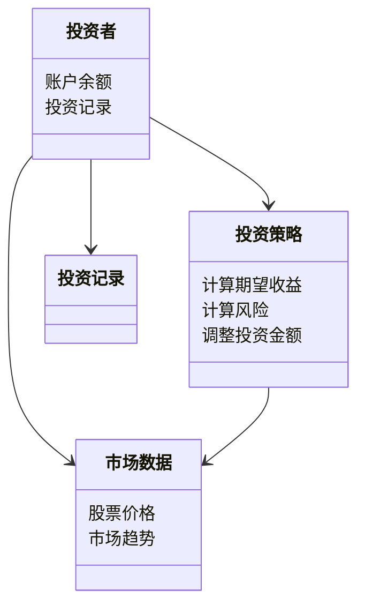
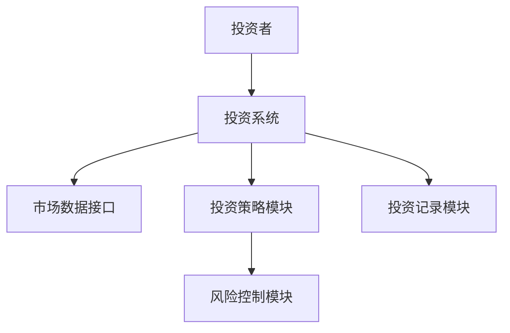

                 


# 爱德华·索普的定期不定额投资法

> 关键词：爱德华·索普，投资策略，概率论，统计套利，投资算法

> 摘要：本文系统地介绍了爱德华·索普的定期不定额投资法，从其投资理论的背景、核心概念、数学模型、算法原理到系统设计与实战应用，进行了全面而深入的分析。文章结合理论与实践，通过具体的案例分析和代码实现，帮助读者理解并掌握这一投资方法。同时，本文还探讨了该投资法在实际应用中的优缺点、风险控制以及与传统投资方法的区别，为投资者提供了重要的参考。

---

## 第1章 爱德华·索普投资理论概述

### 1.1 爱德华·索普的背景与投资理念

#### 1.1.1 爱德华·索普的生平简介
爱德华·索普（Edward Thorp）是一位美国数学家、概率论专家，同时也是著名的投资理论家。他在20世纪60年代提出了基于概率论和统计套利的投资方法，彻底改变了金融投资领域的传统观念。索普不仅在数学领域有着深厚的造诣，还在投资实践中取得了巨大的成功。

#### 1.1.2 索普投资理论的核心思想
索普的投资理论基于概率论和统计套利，强调通过分析市场的随机性和不确定性，寻找投资机会中的潜在利润。他的核心思想是：通过科学的方法和数学模型，投资者可以在不确定的市场中找到确定性的收益。

#### 1.1.3 定期不定额投资法的定义与特点
定期不定额投资法是一种结合了定期投资和动态调整的投资策略。与传统的定额定投不同，它允许投资者根据市场环境的变化，动态调整每次投资的金额。其特点包括：
- **定期性**：按照预定的时间间隔进行投资。
- **不定额性**：每次投资的金额根据市场环境和策略模型动态调整。
- **灵活性**：能够根据市场变化优化投资组合，降低风险。

---

### 1.2 定期不定额投资法的背景与问题背景

#### 1.2.1 投资市场的不确定性与风险
金融市场本质上是一个高度不确定的领域，价格波动、市场情绪、经济周期等因素都会对投资结果产生重大影响。传统的投资方法往往依赖于市场预测，但这种预测在很多时候是不可靠的。

#### 1.2.2 投资者行为中的常见误区
大多数投资者在投资过程中容易陷入以下误区：
- 过度依赖市场预测。
- 未能有效控制投资风险。
- 缺乏系统的投资策略。

#### 1.2.3 定期不定额投资法的提出背景
索普的定期不定额投资法正是为了解决上述问题而提出的。通过定期投资和动态调整投资金额，这种方法能够在不确定的市场中降低风险，同时抓住潜在的投资机会。

---

### 1.3 定期不定额投资法的核心概念与边界

#### 1.3.1 定期不定额投资法的核心要素
- **时间间隔**：固定的定期投资周期（如每周、每月）。
- **投资金额**：根据市场环境动态调整的金额。
- **风险控制**：通过数学模型优化投资组合，降低风险。

#### 1.3.2 投资策略的边界与外延
- **边界**：定期不定额投资法适用于中长期投资，不适用于短期投机。
- **外延**：可以与其他投资策略结合使用，如价值投资、趋势投资等。

#### 1.3.3 投资法与传统投资方法的区别
| 特性 | 定期不定额投资法 | 传统定额定投 | 随意投资 |
|------|----------------|--------------|----------|
| 时间间隔 | 定期 | 定期 | 不定期 |
| 投资金额 | 动态调整 | 固定 | 随意 |
| 风险控制 | 强化 | 一般 | 较弱 |

---

## 第2章 索普投资法的数学模型与算法原理

### 2.1 索普投资法的数学模型

#### 2.1.1 投资收益的期望值公式
$$E(R) = \sum_{i=1}^{n} P_i R_i$$
其中，\( P_i \) 是第 \( i \) 种投资方式的概率，\( R_i \) 是对应的收益。

#### 2.1.2 投资风险的方差公式
$$Var(R) = \sum_{i=1}^{n} P_i (R_i - E(R))^2$$
方差反映了投资收益的波动性，方差越大，风险越高。

#### 2.1.3 投资组合优化的数学模型
$$\text{最大化 } E(R) - \lambda \times Var(R)$$
其中，\( \lambda \) 是风险厌恶系数。

---

### 2.2 投资策略的优化与调整

#### 2.2.1 现金流的动态调整模型
$$\text{调整金额} = \text{当前账户余额} \times \text{市场环境因子}$$
市场环境因子是一个介于0和1之间的系数，用于动态调整投资金额。

#### 2.2.2 投资组合的再平衡策略
定期不定额投资法要求投资者在每次投资时，根据当前市场环境调整投资金额。例如：
- 当市场处于上升趋势时，增加投资金额。
- 当市场处于下降趋势时，减少投资金额。

---

### 2.3 投资法的属性特征对比

| 属性 | 定期不定额投资法 | 传统定额定投 | 随意投资 |
|------|----------------|--------------|----------|
| 投资频率 | 定期 | 定期 | 不定期 |
| 投资金额 | 动态调整 | 固定 | 随意 |
| 风险控制 | 强化 | 一般 | 较弱 |

---

## 第3章 索普投资法的系统分析与架构设计

### 3.1 系统分析

#### 3.1.1 问题场景介绍
投资者需要在不同时间点进行投资决策，每次投资的金额需要根据市场环境动态调整。系统需要实时获取市场数据，计算投资金额，并记录投资历史。

---

### 3.2 系统功能设计

#### 3.2.1 领域模型（mermaid 类图）


---

### 3.3 系统架构设计

#### 3.3.1 系统架构图（mermaid 架构图）


---

### 3.4 系统接口设计

#### 3.4.1 获取市场数据接口
```python
def get_market_data():
    # 获取股票价格、市场趋势等数据
    pass
```

#### 3.4.2 计算投资金额接口
```python
def calculate_investment_amount(balance, market_factor):
    return balance * market_factor
```

---

### 3.5 系统交互设计（mermaid 序列图）
```mermaid
seqdiag
    investor -> 投资系统: 请求投资
    投资系统 -> 市场数据接口: 获取市场数据
    市场数据接口 --> 投资系统: 返回市场数据
    投资系统 -> 投资策略模块: 计算投资金额
    投资策略模块 --> 投资系统: 返回投资金额
    投资系统 -> 风险控制模块: 风险评估
    风险控制模块 --> 投资系统: 返回风险评估结果
    投资系统 -> 投资记录模块: 记录投资
    投资记录模块 --> 投资者: 返回投资结果
```

---

## 第4章 索普投资法的项目实战

### 4.1 环境安装与配置

#### 4.1.1 安装Python环境
```bash
python --version
pip install numpy pandas matplotlib
```

#### 4.1.2 安装必要的库
```bash
pip install numpy pandas scikit-learn
```

---

### 4.2 核心实现代码

#### 4.2.1 投资策略实现
```python
import numpy as np
import pandas as pd

def sop_investment_strategy(initial_amount, rate, time_periods):
    amounts = []
    current_balance = initial_amount
    for _ in range(time_periods):
        # 获取市场数据
        market_data = get_market_data()
        # 计算市场环境因子
        market_factor = calculate_market_factor(market_data)
        # 计算投资金额
        investment_amount = current_balance * market_factor
        amounts.append(investment_amount)
        # 更新当前余额
        current_balance += investment_amount * (1 - rate)
    return amounts

def calculate_market_factor(data):
    # 简单实现：假设市场环境因子与收益相关
    return np.mean(data) / np.std(data)
```

---

### 4.3 代码应用解读与分析

#### 4.3.1 代码逻辑分析
- `sop_investment_strategy` 函数实现定期不定额投资的核心逻辑。
- `calculate_market_factor` 函数根据市场数据计算市场环境因子。

---

## 第5章 索普投资法的最佳实践与小结

### 5.1 最佳实践 tips

#### 5.1.1 确定投资目标与风险承受能力
投资者需要明确自己的投资目标和风险承受能力，选择合适的投资周期和金额调整策略。

#### 5.1.2 定期回顾与优化
定期回顾投资结果，根据市场环境的变化优化投资策略。

---

### 5.2 小结

索普的定期不定额投资法通过科学的数学模型和动态调整的投资策略，帮助投资者在不确定的市场中降低风险、提高收益。然而，这种方法需要投资者具备一定的数学基础和市场分析能力，同时需要结合实际情况进行优化。

---

## 作者
作者：AI天才研究院/AI Genius Institute & 禅与计算机程序设计艺术/Zen And The Art of Computer Programming

