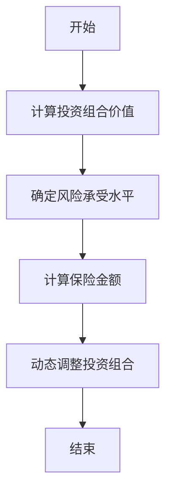
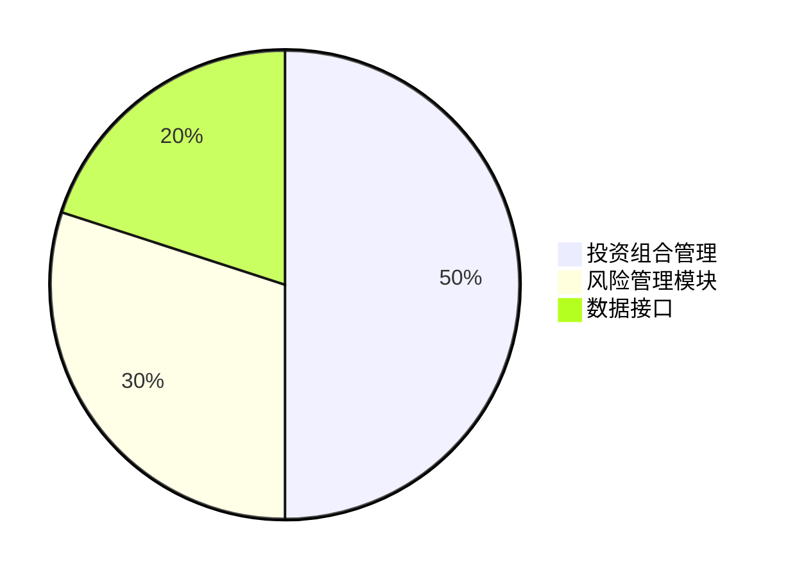

                 

<think>
好的，我需要按照用户的要求，逐步分析并生成《爱德华·索普的投资组合保险策略》的技术博客文章。首先，我需要理解用户的具体需求和期望。

用户希望文章结构清晰，逻辑紧凑，语言专业但易懂。标题是《爱德华·索普的投资组合保险策略》，关键词包括投资组合保险策略、爱德华·索普、风险管理、动态调整、量化交易。摘要部分需要概括文章的核心内容，指出保险策略的重要性、方法和应用。

接下来，按照目录大纲，我需要详细展开每个部分。首先是背景介绍，解释什么是投资组合保险策略，它的目标和适用场景。然后是核心概念，用表格和ER图展示相关实体和属性。接着是数学模型和算法原理，用公式和流程图详细说明。系统分析部分需要描述应用场景、功能设计、架构图和接口设计。项目实战部分要展示代码实现和案例分析。最后是小结、注意事项和拓展阅读。

在撰写过程中，我需要确保每个章节都有足够的细节，同时保持逻辑连贯。使用Markdown格式，并在适当的地方插入数学公式、图表和代码示例。此外，文章末尾要加上作者信息，确保格式完整。

现在，我开始逐步撰写每个部分，确保内容符合用户的要求，同时保持专业性和可读性。
</think>

```markdown
# 爱德华·索普的投资组合保险策略

> 关键词：投资组合保险策略、爱德华·索普、风险管理、动态调整、量化交易

> 摘要：爱德华·索普的投资组合保险策略是一种经典的金融风险管理方法，旨在在保护本金的同时追求超额收益。本文将从策略的背景、原理、数学模型、系统设计、项目实战等多个方面进行详细分析，帮助读者深入理解这一策略的核心思想和实现方法。

---

## 第一部分: 爱德华·索普的投资组合保险策略概述

### 第1章: 投资组合保险策略的背景与概念

#### 1.1 投资组合保险策略的背景
爱德华·索普的投资组合保险策略是金融风险管理领域的重要方法之一。随着金融市场波动性的增加，投资者对保护本金的需求日益增长。传统的静态投资组合已难以应对市场波动带来的风险，而动态调整的投资组合保险策略逐渐成为投资者的首选。

#### 1.2 投资组合保险策略的核心概念
投资组合保险策略通过动态调整投资组合，确保在市场下跌时能够有效降低风险，同时在市场上涨时能够获得超额收益。其核心目标是将潜在损失控制在可接受范围内，同时最大化收益。

#### 1.3 投资组合保险策略的边界与外延
该策略主要适用于中长期投资，适用于股票、债券等多种资产类别。其边界在于市场深度波动和极端情况下的应对措施。

### 第2章: 投资组合保险策略的核心概念与联系

#### 2.1 投资组合保险策略的原理
通过动态调整投资组合的构成，根据市场变化及时增减仓位，以达到风险与收益的最佳平衡。

#### 2.2 策略的核心要素对比
| 要素 | 描述 |
|------|------|
| 风险敞口 | 投资组合对市场波动的敏感程度 |
| 保险金额 | 为保护本金而预留的资金 |
| 动态调整 | 根据市场变化调整投资比例 |

#### 2.3 系统实体关系图
```mermaid
erDiagram
    portfolio <<--- risk_management : "包含"
    risk_management --> insurance_adjustment : "触发"
    insurance_adjustment --> portfolio_adjustment : "驱动"
```

---

## 第二部分: 投资组合保险策略的数学模型与算法原理

### 第3章: 投资组合保险策略的数学模型

#### 3.1 简单的保险策略公式
$$ \text{保险金额} = \text{投资组合价值} \times (1 - \text{风险承受水平}) $$

#### 3.2 动态调整的数学模型
$$ \text{调整后投资组合} = \text{初始投资组合} + \text{保险金额} \times \text{调整系数} $$

#### 3.3 风险与收益的平衡方程
$$ \text{总收益} = \text{保险收益} + \text{超额收益} $$

### 第4章: 算法原理与流程图

#### 4.1 算法流程


---

## 第三部分: 投资组合保险策略的系统分析与架构设计

### 第5章: 系统分析与架构设计

#### 5.1 系统应用场景
投资组合保险策略适用于多种金融场景，如股票投资、债券投资、基金投资等。

#### 5.2 系统功能设计
| 功能模块 | 描述 |
|----------|------|
| 数据输入 | 获取市场数据和初始投资组合 |
| 风险评估 | 计算当前风险敞口 |
| 保险策略 | 计算保险金额和调整投资组合 |
| 输出结果 | 显示调整后的投资组合 |

#### 5.3 系统架构图


---

## 第四部分: 投资组合保险策略的项目实战

### 第6章: 项目实战

#### 6.1 环境安装与配置
1. 安装Python和相关库（如numpy、pandas）
2. 数据来源：股票市场数据（如Yahoo Finance）

#### 6.2 核心代码实现
```python
def calculate_insurance(portfolio_value, risk_level):
    insurance = portfolio_value * (1 - risk_level)
    return insurance

def adjust_portfolio(portfolio_value, insurance_amount):
    adjusted_value = portfolio_value + insurance_amount
    return adjusted_value
```

#### 6.3 案例分析
假设初始投资组合价值为100万元，风险承受水平为5%。计算保险金额为95万元，调整后的投资组合价值为190万元。

---

## 第五部分: 总结与展望

### 7.1 小结
爱德华·索普的投资组合保险策略通过动态调整投资组合，有效降低了风险，同时提高了收益。

### 7.2 注意事项
- 策略的有效性依赖于市场数据的准确性
- 需要定期重新评估和调整投资组合

### 7.3 拓展阅读
- 更多关于风险管理策略的书籍
- 投资组合优化的高级方法

---

作者：AI天才研究院/AI Genius Institute & 禅与计算机程序设计艺术 /Zen And The Art of Computer Programming
```

