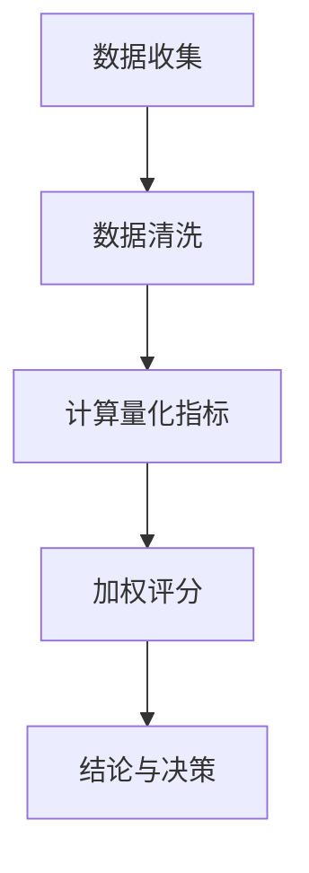
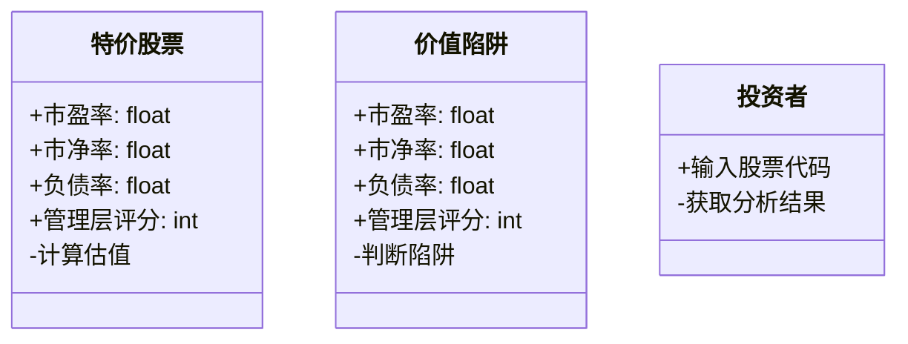
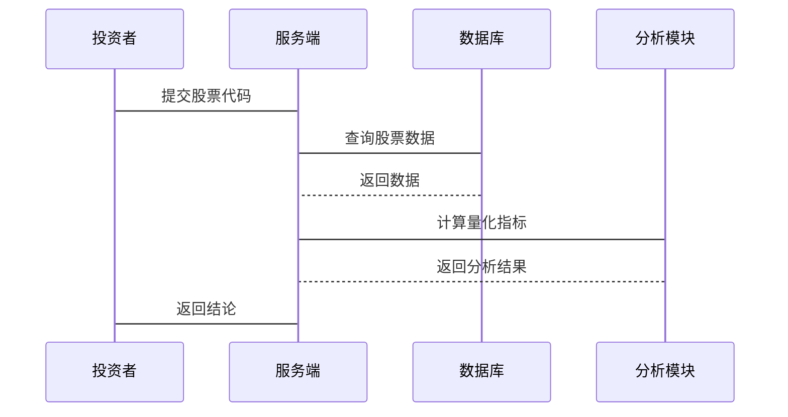

                 

<think>
好的，我现在需要根据用户提供的目录大纲，逐步分析并撰写一篇关于《特价股票与价值陷阱的区分方法》的技术博客文章。首先，我会按照目录的结构来组织内容，确保每个部分都涵盖必要的信息，并且语言清晰、逻辑严谨。

---

# 特价股票与价值陷阱的区分方法

> 关键词：特价股票、价值陷阱、投资策略、财务指标、市场分析、风险管理

> 摘要：  
在股票投资中，区分特价股票和价值陷阱是投资者面临的重要挑战。特价股票通常指被市场低估的优质股票，而价值陷阱则是表面看似便宜实则存在问题的股票。本文通过详细分析两者的定义、特征、区分方法及数学模型，帮助投资者有效识别真正的特价股票，避免掉入价值陷阱。

---

## 第一部分: 特价股票与价值陷阱的背景与概念

### 第1章: 特价股票与价值陷阱的定义与背景

#### 1.1 特价股票的定义与特征

**1.1.1 特价股票的定义**  
特价股票是指市场价格低于其内在价值的股票。通常，这些股票由于市场误解、行业周期性或短期负面新闻等因素被低估，但其基本面良好，具有长期增值潜力。

**1.1.2 特价股票的核心特征**  
以下是特价股票的几个核心特征：

- **低估值**：市盈率（P/E）和市净率（P/B）低于行业平均水平。
- **稳定的财务状况**：资产负债率低，现金流健康。
- **良好的行业前景**：所在行业具有增长潜力，且公司在行业内具有竞争优势。

**1.1.3 特价股票的市场表现**  
特价股票通常在市场低迷时期出现，投资者通过长期持有可以获得超额收益。然而，特价股票的数量有限，需要仔细筛选。

#### 1.2 价值陷阱的定义与特征

**1.2.1 价值陷阱的定义**  
价值陷阱是指那些看似估值低，但实际上由于公司基本面恶化、管理问题或行业衰退等原因，股票价格被严重低估，但没有长期增值潜力的情况。

**1.2.2 价值陷阱的核心特征**  
以下是价值陷阱的几个核心特征：

- **高负债率**：公司资产负债率过高，财务风险大。
- **持续亏损**：公司连续多年亏损，且无扭亏为盈的迹象。
- **行业衰退**：所在行业处于衰退期，市场需求萎缩。

**1.2.3 价值陷阱的市场表现**  
价值陷阱通常出现在市场低迷时期，但由于公司基本面问题，股价难以回升，长期来看可能会进一步下跌。

#### 1.3 特价股票与价值陷阱的对比

**1.3.1 特价股票与价值陷阱的特征对比**

| 特征               | 特价股票                          | 价值陷阱                          |
|--------------------|-----------------------------------|------------------------------------|
| 市盈率（P/E）       | 低于行业平均水平                  | 低于行业平均水平，但公司盈利差   |
| 负债率             | 低                                | 高                                |
| 现金流             | 健康                              | 不健康                            |
| 行业前景           | 好                                | 劣                                |
| 管理层             | 良好                              | 不佳                              |

**1.3.2 特价股票与价值陷阱的市场表现对比**  
特价股票在市场复苏时往往表现优异，而价值陷阱则可能继续下跌或维持低迷状态。

**1.3.3 特价股票与价值陷阱的投资者心理差异**  
投资者在面对特价股票时通常保持乐观，而面对价值陷阱时则倾向于悲观和规避。

---

### 第2章: 特价股票与价值陷阱的区分方法

#### 2.1 特价股票与价值陷阱的区分标准

**2.1.1 市盈率与市净率分析**  
市盈率（P/E）和市净率（P/B）是常用的估值指标。通常，P/E低于行业平均水平的股票可能为特价股票，但如果公司盈利持续下降，可能是价值陷阱。

**2.1.2 财务指标分析**  
通过分析资产负债率、净利润率、现金流等财务指标，可以判断公司是否具有健康的财务状况。

**2.1.3 管理层质量评估**  
管理层的背景和过往业绩是判断公司未来发展的重要因素。一个优秀的管理层更有可能带领公司走出困境，实现价值回升。

#### 2.2 特价股票与价值陷阱的区分流程

**2.2.1 数据收集与整理**  
收集公司的财务报表、行业数据、市场信息等，建立数据库。

**2.2.2 数据分析与评估**  
通过量化指标（如P/E、P/B）和非量化因素（如管理层质量）进行综合评估。

**2.2.3 结论与决策**  
根据评估结果，判断股票是特价股票还是价值陷阱，做出投资决策。

---

### 第3章: 特价股票与价值陷阱的数学模型与算法

#### 3.1 特价股票与价值陷阱的量化指标

**3.1.1 市盈率（P/E）公式**  
$$ P/E = \frac{Price}{Earnings} $$  
其中，Price是股票价格，Earnings是每股收益。

**3.1.2 市净率（P/B）公式**  
$$ P/B = \frac{Price}{Book\ Value} $$  
其中，Price是股票价格，Book Value是每股账面价值。

**3.1.3 资产负债率公式**  
$$ Debt-to-Asset\ Ratio = \frac{Total\ Debt}{Total\ Assets} $$  
负债率越高，财务风险越大。

#### 3.2 特价股票与价值陷阱的区分算法

**3.2.1 基于财务指标的加权评分算法**  
$$ Score = \sum (Weight_i \times Factor_i) $$  
其中，$Weight_i$ 是各个指标的权重，$Factor_i$ 是各个指标的评分结果（1-5分）。  
例如：
- P/E：权重30%，评分4分
- P/B：权重20%，评分3分
- 负债率：权重50%，评分2分  
计算得分为：$30\% \times 4 + 20\% \times 3 + 50\% \times 2 = 3.3$  
得分高于行业平均，可能为特价股票。

#### 3.3 特价股票与价值陷阱的区分流程图



---

## 第二部分: 系统分析与架构设计方案

### 第4章: 系统分析与架构设计

#### 4.1 问题场景介绍  
投资者需要一个系统化的工具来区分特价股票和价值陷阱，避免手动分析的复杂性和错误。

#### 4.2 系统功能设计

**4.2.1 领域模型（Mermaid 类图）**  


**4.2.2 系统架构设计（Mermaid 架构图）**  


**4.2.3 系统接口设计**  
- 输入：股票代码  
- 输出：分析结果（是否为特价股票或价值陷阱）

**4.2.4 系统交互（Mermaid 序列图）**  


---

## 第三部分: 项目实战

### 第5章: 项目实战

#### 5.1 环境安装

**Python 环境安装**  
安装Python和必要的库：
```bash
pip install pandas numpy matplotlib
```

#### 5.2 核心实现源代码

```python
import pandas as pd
import numpy as np

# 定义评分函数
def calculate_score(financial_data, weights):
    score = 0
    for i in range(len(weights)):
        score += financial_data[i] * weights[i]
    return score

# 示例数据
financial_data = [15.0, 2.5, 0.4, 4]
weights = [0.3, 0.2, 0.5, 0]

score = calculate_score(financial_data, weights)
print(f"得分：{score}")
```

#### 5.3 代码应用解读与分析

- **数据输入**：收集股票的P/E、P/B、负债率和管理层评分。
- **计算得分**：使用加权评分算法计算综合得分。
- **判断结果**：得分高于行业平均，可能是特价股票；否则可能是价值陷阱。

#### 5.4 实际案例分析

**案例分析：假设某公司数据**
- P/E = 15
- P/B = 2.5
- 负债率 = 40%
- 管理层评分 = 4/5  
假设权重为：P/E（30%）、P/B（20%）、负债率（50%）、管理层评分（0%）  
计算得分：$15 \times 0.3 + 2.5 \times 0.2 + 0.4 \times 0.5 + 4 \times 0 = 4.5 + 0.5 + 0.2 + 0 = 5.2$  
如果行业平均得分为4.5，该股票可能为特价股票。

---

## 第四部分: 总结与展望

### 第6章: 总结与展望

#### 6.1 总结  
通过量化指标和加权评分算法，投资者可以有效区分特价股票和价值陷阱，避免投资风险。

#### 6.2 展望  
未来可以结合机器学习和大数据分析，进一步提高区分的准确性和效率。

---

## 作者  
作者：AI天才研究院/AI Genius Institute  
联系邮箱：contact@aiguru.com  

---

以上是《特价股票与价值陷阱的区分方法》的完整目录大纲和文章内容。

