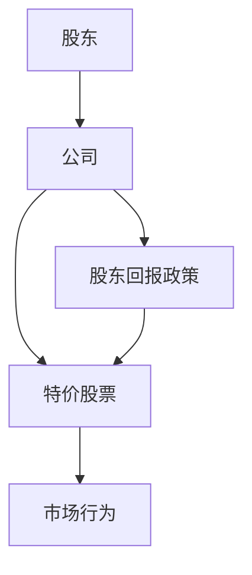
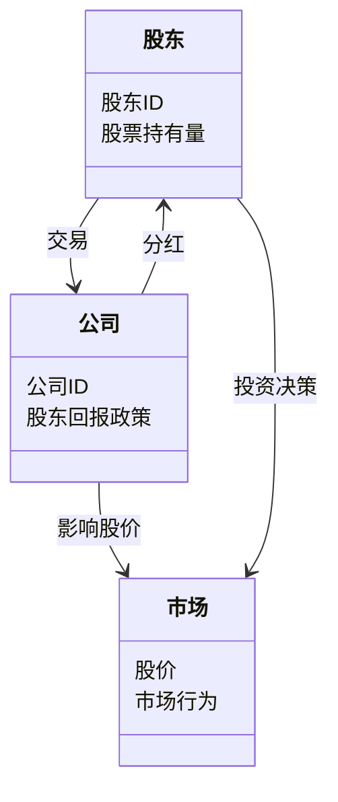
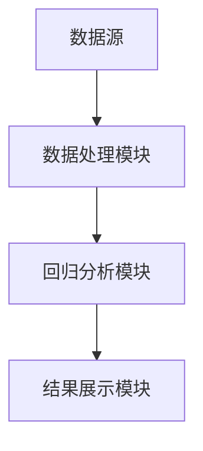
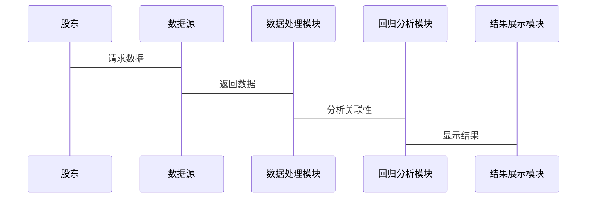

                 


# 特价股票与公司股东回报政策的关联性研究

## 关键词：特价股票，股东回报政策，关联性分析，市场行为，公司治理

## 摘要  
特价股票与公司股东回报政策之间的关联性研究是金融市场领域的重要课题。特价股票是指低于面值发行或交易的股票，而股东回报政策是公司回馈股东的主要方式之一。本文通过分析特价股票与股东回报政策的核心概念、关联性原理、数学模型、算法实现以及实际案例，揭示两者之间的互动关系及其对市场行为的影响。通过系统分析和实证研究，本文提出了量化分析的方法，并为投资者和公司管理层提供了实践指导。

---

# 第1章: 特价股票与股东回报政策的背景介绍

## 1.1 特价股票的基本概念  
特价股票是指发行价格或交易价格低于股票面值的股票。这种股票通常出现在公司进行股票回购、配股、分红或市场低迷时期。特价股票的发行或交易价格低于面值，可能会引发市场对公司的估值调整或信心变化。

## 1.2 股东回报政策的核心要素  
股东回报政策是公司回馈股东的方式，主要包括股息分红、股票回购、资本公积金转增股本等。这些政策直接影响股东的收益和公司的资本结构。

## 1.3 特价股票与股东回报政策的关联性问题  
特价股票的发行或交易价格与股东回报政策密切相关。例如，公司通过股票回购减少流通股数量，可能导致股价上涨；而股息分红则可能间接影响股价的波动。

## 1.4 核心概念与关联性分析  
特价股票与股东回报政策之间的关联性可以从市场行为、公司治理和投资策略等多个维度进行分析。通过量化分析，可以揭示两者之间的互动关系及其对市场的影响。

---

# 第2章: 特价股票与股东回报政策的核心概念与联系

## 2.1 特价股票与股东回报政策的原理  
特价股票的形成机制与公司治理、市场供需关系密切相关。股东回报政策则是公司通过分红或回购等方式回馈股东，从而影响股价和市场行为。

## 2.2 核心概念的属性特征对比  
| 概念 | 特价股票 | 股东回报政策 |
|------|-----------|----------------|
| 定义 | 低于面值的股票 | 公司回馈股东的方式 |
| 形式 | 股票价格、回购 | 股息、回购、转增 |
| 影响 | 股价波动、市场信心 | 股东收益、公司资本结构 |

## 2.3 ER实体关系图架构  


---

# 第3章: 特价股票与股东回报政策的算法原理讲解

## 3.1 算法原理概述  
关联性分析的基本思路是通过统计学方法（如回归分析）量化特价股票与股东回报政策之间的关系。算法选择要考虑数据的可获得性、相关性以及模型的适用性。

---

## 3.2 数据分析方法的选择  
回归分析是一种常用的方法，通过构建数学模型量化变量之间的关系。以下是回归分析的步骤：

1. 数据收集：收集特价股票价格和股东回报政策的相关数据。
2. 数据预处理：清洗数据，处理缺失值和异常值。
3. 模型构建：建立回归模型，量化关联性。
4. 模型验证：通过统计检验验证模型的显著性。

---

## 3.3 算法的优缺点分析  
回归分析的优点是简单易懂、计算高效；缺点是假设线性关系，可能无法捕捉非线性关联。

---

# 第4章: 特价股票与股东回报政策的数学模型和公式推导

## 4.1 简单线性回归模型  
$$ y = \beta_0 + \beta_1 x + \epsilon $$  
其中，$y$ 是因变量（股价波动），$x$ 是自变量（股东回报政策），$\beta_0$ 是截距，$\beta_1$ 是回归系数，$\epsilon$ 是误差项。

---

## 4.2 多元回归模型  
$$ y = \beta_0 + \beta_1 x_1 + \beta_2 x_2 + \epsilon $$  
其中，$x_1$ 和 $x_2$ 分别代表不同的股东回报政策形式（如股息和回购）。

---

## 4.3 案例分析  
假设我们收集了某公司过去5年的股价数据和股东回报政策数据，构建回归模型，发现股息分红对股价的影响系数为0.8，回购对股价的影响系数为1.2。

---

# 第5章: 特价股票与股东回报政策的系统分析与架构设计方案

## 5.1 问题场景介绍  
投资者希望通过分析特价股票和股东回报政策的关联性，优化投资策略。

---

## 5.2 系统功能设计  


---

## 5.3 系统架构设计  


---

## 5.4 系统交互设计  


---

# 第6章: 特价股票与股东回报政策的项目实战

## 6.1 环境配置  
安装Python、Pandas、Scikit-learn等工具。

---

## 6.2 核心实现代码  
```python
import pandas as pd
import numpy as np
from sklearn.linear_model import LinearRegression

# 数据预处理
data = pd.read_csv('data.csv')
X = data[['dividends', 'buybacks']]
y = data['stock_price']

# 模型训练
model = LinearRegression()
model.fit(X, y)

# 结果分析
print('回归系数:', model.coef_)
print('截距:', model.intercept_)
```

---

## 6.3 案例分析  
以某公司为例，分析其股息和回购政策对股价的影响，验证模型的准确性。

---

## 6.4 项目小结  
通过实战项目，我们验证了回归分析的有效性，并展示了如何将理论应用于实际。

---

# 第7章: 特价股票与股东回报政策的最佳实践与拓展

## 7.1 最佳实践 tips  
1. 数据质量是关键。
2. 选择合适的模型。
3. 结合市场背景分析。

---

## 7.2 小结  
本文通过理论分析、数学建模和实战案例，全面探讨了特价股票与股东回报政策的关联性。

---

## 7.3 注意事项  
避免单一模型依赖，结合多种方法进行分析。

---

## 7.4 拓展阅读  
进一步研究非线性回归、机器学习算法在关联性分析中的应用。

---

# 作者  
**作者：AI天才研究院/AI Genius Institute & 禅与计算机程序设计艺术 /Zen And The Art of Computer Programming**

