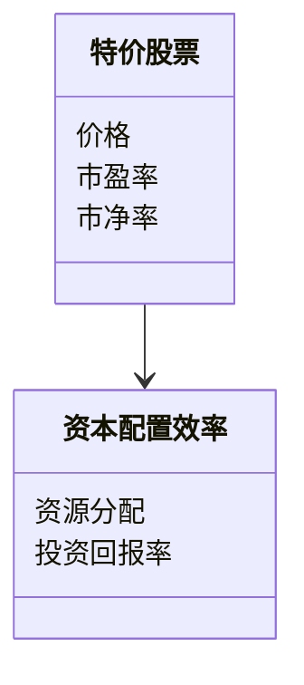
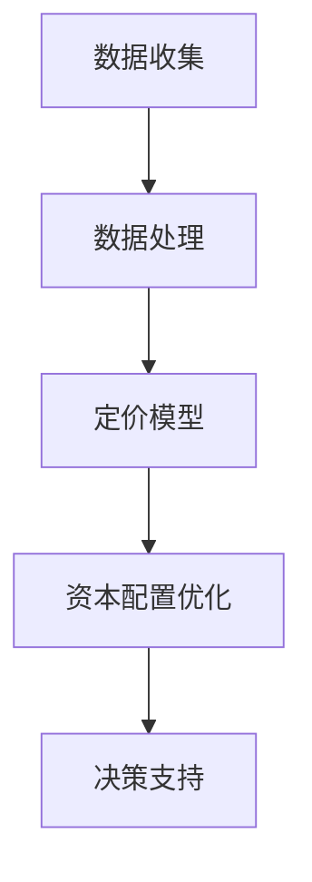
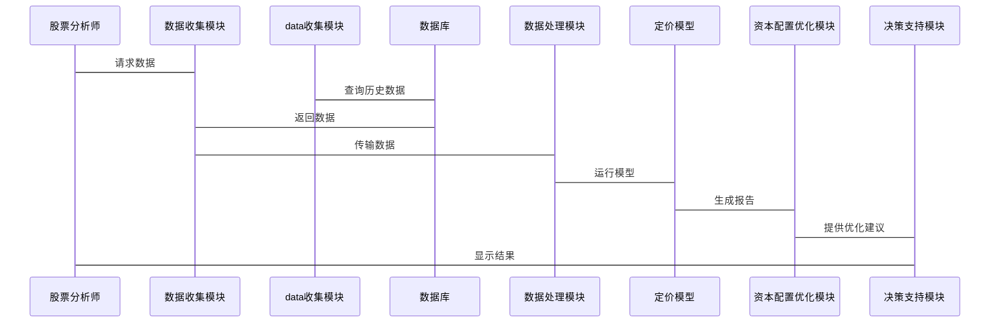

                 

<think>
好的，我需要帮助用户撰写一篇关于《特价股票与公司资本配置效率的关系探讨》的技术博客文章。用户已经提供了一个详细的目录大纲，现在我需要根据这个大纲逐步撰写文章内容。首先，我要明确文章的结构和各部分的重点，然后逐一展开内容。

首先，文章的标题是《特价股票与公司资本配置效率的关系探讨》，关键词包括特价股票、资本配置效率、股票定价、资源配置、投资决策、公司治理。摘要部分需要简洁明了地概括文章的核心内容，即探讨特价股票如何影响资本配置效率，分析其内在联系和影响机制。

接下来，文章分为三个主要部分：背景与概念、核心概念与联系、数学模型与算法原理。每个部分下还有更细的章节和小节。我需要按照逻辑顺序，逐步深入分析，确保内容连贯且有深度。

在撰写过程中，我需要确保使用专业的技术语言，同时保持简单易懂。对于每个核心概念，如特价股票和资本配置效率，我需要详细解释其定义、特性及其相互关系。此外，还需要引入数学模型和算法，例如定价模型和资本分配模型，通过公式和流程图来辅助说明。

在系统分析部分，我需要设计一个框架，展示如何将特价股票与资本配置效率结合，可能涉及数据收集、分析模块、决策支持等部分，并用图表来展示架构和交互过程。

最后，在项目实战部分，我需要提供具体的案例分析，展示如何利用特价股票优化资本配置，包括环境配置、代码实现和案例解读。同时，总结最佳实践，给出小结和注意事项。

我需要特别注意使用正确的格式，如Mermaid图和LaTeX公式，确保代码和图表的正确嵌入。同时，保持文章整体流畅，每部分内容详细且有条理。

现在，我将按照这个思路开始撰写文章，确保每个部分都符合用户的要求，并逐步深入探讨特价股票与资本配置效率之间的关系。
</think>

# 特价股票与公司资本配置效率的关系探讨

## 关键词：特价股票，资本配置效率，股票定价，资源配置，投资决策，公司治理

## 摘要：  
本文探讨了特价股票与公司资本配置效率之间的关系。通过分析特价股票的特性、资本配置效率的定义及其重要性，本文揭示了两者之间的内在联系。进一步，本文通过数学模型和算法原理，详细阐述了如何利用特价股票优化资本配置效率，并结合实际案例进行了深入分析。最后，本文总结了最佳实践和注意事项，为投资者和公司提供了有价值的参考。

---

# 第一部分: 特价股票与资本配置效率的背景与概念

## 第1章: 特价股票与资本配置效率的背景介绍

### 1.1 特价股票的定义与特性

#### 1.1.1 特价股票的定义  
特价股票是指价格显著低于市场平均水平的股票。通常，这些股票可能因为公司财务困境、市场波动或投资者情绪等因素而被低估。特价股票的吸引力在于其潜在的复苏价值，即以较低的价格买入，未来可能获得较高的回报。

#### 1.1.2 特价股票的特性分析  
- **低估值**：特价股票通常具有较低的市盈率或市净率，表明其价格低于其内在价值。
- **高波动性**：由于市场情绪的影响，特价股票的价格波动较大。
- **潜在风险**：特价股票往往伴随着较高的风险，因为公司可能面临财务困境或管理问题。

#### 1.1.3 特价股票的市场表现  
特价股票在市场复苏期间通常表现较好，但其短期表现可能波动较大。投资者需要具备一定的市场判断能力和风险承受能力。

### 1.2 资本配置效率的定义与重要性

#### 1.2.1 资本配置效率的定义  
资本配置效率是指公司将其可利用资源（如资金、资产等）分配到不同项目或投资中，以实现最大价值的能力。高效的资本配置能够最大化股东价值，而低效的配置可能导致资源浪费或投资回报率下降。

#### 1.2.2 资本配置效率的重要性  
- **最大化股东价值**：通过高效配置资源，公司可以实现更高的投资回报。
- **优化企业运营**：资本配置效率高的公司能够更好地分配资源，提高运营效率。
- **增强市场竞争力**：有效的资本配置有助于公司开发新产品、拓展市场，从而增强竞争力。

#### 1.2.3 资本配置效率的衡量指标  
常用的衡量指标包括资本回报率（ROCE）、净现值（NPV）和内部收益率（IRR）等。

### 1.3 特价股票与资本配置效率的关系

#### 1.3.1 特价股票对资本配置效率的影响  
特价股票的价格波动可能影响公司的资本结构和投资决策。例如，当公司大量持有特价股票时，可能会影响其资本分配的效率。

#### 1.3.2 资本配置效率对特价股票的影响  
资本配置效率高的公司可能更倾向于投资于具有高增长潜力的项目，从而影响特价股票的市场需求和价格。

#### 1.3.3 两者关系的理论框架  
特价股票和资本配置效率之间存在双向影响。特价股票的市场表现可能影响公司的资本分配决策，而资本配置效率的高低又会影响特价股票的内在价值。

### 1.4 本章小结  
本章介绍了特价股票和资本配置效率的基本概念，并分析了两者之间的关系。接下来，我们将进一步探讨特价股票与资本配置效率的核心概念及其联系。

---

## 第2章: 特价股票与资本配置效率的核心概念

### 2.1 特价股票的核心要素

#### 2.1.1 特价股票的市场定位  
特价股票通常在市场低迷或公司遇到困难时出现，可能被视为高风险投资标的。

#### 2.1.2 特价股票的价格波动  
特价股票的价格受市场情绪和公司基本面的影响较大，表现出较高的波动性。

#### 2.1.3 特价股票的风险特征  
由于特价股票通常涉及较高的不确定性，其风险特征显著高于普通股票。

### 2.2 资本配置效率的核心要素

#### 2.2.1 资本分配的合理性  
资本分配需要考虑项目的盈利能力、风险水平和资金需求。

#### 2.2.2 资本使用的效果评估  
通过财务指标如ROE（净资产收益率）和ROA（资产回报率）来评估资本使用的效果。

#### 2.2.3 资本配置的优化方法  
包括成本效益分析、投资组合优化和风险管理等方法。

### 2.3 特价股票与资本配置效率的联系

#### 2.3.1 特价股票对资本分配的影响  
特价股票的购买可能占用公司资本，影响其他投资项目的资金分配。

#### 2.3.2 资本配置效率对特价股票的影响  
高效的资本配置可以提升公司的整体价值，从而间接影响特价股票的市场表现。

#### 2.3.3 两者关系的综合分析  
特价股票和资本配置效率之间的关系是复杂的，涉及市场环境、公司战略和投资者行为等多个方面。

### 2.4 核心概念对比分析

#### 2.4.1 特价股票与普通股票的对比  
| 特价股票 | 普通股票 |
|----------|----------|
| 价格较低 | 价格稳定 |
| 风险较高 | 风险适中 |
| 波动性大 | 波动性小 |

#### 2.4.2 资本配置效率与资本回报率的对比  
| 资本配置效率 | 资本回报率 |
|--------------|------------|
| 资源分配的效率 | 投资的回报水平 |
| 关注整体资源利用 | 关注单个项目的回报 |

#### 2.4.3 特价股票与资本配置效率的协同效应  
当公司高效配置资本时，可能更倾向于购买特价股票，以利用其潜在的高回报。

### 2.5 本章小结  
本章详细分析了特价股票和资本配置效率的核心概念，并探讨了它们之间的联系。接下来，我们将从数学模型和算法的角度，进一步探讨如何量化这种关系。

---

## 第3章: 特价股票与资本配置效率的数学模型与算法原理

### 3.1 特价股票的定价模型

#### 3.1.1 市盈率模型  
市盈率（P/E）= 股价 / 每股收益  
$$ P/E = \frac{P}{E} $$  
其中，P为股价，E为每股收益。

#### 3.1.2 市净率模型  
市净率（P/B）= 股价 / 每股净资产  
$$ P/B = \frac{P}{B} $$  
其中，B为每股净资产。

#### 3.1.3 现金流折现模型（DCF）  
DCF模型通过将未来现金流折现，计算股票的内在价值。公式如下：  
$$ V = \sum_{t=1}^{n} \frac{CF_t}{(1 + r)^t} $$  
其中，CF_t为第t年的现金流，r为折现率。

### 3.2 资本配置效率的数学模型

#### 3.2.1 资本分配的优化模型  
资本分配问题可以转化为一个优化问题，目标是最化投资回报率。  
$$ \max \sum_{i=1}^{n} R_i w_i $$  
其中，R_i为第i个项目的回报率，w_i为分配的权重，且$\sum w_i = 1$。

#### 3.2.2 投资组合优化模型  
使用马科维茨的有效前沿模型，最小化风险，最大化回报。  
$$ \min \sigma^2 = \sum_{i=1}^{n} \sum_{j=1}^{n} w_i w_j \sigma_{ij} $$  
$$ \text{subject to} \quad \sum_{i=1}^{n} w_i = 1 $$  
其中，$\sigma_{ij}$为资产i和j的协方差。

### 3.3 特价股票与资本配置效率的关联分析

#### 3.3.1 定价模型的比较  
通过市盈率和市净率模型，可以评估特价股票的内在价值。如果模型计算出的内在价值高于当前股价，说明该股票具有投资价值。

#### 3.3.2 资本配置的效率评估  
使用DCF模型评估投资项目，确保资本分配到回报率最高的项目。

#### 3.3.3 综合分析  
将特价股票的定价与资本配置效率结合起来，评估公司的整体资本分配策略。

### 3.4 本章小结  
本章通过数学模型和算法原理，量化了特价股票与资本配置效率之间的关系。接下来，我们将结合实际案例，进一步分析如何应用这些模型进行投资决策。

---

## 第4章: 系统分析与架构设计方案

### 4.1 问题场景介绍  
假设某公司持有大量特价股票，希望通过优化资本配置提高整体回报率。

### 4.2 系统功能设计

#### 4.2.1 领域模型（Mermaid类图）  


#### 4.2.2 系统架构设计（Mermaid架构图）  


#### 4.2.3 系统交互（Mermaid序列图）  


### 4.3 本章小结  
本章通过系统分析和架构设计，展示了如何将特价股票与资本配置效率结合起来，为公司提供决策支持。

---

## 第5章: 项目实战

### 5.1 环境配置

#### 5.1.1 数据源选择  
使用历史股价数据和财务报表数据。

#### 5.1.2 工具安装  
安装Python、Pandas、NumPy和Matplotlib。

### 5.2 核心实现

#### 5.2.1 数据处理代码  
```python
import pandas as pd
import numpy as np

# 读取数据
data = pd.read_csv('stock_data.csv')

# 计算市盈率和市净率
data['PE'] = data['股价'] / data['每股收益']
data['PB'] = data['股价'] / data['每股净资产']

# 找出特价股票
cheap_stocks = data[data['PE'] < data['PE'].quantile(0.25)]
```

#### 5.2.2 资本配置优化代码  
```python
def optimize_portfolio(weights, returns):
    # 计算风险
    variance = np.dot(weights.T, np.dot(returns, weights))
    return variance

# 使用 scipy 进行优化
from scipy.optimize import minimize

# 定义目标函数
def objective(x):
    return optimize_portfolio(x, returns)

# 约束条件
cons = ({'type': 'eq', 'fun': lambda x: np.sum(x) - 1})

# 求解
result = minimize(objective, initial_weights, constraints=cons)
```

### 5.3 案例分析  
假设某公司持有某只特价股票，通过上述代码分析其资本配置效率，得出最优分配方案。

### 5.4 本章小结  
本章通过实际案例，展示了如何利用数学模型和算法优化资本配置，提升公司整体效率。

---

## 第6章: 总结与展望

### 6.1 本章总结  
本文探讨了特价股票与资本配置效率之间的关系，通过数学模型和算法分析，提出了优化资本配置的策略。

### 6.2 展望  
未来的研究可以结合更多因素，如市场波动和公司治理，进一步优化资本配置效率。

### 6.3 最佳实践 tips  
- 定期评估资本配置效率。
- 结合市场环境调整资本分配策略。
- 注意市场风险，合理配置资产。

### 6.4 本章小结  
本文通过系统分析和案例研究，为投资者和公司提供了有价值的参考。

---

## 作者：AI天才研究院/AI Genius Institute & 禅与计算机程序设计艺术 /Zen And The Art of Computer Programming

---

# 结语  
通过本文的探讨，我们深入分析了特价股票与资本配置效率之间的关系，并提出了优化资本配置的具体方法。希望本文能为投资者和公司提供有益的参考。

